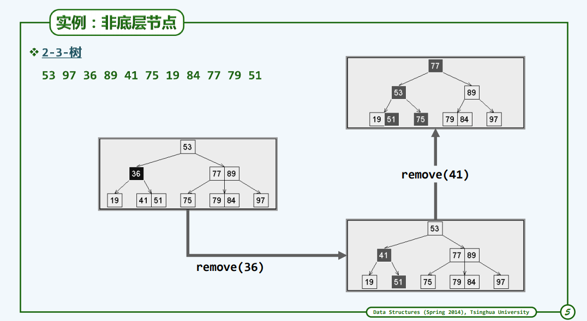

# B-Tree
B-Tree是一个平衡的多路（multi-way）搜索树


其中30和4表示树的最大深度,也是查找的最大次数。

## 定义

> * 所谓m阶B-树，即m路平衡搜索树（m >= 2）
> * `外部结点`的深度统一相等
> * 所有`叶节点`的深度统一相等
> * 树高 h = 外部节点的深度


对于m阶B-树，用n表示关键码，则分支数为n+1,

> * 每个内部节点的分支数不超过m个
> *  关键码的数目不超过m-1个
> *  每个节点的分支数n+1也不能太少
> *  树根: n+1 >= 2
> *  其他：n+1 >= m/2 
> * 故亦称作（m/2的上整, m)-树。


## 实现

### B_Tree.h


```C++
#ifndef _B_TREE_
#define _B_TREE_

#include <iostream>
#include <vector>

using namespace std;

#define BTNodePosi(T) BTNode<T>*

template <typename T> struct BTNode
{
  BTNodePosi(T) parent;    //父节点
  vector<T> key;        //数值向量（关键码）
  vector<BTNodePosi(T)> child;//孩子向量(其长度总比key多一)

  BTNode() { parent = NULL; child.insert(0, NULL); }
  BTNode(T e, BTNodePosi(T) lc = NULL, BTNodePosi(T) rc = NULL) 
  {
    parent = NULL;    //根节点，初始化时，父节点为空
    key.insert(0, e);  //插入一个关键码
    
    //两个孩子
    child.insert(0, lc); 
    child.insert(1, rc); 
    
    if (lc) { lc->parent = this; }
    if (rc) { rc->parent = this; }
  }
};

template <typename T> class BTree 
{
protected:
  int _size;         //关键码总数
  int _order;       //阶次
  BTNodePosi(T) _root;  //根节点
  BTNodePosi(T) _hot;   //search()最后访问的非空节点位置

  void solveOverflow(BTNodePosi(T));  //解决因插入而上溢后的分裂处理
  void solveUnderflow(BTNodePosi(T)); //解决因删除而下溢后的合并处理

public:
  BTNodePosi(T) search(const T &e);  //查找
  bool insert(const T &e);      //插入
  bool remove(const T &e);      //删除
};

#endif //_B_TREE_
```

### 查找
**算法描述**

每次加载必须的若干个节点载入内存，通过这种策略可以尽可能的减少I/O操作。
对于一棵B树，假设它的根节点已经加载至内存，现在在这棵树中查找关键码key，

> * 首先在根节点中进行查找，每个节点中的关键码已经存为一个向量，所以只需进行顺序查找；
> * 如果在该节点中命中，则查找结束；
> * 如果查找失败，则通过该节点中失败的位置的左节点或者右节点查找到下一个节点，并且载入到内存中，再进行一次顺序查找；
> * 循环2、3步，如果查找到外部结点，则查找失败。

**实现**


````C++
template <typename T>
BTNodePosi(T) BTree<T>::search(const T &e) 
{
  BTNodePosi(T) v = _root;//从根节点开始
  _hot = NULL;
```

  while (v)  //逐层查找
  {
    Rank r = v->key.search(e);    //在当前节点对应的向量中顺序查找
    if (r >= 0 && e == v->key[r])  //查找成功，返回
      return v;

	 _hot = v;
     v = v->child[r+1];  //沿引用转至对应的下层子树，并载入其根I/O
  }  //若因!v而退出，则意味着抵达外部结点，超找失败

  return NULL;
}
````

**优化**

> * 每次将一个节点读入内存的I/O消耗
> * 节点内部二分查找效率不一定高。为了与I/O操作相匹配，每一个节点的大小应该尽可能设计为与一次I/O兑换的页面大小，通常为若干KB，因此每个节点内的数量一般为几百，对于这样的规模，二分查找的效率反而更低。
> * B树的高度h和关键码的数目N之间的关系？h = logN. B-树的高度变化有限。

### 插入


```C++
template <typename T> 
bool BTree<T>::insert(const T &e) {
  BTNodePosi(T) v = search(e);
  if (v)        //确认e不存在 
    return false;
  Rank r = _hot->key.search(e);   //在节点_hot中确认插入位置

  _hot->key.insert(r + 1, e);    //将新关键码插至对应的位置    
  _hot->child.insert(r + 2, NULL);//创建一个空子树指针
  
  _size++;
  solveOverflow(_hot); //如发生上溢，需做分裂

  return true;
}
```

**分裂算法**


```C++
template <typename T>
void BTree<T>::solveOverflow(BTNodePosi(T) v) 
{
  if (_order >= v->child.size()) //递归基：不再上溢
    return;

  Rank s = _order / 2; //轴点（此时_order = key.size() = child.size() - 1）
  BTNodePosi(T) u = new BTNode<T>();

  for (Rank j = 0; j < _order - s - 1; j++) //分理处右侧节点u（效率低可改进）
  {
    u->child.insert(j, v->child.remove(s + 1)); //v右侧_order-s-1个孩子 
    u->key.insert(j, v->key.remove(s + 1));    //v右侧_order-s-1个关键码
  }

  u->child[_order - s - 1] = v->child.remove(s + 1); //移动v最右边的孩子

  //？？？为什么child[0]不为NULL，其他孩子节点都不为NULL
  if (u->child[0]) // 若u的孩子们非空，则统一令其以u为父节点
  {
    for （Rank j = 0; j < _order - s; j++）
      u->child[j]->parent = u;
  }

  BTNodePosi(T) p = v->parent; //v当前的父节点p
  if (!p)      //若p为空，则创建之（全树最高层，新根节点恰好两度）
  {
    _root = p = new BTNode<T>(); 
    p->child[0] = v;
    v->parent = p;
  }

  Rank r = 1 + p->key.search(v->key[0]);   //p中指向u的指针的秩

  p->key.insert(r, v->key.remove(s));   //轴点关键码上升
  p->child.insert(r + 1, u);
  u->parent = p;    //新节点u与父节点p互联

  solveOverflow(p);  //上升一层，如果有必要则继续分裂——至多递归O(logn)层
}
```

### 删除
与其右子树的最左端节点的值交换，然后删除其右子树的最多端节点。类似BST的删除。


```C++
template <typename T>
bool BTree<T>::remove(const T &e) 
{
  BTNodePosi(T) v = search(e);
  if (!v)       //确认e存在
    return false; 

  Rank r = v->key.search(e); //确定e在v中的秩
  if (v->child[0]) //若v非叶子节点
  {
    BTNodePosi(T) u = v->child[r+1]; 
    //在右子树中一直向左，即可
    while(u->child[0]) 
    {
      u = u->child[0]; //找到e的后继（必属于叶节点）
    }

    //与e的后继交换位置
    v->key[r] = u->key[0];
    v = u; 
    r = 0;
  }  //至此，v必然位于最底层，且其中第r个关键码就是待删除者

  v->key.remove(r);
  v->child.remove(r+1);

  _size--;
  solveOverflow(v); //如有需要，需做旋转和合并
  
  return true;
}
```


**旋转和合并**


**实例**



```C++
template <typename T>
void BSTree<T>::solveUnderflow(BTNodePosi(T) v) //解决因删除而下溢后的合并处理
{
  if ((_order + 1) / 2 <= v->child.size()) 
    return;

  BTNodePosi(T) p = v->parent;
  if (!p)
  {
    //递归基：已到根节点
    return;
  }

  Rank r = 0;
  while (p->child[r] != v)
    r++;

  //情况一： 若v的左兄弟存在，且至少包含m/2的上整数个关键码
  if (r > 0)  //若v不是p的第一个孩子
  {
    BTNodePosi(T) ls = p->child[r - 1]; //左兄弟必存在

    if((_order + 1) / 2 < ls->child.size()) //若该节点足够“胖”
    {
      v->key.insert(0, p->key[r-1]); //（p借出的关键码给v，最为最小关键码）
      p->key[r-1] = ls->key.remove(ls->key.size() - 1); //ls的最大关键码转入p

      //同时ls的最右侧孩子过继给v（作为v的最左侧孩子）
      v->child.insert(0, ls->child.remove(ls.child.size() - 1)); 
      
      if (v->child[0])
      {
        v->child[0]->parent = v;
      }

      return; //至此，通过右旋已完成当前层（以及所有层）的下溢处理
    }
  }

  //情况二： 若v的右兄弟存在，且至少包含m/2的上整数个关键码
  if (p->child.size() -1 > r) 
  {  
    BTNodePosi(T) rs = p->child[r + 1]; //右兄弟必存在

    if((_order + 1) / 2 < rs->child.size()) //若该节点足够“胖”,大于或等于m/2的上整
    {
      v->key.insert(v->key.size(), p->key[r]); //p借出的关键码给v，做为最大关键码
      p->key[r-1] = rs->key.remove(0); //rs的最小关键码转入p

      //同时rs的最左侧孩子过继给v（作为v的最右侧孩子）
      v->child.insert(v->child.size(), rs->child.remove(0); 
      
      if (v->child[v->child.size()-1])
      {
        v->child[v->child[size()-1]]->parent = v;
      }

      return; //至此，通过右旋已完成当前层（以及所有层）的下溢处理
    }
  }

  //情况三: L和R或者不存在，或者所含的关键码不足m/2的上整数个。
  if (r > 0) //与左兄弟合并
  {
    BTNodePosi(T) ls = p->child[r-1]; //左兄弟存在

    ls->key.insert(ls->key.size(), p->key.remove(r-1));
    p->child.remove(r); //pd的第r-1个关键码转入ls，v不再是p的第r个孩子

    //v的最左孩子过继给ls做最右侧孩子
    ls->child.insert(ls->child.size(), v->child.remove(0));
    if (ls->child[ls->child.size()-1]) 
      ls->child[ls->child.size()-1]->parent = ls;

    //将v剩余的关键码和孩子，依次转入ls
    while(!v->key.empty())
    {
      ls->key.insert(ls->key.size(), v->key.remove(0));
      ls->child.insert(ls->child.size(), v->child.remove(0));

      if (ls->child[ls->child.size() - 1])
        ls->child[ls->child.size() - 1]->parent = ls
    }

    release(v);
  }
  else     //与右兄弟合并,与上面完全对称
  {
    BTNodePosi(T) rs = p->child[r + 1];

    rs->key.insert(0, p->key.remove(r));
    p->child.remove(r)
  
    rs->child.insert(0, v->child.remove(v->child.size()-1));
    if (rs->child[0])
      rs->child[0]->parent = rs;

    while(!v->key.empty())
    {
      rs->key.insert(0, v->key.remove(v->child.size()-1));
      rs->child.insert(0, v->child.remove(v->child.size()-1));

      if (rs->child[0])
        rs->child[0]->parent = rs;
    }

    release(v);    
  }

  solveUnderflow(p); //上升一层，继续分裂（至多O(logn)层）

  return
}
```

