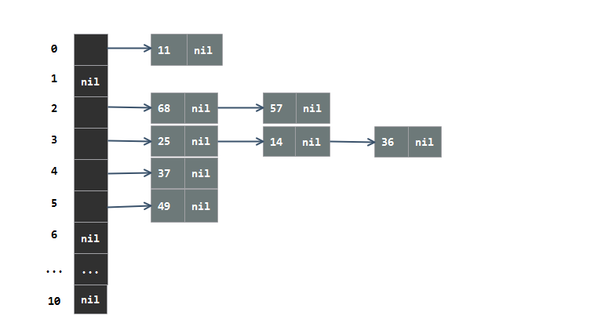

# 散列表

**散列表（Hash table，也叫哈希表）**，是根据关键码值(Key value)而直接进行访问的数据结构。也就是说，它通过映射函数把关键字值映射到表中的某一个位置来访问记录，以加快查找的速度。

散列技术就是在记录的关键字和存储位置之间建立一个确定的对应关系f，使得每个关键字，对应一个存储位置。这种对应关系f叫做散列函数或哈希函数，采用散列技术将记录存储在一块连续的存储空间中，这块存储记录的连续的存储空间叫做散列表或哈希表。

散列表是一种面向查找的存储结构，与链表、树、图的不同点在于，散列表存储记录之间没有任何逻辑关系，而其他的记录之间都存在着某种逻辑关系。

散列表是一种既适用于静态查找问题，又适用于动态查找问题，并且查找效率非常高的存储结构。哈希查找的主要问题在于哈希表的设计。

## Hash函数

理想情况下，即在查找时不经过任何比较，一次就可以直接从哈希表中拿到要搜索的值。此时，存在 Hash()函数，使得每个关键码（key）与结构中的一个唯一的存储位置（Address）相对应。
$$
Address = Hash(key)
$$
但是实际情况并非如此，在使用哈希表时，数据寻址过程中不可避免的会发生哈希冲突。因此哈希函数的设计至关重要。

hash函数设计的准则：

> - 分布均匀：哈希函数计算出来的地址尽可能的在存储空间范围内分布均匀
> - 尽可能的简单：算法不能太过复杂，其哈希函数的复杂度不能超过其他查找技术与关键字比较的时间
> - 能够解决哈希冲突

常见的散列函数：

**（1）直接定址法：**取关键字的某个线性函数值作为散列地址，简单的说就是通过关键字的加减乘除来得到一个散列地址。              
$$
f(key) = a * key + b
$$
**（2）数字分析法：**通常用于处理关键字位数比较大的情况，抽取关键字的某几位数来求散列地址。

**（3）平方取中法：**将关键字平方之后取中间若干位数字作为散列地址。

**（4）折叠法：**将关键字从左到右分割成位数相等的几部分，然后将这几部分叠加求和，并按散列表表长取后几位作为散列地址。

**（5）除留余数法：**最常用的散列函数，对于散列表长为m的散列函数计算公式为：
$$
f(key) = key \% p (p <= m)  （p为小于或等于m的最小质数）
$$
关于p的选取，书中提到p应为小于或等于m的最小质数，但是在实际中我们发现当 m=12 时，p应该取11，但是当p=11时，索引为11的地址是不可达的。因此散列表中桶的数量的选取也需要注意。

事实上，这个方法不仅可以对关键字直接取模， 也可以通过折叠、平方取中后再取模。

**（6）随机数法：选择一个随机数，取关键字的随机函数值为它的散列地址。**
$$
f(key) = random(key)（random是随机函数，当关键字长度不等时，采用这个方法比较合适）
$$

在不同情况下选择不同的散列函数：

> * 计算散列地址所需的时间
>
> * 关键字的长度
> * 散列表的大小
> * 关键字的分布情况
> * 记录查找的频率


## 哈希冲突解决方法

**（1）开放定址法：**所谓开放定址法就是一旦发生了冲突，就去寻找下一个空的散列地址，只要散列表足够大，空的散列地址总能找到，并将记录存入，这种方法称为线性探测法。它的公式是：
$$
f_i(key) = (f(key)+d_i) \% m (d_i = 1， 2，...，m-1)
$$
a. 可以通过新修改di的取值方式，例如使用平方运算来尽量解决堆积问题,称为==二次探测法==：       
$$
f_i(key) = (f(key)+d_i) \% m (d_i = 1^2, -1^2, 2^2, -2^2, ..., q^2, -q^2, q <= m/1)
$$
b. 还有一种方法是，在冲突时，对于位移量di采用随机函数得到，我们称之为==随机探测法==：
$$
fi(key) = (f(key) + di) \% m (di是由一个随机函数获得的数列)
$$
**（2）再散列函数法：**
$$
f_i(key) = RH_i(key) (i = 1, 2, 3, ..., k), RHi是各种散列函数
$$
开放定址法和再散列函数法都属于闭散列方法（开地址法），在这种情形下，不能随便物理删除表中已有的元素，若删除会影响到其他元素的搜索。当散列表经常变化时，最好不用闭散列方法处理冲突。

**（3）公共溢出区法**

准备一张溢出表保存冲突的数据，该溢出表的结构与基本表类似。

**（4）开散列法（链地址法）**

设散列表的地址空间的位置是从0~m-1，则关键码集合中所有关键码被划分为m个子集合，通过散列函数计算出来具有相同地址的关键码为同一子集合，每个子集合成为一个桶。

通常每个桶中的元素时用一个单链表连接起来的，称为同义词子表。

例如，给出一组元素，关键码为37，25，14，36，49，68，57，11，散列表为HT，表的大小是11，采用的散列函数为 $$Hash(x) = x \% 11 $$.根据hash函数得到的散列表结构如下：



**散列表的查找步骤：**

（1）当存储记录时，通过散列函数计算出记录的散列地址。

（2）当查找记录时， 我们使用同样的散列函数计算记录的散列地址，并按此散列地址访问该记录。


**示例代码**

现在有一个用来存放整数的Hash表，Hash表的存储单位称为桶，每个桶能放3个整数，当一个桶中
要放的元素超过3个时，则要将新的元素存放在溢出桶中，每个溢出桶也能放3个元素，多个溢出
桶使用链表串起来。此Hash表的基桶数目为素数P，Hash表的hash函数对P取模。

```C++
#include<iostream>
using namespace std;

#define P 7
#define BUCKET_NODE_SIZE 3
#define NULL_DATA -1

typedef struct _bucket_node	
{
	int data[BUCKET_NODE_SIZE];
	struct _bucket_node *next;
}bucket_node;

typedef  bucket_node   hash_table[P];	 //hash_table 表示有P个bucket_node类型的数组
hash_table ht;

void init_hashtable(hash_table &h)
{
	for(int i=0; i<P; ++i)
	{
		for(int j=0; j<BUCKET_NODE_SIZE; ++j)
		{
			h[i].data[j] = NULL_DATA;
		}
		h[i].next = NULL;
	}
}

//按照除留余数法，每次将节点插入对应的索引位置，当当前节点的数组已满时，创建新的的节点，并与原节点链接起来。
bool insert_new_element(hash_table &h, int x)
{
	int index = x % P;
	bucket_node *p = &h[index];

	//将p指向当前索引在哈希表中最后一个节点，因为前几个节点肯定都存满了
	while (p->next != NULL)
	{
		p = p->next;
	}

	//最后一个节点未满，接着存放数据
	if (p->data[BUCKET_NODE_SIZE - 1] == NULL_DATA)
	{
		for (int i = 0; i < BUCKET_NODE_SIZE; ++i)
		{
			if (p->data[i] == NULL_DATA)
			{
				p->data[i] = x;
				return true;
			}																												 
		}
	}
	else  //最后一个节点已满，创建新节点
	{
		bucket_node *node = (bucket_node *)malloc(sizeof(bucket_node));
		if (NULL == node)
		{
			cout << "生成节点失败" << endl;
			return false;
		}

		for (int i = 0; i < BUCKET_NODE_SIZE; ++i)
		{
			node->data[i] = NULL_DATA;
		}
		
		node->next = NULL;
		p->next = node;
		for (int i = 0; i < BUCKET_NODE_SIZE; ++i)
		{
			if (node->data[i] == NULL_DATA)
			{
				node->data[i] = x;
				return true;
			}
		}
	}

	return false;
}

int main()
{
	init_hashtable(ht);
	int array[] = {15,14,21,87,96,293,35,24,149,19,63,16,103,77,5,153,145,356,51,68,705,453 };  
	//int array[] = {1, 8, 15, 22, 29, 36, 43, 50};

	int n = sizeof(array) / sizeof(int);
	for(int i=0; i<n; ++i)
	{
		insert_new_element(ht,array[i]);
	}

	bucket_node *p = NULL;
	for (int i = 0; i < P; ++i)
	{
		cout << i << " : ";
		p = &ht[i];
		while (p != NULL)
		{
			if (p->data[0] != NULL_DATA)
			{
				for (int i = 0; i < BUCKET_NODE_SIZE; ++i)
				{
					if (p->data[i] != NULL_DATA)
						cout << p->data[i] << "  ";
				}
			} //if

			p = p->next;
		} //while
		cout << endl;
	} //for

	system("pause");
	return 0;
}
```

