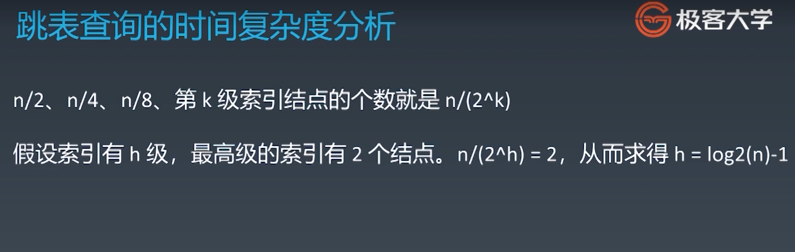
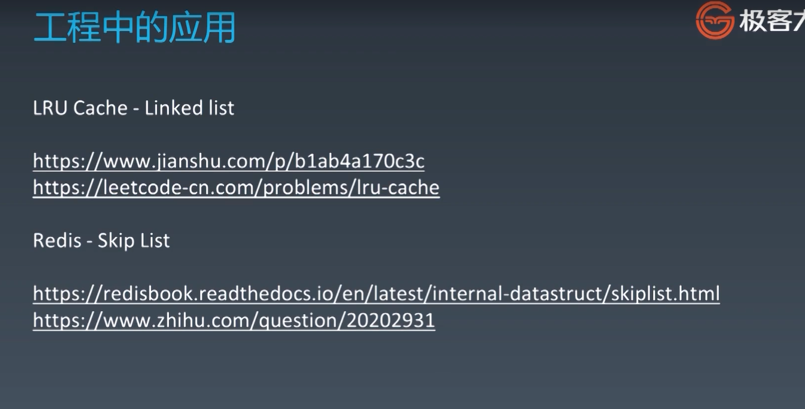

## 数组、链表、跳表

### 跳表






### 递归

```python
# Python
def recursion(level, param1, param2, ...): 
    # recursion terminator 
    if level > MAX_LEVEL: 
	   process_result 
	   return 
    
    # process logic in current level 
    process(level, data...) 
    
    # drill down 
    self.recursion(level + 1, p1, ...) 
    
    # reverse the current level status if needed
```

