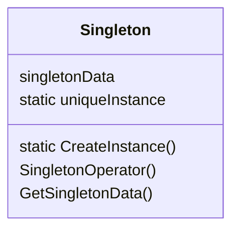

## 创建型（Creational）模式

​		创建型模式是将对象的部分创建工作延迟到子类或者其他对象，从而应对需求变化为对象创建时具体类型实现引来的冲击。

## 1. 单例模式（Singleton）



```c++
class Singleton {
	privative:
    	Singleton(const Singleton&) = delete;
  		Singleton& operator=(const Singleton&) = delete;

  		Singleton() = default;
  		~Singleton() = default;
    
    public:
    	static Singleton* CreateInstance();
    	// volatile 解决因内存读写 reorder 导致二次检查失效不安全
    	static Singleton* volatile m_instance; 
    	static std::mutex m_mutex;
};

// 非线程安全版本，不可重入
Singleton* Singleton::CreateInstance() {
    if (m_instance == nullptr) {
        m_instance = new Singleton();
    }
    
    return m_instance;
}

// 两重检查，线程安全版本，可重入
// 但有可能存在因内存读写 reorder 导致检查失效不安全
Singleton* Singleton::CreateInstance() {
    // 第一个 if 解决性能问题
    if (m_instance == nullptr) {
        std::unique_lock<std::mutex> locker(m_mutex);
        
        if (m_instance == nullptr) {
        	m_instance = new Singleton();
        }
    }
    
    return m_instance;
}
```


## 2. 工厂模式（Factory Method）

## 3. 抽象工厂模式

## 4. 原型模式（Abstract Factory）

## 5. 建造者模式（Builder）


