#  Docker入门

## 1 安装Docker

### 1.1 centos

参考[官方文档](https://docs.docker.com/engine/install/centos/#install-using-the-repository)。

其他配置：

```bash
# 修改存储位置 ExecStart=/usr/bin/dockerd 后增加--graph=/new-path/docke
vim /usr/lib/systemd/system/docker.service
# 编辑保存成功后
systemctl daemon-reload
systemctl restart docker
```


## 2 配置Docker服务

**避免每次使用docker命令时都需要切换到特权身份，将当前用户加入安装中自动创建的docker用户组。**

```bash
$ sudo usermod -aG docker USER_NAME
```

额外介绍两个命令:

```bash
# 添加docker用户组
$ sudo groupadd docker

# 退出重新登陆后，运行以下命令就能查看是否以进入docker组了
$ id -aGn username
```

Centos下重启docker服务,然后重新登录该用户即可生效,Ubuntu下重启docker服务,然后通过**newgrp - docker**切换当前会话到新组即可.

如果Docker服务不正常，可以通过 **journalctl -u docker.service** 查看Docker服务的日志信息来确定问题。每次重启Docker服务之后，可以通过 **docker info** 查看Docker信息，确保服务正常运行。

## 3 使用Docker镜像

Docker运行容器前需要本地有对应的镜像，如果不存在，默认使用Docker Hub公共注册服务器中仓库，用户可以通过配置，使用自定义的镜像仓库。

### 3.1 获取镜像

命令：**docker pull NAME[:TAG]**

选项：**-a, --all-tags=true|false：**是否获取仓库中的所有镜像，默认为否

​	   **--disable-content-trust：**取消镜像的内容校验，默认为真。

NAME是镜像仓库名称（用来区分不同仓库中的镜像），仓库名称中应该加上仓库地址（即registry，注册服务器），默认使用的是官方Docker Hub服务，该地址可以省略。TAG镜像的标签（用来表示版本信息，可以标记一个仓库中的不同镜像），如果不显示指定TAG，则默认会选择latest标签（表示最新版本的镜像）。通常情况下，描述一个镜像需要包括**“名称+标签” **信息。

**注意：**

一般来说，镜像的latest标签以为着该镜像的内容会跟踪最新版本的变更而变化，内容不稳定。因此最好不要在生产环境使用latest标记的镜像。

**示例：**

（1）获取一个Ubuntu18.04系统镜像。

docker pull ubuntu:18.04其实就相当于docker pull registry.hub.docker.com/ubuntu:18.04 

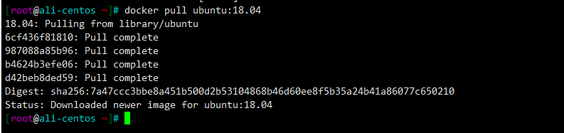

镜像文件一般由若干层（layer）组成，**6cf436f81810** 这样的标识是每一层的唯一id，实际上，层的id包括256bit，64个十六进制字符组成。使用 docker pull 下载镜像时会获取并输出镜像的各层信息。**当不同的镜像包括相同的层时，本地仅存储一份层的内容，减少了存储空间**。

另外，如果需要使用镜像代理服务获取镜像的话，可以在Docker服务启动配置中增加--registry-mirror =proxy_URL来指定代理服务器地址（如https://registry.docker-cn.com)。

### 3.2 查看镜像信息

#### 使用images命令列出镜像

使用docker images或docker image ls 查看本地镜像基本信息。

命令：**docker  images 或 docker image ls**

选项：**-a, --all=true|false：**列出所有（包括临时文件）镜像文件，默认为否；

​	   **-f, -filter=[]: **过滤列出的镜像，如dangling=true只显示没有被使用的镜像；也可以指定带有特定标注的镜像等。

列几个比较常用的，其他的可以通过man docker-images 查看。

**示例：**

（1）列出本地所有镜像基本信息

红框里是错误示范，是docker image ls 而不是 docker images ls。

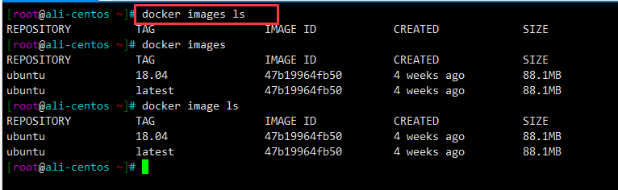

**REPOSITORY**表示来自哪个仓库，**TAG**表示镜像的标签信息，**IMAGE ID**表示镜像的唯一标识，如果两个镜像ID相同标识他们实际指向同一个镜像，只是具有不同的标签名而已。其他两个很容易看懂，分别是创建时间和大小。

#### 使用tag命令添加镜像标签

使用docker tag 命令为本地镜像任意添加新的标签。

命令：**docker tag  NAME:TAG  NEWNAME:NEWTAG**

**示例：**

（1）添加一个新的myubuntu:18.04镜像标签

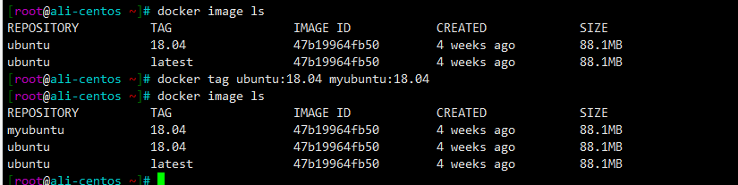

#### 使用inspect命令查看详细信息

使用docker inspect命令可以获取该镜像的详细信息，包括制作者、适应架构、各层的数字摘要等。

命令：**docker inspect NAME:TAG**

选项：**-f：**指定获取其中的一项内容

**示例：**

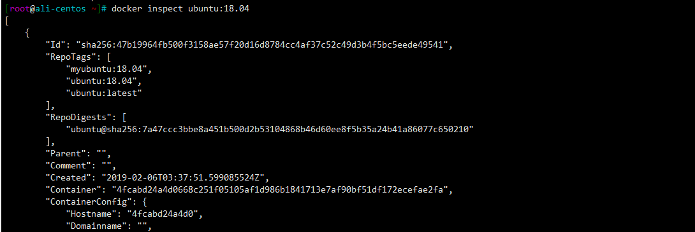

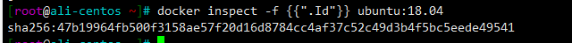

#### 使用history命令查看镜像历史

使用docker history列出镜像各层的创建信息。

命令：**docker history NAME:TAG**

**示例：**

（1）查看ubuntu:18.04镜像的创建过程

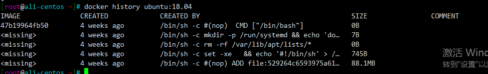

过长的命令被自动截断了，可以使用前面提到的--no-trunc选项来输出完整命令。

### 3.3 搜寻镜像

使用docker search命令搜索仓库中的镜像。

命令：**docker search [option] keyword**

选项：**-f, --filter=[]：**过滤输出的内容

​	   **--format string：** 格式化输出内容

**示例：**

（1）搜索官方提供的带nginx关键字的镜像和搜索所有收藏数超过4的关键词包括tensorflow的镜像。

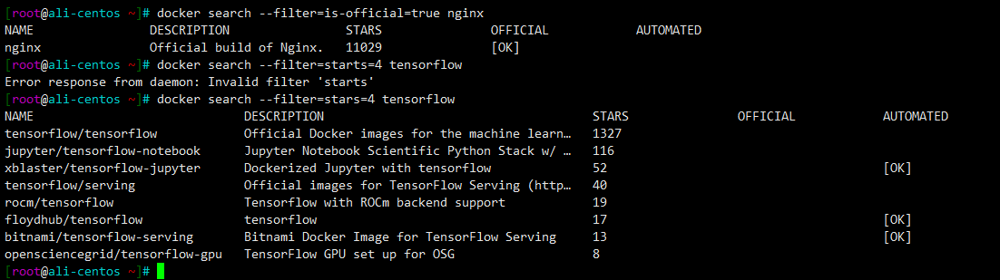

### 3.4 删除和清理镜像

#### 使用镜像标签或ID删除镜像

使用docker rmi和docker image rm命令可以删除镜像。

命令：**docker rmi IMAGE 或 docker image rm IMAGE[IMAGE...]**，其中IMAGE可以为标签或者ID

选项：**-f，-force：**强制删除镜像，即使有容器依赖它；

​	   **-no-prune：**不要清理未带标签的父镜像。

**docker rmi + 镜像ID（也可以是能进行区分的部分ID串前缀）：**会先尝试删除所有指向该镜像的标签，然后删除该镜像本身。当有该镜像创建的容器存在时，提示镜像文件无法删除，可以使用-f参数强制删除，但是不推荐。正确的做法是**先删除依赖该镜像的所有容器，再来删除镜像。**

**示例：**

（1）删除ubuntu:18.04镜像

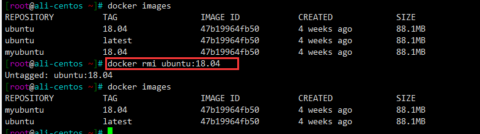

由此发现，当一个镜像拥有多个标签的时候，docker rmi命令只是删除了该镜像多个标签中的指定标签而已，并不影响镜像文件。当镜像只剩下一个标签的时候，则会彻底删除镜像。

（2）先使用ubuntu:18.04镜像创建一个简单的容器来输出一段话，然后再试图删除该镜像，提示有容器正在运行，无法删除，但是如果是删除该镜像多个标签中的一个时，是可以的。

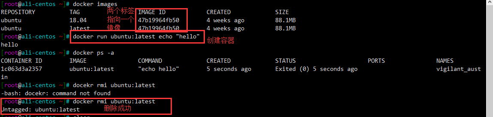

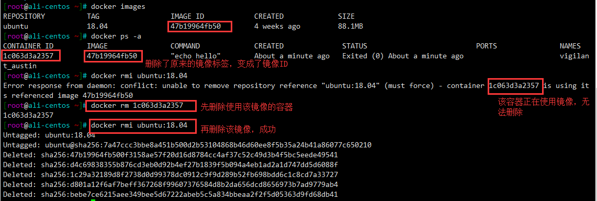

#### 清理镜像

使用Docker一段时间，系统中会遗留一些临时镜像文件，还有一些没有被使用过的镜像，可以通过docker image prune命令来进行清理。

命令：**docker image prune**

选项：**-a, all：**删除所有无用镜像，不光是临时镜像；

​	   **-filter=[]：**只清理符合给定过滤器的镜像；

​	   **-f, -force：**强制删除镜像，而不进行确认。

### 3.5 创建镜像

#### 基于已有容器创建

该方法主要使用docker commit命令。

命令：**docker commit [OPTIONS] CONTAINER REPOSITORY[:TAG]**

选项：**-a, --author=""：**作者信息；

​	   **-c，--change=[]：**提交的时候执行Dockerfile指令，包括CMD|ENTRYPOINT|ENV|EXPOSE|LABEL|ONBUILD|USER|VOLUME|WORKDIR等；

​	   **-m，--message=""：**提交消息；

​	   **-p，--pause=true：**提交时暂停容器运行。

**示例：**

（1）提交一个新的镜像

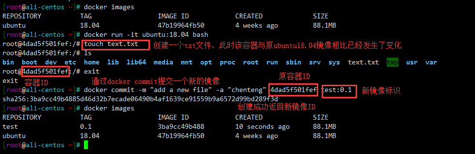

#### 基于本地模板导入

用户可以从一个操作系统模板文件导入一个镜像，主要使用docker import命令。

命令：**docker import [OPTIONS] file | URL | -REPOSITORY[:TAG]**

要导入一个镜像可以使用OpenVZ提供的模板文件或者用其他已导出的镜像模板来创建。OpenVZ模板的下载地址为http://openvz.org/Download/templates/precreated。

**示例：**

（1）下载了一个centos7模板压缩包，导入centos7镜像。

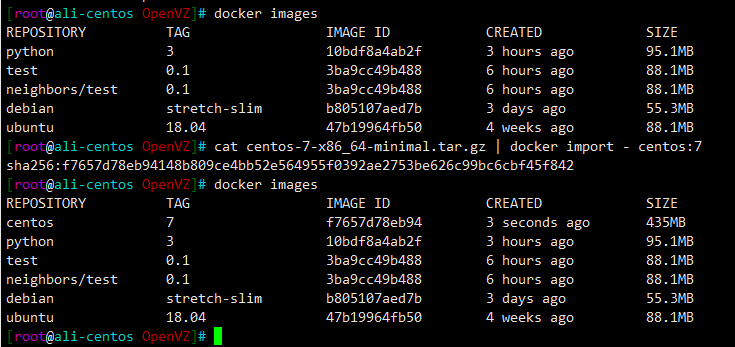

#### 基于Dockerfile创建

基于Dockerfile创建是最常见的方式。Dockerfile是一个文本文件，利用给定的指令描述基于某个父镜像创建新镜像的过程。通过docker build命令编译Dockerfile，成功后生成一个新的镜像。

命令：**docker build [OPTIONS]**

选项：**-t：**指定仓库和标签，可以多个

```bash
$ docker build -t shykes/myapp:1.0.2 -t shykes/myapp:latest .
```

​	   **-f：**指定dockerfile文件路径

```bash
$ docker build -f /path/to/a/Dockerfile .
```

**注意：**

docker build 后面的“.“表示？？？

**示例：**

（1）基于debian:stetch-slim镜像安装python3环境，生成一个新的python:3镜像。

Dockerfile内容如下：

```dockerfile
FROM debian:stretch-slim 
LABEL version="1.0" maintainer="docker user <docker_user@github>"
RUN  apt-get update && \                                                                 
			apt-get install -y python3 && \
    		apt-get clean && \
    		rm -rf /var/lib/apt/lists/*
```

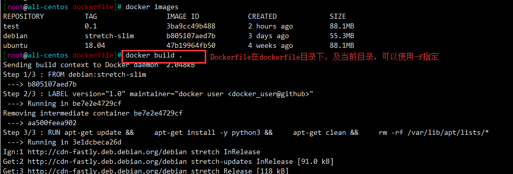

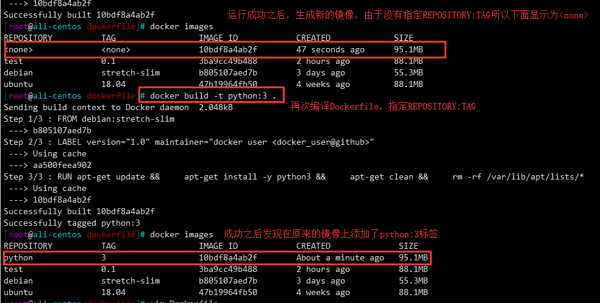
### 3.6 存出和载入镜像

#### 存出镜像

使用docker save 命令导出镜像到本地文件，然后可以分享给他人。

命令：**docker save [OPTIONS]**

选项：**-o：**指定保存目录

**示例：**

（1）导出本地的ubuntu:18.04镜像为ubuntu_18.04.tar

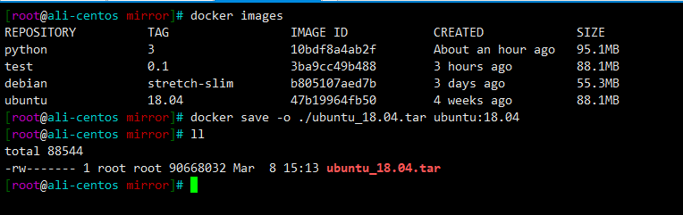

#### 载入镜像

使用docker load 将导出的镜像文件导入到本地镜像库，包括镜像以及相关的元数据信息（包括标签等）。

命令：**docker load [OPTIONS]**

选项：**-i：** 指定读取文件路径

**示例：**

（1）从ubuntu_18.04文件导入镜像到本地镜像列表。

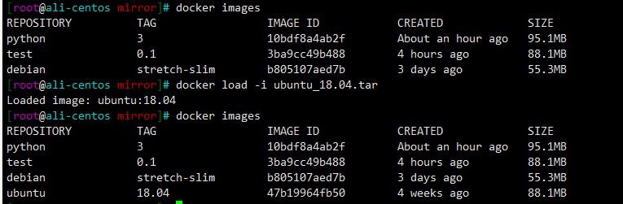

也可以使用**docker load < ubuntu_18.04.tar**进行导入。

### 3.7 上传镜像

使用docker push命令上传镜像到仓库，默认上传到Docker Hub官方仓库（需要登录）。

命令：**docker push NAME[:TAG] | [REGISTRY_HOST[:REGISTRY_PORT]/]NAME[:TAG]**

用户在Docker Hub网站注册后就可以上传自制的镜像。

**示例：**

（1）上传本地neighbors/test:0.1镜像

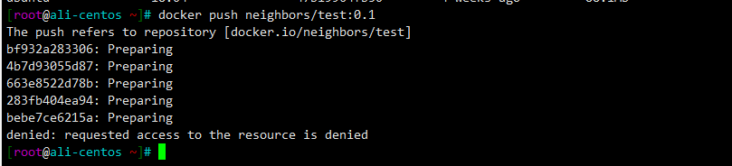

出现了问题：**denied: request access to the resource is denied.**

**解决方案:**

在Docker Hub注册成功之后,还需要在本地等录一次,默认登录到Docker hub , 然后才能上传成功.

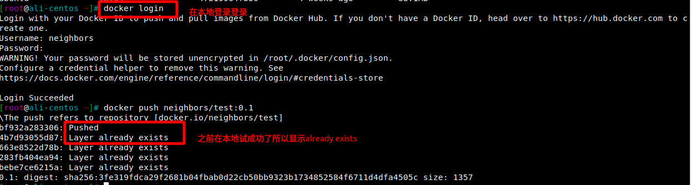

之前在另一个环境已经上传了neighbors/test:0.1,所以显示layer already exists.

## 4 操作Docker容器

### 4.1 创建容器

### 4.2 终止容器

### 4.3 进入容器

### 4.4 删除容器

### 4.5 导入和导出容器

