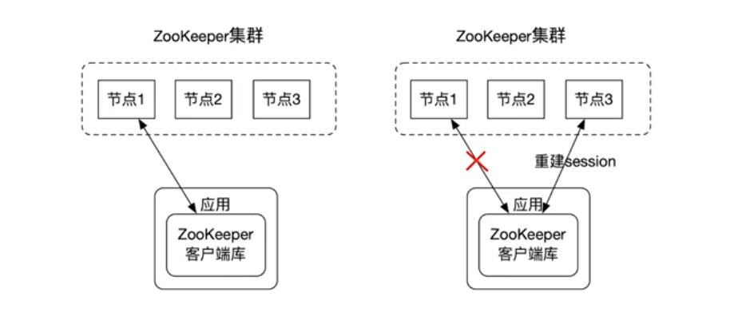
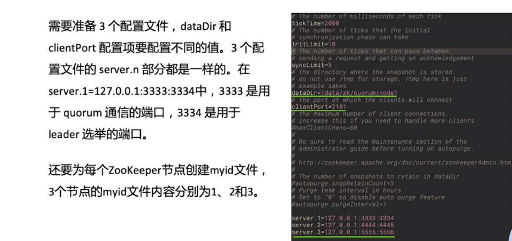
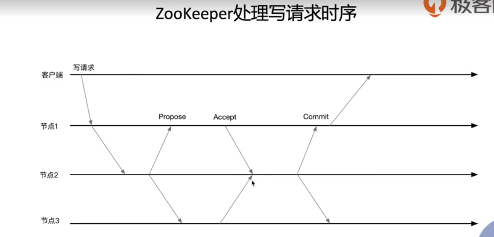
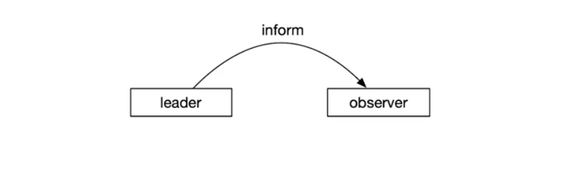
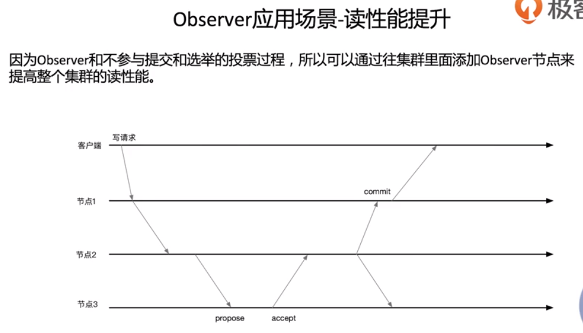
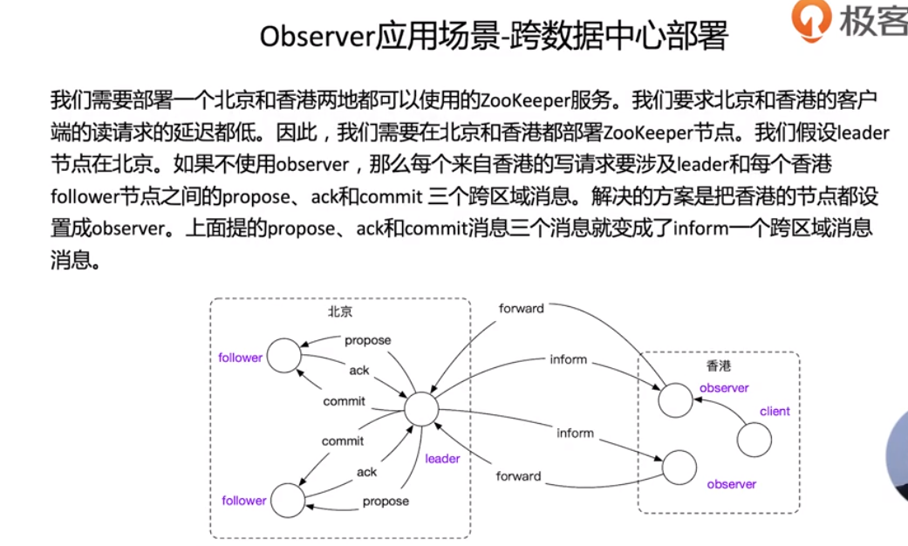
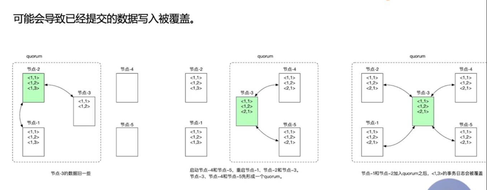

# ZooKeeper手册

## 简介

Zoo

ZK 服务有两种模式（standalone和quorum），standalone模式下ZK集群只有一个独立运行的ZK节点，quorum模式下ZK集群包含多个ZK节点, 一个leader节点和其他follower节点, leader节点可以处理读写请求, 而follower节点只可以处理读请求, follower接收到写请求时会转发给leader处理. 应用使用ZK客户端库来使用ZK服务，ZK客户端负责和ZK集群交互。


**session**

​		ZK客户端在和ZK集群中的某个节点建立连接成功之后会创建一个session. 客户端可以主动关闭session. 另外, 在会话超时(即ZK节点在设置的timeout时间内没有收到客户端任何消息)时, ZK节点也会关闭session. 如果ZK客户端发现链接的ZK节点异常, 会自动和其他ZK节点建立连接.



**数据一致性**

> * 全局可线性化(Linearizable)写入: 先到达leader的写请求会被先处理, leader决定写请求的执行顺序.
> * 客户端FIFO顺序: 保证单个客户端的请求按照发送顺序执行.


ZooKeeper适用于存储和协同相关的关键数据，不适用于大量数据存储。

**典型应用场景：**

> * 配置管理（Configuration Management）
> * DNS服务
> * 组成员管理（Group Membership）
> * 分布式锁


## 1. 基础篇

### 1.1 数据模型

​		ZooKeeper的数据模型是层次模型，层次模型常见于文件系统。ZooKeeper使用层次模型主要是基于以下两点考虑。

> * 文件系统的树形结构便于表达数据之间的层次关系；
> * 文件系统的树形结构便于为不同的应用分配独立的命名空间（namespace）。

​		ZooKeeper的层次模型称作 data tree。Data tree的每个节点称为znode。不同于文件系统，ZooKeeper的每个节点都可以保存数据。每个节点都有一个版本号（version），版本从0开始计数。


​		ZooKeeper 对外提供一个用来访问 data tree 的简化文件系统API：

> * 使用 UNIX 风格的路径名来定位znode，例如 /A/X 表示 znode A 的子节点 X；
> * znode 的数据只支持全量写入和读取，没有像通用文件系统那样支持部分写入和读取；
> * data tree 的所有 API 都是 wait-free 的。正在执行的 API 调用不会影响其他 API 的完成；
> * data tree 的 API 都是对文件系统的 wait-free 操作，不直接提供锁这样的分布式协同机制。但是 data tree 的 API 非常强大，可以用来实现多种分布式协同机制。


### 1.2 znode分类

一个znode可以是持久性的，也可以是临时性的：

> * 持久性znode（PERSISTENT）：创建之后即使发生ZooKeeper集群宕机或者client宕机也不会丢失；
> * 临时性znode（EPHEMERAL）：client宕机或者client在指定的timeout时间内没有给ZooKeeper集群发送消息，则临时节点（同一会话内，待确认）就会消失。

​		znode节点也可以是顺序性的。每一个顺序性的znode关联一个唯一的单调递增整数。这个单调递增整数是znode名字的后缀。

> * 持久顺序性znode（PERSISTENT_SEQUENTIAL）：持久性znode具有顺序性。
> * 临时顺序性znode（EPHEMERAL_SEQUENtIAL）：临时性znode具有顺序性。

ZooKeeper主要有以上4种znode。其他暂不了解。


### 1.3 配置说明

参考示例配置文件：

```json
# The number of milliseconds of each tick
tickTime=2000
# The number of ticks that the initial 
# synchronization phase can take
initLimit=10
# The number of ticks that can pass between 
# sending a request and getting an acknowledgement
syncLimit=5
# the directory where the snapshot is stored.
# do not use /tmp for storage, /tmp here is just 
# example sakes.
dataDir=/tmp/zookeeper
# the port at which the clients will connect
clientPort=2181
# the maximum number of client connections.
# increase this if you need to handle more clients
#maxClientCnxns=60
#
# Be sure to read the maintenance section of the 
# administrator guide before turning on autopurge.
#
# http://zookeeper.apache.org/doc/current/zookeeperAdmin.html#sc_maintenance
#
# The number of snapshots to retain in dataDir
#autopurge.snapRetainCount=3
# Purge task interval in hours
# Set to "0" to disable auto purge feature
#autopurge.purgeInterval=1
```



### 1.4 常用命令

| 命令    | 说明                                                         |
| ------- | :----------------------------------------------------------- |
| help    | 查看命令及相关说明。                                         |
| ls      | 显示指定路径下的节点信息。                                                                                                                                                        ls -R /                    显示所有节点信息， -R表示递归                                                                                                                                  ls -w /workers     获取/workers下的节点并监控/workers下的节点变化，-w 表示watch |
| create  | 创建节点，默认持久性           -e：表示创建临时节点          |
| stat    |                                                              |
| delete  |                                                              |
| sync    |                                                              |
| quit    |                                                              |
| set     |                                                              |
| get     |                                                              |
| close   |                                                              |
| connect |                                                              |
| ls2     |                                                              |
| redo    |                                                              |


### 1.5 应用实例

#### master - worker协同

master-worker架构中有一个master负责监控worker的状态，并为worker分配任务。该架构要求；

> * 任何时刻系统中最多只能有一个master，不可能出现两个master的情况，多个master共存会导致脑裂（参考后面说明）。
> * 系统中除了处于active状态的master之外，还有备用master，如果主master异常，备master能很快切换为主master工作。
> * master实时监控worker的状态，能够及时收到worker成员变化的通知。master在收到worker成员变化的通知时，通常重新进行任务的重新分配。

**实现思路**

> * 使用一个临时节点/master表示主节点master，master在行使职能之前，首先要创建/master znode.如果能创建成功，则进入active状态，开始行使master职能。否则的话，进入backup状态，使用watch机制监控/master节点。假设系统中有主备两个master，如果主master异常，则创建的临时节点/master也会被ZK自动删除。此时备master会收到通知，通过再次创建/master临时节点称为新的主master。
> * worker通过在/workers下面创建临时节点来加入集群。
> * 处于active状态的master会通过watch机制监控/workers下的znode变化来实时获取worder成员的变化。


准备工作:

```bash
# 查看ZK现有节点信息
ls -R /

# 创建/workers节点
create /workers
```


Client1（Master1）:

```bash
# 尝试创建临时节点/master，创建成功进入Active状态
create -e /master "m1:2223"  

# 获取并监控/workers下的节点
ls -w /workers

# /wokers下节点变化，Master收到通知，重新获取并监控/workers下的节点
ls -w /workers
```

Client2（Master2）:

```bash
# 尝试创建临时节点/master，创建失败进入Backup状态，因为master1已创建
create -e /master "m1:2223"  

# 监控/master节点的变化,如果Master1异常，/master被ZK自动删除，Master2能监控到异常，然后再尝试创建/master，成功之后转为Active master。
stat -w /master
```


#### 分布式锁

Client1:

```bash
# 

```

Client2:

```bash
# 
```


### 1.6 启动检查

``` bash
# 启动zookeeper服务
zkServer.sh

# 日志路径下，查看是否存在异常或错误日志
grep -E -i "((exception)|(error))" *

# 检查端口是否在指定端口监听
netstat -an | ag 2181
```


## 2. 开发篇


## 3. 运维篇

### 1.1

### 1.2 ZK监控

http://zookeeper.apache.org/doc/r3.4.10/zookeeperAdmin.html#sc_zkCommands

#### The Four Letter Words

​		一组检查zk节点状态的命令,每个命令由四个字母组成,可以通过telnet或ncat使用客户端端口向zk发出命令.

```bash
# Are you ok?
echo ruok | ncat localhost 2181
# 查看配置项
echo conf | ncat localhost 2181

# 查看ZK详细的运行状态信息和客户端连接信息
echo stat | ncat localhost 2181

```

ZooKeeper responds to a small set of commands. Each command is composed of four letters. You issue the commands to ZooKeeper via telnet or nc, at the client port.

Three of the more interesting commands: "stat" gives some general information about the server and connected clients, while "srvr" and "cons" give extended details on server and connections respectively.

- conf

  **New in 3.3.0:** Print details about serving configuration.

- cons

  **New in 3.3.0:** List full connection/session details for all clients connected to this server. Includes information on numbers of packets received/sent, session id, operation latencies, last operation performed, etc...

- crst

  **New in 3.3.0:** Reset connection/session statistics for all connections.

- dump

  Lists the outstanding sessions and ephemeral nodes. This only works on the leader.

- envi

  Print details about serving environment

- ruok

  Tests if server is running in a non-error state. The server will respond with imok if it is running. Otherwise it will not respond at all.A response of "imok" does not necessarily indicate that the server has joined the quorum, just that the server process is active and bound to the specified client port. Use "stat" for details on state wrt quorum and client connection information.

- srst

  Reset server statistics.

- srvr

  **New in 3.3.0:** Lists full details for the server.

- stat

  Lists brief details for the server and connected clients.

- wchs

  **New in 3.3.0:** Lists brief information on watches for the server.

- wchc

  **New in 3.3.0:** Lists detailed information on watches for the server, by session. This outputs a list of sessions(connections) with associated watches (paths). Note, depending on the number of watches this operation may be expensive (ie impact server performance), use it carefully.

- wchp

  **New in 3.3.0:** Lists detailed information on watches for the server, by path. This outputs a list of paths (znodes) with associated sessions. Note, depending on the number of watches this operation may be expensive (ie impact server performance), use it carefully.

- mntr

  **New in 3.4.0:** Outputs a list of variables that could be used for monitoring the health of the cluster.

  ```
  $ echo mntr | nc localhost 2185
  
  zk_version  3.4.0
  zk_avg_latency  0
  zk_max_latency  0
  zk_min_latency  0
  zk_packets_received 70
  zk_packets_sent 69
  zk_outstanding_requests 0
  zk_server_state leader
  zk_znode_count   4
  zk_watch_count  0
  zk_ephemerals_count 0
  zk_approximate_data_size    27
  zk_followers    4                   - only exposed by the Leader
  zk_synced_followers 4               - only exposed by the Leader
  zk_pending_syncs    0               - only exposed by the Leader
  zk_open_file_descriptor_count 23    - only available on Unix platforms
  zk_max_file_descriptor_count 1024   - only available on Unix platforms
  ```

  The output is compatible with java properties format and the content may change over time (new keys added). Your scripts should expect changes.

  ATTENTION: Some of the keys are platform specific and some of the keys are only exported by the Leader.

  The output contains multiple lines with the following format:

  ```
  key \t value
  ```

#### JMX

http://zookeeper.apache.org/doc/r3.4.10/zookeeperJMX.html

ZooKeeper很好的支持了JMX,大量的监控和管理工作可以通过JMX来做,可以把ZK的JMX数据集成到Prometheus,使用Prometheus来做ZK的监控.

```bash
# 启动JMX, 默认只能本地访问
jconsole 

# 要想远程访问,需要在ZK server启动之前配置环境变量
export JMXPORT = 8081
```

### 1.3 ZK Observer

节点2为leader,其他为follower, 节点2在收到大多数节点的Accept消息后,向所有节点发送commit消息.



​		Observer节点和ZK其他节点唯一的交互就是接收来自leader的inform消息,更新自己本地的存储,不参与提交和选举的投票过程.



假设1为observer.不参与事务提交的过程,只等待leader的通知.






为什么要给每个节点推送给propose 而不是直接 commite 呢？

作者回复: 我想您说的是PPT第13页。以下是ZooKeeper leader处理一个写请求的过程：

* Leader把写请求通过propose消息发给所有的节点。
* Leader在收到集群中大部分节点的accept消息之后才可以发送commit消息给所有的节点。

Leader不可以直接收到用户的写请求就commit。假设我们在图中的3节点集群中加入节点4和节点5形成一个5节点集群。节点2在收到写请求之后立刻给节点1发commit消息，节点1给客户端发写成功消息。如果在节点3、节点4和节点5收到这个commit消息之前发生了如下的网络分区。

​    分区A 分区B
节点1 节点2 | 节点3 节点4 节点4

分区B中的节点可以新选举一个leader，从而丢失上述的写请求。丢失已经commit的写操作是不可以的。

关于这一部分的细节，后续的章节会详细说明。


### 1.4 动态配置

手动集群成员调整

> * 停止整个ZK现有集群
> * 更改配置文件zoo.cfg的server.n项
> * 启动新集群的ZK节点

导致的问题:

> * 需要停止ZK服务
> * 可能导致已提交的数据写入被覆盖(如下图)



通过以下操作可以保证每个follower节点和leader节点的数据是一样的,可以避免提交数据被覆盖问题。

> * 停止所有对ZooKeeper集群的访问。
>
> * 使用zkCli.sh连接每一个ZooKeeper的follower节点，并执行sync。

​		ZK3.5.0加入新的特性动态配置(dynamic reconfiguration),可以在不停ZK服务调整集群成员.但是必须启用Authentication机制.

### 1.5 数据存储 

  


## 4. 进阶篇

## 5.对比Chubby、etcd和ZooKeeper

## 6. ZooKeeper实现原理和源码解读

## ACL

```bash
addauth digest zkUser:zkPass
setAcl /tgroup_0 auth:zkUser:zkPass:cdrwa
getAcl /tgroup_0
```

