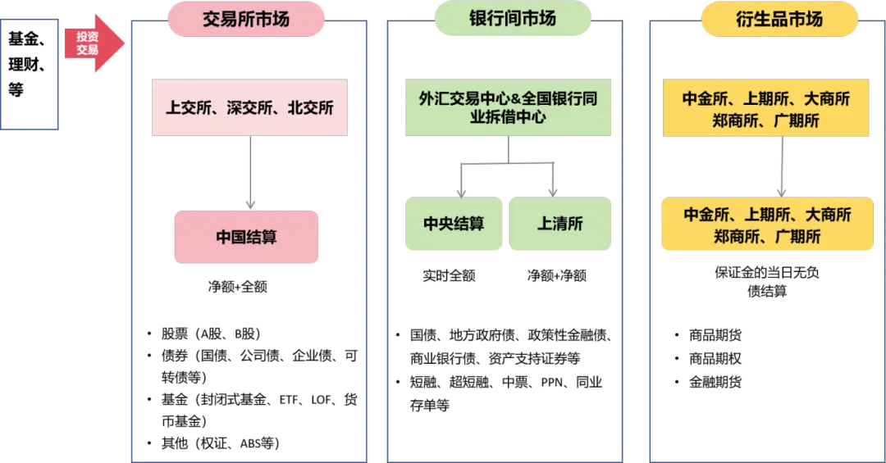
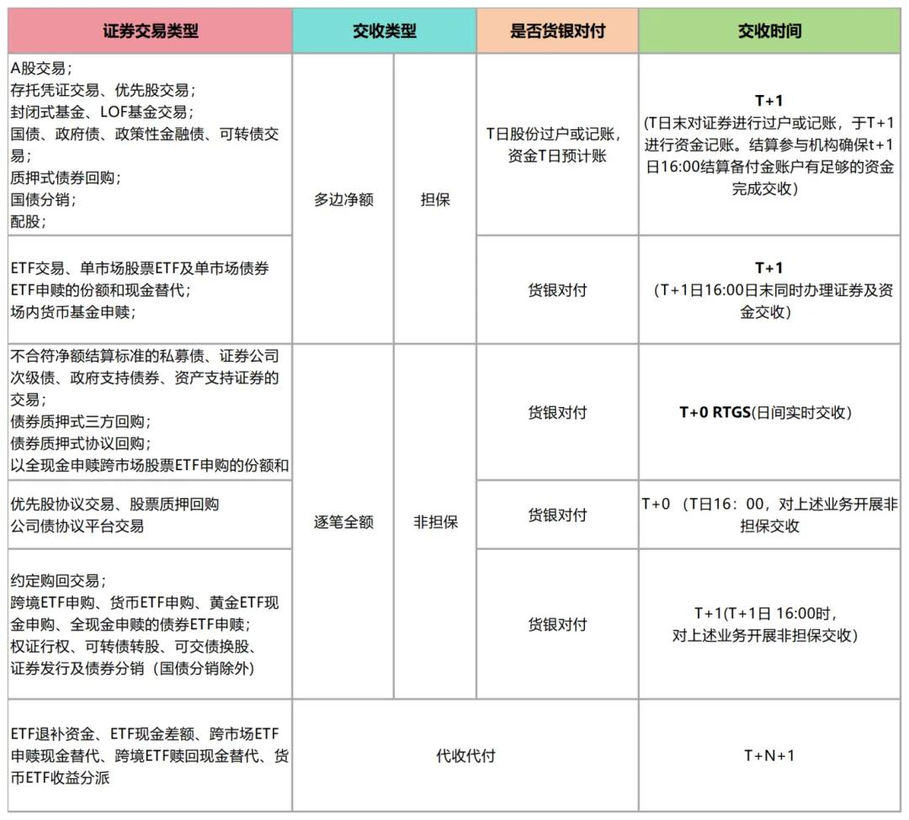

# 场内交易清结算

​		基金、理财等各类型产品投资股票、债券、衍生品等金融资产，主要是在上交所、深交所、银行间债券市场、中金所等交易市场进行，并有对应的结算结构负责证券、资金的清算及交收，都有各自的结算体系。看下证券结算业务概览全景图：

​		本文主要对交易所市场（沪、深、北）证券交易的结算进行介绍，包括清算原则、结算模式、交收类型、结算备付金和保证金等方面。

## 1. 清算和结算

### 1.1 法人结算原则

​		资管产品参与交易所的交易，托管人需要以法人名义申请加入中国结算，成为结算系统参与人，开立证券结算账户和资金结算账户。

### 1.2 分级结算原则

​		中国结算作为共同对手方提供结算服务，负责办理与结算参与机构之间的集中清算交收；结算参与机构负责办理结算参与机构与客户之间的证券和资金的清算交收。

### 1.3 货银对付原则

​		中国结算与结算参与人在交收过程中，当且仅当资金交付时给付证券，证券交付时给付资金。即在办理资金交收的同时完成证券的交割，通俗来说就是“一手交钱，一手交货”。

### 1.4 滚动交收原则

​		滚动交收是指某一交易日成交的所有交易有计划地安排距成交日相营业日天数的某一营业日进行交收。目前交易所大部分交易是 T+1 滚动交收。

## 2. 结算模式

### 2.1 托管人结算模式（直连模式）

### 2.2 券商结算模式（分仓模式）

## 3. 结算交收类型

### 3.1 多边净额担保交收

### 3.2 全额逐笔非担保交收

### 3.3 代收代付

**货银对付：Delivery Versus Payment，简称DVP，即一手交钱、一手交货Delivery Versus Payment，简称DVP，即一手交钱、一手交货**