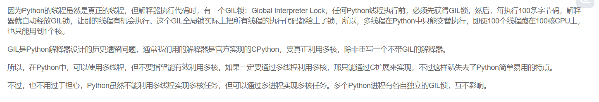

# Python Manual

## class

### \__new__

### \__init__

### 类变量

### 3rd

#### logging

#### lxml

#### cx_oracle

#### json

## 多线程



````
（The entire Python program exits when no alive non-daemon threads are left.）也就是说设置为daemon的线程会随着主线程的退出而结束，而非daemon线程会阻塞主线程的退出。没有设置daemon的线程会继承父线程的状态，主线程默认是非daemon线程（Its initial value is inherited from the creating thread; the main thread is not a daemon thread and therefore all threads created in the main thread default to daemon = False.）
````

