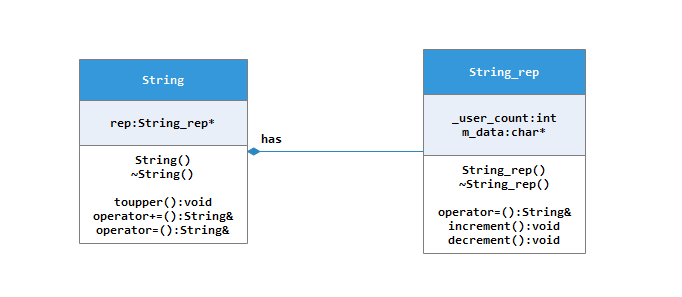

# C++ fundation

## 关键字

### extern

#### extern "C"的作用

extern "C"的主要作用就是为了能够正确实现C++代码调用其他C语言代码。加上extern "C"后，会指示编译器这部分代码按C语言的一些规则进行编译，而不是C++的。比如C++和C的函数签名是不一样的，C++函数签名包括参数类型不单单是函数名。

### static & const

>* static变量存储在静态存储区，生命周期为整个程序的整个运行期。
>* static关键字限制了变量的作用域，静态全局变量只在定义该变量的源文件内有效，而在其他源文件不能使用它。非静态全局变量在声明了该变量的CPP文件或包含该变量声明头文件的CPP文件中都能使用。
>* C++类中声明的静态函数和静态变量，只属于类，与实例无关。

>* const变量存放在常量区
>* const关键字修饰的变量是只读的

### volitale

Volatile是易变的意思，编译器在编译时期可能不能获取变量是否被多个线程或者进程修改的信息。这时候一个变量是否在两次“读操作”之间发生改变，编译器肯定无法确定。然而编译优化的技术针对一般的变量都会做出优化，例如：

```C
int a=0;
int b=a;
int c=a+1;
```

编译器极可能把a放在寄存器中，供b,c的计算使用。更有甚者，编译器确定a的值是0，会直接计算出b=0，c=1！如果在实际运行中a的值被其他线程修改，这么做就改变了代码的语意。

**使用格式：**

```C
volatile int a;//这里对a是否初始化已经不再重要了
```

为了消除这种问题，使用volatile关键字告诉编译器每次访问a的时候都需要读内存，而不对其优化。

### mutable

### typename & class

### inline

#### 1. 引入inline关键字的原因

在c/c++中，**为了解决**一些频繁调用的小函数大量消耗栈空间（栈内存）的问题，特别的引入了inline修饰符，表示为内联函数。

**栈空间**就是指放置程序的局部数据（也就是函数内数据）的内存空间。

在系统下，栈空间是有限的，假如频繁大量的使用就会造成因栈空间不足而导致程序出错的问题，如，函数的死循环递归调用的最终结果就是导致栈内存空间枯竭。

下面我们来看一个例子：

```C++
#include <stdio.h>
//函数定义为inline即:内联函数
inline char* dbtest(int a) {
    return (i % 2 > 0) ? "奇" : "偶";
} 

int main()
{
   int i = 0;
   for (i=1; i < 100; i++) {
       printf("i:%d    奇偶性:%s /n", i, dbtest(i));    
   }
}
```

上面的例子就是标准的内联函数的用法，使用inline修饰带来的好处我们表面看不出来，其实，在内部的工作就是在每个for循环的内部任何调用**dbtest(i）**的地方都换成了**(i%2>0)?”奇”:”偶”**，这样就避免了频繁调用函数对栈内存重复开辟所带来的消耗。

#### 2. inline使用限制

inline的使用是**有所限制的**，inline只适合函数体内代码简单的函数使用，不能包含复杂的结构控制语句例如while、switch，并且不能内联函数本身不能是直接递归函数（即，自己内部还调用自己的函数）。

#### 3. inline仅是一个对编译器的建议

inline函数仅仅是一个**对编译器的建议**，所以**最后能否真正内联，看编译器的意思**，它如果认为函数不复杂，能在调用点展开，就会真正内联，并不是说声明了内联就会内联，声明内联只是一个建议而已。

#### 4. 建议：inline函数的定义放在头文件中

其次，因为内联函数要在调用点展开，所以**编译器必须随处可见内联函数的定义**，要不然就成了非内联函数的调用了。所以，这要求每个调用了内联函数的文件都出现了该**内联函数的定义**。

因此，将**内联函数的定义**放在**头文件**里实现是合适的，省却你为每个文件实现一次的麻烦。

**声明跟定义要一致**：如果在每个文件里都实现一次该内联函数的话，那么，最好保证每个定义都是一样的，否则，将会引起未定义的行为。如果不是每个文件里的定义都一样，那么，编译器展开的是哪一个，那要看具体的编译器而定。所以，最好将**内联函数定义**放在**头文件**中。

#### 5. 类中的成员函数与inline

**定义**在类中的**成员函数**缺省都是**内联的**，如果在类定义时就在类内给出函数定义，那当然最好。如果在类中未给出成员函数定义，而又想内联该函数的话，那在类外要加上inline，否则就认为不是内联的。

例如，

```
class A
{
    public:void Foo(int x, int y) {  } // 自动地成为内联函数
}
```

将成员函数的定义体放在类声明之中虽然能带来书写上的方便，但不是一种良好的编程风格，上例应该改成：

```
// 头文件
class A
{
    public:
    void Foo(int x, int y);
}
```

```
// 定义文件
inline void A::Foo(int x, int y){}
```

#### 6. inline 是一种“用于实现的关键字”

关键字inline 必须与**函数定义体**放在一起才能使函数成为内联，仅将inline 放在函数声明前面**不起任何作用**。

如下风格的函数Foo 不能成为内联函数：

```
inline void Foo(int x, int y); // inline 仅与函数声明放在一起

void Foo(int x, int y){}
```

而如下风格的函数Foo 则成为内联函数：

```
void Foo(int x, int y);

inline void Foo(int x, int y) {} // inline 与函数定义体放在一起
```

所以说，inline 是一种“**用于实现的关键字**”，而不是一种“用于声明的关键字”。一般地，用户可以阅读函数的声明，但是看不到函数的定义。尽管在大多数教科书中内联函数的声明、定义体前面都加了inline 关键字，但我认为**inline不应该出现在函数的声明中**。这个细节虽然不会影响函数的功能，但是体现了高质量C++/C 程序设计风格的一个基本原则：**声明与定义不可混为一谈，用户没有必要、也不应该知道函数是否需要内联。**

#### 7. 慎用inline

内联能提高函数的执行效率，为什么不把所有的函数都定义成内联函数？如果所有的函数都是内联函数，还用得着“内联”这个关键字吗？ 
内联是以**代码膨胀（复制）**为代价，仅仅省去了函数调用的开销，从而提高函数的执行效率。 
如果执行函数体内代码的时间，相比于函数调用的开销较大，那么效率的收获会很少。另一方面，每一处内联函数的调用都要复制代码，将使程序的总代码量增大，消耗更多的内存空间。

**以下情况不宜使用内联：** 
（1）如果函数体内的代码**比较长**，使用内联将导致**内存消耗代价较高**。 
（2）如果函数体内出现**循环**，那么执行函数体内代码的时间要比函数调用的开销大。类的构造函数和析构函数容易让人误解成使用内联更有效。要当心**构造函数和析构函数可能会隐藏一些行为**，如“偷偷地”执行了**基类或成员对象**的构造函数和析构函数。所以**不要随便地将构造函数和析构函数的定义体放在类声明中**。一个好的编译器将会根据函数的定义体，自动地取消不值得的内联（这进一步说明了 inline 不应该出现在函数的声明中）。

#### 8.总结

内联函数并不是一个增强性能的灵丹妙药。只有当**函数非常短小**的时候它才能得到我们想要的效果；但是，如果函数并不是很短而且在很多地方都被调用的话，那么将会使得可执行体的体积增大。 
**最令人烦恼的**还是当**编译器拒绝内联**的时候。在老的实现中，结果很不尽人意，虽然在新的实现中有很大的改善，但是仍然还是不那么完善的。一些编译器能够足够的聪明来指出哪些函数可以内联哪些不能，但是大多数编译器就不那么聪明了，因此这就需要我们的经验来判断。**如果内联函数不能增强性能，就避免使用它！**

### explicit

This keyword is a declaration specifier that can only be applied to in-class constructor declarations. Constructors declared **explicit** will not be considered for implicit conversions. For example:

```C++
class X {
public:
   explicit X(int);      //legal
   explicit X(double) {   //legal
      // ...
   }
};

explicit X::X(int) {}      //illegal
```

An explicit constructor cannot take part in implicit conversions. It can only be used to explicitly construct an object. For example, with the class declared above:

```C++
void f(X) {}
void g(int I) {
   f(i);      // will cause error
}
void h() {
   X x1(1);      // legal
}
```

The function call `f(i)` fails because there is no available implicit conversion from **int** to `X`.

**Note:**   It is meaningless to apply **explicit** to constructors with multiple arguments, since such constructors cannot take part in implicit conversions.


## 基础知识

https://mp.weixin.qq.com/s/MGSoPqPv_OzyWBS5ZdnZgw

### 预处理 编译 汇编 链接

（1）预处理（Preprocessing）。由预处理器cpp完成，将.cpp源文件预处理为.i文件。

```javascript
g++  -E  test.cpp  -o  test.i    //生成预处理后的.i文件
```

（2）编译（Compilation）。将.i文件编译为.s的汇编文件。使用`-S`选项，只进行编译而不进行汇编，生成汇编代码。这里的编译器具体是什么，我暂时还不清楚，知道的请留言告知，万分感谢。百度百科说是egcs，但是我在Linux并没有查到该命令。

```javascript
g++ -S test.i -o test.s         //生成汇编.s文件
```

（3）汇编（Assembly）。由汇编器as完成，将.s文件汇编成.o的二进制目标文件。

```javascript
g++  -c  test.s  -o  test.o    //生成二进制.o文件
```

（4）链接（Linking）。由链接器ld，将.o文件连接生成可执行程序。

### 大端对齐和小端对齐

 大端模式：数据的低位保存在内存的高地址中，而数据的高位保存在内存的低地址中，这种存储模式就类似把数据当做字符串顺序处理，例如:数据中两个字节按顺序为：FE 10 ，它表示的一个数就是0xFE10。换句话说：内存的低地址存放着数据高位；

  小端模式：数据的低位保存在内存的低地址中，而数据的高位保存在内存的高地址中，这种存储方式就是将地址的高低和数据的位结合起来，前面的例子按照小端模式表示，应该为：0x10FE。换句话说：内存的低地址存放着数据低位。

例如 char p[2];，它用大端模式表示一个数的计算方式为：

```C++
unsigned int result =p[0];
result =(result <<8)|p[1];
```

用小端模式表示一个数的计算方式为：

```C++
unsigned int result =p[0];
result =(p[1]<<8)|result;
```

**字节对齐**

　　现代计算机中内存空间都是按照byte划分的，从理论上讲似乎对任何类型的变量的访问可以从任何地址开始，但实际情况是在访问特定类型变量的时候经常在特定的内存地址访问，这就需要各种类型数据按照一定的规则在空间上排列，而不是顺序的一个接一个的排放，这就是对齐。

**作用和原因**

　　各个硬件平台对存储空间的处理上有很大的不同。一些平台对某些特定类型的数据只能从某些特定地址开始存取。比如有些架构的CPU在访问 一个没有进行对齐的变量的时候会发生错误，那么在这种架构下编程必须保证字节对齐.其他平台可能没有这种情况，但是最常见的是如果不按照适合其平台要求对 数据存放进行对齐，会在存取效率上带来损失。比如有些平台每次读都是从偶地址开始，如果一个int型（假设为32位系统）如果存放在偶地址开始的地方，那 么一个读周期就可以读出这32bit，而如果存放在奇地址开始的地方，就需要2个读周期，并对两次读出的结果的高低字节进行拼凑才能得到该32bit数据。

其实字节对齐的细节和具体编译器实现相关，但一般而言，满足三个准则：

```
1) 结构体变量的首地址能够被其最宽基本类型成员的大小所整除；
2) 结构体每个成员相对于结构体首地址的偏移量都是成员大小的整数倍，如有需要编译器会在成员之间加上填充字节；例如上面第二个结构体变量的地址空间。
3) 结构体的总大小为结构体最宽基本类型成员大小的整数倍，如有需要编译器会在最末一个成员之后加上填充字节。例如上面第一个结构体变量。
```

### 函数调用约定

#### __fastcall 

#### __stdcall

#### __cdecl

### 值传递、指针传递、引用传递

### 指针与引用的区别

>* 指针也是一种变量，只是保存的是变量的地址，而引用是变量一种别名。
>* 在C＋＋里，引用应被初始化，初始化后不能修改。但指针可以是未初始化的指针（不过空指针合法但危险）。
>* 不存在指向空值的应用，而指针可以为NULL。因为在使用引用之前不需要测试它的合法性。相反，指针则应该总是被测试，防止其为空
>* 指针与引用的另一个重要的不同是指针可以被重新赋值以指向另一个不同的对象。但是引用则总是指向在初始化时被指定的对象，以后不能改变。

以下情况下应该使用指针，一是你考虑到存在不指向任何对象的可能（在这种情况下，你能够设置指针为空），二是你需要能够在不同的时刻指向不同的对象（在这种情况下，你能改变指针的指向）。
当重载某个操作符时，应该使用引用。最普通的例子是操作符[]。这个操作符典型的用法是返回一个目标对象，其能被赋值。

### 面向对象的三个特点
准确的来说，面向对象应该有四个特点：抽象、封装、继承和多态。
多态指为指为不同数据类型的实体提供统一的接口，能够依据对象所属类别，引发对应类别的方法，而有不同的行为。

### 重载、重写和同名隐藏

**重载与覆盖**
成员函数被重载的特征：

* 相同的范围（在同一个类中）

* 函数名字相同
* 参数不同
* virtual 关键字可有可无
* 函数后面有const，即this参数类型不一样


覆盖（重写）是指派生类函数覆盖基类函数，特征是：

* 不同的范围（分别位于派生类与基类）
* 函数名字相同
* 参数相同
* 基类函数必须有virtual 关键字

**有些描述可能不太准确，这种事最好自己再试一试，一试出真知。**
这里“隐藏”是指派生类的函数屏蔽了与其同名的基类函数，规则如下：
（1）如果派生类的函数与基类的函数同名，但是参数不同（返回类型不用考虑）。此时，不论有无virtual 关键字，基类的函数将被隐藏（注意别与重载混淆）。
（2）如果派生类的函数与基类的函数同名，并且参数也相同（返回类型可以不相同）且基类函数没有virtual 关键字。此时，基类的函数被隐藏（注意别与覆盖混淆）。

 另一个c++特性——协变，简单的说就是一个派生类语义上也是一个基类。

​		***在C++中，只要原来的返回类型是指向基类的指针或引用，新的返回类型是指向派生类的指针或引用，覆盖的方法就可以改变返回类型。这样的类型称为协变返回类型，注意是指针或者引用。***

```c++
class Shape
{
public:
	virtual void draw() = 0;
	virtual ~Shape() {}
private:
	int width;
};

class Rect : public Shape
{
public:
	virtual void draw() { cout << "draw..." << endl; }
	virtual void draw(int scale) { cout << "draw with param..." << endl; }

private:
	int width;
};

int main()
{
	Shape *p = new Rect();
	p->draw();

	Rect *q = new Rect();
	q->draw();
	q->draw(23);

	delete p;
	delete q;

	return 0;
}
```


### 动态库与静态库的区别，动态库链接的方法

静态库和动态库区别来自链接阶段如何处理库、链接成可执行程序。分别称为静态链接方式、动态链接方式。
#### 静态库
之所以称为静态库，是因为在链接阶段会将会变生成的目标文件.o与引用到的库一起打包到可执行文件中，整个函数库的所有数据都会被整合进目标代码中。
静态库的优点就显而易见了，即编译后的执行程序不需要外部的函数库支持，因为所有使用的函数都已经被编译进可执行文件了。当然这也会成为他的缺点，因为如果静态函数库改变了，那么你的程序必须重新编译，而且体积也较大。
Linux下静态库的命名规范：lib + your_library_name + .a。lib为前缀，中间静态库名，“.a”是后缀。
**创建：**
ar -crv libstaticmath.a StaticMath.o ...
ar命令的详细用法见google。

| 选项 | 功能                                                         |
| ---- | ------------------------------------------------------------ |
| d    | 从库中删除成员文件                                           |
| m    | 在库中移动成员文件。当库中的若干成员文件有相同符号时（如相同的函数名），成员的位置顺序很重要，如果没有指定其他选项，任何指定的成员将被移至库的最后。也可以使用'a', 'b'或'I'选项移动至指定位置 |
| p    | 在终端上打印库中指定的成员                                   |
| q    | 快速追加。增加新成员文件到库的结尾处而不检查库中是否存在同名的成员文件 |
| r    | 在库中加入成员文件，如果要加入的成员文件在库中已存在，则替换之。默认情况下，新的成员添加在库的末尾处，可以使用其他选项来改变加入的位置。 |
| t    | 显示库的成员文件清单                                         |
| x    | 从库中提取一个成员文件。如果不指定要提取的成员文件则提取库中所有的文件。 |
| a    | 在库中的一个已经存在的成员后面增加一个新的成员文件           |
| b    | 在库中的一个已经存在的成员前面增加一个新的成员文件。         |
| c    | 创建一个库                                                   |
| i    | 在库的一个已经存在的成员前面增加一个新的成员文件，类似选项b  |
| l    | 暂未使用                                                     |
| s    | 无论ar命令是否修改了库内容，都强制重新生成库符号表           |
| u    | 插入并列出文件中那些比库中同名文件新的文件，该选项必须和r选项一起使用 |
| v    | 用来显示操作的附加信息                                       |
| V    | 显示ar的版本信息                                             |

**使用**
g++ TestStaticLibrary.cpp -L ../StaticLibrary -lstaticmath
>* -L: 表示要连接的库所在目录
>* -l: 指定链接时需要的动态库，编译器查找动态链接库时有隐含的命名规则，即在给出的名字前面加上lib，后面加上.a或者.so来确定库的名称。

#### 动态库
动态库在程序编译时并不会被连接到目标代码中，而是在程序运行是才被载入。**不同的应用程序如果调用相同的库，那么在内存里只需要有一份该共享库的实例**，规避了空间浪费问题。动态库在程序运行是才被载入，也解决了静态库对程序的更新、部署和发布页会带来麻烦。用户只需要更新动态库即可，**增量更新**。如果静态库更新了，所以使用它的应用程序都需要重新编译、发布给用户（对于玩家来说，可能是一个很小的改动，却导致整个程序重新下载，**全量更新**。
动态函数库在编译的时候并没有被编译进目标代码中，你的程序执行到相关函数时才调用该函数库里的相应函数，因此动态函数库所产生的可执行文件比较小。由于函数库没有被整合进你的程序，而是程序运行时动态的申请并调用，所以程序的运行环境中必须提供相应的库。动态函数库的改变并不影响你的程序，所以动态函数库的升级比较方便。而且如果多个应用程序都要使用同一函数库，动态库就非常适合，可以减小应用程序的体积。
**创建**
g++ -shared -fPIC -o libdynmath.so lib -c DynamicMath.cpp

>* -fpic 创建与地址无关的编译程序（pic，position independent code），是为了能够在多个应用程序间共享。
>* -shared 生成动态链接库

**使用**
g++ TestDynamicLibrary.cpp -L../DynamicLibrary -ldynmath
此时还不能立即./out，因为在动态函数库使用时，会查找/usr/lib /lib目录下的动态函数库，而此时我们生成的库不在里边。
这个时候有好几种方法可以让他成功运行： 

>* 最直接最简单的方法就是把libaddsub.so拉到/usr/lib 或/lib中去。

>* 还有一种方法,假设libaddsub.so在/home/linux/addsub
>  export LD_LIBRARY_PATH=/home/linux/addsub：$LD_LIBRARY_PATH

>* 另外还可以在/etc/ld.so.conf文件里加入我们生成的库的目录，然后/sbin/ldconfig。/etc/ld.so.conf是非常重要的一个目录，里面存放的是链接器和加载器搜索共享库时要检查的目录，一般是从/usr/lib或/lib中读取的，所以想要顺利运行，我们也可以把我们库的目录加入到这个文件中并执行/sbin/ldconfig。

#### 动态库的链接方法
**编译时动态链接**
这种用法的前提是在编译之前已经明确知道要调用DLL中的哪几个函数，编译时在目标文件中只保留必要的链接信息，而不含DLL函数的代码；当程序执行时，调用函数的时候利用链接信息加载DLL函数代码并在内存中将其链接入调用程序的执行空间中(全部函数加载进内存），其主要目的是便于代码共享。（动态加载程序，处在加载阶段，主要为了共享代码，共享代码内存）

**运行时动态链接**
这种方式是指在编译之前并不知道将会调用哪些DLL函数，完全是在运行过程中根据需要决定应调用哪个函数，将其加载到内存中（只加载调用的函数进内存），并标识内存地址，其他程序也可以使用该程序，并用LoadLibrary和GetProcAddress动态获得DLL函数的入口地址。（dll在内存中只存在一份，处在运行阶段）

### pkg_config的作用

### 对make和cmake的理解
make主要依赖makefile这个文件，makefile中的内容主要包含三种：
目标文件、依赖规则、生成规则。

### 赋值兼容规则

**派生类是基类的子类型，反之不成立**

​		赋值兼容规则是指在共有继承情况下，派生类的对象可以作为基类的对象来使用，即派生类对象就是基类对象。

​		假定D类公有继承B类，D类是B类的子类型。赋值兼容规则指出：

```
(1) 派生类的对象可以赋值给基类对象，如：
    D d;
    B b;
    b = d; //d = b非法
(2) 派生类的对象可以用来初始化基类对象的引用，如：
	D d;
	B &rb = d;
(3) 派生类对象的地址值可以赋值给指向基类对象的指针。
	D d;
	B *pb = &d;
```

### 构造函数

### 特殊成员函数的生成

在C++术语中，特殊成员函数是指C++自己生成的函数。C++98有四个：默认构造函数函数，析构函数， 拷⻉构造函数，拷⻉赋值运算符。这些函数仅在需要的时候才⽣成，⽐如某个代码使⽤它们但是它们没有在类中声明。默认构造函数仅在类完全没有构造函数的时候才⽣成。（防⽌编译器为某个类⽣成构造函数，但是你希望那个构造函数有参数）⽣成的特殊成员函数是隐式public且inline，除⾮该类是继承⾃某个具有虚函数的类，否则⽣成的析构函数是⾮虚的。

C++11特殊成员函数俱乐部迎来了两位新会员：移动构造函数和移动赋值运算符。它们的签名是：

```c++
class Widget { 
public: 
	... 
    Widget(Widget&& rhs); 
    Widget& operator=(Widget&& rhs); 
    ... 
};
```

 移动操作仅在需要的时候⽣成，如果⽣成了，就会对⾮static数据执⾏逐成员的移动。那意味着移动构造函数根据 rhs 参数⾥⾯对应的成员移动构造出新部分，移动赋值运算符根据参数⾥⾯对应的⾮static成员移动赋值。移动构造函数也移动构造基类部分（如果有的话），移动赋值运算符也是移动赋值基类部分。

当我对⼀个数据成员或者基类使⽤移动构造或者移动赋值时，没有任何保证移动⼀定会真的发⽣。逐成员移动的核⼼是对对象使⽤**std::move**，然后函数决议时会选择执⾏移动还是拷⻉操作。简单记住如果⽀持移动就会逐成员移动类成员和基类成员，如果不⽀持移动就执⾏拷⻉操作就好了。

 C++11对于特殊成员函数处理的规则如下： 

> * 默认构造函数：和C++98规则相同。仅当类不存在⽤⼾声明的构造函数时才⾃动⽣成。 
> * 析构函数：基本上和C++98相同；稍微不同的是现在析构默认**noexcept**（参⻅Item14）。和C++98⼀样，仅当基类析构为虚函数时该类析构才为虚函数。
> *  拷⻉构造函数：和C++98运⾏时⾏为⼀样：逐成员拷⻉⾮static数据。仅当类没有⽤⼾定义的拷⻉构造时才⽣成。如果类声明了移动操作它就是**delete**。当⽤⼾声明了拷⻉赋值或者析构，该函数不再⾃动⽣成。
> * 拷⻉赋值运算符：和C++98运⾏时⾏为⼀样：逐成员拷⻉赋值⾮static数据。仅当类没有⽤⼾定义的拷贝赋值时才⽣成。如果类声明了移动操作它就是**delete**。当⽤⼾声明了拷⻉构造或者析构，该函数不再⾃动⽣成。 
> * 移动构造函数和移动赋值运算符：都对⾮static数据执⾏逐成员移动。仅当类没有⽤⼾定义的拷贝操作，移动操作或析构时才⾃动⽣成。

记住：

> * 特殊成员函数是编译器可能⾃动⽣成的函数：默认构造，析构，拷⻉操作，移动操作。 
> * 移动操作仅当类没有显式声明移动操作，拷贝操作，析构时才⾃动⽣成。 
> * 拷⻉构造仅当类没有显式声明拷⻉构造时才⾃动⽣成，并且如果用户声明了移动操作，拷贝构造就是delete。拷贝赋值运算符仅当类没有显式声明拷贝赋值运算符时才自动⽣成，并且如果用户声明了移动操作，拷⻉赋值运算符就是delete。当用户声明了析构函数，拷贝操作不再⾃动⽣成。

### 派生和继承


 也就是说子类只能访问父类的保护和公有成员，而对象只能访问公有成员。

**继承方式**

> * 三种继承方式不影响子类对父类的访问权限，子类对父类只看父类的访问控制权。
> * 继承方式是为了控制子类(也称派生类)的调用方(也叫用户)对父类(也称基类)的访问权限。
> * public、protected、private三种继承方式，相当于把父类的public访问权限在子类中变成了对应的权限。 如protected继承，把父类中的public成员在本类中变成了protected的访问控制权限；private继承，把父类的public成员和protected成员在本类中变成了private访问控制权。

#### 1. 派生类的概念

以面向对象的程序设计的观点来看，继承表达的是对象类之间的相互关系。这种关系使得某类对象可以继承另外一类对象的特征和能力。如果一类对象继承了另一类对象的特征和能力，这个类就叫做所继承类的派生类。

##### 1.1 声明一个派生类的一般格式是：

  class 派生类名：派生方式（ public or private）基类名{

//派生类新增加或修改的数据和成员函数}；

#### 1.2 派生类构造函数和析构函数的执行顺序

当派生类中不含对象成员时

●在创建派生类对象时,构造函数的执行顺序是：基类的构造函数→派生类的构造函数；

●在撤消派生类对象时,析构函数的执行顺序是：派生类的构造函数→基类的构造函数。

当派生类中含有对象成员时

●在定义派生类对象时，构造函数的执行顺序：基类的构造函数→对象成员的构造函数→派生类的构造函数；

●在撤消派生类对象时，析构函数的执行顺序：派生类的构造函数→对象成员的构造函数→基类的构造函数。  

#### 1.3 派生类构造函数和析构函数的构造规则

当基类中无显式定义构造函数或有函数但无参数时派生类可以不向基类传递参数,甚至可以不定义构造函数;
当基类中有构造函数且含有参数时，派生类必须定义构造函数以提供把参数传递给基类构造函数的途径。

⑴派生类构造函数的一般格式为:

派生类：：派生类构造函数名（参数表）：基类构造函数名（参数表）{
// 派生类新增成员
}

⑵当派生类中含有对象成员时，其构造函数的一般形式为：
派生类：：派生类构造函数名（参数表）：基类构造函数名（参数表），对象成员名（参数表），……对象成员名n（参数表）

{//新增数据初始化（不包括对象成员）
}

#### 2. 多重继承

前面我们介绍的派生类只有一个基类，称为单基派生或单一继承。在实际运用中，我们经常需要派生类同时具有多个基类，这种方法称为多基派生或多重继承。

2.1多重继承的声明：

在C++中，声明具有两个以上基类的派生类与声明单基派生类的形式类似，只需将要继承的多个基类用逗号分开即可。

在多重继承中，公有派生和私有派生对于基类成员在派生类的可访问性与单继承的规则相同。
另外，对基类成员的访问必须是无二义的，若两个基类中具有同名的数据成员或成员函数，使用成员名限定来消除二义性，若派生类中新增成员或成员函数与基类成员或成员函数同名，则派生类会覆盖外层同名成员，也须使用作用域分辨符。

2.2多重继承的构造函数和析构函数：

  多重继承的构造函数的定义形式与单继承构造函数的定义形式类似，只有n个基类的构造函数之间用“，”分隔。

  多重继承的构造函数的执行顺序与单继承构造函数的执行顺序相同，也是遵循先执行基类的构造函数，再执行对象成员的构造函数，最后执行派生类构造函数的原则。在多个基类之间，则严格按照派生类声明是从左到右的顺序来排列先后。而析构函数的执行顺序与构造函数的执行顺序相反。

2.3虚基类:

  如果某个派生类的部分或全部直接基类是从另一个共同的基类派生而来，在这些基类中，从上一级基类继承来的成员就有相同的名称，则在这个派生类中访问这个共同的基类中的成员时，可能会产生二义性，此时，可定义虚基类。这就要求在其直接基类的定义中，使用关键字virtual将那个共同的基类定义为虚基类，其语法形式如下：

class 派生类名： virtual 派生方式 基类

  **虚基类的初始化与一般的多重继承的初始化在语法上是一样的 ，但构造函数的调用顺序不同，虚基类构造函数的调用顺序是这样规定的：**

**1)在同一层次中，先调用虚基类的构造函数，接下来依次是非虚基类的构造函数，对象成员的构造函数，派生类的构造函数。**

**2)若同一层次中包含多个虚基类，这些虚基类的构造函数按对他们说明的先后次序调用**

**3)若虚基类由非虚基类派生而来，则仍然先调用基类构造函数，再调用派生类构造函数。**

**3.注意**

```
1.基类向派生类提供它的行为和结构，派生类负责正确初始化基类对象
2.要用正确的参数调用直接基类的构造函数，以作为每个派生类构造函数的一部分(讨论)
3.普通成员函数不能用这种语法调用基类方法
4.类只负责其直接基类的构造。但存在虚基类时有所不同
5.派生类构造函数的参数要包括自己使用的和基类需要使用的所用参数
6.派生类继承基类的行为和结构，但不继承构造函数和析构函数
7.要在派生类拷贝构造函数中调用基类的拷贝构造函数
8.要在派生类赋值运算符中调用基类的赋值运算符
9. 派生类析构函数并不明确调用基类的析构函数
10. 所用虚基类都由最后的派生类的构造函数所初始化。当创建对象时，将忽略子对象构造函数内部对虚基类构造函数的调用。
11.公有继承是继承的主要模式，私有继承只在特殊情况下用（如实现堆栈类可从列表类中继承，但它不是某种列表，重新导出私有基类的成员。）私有继承没有多态性。
12.在单一继承能实现目的时,不要用多重继承
13.继承的优点：代码重用，在正在运行的程序中加入新类和新功能（如卫星、病人监护），动态联编，多态性。
```

#### 3. 虚继承

##### 3.2 特性验证

```C++
#include<iostream>
using namespace std;


/*
//定义接口
class A
{
public:
	virtual void Eat() = 0;//纯虚函数
	virtual void Sleep() = 0
	{}
};
class P : public A
{
public:
	void Eat()
	{
		cout << "P::Eat()" << endl;
	}
	void Sleep()
	{
	cout << "P::Sleep()" << endl;
	}
};

void main()
{
	P p;
}
*/


/*
class Base
{
public:
	Base()
	{
		cout << "Create Base." << endl;
	}
	virtual ~Base()
	{
		cout << "Free Base." << endl;
	}
public:
	Base* fun()
	{
		cout << "Base::fun()" << endl;
		return this;
	}
};

class D : public Base
{
public:
	D()
	{
		cout << "Create D." << endl;
		data = new int[10];
	}
	~D()
	{
		cout << "Free D." << endl;
		delete[]data;
	}
public:
	D* fun()
	{
		cout << "D::fun()" << endl;
		return this;
	}
private:
	int *data;
};

void main()
{
	Base *pb = new D;					
	pb->fun();
}
*/


class Base
{
public:
	virtual void f(){ cout << "Base::f()" << endl; }
	virtual void g() { cout << "Base::g()" << endl; }
	virtual void h() { cout << "Base::h()" << endl; }
};

class D : public Base
{
public:
	virtual void f(){ cout << "D::f()" << endl; }
	virtual void g() { cout << "D::g()" << endl; }
	virtual void h1() { cout << "D::h1()" << endl; }
};
void main()
{
	D d;
	memset(&d, 0, sizeof(D));
	Base *pb = &d;
	pb->f();
}

/*
class Base
{
public:
	virtual void f(){ cout << "Base::f()" << endl; }
	virtual void g() { cout << "Base::g()" << endl; }
	virtual void h() { cout << "Base::h()" << endl; }
};
class Base1
{
public:
	virtual void f(){ cout << "Base1::f()" << endl; }
	virtual void g() { cout << "Base1::g()" << endl; }
	virtual void h() { cout << "Base1::h()" << endl; }
};
class Base2
{
public:
	virtual void f(){ cout << "Base2::f()" << endl; }
	virtual void g() { cout << "Base2::g()" << endl; }
	virtual void h() { cout << "Base2::h()" << endl; }
};

class D : public Base, public Base1, public Base2
{
public:
	virtual void f(){ cout << "D::f1()" << endl; }
	virtual void g1() { cout << "D::g1()" << endl; }
	virtual void h1() { cout << "D::h1()" << endl; }
};

void main()
{
	D  d;
	cout << sizeof(d) << endl;
}


typedef void(*Fun)(void);

void main()
{
	Base b;
	Fun pFun = NULL;
	cout << "虚函数表地址：" << hex << *(int*)(&b) << endl;
	((Fun)*((int*)*(int*)(&b) + 0))(); // Base::f()
	((Fun)*((int*)*(int*)(&b) + 1))(); // Base::g()
	((Fun)*((int*)*(int*)(&b) + 2))(); // Base::h()
}


class Base
{
public:
	virtual void fun()
	{
		cout << "Base::fun()" << endl;
	}
	void show()
	{
		cout << "Base::fun()" << endl;
	}
	void print()
	{
		cout << "Base::print()" << endl;
	}
private:
	int z;
	int x;
	int y;

};

void main()
{
	Base b;
	//b.__vfptr;
}
*/


/*
class Base
{
public:
	Base()
	{
		x = 0;
	}
public:
	virtual void fun()
	{
		cout << "Base::fun()" << endl;
	}
	virtual void show()
	{
		cout << "Base::fun()" << endl;
	}
	void print()
	{
		cout << "Base::print()" << endl;
	}
private:
	int x;
};
class D : public Base
{
public:
	D()
	{
		m = 0;
	}
public:
	void fun()
	{
		cout << "D::fun()" << endl;
	}
	virtual void fun(int a)
	{
		cout << "D::fun(int)" << endl;
	}
	void show()
	{
		cout << "D::show()" << endl;
	}
	void list()
	{
		cout << "D::list()" << endl;
	}
private:
	int m;
};

class C : public Base
{
public:
	void fun()
	{
		cout << "C::fun()" << endl;
	}
};

void Action(Base *pb)
{
	pb->fun(); //
}

///////////////////////////////////////////////////////
void main()
{
	Base b; //早期绑定

	Base *pb = &c;
	pb ->func();

}

void main()
{
	Base b;
	D d;
	Base *pb = &d;
	pb->fun();
	pb->show();
}


int Add(int a, int b)
{
	return a + b;
}

int Sub(int a, int b)
{
	return a - b;
}

int fun(int(*pfun)(int, int), int a, int b)
{
	return pfun(a, b);
}

void main()
{
	int a = 10;
	int b = 5;
	cout << fun(Sub, a, b) << endl;
}

class Base
{
public:
	Base()
	{
		x = 0;
	}
public:
	virtual void fun()
	{
		cout << "Base::fun()" << endl;
	}
	virtual void show()
	{
		cout << "Base::fun()" << endl;
	}
	void print()
	{
		cout << "Base::print()" << endl;
	}
private:
	int x;
};
class D : public Base
{
public:
	D()
	{
		m = 0;
	}
public:
	void fun()
	{
		cout << "D::fun()" << endl;
	}
	void fun(int a)
	{
		cout << "D::fun(int)" << endl;
	}
	void show()
	{
		cout << "D::show()" << endl;
	}
	void list()
	{
		cout << "D::list()" << endl;
	}
private:
	int m;
};

void main()
{
	//Base b;
	D d;
	Base *pb = &d;
	pb->fun();
}

void main()
{
	D d;
	Base *pb = &d;
	pb->fun();
}


void main()
{
	Base b;
	D d;
	b = d;
	b.show();
}
*/
```


### 多态

```C++
#include <iostream>
using namespace std;

class CBase
{
public:
        void fun()
        {
                cout << "CBase::fun()" << endl;
        }

        virtual void vFun1()
        {
                cout << "CBase::vFun1()" << endl;
        }

        virtual void vFun2()
        {
                cout << "CBase::vFun2()" << endl;
        }
};

class CDerive : public CBase
{
public :
        void fun()
        {
                cout << "CDerive::fun()" << endl;
        }

        virtual void vFun1()
        {
                cout << "CDerive::vFun1()" << endl;
        }
};

int main()
{
        CBase pb;
        CDerive pd;
        CBase *pb2 = (CBase *)(&pd);

        pb.fun();
        pd.fun();
        pb2->fun();
        cout << endl;

        pb.vFun1();
        pd.vFun1();
        pb2->vFun1();
        cout << endl;

        pb.vFun2();
        pd.vFun2();
        pb2->vFun2();

        cout << endl;

        cout << hex << *((int *)(*((int *)&pd))) << endl;  //虚函数vFun1的地址
        cout << hex << *((int *)(*((int *)&pd))+1) << endl;//虚函数vFun2的地址

        return 0;
}
```


#### 1. 早绑定和晚绑定

早绑定又称编译期绑定，晚绑定又称运行时绑定。

>* 静态类型：对象在声明时采用的类型，在编译期既已确定
>* 动态类型：通常指一个指针或引用目前所指对象的类型,是在运行期决定的
>* 静态绑定：绑定的是静态类型，所对应的函数或属性依赖于对象的静态类型,发生在编译期
>* 动态绑定：绑定的是动态类型，所对应的函数或属性依赖于对象的动态类型，发生在运行期

在C++中，非虚函数一般都是静态绑定，而虚函数都是动态绑定(如此才可实现多态性)。

**结论：**

>* 如果基类A中的func函数不是虚函数,无论哪个指针对func的调用都是在定义时的静态类型决定，早在编译期确定了.
>* 同样空指针也能调用非虚函数而不报错，所以要做空指针检查,因此静态绑定不能实现多态。
>* 如果基类中的func函数是虚函数，那所有的调用都要等到运行是根据其指向对象的类型才能确定，比起静态绑定自然是要有性能损失，但实现了多态。
>* 引用同样适用。

**建议：**
***绝对不要重新定义继承而来的非虚函数,因为这样导致函数调用由对象声明的静态类型确定了，而和对象本身脱离了关系，没有多态，这也将给程序留下预知的隐患和莫名奇妙的BUG.***

***在动态绑定中，要注意默认参数的使用，当缺省参数和virtual函数一起使用时，一定要谨慎。绝对不要重新定义一个继承而来的virtual函数的缺省参数值，因为缺省参数值都是静态绑定的，而virtual函数则是动态绑定.***

```C++
/****************************************************************************
        静态绑定：对象在声明时采用的类型，在编译期既已确定
        动态类型：通常指一个指针或引用目前所指对象的类型,是在运行期决定的
        静态绑定：绑定的是静态类型，所对应的函数或属性依赖于对象的静态类型,
发生在编译期
        动态绑定：绑定的是动态类型，所对应的函数或属性依赖于对象的动态类型，
发生在运行期

        在C++中，非虚函数一般都是静态绑定，而虚函数都是动态绑定(如此才可实现多态性)
****************************************************************************/
#if 0
#include <iostream>

class A
{
public:
        void func()
        {
                std::cout<<"A::func()\n";
        }
};

class B : public A
{
public:
        void func()
        {
                std::cout<<"B::func()\n";
        }
};

class C : public A
{
public:
        void func()
        {
                std::cout<<"C::func()\n";
        }
};

int main()
{
        C* pc = new C();  //pc的静态绑定类型和动态绑定类型均为C*
        B* pb = new B();  //pb的静态绑定和动态绑定类型均为B*
        A* pa = pc;      //pa的静态绑定类型为A*，动态绑定类型为pc的类型C*

        pa = pb;          //将pa的动态绑定类型改为B*,其静态绑定类型仍为A*
        C* pNull = NULL;  //pNull静态绑定类型为C*
        
        pa->func();
        pc->func();
        pNull->func();
        

        return 0;
}
#endif
/*----------------------------------------------------------------------
结论：
        1.如果基类A中的func函数不是虚函数,无论哪个指针对func的调用都是
在定义时的静态类型决定，早在编译期确定了.
        2.同样空指针也能调用非虚函数而不报错，所以要做空指针检查,因此静
态绑定不能实现多态。
        3.如果基类中的func函数是虚函数，那所有的调用都要等到运行是根据其
指向对象的类型才能确定，比起静态绑定自然是要有性能损失，但实现了多态。
        4.引用同样适用。

建议：
        绝对不要重新定义继承而来的非虚函数,因为这样导致函数调用由对象声明的
静态类型确定了，而和对象本身脱离了关系，没有多态，这也将给程序留下预知的
隐患和莫名奇妙的BUG.
        在动态绑定中，要注意默认参数的使用，当缺省参数和virtual函数一起使用时，
一定要谨慎。
-------------------------------------------------------------------------*/
# include <iostream>
using namespace std;

class F
{
public:
        virtual void func(int i = 1)
        {
                cout<<"F::func()"<<i<<endl;
        }
};

class E : public F
{
public:
        virtual void func(int i = 0)
        {
                cout<<"E::func()"<<i<<endl;
        }
};

void main()
{
        F* pf = new F();
        E* pe = new E();

        pf->func(); //F::func()1
        pf = pe;  //将pf的动态绑定类型改为E*
        pf->func(); //E::func()1
}

/*----------------------------------------------------------------------------
  注意：
        绝对不要重新定义一个继承而来的virtual函数的缺省参数值，因为缺省参数值都是
静态绑定的，而virtual函数确实动态绑定.
-----------------------------------------------------------------------------*/
```

#### 2. 静多态和动多态

静多态又称编译期多态，动多态又称运行时多态。

多态指为指为不同数据类型的实体提供统一的接口，能够依据对象所属类别，引发对应类别的方法，而有不同的行为。
**编译期多态**
编译期多态主要是通过模板来实现的，又称泛型编程。
**优点:**

>* 它带来了泛型编程的概念，使得C++拥有泛型编程与STL这样的强大武器。
>* 在编译器完成多态，提高运行期效率。 
>* 具有很强的适配性与松耦合性，对于特殊类型可由模板偏特化、全特化来处理。

**缺点**

>* 程序可读性降低，代码调试带来困难。 
>* 无法实现模板的分离编译，当工程很大时，编译时间不可小觑。 
>* 无法处理异质对象集合。

 **运行时多态**
运行时多态是通过类继承机制和虚函数机制来实现的。所谓虚函数机制，主要是父类对虚函数的定义和实现，以及子类对虚函数的实现，然后通过用子类对象初始化父类引用或者将子类对象地址赋值给父类对象的指针。
**优点:**

>* OO设计中重要的特性，对客观世界直觉认识。
>* 能够处理同一个继承体系下的异质类集合。

**缺点:**

>* 运行期间进行虚函数绑定，提高了程序运行开销。
>* 庞大的类继承层次，对接口的修改易影响类继承层次。
>* 由于虚函数在运行期在确定，所以编译器无法对虚函数进行优化。
>* 虚表指针增大了对象体积，类也多了一张虚函数表，当然，这是理所应当得付出的资源消耗，列为缺点有点勉强。


### 虚析构函数的作用

一般情况下类的析构函数里面都是释放内存资源，而析构函数不被调用的话就会造成内存泄漏。使用虚函数的目的是为了当用一个基类的指针删除一个派生类的对象时，派生类的析构函数会被调用。

### cout/cin/endl的本质

### 左值、右值

​		C++中所有的值都必然属于左值、右值二者之一。左值是指表达式结束后依然存在的持久化对象，右值是指表达式结束时就不再存在的临时对象。所有的具名变量或者对象都是左值，而右值不具名。很难得到左值和右值的真正定义，但是有一个可以区分左值和右值的便捷方法：看能不能对表达式取地址，如果能，则为左值，否则为右值。

​		右值分为将亡值和纯右值。纯右值就是c++98标准中右值的概念，如非引用返回的函数返回的临时变量值；一些运算表达式，如1+2产生的临时变量；不跟对象关联的字面量值，如2，'c'，true，"hello"；这些值都不能够被取地址。而将亡值则是c++11新增的和右值引用相关的表达式，这样的表达式通常时将要移动的对象、T&&函数返回值、std::move()函数的返回值等，不懂将亡值和纯右值的区别其实没关系，统一看作右值即可，不影响使用。

### 隐式移动

### 引用折叠

### new/delete、operator new/delete 和 placement new

​		new operator/delete operator 就是 new 和 delete 操作符，而 operator new/operator delete 是函数。

**new operator**

* 调用 operator new 分配足够的空间，并调用相关对象的构造函数生成对象，返回对应指针。
* 不可以被重载

**operator new**

* 只分配所要求的空间，不调用相关对象的构造函数。当无法满足所要求分配的空间时，则
      ->如果有new_handler，则调用new_handler，否则
      ->如果没要求不抛出异常（以nothrow参数表达），则执行bad_alloc异常，否则
      ->返回0
* 可以被重载
* 重载时，返回类型必须声明为void*
* 重载时，第一个参数类型必须为表达要求分配空间的大小（字节），类型为size_t
* 重载时，可以带其它参数
* 如果类中没有重载operator new，那么调用的就是全局的::operator new来完成堆的分配。同理，operator new[]、operator delete、operator delete[]也是可以重载的

**placement new**

* operator new重载的一个版本
* 不分配内存，只是返回指向已经分配好的某段内存的一个指针。因此不能删除它，但需要调用对象的析构函数
* placement new允许你在一个已经分配好的内存中（栈或者堆中）构造一个新的对象。原型中void* p实际上就是指向一个已经分配好的内存缓冲区的的首地址

```C++
#include <iostream>
#include <string>
using namespace std;

class X
{
public:
    X() { cout<<"constructor of X"<<endl; }
    ~X() { cout<<"destructor of X"<<endl;}

    void* operator new(size_t size,string str)
    {
        cout<<"operator new size "<<size<<" with string "<<str<<endl;
        return ::operator new(size);
    }

    void operator delete(void* pointee)
    {
        cout<<"operator delete"<<endl;
        ::operator delete(pointee);
    }
private:
    int num;
};

int main()
{
    //new operator 它将调用类X中的operator new，为该类的对象分配空间，然后调用当前实例的构造函数
    X *px = new("A new class") X;
    
    // delete operator 它将调用该实例的析构函数，然后调用类X中的operator delete，以释放该实例占用的空间
    delete px;

    return 0;
}
```

​		`new` operator 与 `delete` operator 的行为是不能够也不应该被改变，这是C++标准作出的承诺。而 operator new 与 operator delete 和 C语言中的 `malloc` 与 `free`  对应，只负责分配及释放空间。但使用 operator new 分配的空间必须使用 operator delete 来释放，而不能使用 free，因为它们对内存使用的登记方式不同。反过来亦是一样。你可以重载 operator new 和 operator delete 以实现对内存管理的不同要求，但你不能重载new operator 或 delete operator以改变它们的行为。

**为什么有必要写自己的operator new和operator delete？**


​		答案通常是：为了效率。缺省的 operator new 和 operator delete 具有非常好的通用性，它的这种灵活性也使得在某些特定的场合下，可以进一步改善它的性能。尤其在那些需要动态分配大量的但很小的对象的应用程序里，情况更是如此。具体可参考《Effective C++》中的第二章内存管理。

**Placement new的含义**？

​		placement new 是重载 operator new 的一个标准、全局的版本，它不能够被自定义的版本代替（不像普通版本的operator new 和 operator delete能够被替换）。

```C++
void *operator new( size_t, void * p ) throw() { return p; }
```

​		placement new的执行忽略了size_t参数，只返还第二个参数。其结果是允许用户把一个对象放到一个特定的地方，达到调用构造函数的效果。和其他普通的new不同的是，它在括号里多了另外一个参数。比如：

```C++
Widget * p = new Widget;          			//ordinary new
pi = new (ptr) int; pi = new (ptr) int;   	//placement new
```

​		括号里的参数ptr是一个指针，它指向一个内存缓冲器，placement new 将在这个缓冲器上分配一个对象。placement new 的返回值是这个被构造对象的地址（比如括号中的传递参数）。

placement new 主要适用于：

* 在对时间要求非常高的应用程序中，因为这些程序分配的时间是确定的
* 长时间运行而不被打断的程序
* 以及执行一个垃圾收集器 (garbage collector)

**placement new 存在的理由**

1.用 placement new 解决 buffer 的问题

问题描述：用new分配的数组缓冲时，由于调用了默认构造函数，因此执行效率上不佳。若没有默认构造函数则会发生编译时错误。如果你想在预分配的内存上创建对象，用缺省的new操作符是行不通的。要解决这个问题，你可以用placement new构造。它允许你构造一个新对象到预分配的内存上。

2.增大时空效率的问题

使用 new 操作符分配内存需要在堆中查找足够大的剩余空间，显然这个操作速度是很慢的，而且有可能出现无法分配内存的异常（空间不够）。placement new就可以解决这个问题。我们构造对象都是在一个预先准备好了的内存缓冲区中进行，不需要查找内存，内存分配的时间是常数；而且不会出现在程序运行中途出现内存不足的异常。所以，placement new 非常适合那些对时间要求比较高，长时间运行不希望被打断的应用程序。

**Placement new使用步骤**

在很多情况下，placement new的使用方法和其他普通的new有所不同。这里提供了它的使用步骤。

```C++
// 第一步 缓存提前分配
// 为了保证通过 placement new 使用的缓存区的 memory alignment（内存队列）正确准备，使用普通的
// new 来分配它：在堆上进行分配。请注意 auto 或者 static 内存并非都正确地为每一个对象类型排列，所
// 以，你将不能以 placement new 使用它们。
// class Task ;
// char * buff = new [sizeof(Task)]; //分配内存

// 在栈上进行分配
class Task ;
char buf[N*sizeof(Task)]; //分配内存

// 还有一种方式，就是直接通过地址来使用。(必须是有意义的地址)
// void* buf = reinterpret_cast<void*> (0xF00F);

// 第二步 对象的分配
// 在刚才已分配的缓存区调用placement new来构造一个对象。
Task *ptask = new (buf) Task

// 第三步 按照普通方式使用分配的对象
ptask->memberfunction();
ptask-> member;


// 第四步 对象的析构
// 一旦你使用完这个对象，你必须调用它的析构函数来毁灭它。按照下面的方式调用析构函数：
ptask->~Task(); //调用外在的析构函数

// 第五步 释放
// 你可以反复利用缓存并给它分配一个新的对象（重复步骤2，3，4）如果你不打算再次使用这个缓存，
// 你可以象这样释放它
delete [] buf;
```

```
#include <iostream>
using namespace std;

class X
{
public:
    X() { cout<<"constructor of X"<<endl; }
    ~X() { cout<<"destructor of X"<<endl;}

    void SetNum(int n)
    {
        num = n;
    }

    int GetNum()
    {
        return num;
    }

private:
    int num;
};

int main()
{
    char* buf = new char[sizeof(X)];
    X *px = new(buf) X;
    px->SetNum(10);
    cout<<px->GetNum()<<endl;
    px->~X();
    delete []buf;

    return 0;
}
```

### 写时拷贝

 写时拷贝技术是通过"引用计数"实现的，在分配空间的时候多分配4个字节，用来记录有多少个指针指向块空间，当有新的指针指向这块空间时，引用计数加一，当要释放这块空间时，引用计数减一(假装释放)，直到引用计数减为0时才真的释放掉这块空间。当有的指针要改变这块空间的值时，再为这个指针分配自己的空间(注意这时引用计数的变化，旧的空间的引用计数减一，新分配的空间引用计数加一)。



```C++
#include<iostream>
#include<new.h>
#include<string>
using namespace std;

//1 解决内存泄漏
//2 编写赋值语句
//3 写时拷贝
class String;
ostream& operator<<(ostream &out, const String &s);

/////////////////////////////////////////////////////////////////////
class String_rep
{
	friend class String;
	friend ostream& operator<<(ostream &out, const String &s);

private:
	String_rep(const char *str = "") : use_count_(0)
	{
		if (str == NULL)
		{
			data = new char[1];
			data[0] = '\0';
		}
		else
		{
			data = new char[strlen(str) + 1];
			strcpy(data, str);
		}
	}
	String_rep(const String_rep &rep)
	{
		this->data = rep.data;
	}
	String_rep& operator=(const String_rep &rep)
	{
		this->data = rep.data;
	}
	~String_rep()
	{
		if (data != NULL)
		{
			delete[]data;
			data = NULL;
		}
	}
public:
	void increment()
	{
		++use_count_;
	}

	void decrement()
	{
		//引用计数为0，释放共享内存
		if (--use_count_ == 0)
			delete this;
	}

private:
	char *data;
	int use_count_;
};

//////////////////////////////////////////////////////
class String
{
	friend ostream& operator<<(ostream& out, const String &s);

public:
	String(const char *str = "") :rep(new String_rep(str))
	{
		rep->increment();
	}
	String(const String &s)
	{
		rep = s.rep;
		rep->increment();
	}
	String& operator=(const String &s)
	{
		if (&s != this)
		{
			this->rep->decrement();	  //原有共享内存中的引用计数减一
			this->rep = s.rep;
			this->rep->increment();	  //现有引用计数加一
		}
		return *this;
	}
	~String()
	{
		//String析构一次，引用计数减一
		rep->decrement();
	}

public:
	void to_upper();
	String& operator+=(const String &str);

private:
	String_rep *rep;
};

/////////////////////////////////////////////////////////////////////////
ostream& operator<<(ostream &out, const String &s)
{
	out << s.rep->data;
	return out;
}

//创建新的共享内存原来共享内存中值一样，然后再修改
void String::to_upper()
{
	String *newStr = new String(this->rep->data);
	this->rep->decrement();
	this->rep = newStr->rep;
	this->rep->increment();

	char *str = this->rep->data;
	while (*str != '\0')
	{
		*str -= 32;
		++str;
	}
	delete newStr;
}

String& String::operator+=(const String &str)
{
	char *ch = new char[strlen(str.rep->data) + strlen(this->rep->data) + 1];
	strcpy(ch,this->rep->data);
	strcat(ch, str.rep->data);

	this->rep->decrement();
	String_rep *s = new String_rep(ch);
	this->rep = s;
	this->rep->increment();

	return *this;
}

int main()
{
	String s("abc");
	String s1;
	s1 = s; //
	String s2("xyz");
	String s3(s);
	s2.to_upper();
	
	s3 += s2;
	cout << s2 << endl;
	cout << s3 << endl;

	return 0;
}
```


## 其他专题

### 1. 类型转换

### 2. 可变长参数列表

#### 2.1 基础部分

###### 2.1.1 什么是可变长参数

可变长参数：顾名思义，就是函数的参数长度（数量）是可变的。比如 C 语言的 printf 系列的（格式化输入输出等）函数，都是参数可变的。下面是 printf 函数的声明：

```c
int printf ( const char * format, ... );
```

可变参数函数声明方式都是类似的。

#### 2.1如何实现

C语言可变参数通过三个宏（va_start、va_end、va_arg）和一个类型（va_list）实现的，

``` c
void va_start ( va_list ap, paramN );
参数：
ap: 可变参数列表地址 
paramN: 确定的参数
功能：初始化可变参数列表（把函数在 paramN 之后的参数地址放到 ap 中）。

void va_end ( va_list ap );
功能：关闭初始化列表（将 ap 置空）。

type va_arg ( va_list ap, type );
功能：返回下一个参数的值。

va_list ：存储参数的类型信息。
```

好了，综合上面3个宏和一个类型可以猜出如何实现C语言可变长参数函数：用 va_start 获取参数列表（的地址）存储到 ap 中，用 va_arg 逐个获取值，最后用 va_end 将 ap 置空。

```C++
#include <stdio.h>  
#include <stdarg.h>  
  
//va_start(arg,format),初始化参数指针arg，将函数参数format右边第一个参数地址赋值给arg  
//format必须是一个参数的指针，所以，此种类型函数至少要有一个普通的参数,   
//从而提供给va_start ,这样va_start才能找到可变参数在栈上的位置。   
//va_arg(arg,char),获得arg指向参数的值，同时使arg指向下一个参数,char用来指名当前参数类型  
//va_end 在有些实现中可能会把arg改成无效值，这里，是把arg指针指向了 NULL,避免出现野指针   
  
void print(const char *format, ...)  
{  
    va_list arg;  
    va_start(arg, format);  
  
    while (*format)  
    {  
        char ret = *format;  
        if (ret == '%')  
        {  
            switch (*++format)  
            {  
            case 'c':  
            {  
                        char ch = va_arg(arg, char);  
                        putchar(ch);  
                        break;  
            }  
            case 's':  
            {  
                        char *pc = va_arg(arg, char *);  
                        while (*pc)  
                        {  
                            putchar(*pc);  
                            pc++;  
                        }  
                        break;  
            }  
            default:  
                break;  
            }  
        }  
        else  
        {  
            putchar(*format);  
        }  
        format++;  
    }  
    va_end(arg);  
}  
int main()  
{  
    print("%s %s %c%c%c%c%c!\n", "welcome", "to", 'C', 'h', 'i', 'n', 'a');  
    system("pause");  
    return 0;  
}  
```

#### 2.2 举例

```C++
#include <stdio.h>
#include <stdarg.h>

#define END -1

int va_sum (int first_num, ...)
{
    // (1) 定义参数列表
    va_list ap;
    // (2) 初始化参数列表
    va_start(ap, first_num);

    int result = first_num;
    int temp = 0;
    // 获取参数值
    while ((temp = va_arg(ap, int)) != END)
    {
        result += temp;
    }

    // 关闭参数列表
    va_end(ap);

    return result;
}

int main ()
{
    int sum_val = va_sum(1, 2, 3, 4, 5, END);
    printf ("%d", sum_val);
    return 0;
}
```

#### 2.4 使用注意事项

1. 宏定义在 stdarg.h 中，所以使用时，不要忘了添加头文件。
2. 设定一个参数结束标志（cplusplus 上说，va_arg 并不能确定哪个参数是最后一个参数）。
3. 类型的匹配
4. 期待您的补充……

#### 2.5 深入原理

“源码面前，一览无遗”！

以下源码，来自“..\Microsoft Visual Studio 10.0\VC\include”

```C++
// stdarg.h
#define va_start _crt_va_start
#define va_arg _crt_va_arg
#define va_end _crt_va_end
// vadefs.h
typedef char * va_list;
#define _crt_va_start(ap,v) ( ap = (va_list)_ADDRESSOF(v) + _INTSIZEOF(v) )
#define _crt_va_arg(ap,t) ( *(t *)((ap += _INTSIZEOF(t)) - _INTSIZEOF(t)) )
#define _crt_va_end(ap) ( ap = (va_list)0 )
#define _ADDRESSOF(v) ( &(v) )
#define _INTSIZEOF(n) ( (sizeof(n) + sizeof(int) - 1) & ~(sizeof(int) - 1) )
```

除了 _INTSIZEOF 之外，其他都很好理解，举个例子吧：

```C++
#include <stdio.h>
#include <stdarg.h>
int main ()
{
	int i = 1;
	float f = 0.0;
	
    printf("_INTSIZEOF(i) = %d\n", (int)(_INTSIZEOF(i)));
	printf("_INTSIZEOF(f) = %d\n", (int)(_INTSIZEOF(f)));
	printf("_INTSIZEOF(\"Hello,world\") = %d\n", (int)(_INTSIZEOF("Hello,world")));
	printf("sizeof(\"Hello,world\") = %d\n", sizeof("Hello,world") );
	return 0;
}
```

输出结果：

```C++
_INTSIZEOF(i) = 4
_INTSIZEOF(f) = 4
_INTSIZEOF("Hello,world") = 12
sizeof("Hello,world") = 12
```

既然 sizeof 和 _INTSIZEOF 值一样，为什么不直接用 sizeof 呢？干嘛要写的那么复杂？答案是为了字节对齐（无论32位还是64位机器，sizeof(int)永远代表机器的位数，明白了吧！^_^）

现在再去看变长参数的实现：其实就是把参数在栈中的地址记录到 ap 中（通过一个确定参数 paramN 确定地址），然后逐个读取值。

此时是否有一种豁然开朗的感觉？至少明白了许多，也清楚了很多。

#### 2.6 简单介绍两种函数调用约定

**__stdcall （C++默认）**

1. 参数从右向左压入堆栈
2. 函数被调用者修改堆栈
3. 函数名(在编译器这个层次)自动加前导的下划线，后面紧跟一个@符号，其后紧跟着参数的尺寸

**__cdecl （C语言默认）**

1. 参数从右向左压入堆栈
2. 参数由调用者清楚，手动清栈，被调用函数不会要求调用者传递多少参数，调用者传递过多或者过少的参数，甚至完全不同的参数都不会产生编译阶段的错误。

那么，变参函数的调用方式为（也只能是）：__cdecl 。

### 3. 类型推导

#### 通用引用

能够依据据类型推导既能接受左值类型的参数，也能接受右值类型的参数。

```c++
template <typename T>
void f(T&& param);
```

#### 模板类型推导

对于一个函数模板，假设声明如下：

```c++
template <typename T>
void f(ParamType param);

// 函数调用
f(expr); 
```

在编译期间，编译器会根据函数调用时的参数来推导`T`和`ParamType`的类型。因为在实际中`ParamType`经常包含const和引用限定符，所以这个两个类型推导经常不一样。比如

```c++
template <typename T>
void f(const T& param); //Param is const T&

// 函数调用
int x = 3;
f(x);  //T is int，ParamType is const int& 
```

类型推导不仅仅取决于`expr`的类型，有时还要依据`ParamType`的形式，下面根据以下三种场景来介绍。

**case 1  ParamType 是引用或指针，但不是通用引用**

```c++
template<typename T>
void f(T& param); //  param is a reference

template<typename T>
void f(const T& param); // param is now a ref-to-const

template<typename T>
void f(T* param); // param is now a pointer
```

在此场景下，类型推导规则如下：

> * 如果expr为引用，则忽略引用性质
> * 将expr的类型与ParamType匹配以确定T

**case 2  ParamType 是通用引用**

```c++
template<typename T>
void f(T&& param); //  param is now a universal reference
```

在此场景下，类型推导规则如下：

> * 如果expr是左值，则T和ParamType都被推导为左值引用
> * 如果expr是右值，则跟case1一致

**case 3 ParamType不是指针也不是引用  **

```c++
template<typename T>
void f(T param); // param is now passed by value
```

在此场景下，类型推导规则如下：

> * 如果是引用，则忽略引用性质
> * 忽略CV限定（const和volatile）

#### auto

* auto 声明的变量必须在定义时初始化，初始化的右值可以是具体的数值，也可以是表达式和函数的返回值等。
* 引用类型不能直接推导出来，正确写法：vector<int> v(5, 1); vector<int> &a = v; **auto &b = a;** 
* const/volatile 语义不能直接推导出来，指针另说，正确写法：cont int a = 1; const auto cNum = a;

**不要滥用auto，auto在编程时真正的用途如下：**

* 代替冗长复杂的变量声明
* 在模板中，用于声明依赖模板参数的变量**
* 函数模板依赖模板参数的返回值
* 用于lambda表达式中

**不能推导的情况**

* 函数形参类型不能由auto推导出来；
* 对于结构体来说，非静态成员变量的类型是不能auto的；
* 声明auto数组， 例如 char x[3]; auto z[3] = x;
* 实例化模板的时候使用auto作为模板参数，如 vector<auto> v = {1};

#### decltype

### 4. 异常安全

### 5. 内存管理


## RAII

### 1.什么是RAII

RAII（**R**esource **A**cquisition **I**s **I**nitialization）是由c++之父Bjarne Stroustrup提出的，中文翻译为资源获取即初始化，他说：使用局部对象来管理资源的技术称为资源获取即初始化；这里的资源主要是指操作系统中有限的东西如内存、网络套接字等等，局部对象是指存储在栈的对象，它的生命周期是由操作系统来管理的，无需人工介入；

### 2.RAII的原理

资源的使用一般经历三个步骤a.获取资源 b.使用资源 c.销毁资源，但是资源的销毁往往是程序员经常忘记的一个环节，所以程序界就想如何在程序员中让资源自动销毁呢？c++之父给出了解决问题的方案：RAII，它充分的利用了C++语言局部对象自动销毁的特性来控制资源的生命周期。给一个简单的例子来看下局部对象的自动销毁的特性：

```cpp
#include <iostream>
using namespace std;
class person {
  public:
      person(const std::string name = "", int age = 0) : 
      name_(name), age_(age) {
            std::cout << "Init a person!" << std::endl;
      }
      ~person() {
            std::cout << "Destory a person!" << std::endl;
      }
      const std::string& getname() const {
            return this->name_;
      }    
      int getage() const {
            return this->age_;
      }      
  private:
      const std::string name_;
      int age_;  
};
int main() {
    person p;
    return 0;
}
/*
编译并运行：
g++ person.cpp -o person
./person 
运行结果：
Init a person!
Destory a person!
*/
```

从person class可以看出，当我们在main函数中声明一个局部对象的时候，会自动调用构造函数进行对象的初始化，当整个main函数执行完成后，自动调用析构函数来销毁对象，整个过程无需人工介入，由操作系统自动完成；于是，很自然联想到，当我们在使用资源的时候，在构造函数中进行初始化，在析构函数中进行销毁。整个RAII过程我总结四个步骤：

a.设计一个类封装资源

b.在构造函数中初始化

c.在析构函数中执行销毁操作

d.使用时声明一个该对象的类

### 3.RAII的应用

本节主要通过一个简单的例子来说明如何将RAII应用到我们的代码中。linux下经常会使用多线程技术，说到多线程，就得提到互斥锁，互斥锁主要用于互斥，互斥是一种**竞争关系**，用来保护临界资源一次只被一个线程访问，按照我们前面的分析，我们封装一下POSIX标准的互斥锁：

```text
#include <pthread.h>
#include <cstdlib>
#include <stdio.h>

class Mutex {
 public:
  Mutex();
  ~Mutex();

  void Lock();
  void Unlock(); 

 private:
  pthread_mutex_t mu_;

  // No copying
  Mutex(const Mutex&);
  void operator=(const Mutex&);
};


#include "mutex.h"

static void PthreadCall(const char* label, int result) {
  if (result != 0) {
    fprintf(stderr, "pthread %s: %s\n", label, strerror(result));
  }
}

Mutex::Mutex() { PthreadCall("init mutex", pthread_mutex_init(&mu_, NULL)); }

Mutex::~Mutex() { PthreadCall("destroy mutex", pthread_mutex_destroy(&mu_)); }

void Mutex::Lock() { PthreadCall("lock", pthread_mutex_lock(&mu_)); }

void Mutex::Unlock() { PthreadCall("unlock", pthread_mutex_unlock(&mu_)); }
```

写到这里其实就可以使用Mutex来锁定临界区，但我们发现Mutex只是用来对锁的初始化和销毁，我们还得在代码中调用Lock和Unlock函数，这又是一个对立操作，所以我们可以继续使用RAII进行封装，代码如下：

```text
#include "mutex.h"

class  MutexLock {
 public:
  explicit MutexLock(Mutex *mu)
      : mu_(mu)  {
    this->mu_->Lock();
  }
  ~MutexLock() { this->mu_->Unlock(); }

 private:
  Mutex *const mu_;
  // No copying allowed
  MutexLock(const MutexLock&);
  void operator=(const MutexLock&);
};
```

到这里我们就真正封装了互斥锁，下面我们来通过一个简单的例子来使用它，代码如下：

```text
#include "mutexlock.hpp"
#include <unistd.h>
#include <iostream>

#define    NUM_THREADS     10000

int num=0;
Mutex mutex;

void *count(void *args) {
    MutexLock lock(&mutex);
    num++;
}


int main() {
    int t;
    pthread_t thread[NUM_THREADS];

    for( t = 0; t < NUM_THREADS; t++) {   
        int ret = pthread_create(&thread[t], NULL, count, NULL);
        if(ret) {   
            return -1;
        }   
    }

    for( t = 0; t < NUM_THREADS; t++)
        pthread_join(thread[t], NULL);
    std::cout << num << std::endl;
    return 0;
}

编译并运行：g++ test_mutexlock.cpp mutexlock.hpp mutex.cpp mutex.h -o test_mutexlock -lpthread
./test_mutexlock 
运行结果：10000  符合预期（可以去掉MutexLock lock(&mutex);试试看看结果如何？
```

#### 1.回顾RAII

前文回顾，RAII即资源获取初始化，使用局部对象管理资源的技术，没有学过该技术的同学可以参考我之前的文章：[c++经验之谈一：RAII原理介绍](https://zhuanlan.zhihu.com/p/34660259)，该文章详细介绍了RAII的原理，本文回介绍RAII的高级应用。

#### 2.裸指针的痛点

```cpp
int *p = new int(10);
/*do something*/
delete p;
```

上面的代码如果在do something里面出现异常，那delete永远也无法执行，就会造成内存泄漏，为了防止内存泄漏，是否可以用RAII对指针进行封装，那么当异常发生时候，通过RAII可以自动的执行delete，答案是肯定的，特别是在c++11里面引入智能指针的概念，指针使用的技术就是RAII;本文主要介绍std::unique_ptr的使用。

#### 3.std::unique_ptr的使用

```cpp
std::unique_ptr<int> up1(new int); //ok 直接初始化
std::unique_ptr<int> up2 = new int;  //error 构造函数explicit
std::unique_ptr<int> up3 = up1;  //error 不可以拷贝
```

某一时刻，只能有一个std::unique_ptr指向的对象，不允许多个std::unique_ptr指向同一个对象，所以std::unique_ptr不支持拷贝和复制；既然std::unique_ptr不支持拷贝和复制，那么如何传递和返回参数类型std::unique_ptr的对象。

传递std::unique_ptr&类型的参数：

```cpp
//传递引用,不会涉及到拷贝
void func(const std::unique_ptr<int>& up) {
       std::cout << *up << std::endl;
}
```

返回std::unique_ptr类型的对象：

```cpp
std::unique_ptr<int> func() {
     return std::unique_ptr<int>(new int(10));  //右值引用（调用移动构造函数） 或者RVO 也可以满足
}
```

#### 4.std::unique_ptr特殊用法

自定义T类型的删除器D：std::**unique_ptr<T,D> up(d)**

```text
//core的时候打印调用栈的信息
void CoreDump(const int caught_signal) {
  constexpr int ADDR_MAX_NUM{100};
  void* p_buf[ADDR_MAX_NUM];
  const int addr_num{backtrace(p_buf, ADDR_MAX_NUM)};
 //为了防止一些同学看不懂，函数指针定义为：函数的返回值类型 （*指针变量名）(函数参数列表)
  std::unique_ptr<char*, void (*)(void*)> str_symbols{
      backtrace_symbols(p_buf, addr_num), free};  //可以传递一个删除器，特别注意 面试的时候经常遇到，防止忘记free
  if (str_symbols == nullptr) {
    return;
  }

  for (int i = 0; i < addr_num; i++) {
    std::cout << "[" << i << "]:" << str_symbols.get()[i];
  }
  
  exit(caught_signal);
}
```

#### 5.总结

RAII技术在C++广泛的被使用，在编码的过程中要有意识的去使用该技术，譬如能用智能指针的地方，就不要用裸指针，在第四节中其实完全可以不用std::unique_ptr,但既然写c++11代码，一定要有这个意识，让内存管理交给代码。

## CRTP

RAII（**R**esource **A**cquisition **I**s **I**nitialization），奇异递归模板模式。


## RTTI

RTTI，即运行时类型识别（Run-time Type Identification），能够在运行时查询一个多态指针或引用指向的具体对象的类型。

### 1. 为什么需要RTTI？

在虚函数重写实现多态时，仅有静态类型检查和虚函数机制不足以解决所有问题，通过基类对象的指针或引用了解到当前处理的具体对象的信息不足，比如不能得到对象具有哪些具体操作。而且在异常处理机制中，由于异常的抛出是在运行中抛出时才会执行相应的异常类型匹配操作，所以需要一种能够在运行时检查对象类型信息的手段。

### 2. RTTI的构成

RTTI中的type_info（类型信息）对象常用的三个成员函数为operator==()、operator!=()和name()，详情请查看头文件<typeinfo>。

**（1）typeid() 运算符**

​    以一个对象或者类型名作为参数，返回一个const type_info对象，表明该对象的确切类型。

​    不仅可以使用typeid()检测多态类型对象信息，还可以通过typeid()检索非多态类型对象和基本数据类型对象的类型信息。只不过此时它不会去检索对象的vptr甚至vtable(它们根本就没有这些设施)，其结果仍然是操作数静态类型对应的type_info对象。

**（2）dynamic_cast<> 运算符**

​    typeid()不具备可扩展性，因为它返回一个对象的确切类型而不是基类型。一个派生类对象在语义上也应该是其基类型的对象（如果是public继承）。然而typeid()不具备这种判断能力。

​    dynamic_cast<>能够自动识别对象与类型间is-a关系：

> * dynamic_cast<>可以用来转换指针和引用，但是不能转换对象。当目标类型是某种类型的指针(包括void*)时，如果转换成功则返回目标类型的指针，否则返回NULL；
> * 当目标类型为某种类型的引用时，如果成功则返回目标类型的引用，否则抛出std::bad_cast异常，因为不存在NULL引用;
> * dynamic_cast<>只能用于多态类型对象（拥有虚函数或虚拟继承），否则将编译错误。

dynamic_cast<>可以实现两个方向上的转换：upcast 和 dowmcast

```
 upcast: 把派生类的指针、引用转换成基类型的指针或引用（实际上这可以隐式的进行， 不必显示转换）；
​ downcast：把基类型的指针或引用转换成派生类型的指针或引用。如果这个基类型的指针或引用确实指向一个这种派生类的对象，那么转换就会成功，否则失败。
```

（1）为了支持dynamic_cast<>运算符，RTTI机制必须维护一棵继承树，即base class table模型（或者类似的索引表格）。只有这样，dynamic_cast<>才能够通过遍历其继承树来确定一个待转换的对象和目标类型之间是否存在is-a关系。

（2）typeid()运算符不需要遍历继承树，实际上调用typeid()运算符的开销与虚函数动态绑定的开销是相等的。

（3）可以看出，虚函数的动态绑定机制进行的是“精确的”对象类型匹配，而dynamic_cast<>进行的是“模糊的”对象类型匹配。

### **3. RTTI 的魅力和代价**

RTTI魅力在于它解决了虚函数不能解决的问题。

使用RTTI时要注意如下事项：

> * a. 如果你的编译器没有打开RTTI支持，那么请你打开它；
> * 要想使用RTTI， 对象所属类型必须是多态类；
> * 如果要使用dynamic_cast<>转换一个引用，你要保证程序有一条catch()语句来处理std::bad_cast异常；
> * 如果试图用typeid来检索NULL指针所指对象的类型信息，如这样"typeid(*p);  //p == NULL"，将抛出std::bad_typeid异常；
> * 当用dynamic_cast<>转换一个指针的时候，要记住检查返回值是否为NULL。

```C++
#include <iostream>
#include <typeinfo>
#include <cstdlib>
#include <ctime>

using namespace std;

class CBase
{
public:
    int m_x, m_y;

public:
    CBase(int x=1, int y=2) { m_x = x; m_y = y; }
    virtual int Sum() { return m_x + m_y; }
    //int Sum() { return m_x + m_y; }
};

class CDerived : public CBase 
{
public:
	int m_z;
};

/********************************************************************************************************
 *      RTTI的用途：在使用多态的情况下，有时候需要知道指针指向的是哪种对象，可能是想调试时跟踪生成的对象类型，
 *  可能是希望调用类方法的正确版本。只要该函数是类层次结构中所有成员都拥有的虚函数，则并不真正需要知道对象的类型。
 *  但派生对象可能包含不是继承而来的方法，在这种情况下，只有某些类型的对象可以使用该方法。
 *  
 *  RTTI只适用于包含虚函数的类。第一个例子打印结果可以说明。
 *  
 *  dynamic_cast<Type *>(pt)/dynamic_cast<Type &>(t)
 *      dynamic_cast会检检查类型转换操作是否会返回一个被要求类型的有效的完整的对象。如果指向的对象（*pt）的类型为Type
 *  或者是从Type直接或间接派生而来的类型，则上面的表达式将从指针pt转换为Type类型的指针。否则结果为0，即空指针。用于引用
 *  的时候，因为没有与空指针对应的引用值，因此无法使用特殊的引用值来指示失败。当转换失败时，dynamic_cast将引发类型为
 *  bad_cast的异常，这种异常是从exception类派生而来，该异常定义于头文件typeinfo中。
 *
 *  typeid(expression)
 *       检查表达式的类型，返回一个类型为type_info的常量对象指针，这种类型定义在标准头文件#include<typeinfo>中。
 *   这种返回值可以用操作符 == 和 != 来互相进行比较，也可以用来通过name()函数获得一个描述数据类型或类名称的字符串。
 *
 *  注意：type_info类的实现随厂商而异，但包含一个name()成员，该函数返回一个随实现而异的字符串：通常（但并非一定）
    是类的名称。
*********************************************************************************************************/
#if 1
int main()
{
    CBase *pBase = new CDerived();
    CBase *pBase2 = new CBase();

    //父子类无虚函数的场景, 注释掉virtual int Sum()函数
    cout << "without virtual function:\n"; 
    cout << "\t*pBase is: " << typeid(*pBase).name() << endl;     // *pBase is: 5CBase
    cout << "\tpBase is: " << typeid(pBase).name() << endl;       // pBase is: P5CBase
    cout << "\t*pBase2 is: " << typeid(*pBase2).name() << endl;   // *pBase2 is: 5CBase
    cout << "\tpBase2 is: " << typeid(pBase2).name() << endl;     // pBase2 is: P5CBase

    //父子类有虚函数的场景, 取消virtual int Sum()函数的注释
    cout << "with virtual function:\n"; 
    cout << "\t*pBase is: " << typeid(*pBase).name() << endl;     // *pBase is: 8CDerived
    cout << "\tpBase is: " << typeid(pBase).name() << endl;       // pBase is: P5CBase
    cout << "\t*pBase2 is: " << typeid(*pBase2).name() << endl;   // *pBase2 is: 5CBase
    cout << "\tpBase2 is: " << typeid(pBase2).name() << endl;     // pBase2 is: P5CBase
    
    return 0;
}
#endif

class Grand
{
private:
    int hold;

public:
    Grand(int h = 0) : hold(h) {}

    virtual void Speak() const { cout << "I'm a grand class！\n"; }
    virtual int  Value() const { return hold; }
};

class Superb : public Grand
{
public:
    Superb(int h = 0) : Grand(h) {}

    void Speak() const { cout << "I'm a superb class!!\n"; }
    virtual void Say() const 
    {
        cout << "I hold the superb value of " << Value() << "!\n";
    }
};

class Magnificent : public Superb
{
private:
    char ch;

public:
    Magnificent(int h = 0, char c = 'A') : Superb(h), ch(c) {}

    void Speak() const { cout << "I'm a magnificent class!!!\n"; }
    void Say() const 
    { 
        cout << "I hold the character " << ch << " and the integer " << Value() << "!\n"; 
    }
};

Grand* GetOne();

#if 0
int main()
{
    srand(time(0));
    Grand *pg;
    Superb *ps;

    for (int i = 0; i < 5; i++)
    {
        pg = GetOne();
        pg->Speak();
        
        // Say方法只有在Superb以及其子类中才存在
        if ( ps = dynamic_cast<Superb *>(pg) )
            ps->Say();
    }

    return 0;
}
#endif

#if 0
int main()
{
    srand(time(0));
    Grand *pg;
    Superb *ps;

    for (int i = 0; i < 5; i++)
    {
        pg = GetOne();
        cout << "Now processing type " << typeid(*pg).name() << ".\n";

        pg->Speak();
        
        // Say方法只有在Superb以及其子类中才存在
        if ( ps = dynamic_cast<Superb *>(pg) )
            ps->Say();

        if ( typeid(Magnificent) == typeid(*pg) )
            cout << "Yes, you're really magnificent.\n";
    }

    return 0;
}
#endif


// generate one of three kinds of objects randomly
Grand* GetOne()
{
    Grand *p;
    
    switch (rand() % 3)
    {
        case 0: 
            p = new Grand(rand() % 100);
            break;
        case 1:
            p = new Superb(rand() % 100);
            break;
        case 2:
            p = new Magnificent(rand() % 100, rand() % 26 + 'A') ;
            break;
    }

    return p;
}
```

## C++11

### 右值引用、std::forward、std::move


### 可变长参数模板

### decltype


### auto

见类型推导

### tuple