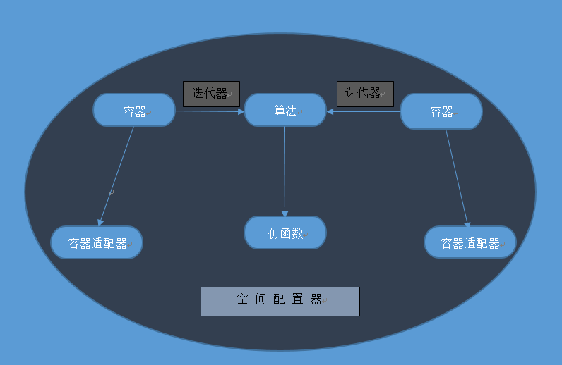
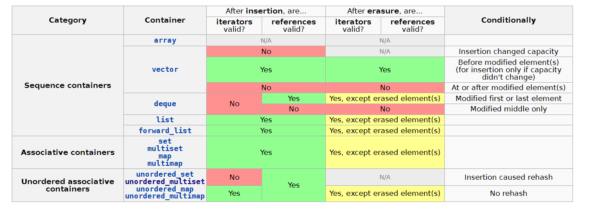

# STL

## 容器分类

### Sequence containers

Sequence containers implement data structures which can be accessed sequentially.

| container                                                    | remark                                    |
| ------------------------------------------------------------ | ----------------------------------------- |
| [array](https://en.cppreference.com/w/cpp/container/array)(C++11) | static contiguous array (class template)  |
| [vector](https://en.cppreference.com/w/cpp/container/vector) | dynamic contiguous array (class template) |
| [deque](https://en.cppreference.com/w/cpp/container/deque)   | double-ended queue (class template)       |
| [forward_list](https://en.cppreference.com/w/cpp/container/forward_list)(C++11) | singly-linked list (class template)       |
| [list](https://en.cppreference.com/w/cpp/container/list)     | doubly-linked list (class template)       |

### Associative containers

Associative containers implement sorted data structures that can be quickly searched (*O(log n)* complexity).

| container                                                    | remark                                                       |
| ------------------------------------------------------------ | ------------------------------------------------------------ |
| [set](https://en.cppreference.com/w/cpp/container/set)       | collection of unique keys, sorted by keys (class template)   |
| [map](https://en.cppreference.com/w/cpp/container/map)       | collection of key-value pairs, sorted by keys, keys are unique (class template) |
| [multiset](https://en.cppreference.com/w/cpp/container/multiset) | collection of keys, sorted by keys (class template)          |
| [multimap](https://en.cppreference.com/w/cpp/container/multimap) | collection of key-value pairs, sorted by keys (class template) |

### Unordered associative containers (since C++11)

Unordered associative containers implement unsorted (hashed) data structures that can be quickly searched (*O(1)* average, *O(n)* worst-case complexity).

| container                                                    | remark                                                       |
| ------------------------------------------------------------ | ------------------------------------------------------------ |
| [unordered_set](https://en.cppreference.com/w/cpp/container/unordered_set)(C++11) | collection of unique keys, hashed by keys (class template)   |
| [unordered_map](https://en.cppreference.com/w/cpp/container/unordered_map)(C++11) | collection of key-value pairs, hashed by keys, keys are unique (class template) |
| [unordered_multiset](https://en.cppreference.com/w/cpp/container/unordered_multiset)(C++11) | collection of keys, hashed by keys (class template)          |
| [unordered_multimap](https://en.cppreference.com/w/cpp/container/unordered_multimap)(C++11) | collection of key-value pairs, hashed by keys (class template) |

### Container adaptors

Container adaptors provide a different interface for sequential containers.

| container                                                    | remark                                                       |
| ------------------------------------------------------------ | ------------------------------------------------------------ |
| [stack](https://en.cppreference.com/w/cpp/container/stack)   | adapts a container to provide stack (LIFO data structure) (class template) |
| [queue](https://en.cppreference.com/w/cpp/container/queue)   | adapts a container to provide queue (FIFO data structure) (class template) |
| [priority_queue](https://en.cppreference.com/w/cpp/container/priority_queue) | adapts a container to provide priority queue (class template) |
| [flat_set](https://en.cppreference.com/w/cpp/container/flat_set)(C++23) | adapts a container to provide a collection of unique keys, sorted by keys (class template) |
| [flat_map](https://en.cppreference.com/w/cpp/container/flat_map)(C++23) | adapts two containers to provide a collection of key-value pairs, sorted by unique keys (class template) |
| [flat_multiset](https://en.cppreference.com/w/cpp/container/flat_multiset)(C++23) | adapts a container to provide a collection of keys, sorted by keys (class template) |
| [flat_multimap](https://en.cppreference.com/w/cpp/container/flat_multimap)(C++23) | adapts two containers to provide a collection of key-value pairs, sorted by keys (class template) |

### Views

Views provide flexible facilities for interacting with one- or multi-dimensional views over a non-owning array of elements.

| view                                                         | remark                                                       |
| ------------------------------------------------------------ | ------------------------------------------------------------ |
| [span](https://en.cppreference.com/w/cpp/container/span)(C++20) | a non-owning view over a contiguous sequence of objects (class template) |
| [mdspan](https://en.cppreference.com/w/cpp/container/mdspan)(C++23) | a multi-dimensional non-owning array view (class template)   |

## 迭代器失效

​		只读方法永远不会使迭代器或引用失效。修改容器内容的方法可能会使迭代器和/或引用失效，如下表所示。

在这里，插入是指向容器中添加一个或多个元素的任何方法，删除是指从容器中删除一个或多个元素的任何方法。

* 插入方法的示例包括 std::set::insert、std::map::emplace、std::vector::push_back 和 std::d eque::push_front。
  * 请注意，std::unordered_map::operator[] 也很重要，因为它可能会在映射中插入元素。（自 C++ 11 起）
* 删除方法的示例包括 std::set::erase、std::vector::pop_back、std::deque::pop_front 和 std::map::clear。
  * clear 使所有迭代器和引用失效。因为它会擦除所有元素。

​		Unless otherwise specified (either explicitly or by defining a function in terms of other functions), passing a container as an argument to a library function never invalidate iterators to, or change the values of, objects within that container.（该怎么翻译)

​		除非另有指定（显式或通过根据其他函数定义函数），否则将容器作为参数传递给库函数绝不会使该容器中对象的迭代器失效或更改其值。

​		past-the-end 迭代器需要特别注意。通常，此迭代器是无效的，就好像它是未删除元素的普通迭代器一样。所以 std::set::end 永远不会失效，std::unordered_set::end 仅在 rehash 时失效（自 C++11 起），std::vector::end 总是失效（因为它总是在修改后的元素之后），依此类推。

​		There is one exception: an erasure which deletes the last element of a [std::deque](https://en.cppreference.com/w/cpp/container/deque) *does* invalidate the past-the-end iterator, even though it is not an erased element of the container (or an element at all). Combined with the general rules for [std::deque](https://en.cppreference.com/w/cpp/container/deque) iterators, the net result is that the only modifying operation which does *not* invalidate [std::deque::end](https://en.cppreference.com/w/cpp/container/deque/end) is an erasure which deletes the first element, but not the last.（怎么翻译）

​		有一个例外：删除 std::d eque 的最后一个元素确实会使 past-the-end 迭代器失效，即使它不是容器的删除元素（或根本不是容器元素）。结合 std::deque 迭代器的一般规则，最终结果是，唯一不会使 std::deque::end  失效的操作是删除第一个元素，而不是删除最后一个元素。

### Thread safety

1. All container functions can be called concurrently by different threads on different containers. More generally, the C++ standard library functions do not read objects accessible by other threads unless those objects are directly or indirectly accessible via the function arguments, including the this pointer.
2. All const member functions can be called concurrently by different threads on the same container. In addition, the member functions `begin()`, `end()`, `rbegin()`, `rend()`, `front()`, `back()`, `data()`, `find()`, `lower_bound()`, `upper_bound()`, `equal_range()`, `at()`, and, except in associative containers, `operator[]`, behave as const for the purposes of thread safety (that is, they can also be called concurrently by different threads on the same container). More generally, the C++ standard library functions do not modify objects unless those objects are accessible, directly or indirectly, via the function's non-const arguments, including the this pointer.
3. Different elements in the same container can be modified concurrently by different threads, except for the elements of std::vector<bool> (for example, a vector of [std::future](https://en.cppreference.com/w/cpp/thread/future) objects can be receiving values from multiple threads).
4. Iterator operations (e.g. incrementing an iterator) read, but do not modify the underlying container, and may be executed concurrently with operations on other iterators on the same container, with the const member functions, or reads from the elements. Container operations that invalidate any iterators modify the container and cannot be executed concurrently with any operations on existing iterators even if those iterators are not invalidated.
5. Elements of the same container can be modified concurrently with those member functions that are not specified to access these elements. More generally, the C++ standard library functions do not read objects indirectly accessible through their arguments (including other elements of a container) except when required by its specification.
6. In any case, container operations (as well as algorithms, or any other C++ standard library functions) may be parallelized internally as long as this does not change the user-visible results (e.g. [std::transform](https://en.cppreference.com/w/cpp/algorithm/transform) may be parallelized, but not [std::for_each](https://en.cppreference.com/w/cpp/algorithm/for_each) which is specified to visit each element of a sequence in order).

**迭代器失效有两个层面的意思:**

>* 无法通过迭代器++,--操作遍历整个stl容器。记作: 第一层失效。
>* 无法通过迭代器存取迭代器所指向的内存。 记作: 第二层失效。

**参考：**

* [cpp reference —  Iterator invalidation](https://en.cppreference.com/w/cpp/container)

