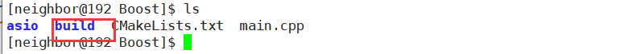

# Build Tool

## GNU (gcc & g++)

### 1. g++简介

g++是GNU开发的C++编译器，是GCC（GNU Compiler Collection）GNU编译器套件的组成部分。另外，gcc是GNU的C编译器。

看官方手册你会发现g++的命令选项真的多如繁星，令人头皮发麻。但是常用的命令选项也就那几个，完成我们的日常编译，g++使用起来还是比较简单的！g++编译器是GCC的一部分，GCC编译工作一般分为四个步骤：  

（1）预处理（Preprocessing）。由预处理器cpp完成，将.cpp源文件预处理为.i文件。

```javascript
g++  -E  test.cpp  -o  test.i    //生成预处理后的.i文件
```

（2）编译（Compilation）。将.i文件编译为.s的汇编文件。使用`-S`选项，只进行编译而不进行汇编，生成汇编代码。这里的编译器具体是什么，我暂时还不清楚，知道的请留言告知，万分感谢。百度百科说是egcs，但是我在Linux并没有查到该命令。

```javascript
g++ -S test.i -o test.s         //生成汇编.s文件
```

（3）汇编（Assembly）。由汇编器as完成，将.s文件汇编成.o的二进制目标文件。

```javascript
g++  -c  test.s  -o  test.o    //生成二进制.o文件
```

（4）链接（Linking）。由链接器ld，将.o文件连接生成可执行程序。

```javascript
g++ test.o  -o  test.out      //生成二进制.out可执行文件 
```

### 2.命令格式

```javascript
gcc [-c|-S|-E] [-std=standard]
    [-g] [-pg] [-Olevel]
    [-Wwarn...] [-pedantic]
    [-Idir...] [-Ldir...]
    [-Dmacro[=defn]...] [-Umacro]
    [-foption...] [-mmachine-option...]
    [-o outfile] [@file] infile...
```

### 3.命令选项

关于g++的命令选项，大家可以参考[g++百度百科](http://baike.baidu.com/link?url=FQvGegKMC9UsRPbdBRSRkto7y-QJuy093kei3dqlVwzghhwZv_i3nD53Xtq16n4_26phqLxD4DKCqnXSQ17Az_)或者[GCC官方手册](https://gcc.gnu.org/onlinedocs/gcc-6.1.0/gcc.pdf)，或者使用`man g++`单独查看g++使用手册。

下面列出常用的命令选项。

**（1）总体选项**

```javascript
-E
    只激活预处理,这个不生成文件,你需要把它重定向到一个输出文件里面。例子用法:   
    gcc -E hello.c > pianoapan.txt   
    gcc -E hello.c | more   
    慢慢看吧,一句`hello word`也要预处理成800行的代码。     
-S   
    只激活预处理和编译，就是指把文件编译成为汇编代码。例子用法： 
    gcc -S hello.c   
    将生成.s的汇编代码，可以用文本编辑器查看。    
-c    
    只激活预处理,编译,和汇编,也就是他只把程序做成obj文件。例子用法:   
    gcc -c hello.c   
    将生成.o的目标文件（object file）。 
-o
    指定目标名称，缺省的时候，gcc/g++编译出来的文件是a.out。例子如下：   
    g++ -o hello.out hello.cpp
    g++ -o hello.asm -S hello.cpp   

g++ -std=c++0x test.cpp -Wl,-R /home/ufccode/appcom -L /home/ufccode/appcom -ls_libpublic_uft
```

**（2）目录选项**

```javascript
-I[dir]
    在你是用#include "file"的时候，gcc/g++会先在当前目录查找你所指定的头文件，如果没有找到，会到系统默认的头文件目录找。如果使用-I指定了目录，编译器会先在指定的目录查找，然后再去系统默认头文件目录查找。对于#include <file>，gcc/g++会到-I指定的目录查找，查找不到，然后再到系统默认的头文件目录查找。
-include [file]
    相当于“#include”，用于包含某个代码,简单来说,就是编译某个文件,需要另一个文件的时候,就可以   
    用它设定,功能就相当于在代码中使用#include。例子用法:   
    gcc hello.c -include /root/pianopan.h   
-I-
    就是取消前一个参数的功能,所以一般在-Idir之后使用   
-idirafter [dir]   
    在-I的目录里面查找失败，将到目录dir里面查找。
-iprefix [prefix]，-iwithprefix [dir]
    一般一起使用，当-I的目录查找失败，会到prefix+dir下查找。
-L[dir]   
    编译的时候，指定搜索库的路径。比如你自己的库，可以用它指定目录，不然编译器将只在标准库的
    目录找。这个dir就是目录的名称。
-l[library]    
    指定编译的时使用的库，例子用法   
    gcc -lcurses hello.c   
    使用curses库编译连接，生成程序。  
```

**（3）预处理选项**

```javascript
-Dmacro
    相当于C语言中的#define macro。
-Dmacro=defn   
    相当于C语言中的#define macro=defn。
-Umacro
    相当于C语言中的#undef macro。
-undef
    取消对任何非标准宏的定义。
```

**（4）链接方式选项**

```javascript
-static
    此选项将禁止使用动态库。优点：程序运行不依赖于其他库。缺点：可执行文件比较大。
-shared
    此选项将尽量使用动态库，为默认选项。优点：生成文件比较小。缺点：运行时需要系统提供动态库。
-symbolic
    建立共享目标文件的时候，把引用绑定到全局符号上。对所有无法解析的引用作出警告（除非用连接选项，
    '-Xlinker -z -Xlinker defs'取代)。注：只有部分系统支持该选项。
-Wl,-Bstatic
    告诉链接器ld只链接静态库，如果只存在动态链接库，则链接器报错。
-Wl,-Bdynamic
    告诉链接器ld优先使用动态链接库，如果只存在静态链接库，则使用静态链接库。
```

**（5）错误与告警选项**

```
-Wall
    一般使用该选项，允许发出GCC能够提供的所有有用的警告。也可以用-W{warning}来标记指定的警告。
-pedantic
    允许发出ANSI/ISO C标准所列出的所有警告。
-pedantic-errors
    允许发出ANSI/ISO C标准所列出的错误
-werror
    把所有警告转换为错误，在警告发生时中止编译过程。
-w
    关闭所有警告,建议不要使用此项。
-WFATAL-ERRORS
	在出现错误的时候停止编译
--fmax-errors=N
	在第N次出现错误的时候停止编译
```

**（6）调试选项**

```javascript
 -g   
    指示编译器，在编译时，产生调试信息。
-gstabs   
    此选项以stabs格式生成调试信息,但不包括gdb调试信息。 
-gstabs+   
    此选项以stabs格式声称调试信息,并且包含仅供gdb使用的额外调试信息.   
-ggdb    
    此选项将尽可能的生成gdb可以使用的调试信息。
-glevel
    请求生成调试信息，同时用level指出需要多少信息，默认的level值是2。
```

**（7）优化选项**

```javascript
-O0   
-O1   
-O2   
-O3   
    编译器优化选项分为4个级别，-O0表示没有优化，-O1为缺省值，建议使用-O2，-O3优化级别最高。
```

**（8）其他选项**

```javascript
-fpic
    编译器就生成位置无关目标码.适用于共享库(shared library).
-fPIC
    编译器就输出位置无关目标码.适用于动态连接(dynamic linking),即使分支需要大范围转移。
-v 显示详细的编译、汇编、连接命令
-pipe
    使用管道代替编译过程中的临时文件,在使用非gnu汇编工具的时候,可能有些问题   
    g++ -pipe -o hello.out hello.cpp
-ansi
    关闭gnu c中与ansi c不兼容的特性，激活ansi c的专有特性(包括禁止一些asm inline typeof关键字,以及
    UNIX,vax等预处理宏。
-fno-asm   
    此选项实现ansi选项功能的一部分，它禁止将asm,inline和typeof用作关键字。   
-fno-strict-prototype
    只对g++起作用,使用这个选项,g++将对不带参数的函数,都认为是没有显式的对参数的个数和类型说明,而不是没有
    参数.而gcc无论是否使用这个参数,都将对没有带参数的函数,认为没有显式说明的类型。
-fthis-is-varialble   
    就是向传统c++看齐,可以使用this当一般变量使用。
-fcond-mismatch   
    允许条件表达式的第二和第三参数类型不匹配,表达式的值将为void类型。
-funsigned-char   
-fno-signed-char   
-fsigned-char   
-fno-unsigned-char   
    这四个参数是对char类型进行设置,决定将char类型设置成unsigned char(前两个参数)或者signed char(后
    两个参数)。
-imacros file   
    将file文件的宏,扩展到gcc/g++的输入文件,宏定义本身并不出现在输入文件中     
-nostdinc   
    使编译器不在系统缺省的头文件目录里面找头文件,一般和-I联合使用,明确限定头文件的位置。 
-nostdin C++
    规定不在g++指定的标准路经中搜索,但仍在其他路径中搜索,此选项在创建libg++库使用。
-C
    在预处理的时候,不删除注释信息,一般和-E使用,有时候分析程序，用这个很方便的。 
-M  
    生成文件依赖的信息，包含目标文件所依赖的所有源文件。你可以用gcc -M hello.c来测试一下，很简单。   
-MM   
    和上面的那个一样，但是它将忽略由#include造成的依赖关系。   
-MD
    和-M相同，但是输出将导入到.d的文件里面。
-MMD   
    和-MM相同，但是输出将导入到.d的文件里面。
-Wa,option   
    此选项传递option给汇编程序；如果option中间有逗号,就将option分成多个选项，然后传递给会汇编程序。 
-Wl.option   
    此选项传递option给连接程序;如果option中间有逗号,就将option分成多个选项,然后传递给会连接程序。
-x language filename   
    设定文件所使用的语言,使后缀名无效,对以后的多个有效.也就是根据约定C语言的后缀名称是.c的，而C++的后缀
    名是.C或者.cpp。如果你很个性，决定你的C代码文件的后缀名是.pig，那你就要用这个参数,这个参数对他后面
    的文件名都起作用，除非到了下一个参数的使用。可以使用的参数有下面的这些：
    c,objective-c,c-header,c++,cpp-output,assembler,assembler-with-cpp。   
    看到英文，应该可以理解的。例子用法:   
    gcc -x c hello.pig
-x none filename
    关掉上一个选项，也就是让gcc根据文件名后缀，自动识别文件类型，例子用法:   
    gcc -x c hello.pig -x none hello2.c
```

### 4.FAQ

#### 4.1编译选项疑问

##### 4.1.1-Wno-unknown-pragmas和-Wno-format -pg

**-Wno-unknown-pragmas：**查了大量资料和官方的手册，我觉得这个应该是实验室的师兄写错了，貌似没有这个警告命令选项。官方手册中有如下两个设置警告的命令选项。

**（1）-Wunknown-pragmas**

```javascript
Warn when a #pragma directive is encountered that is not understood by GCC. If this 
command-line option is used, warnings are even issued for unknown pragmas in system 
header files. This is not the case if the warnings are only enabled by the ‘-Wall’ 
command-line option.
```

遇到GCC无法识别的编译指导指令，发出警告。在使用了-Wall选项时，就不需要使用该命令选项了。

**（2）-Wno-pragmas**

```javascript
Do not warn about misuses of pragmas, such as incorrect parameters, invalid
syntax, or conflicts between pragmas. See also '-Wunknown-pragmas'.
```

遇到GCC无法识别的编译指导指令，不发出警告。

**-pg作用：**编译的过程中加入额外的代码， 供性能分析工具gprof剖析程序的耗时情况。

#### 4.2链接注意事项

##### 4.2.1指定静态与动态的链接方式

g++链接库时，默认优先链接动态链接库。静态库与动态库混合链接时，有如下两种方法：  （1）静态链接库使用绝对路径，动态链接库使用-l。以boost库为例，如果我们要使用静态库则可书写如下：

```javascript
 g++ main.cpp -pthread /usr/lib64/libboost_thread.a /usr/lib64/libboost_system.a
```

（2）使用`-Wl,-Bstatic`告诉链接器`ld`链接静态库，不存在静态库，则`ld`报错，只存在动态链接库也报错。使用`-Wl,-Bdynamic`告诉链接器**优先**使用动态链接库，如果只存在静态库，则链接静态库，不报错。示例如下：

```javascript
g++  main.cpp -Wl,-Bstatic -lboost_system -lboost_thread -Wl,-Bdynamic
```

**注意：**  （1）命令末尾`-Wl,-Bdynamic`，作用是告诉链接器，后续系统库的链接默认使用动态链接，否则会出现找不到系统库的错误，诸如：

```javascript
/usr/bin/ld: cannot find -lgcc_s
collect2: ld returned 1 exit status
```

（2）链接时，库要放在目标文件的后面，否则会报”undefined reference to: xxx”错误。具体参见gcc手册的如下描述：

```javascript
the linker searches and processes libraries and object files in the order they are 
specified. Thus, `foo.o -lz bar.o' searches library `z' after file foo.o but before 
bar.o. If bar.o refers to functions in `z', those functions may not be loaded.
```

### 参考文献

[gcc及其选项详解](http://blog.chinaunix.net/uid-25119314-id-224398.html)  

[GCC官方手册](https://gcc.gnu.org/onlinedocs/gcc-6.1.0/gcc.pdf)  

[gcc编译选项](http://www.cnblogs.com/fengbeihong/p/3641384.html)  

[gcc/g++ 静态动态库混链接](http://blog.csdn.net/wangxvfeng101/article/details/15336955) 

[折腾gcc/g++链接时.o文件及库的顺序问题](http://blog.csdn.net/imilli/article/details/51454236)  

[g++参数介绍](http://www.cnblogs.com/lidan/archive/2011/05/25/2239517.html)  

[gcc cannot find cc1plus](https://stackoverflow.com/questions/36353302/gcc-cannot-find-cc1plus?utm_medium=organic&utm_source=google_rich_qa&utm_campaign=google_rich_qa)

### 5. 手工安装

```bash
# GMP: https://gcc.gnu.org/pub/gcc/infrastructure/
$ ./configure --prefix=/usr/local/gmp-6.1.0/

# MPFR: https://gcc.gnu.org/pub/gcc/infrastructure/
$ ./configure --prefix=/usr/local/mpfr-4.1.0/     --with-gmp-include=/usr/local/gmp-6.1.0/include     --with-gmp-lib=/usr/local/gmp-6.1.0/lib

#MPC: https://gcc.gnu.org/pub/gcc/infrastructure/
$ ./configure --prefix=/usr/local/mpc-1.2.1     --with-gmp-include=/usr/local/gmp-6.1.0/include --with-gmp-lib=/usr/local/gmp-6.1.0/lib --with-mpfr-include=/usr/local/mpfr-4.1.0/include --with-mpfr-lib=/usr/local/mpfr-4.1.0/lib

# GCC: https://ftp.gnu.org/gnu/gcc/gcc-4.4.6/
$ ./configure     --disable-multilib     --prefix=/usr/local/gcc-4.4.6   --with-gmp-include=/usr/local/gmp-6.1.0/include --with-gmp-lib=/usr/local/gmp-6.1.0/lib --with-mpfr-include=/usr/local/mpfr-4.1.0/include --with-mpfr-lib=/usr/local/mpfr-4.1.0/lib     --with-mpc-include=/usr/local/mpc-1.2.1/include  --with-mpc-lib=/usr/local/mpc-1.2.1/lib  

# 不设置编译gcc时会报一些不明确的错误
$ export LD_LIBRARY_PATH=$LD_LIBRARY_PATH:/usr/local/gmp-6.1.0/lib:/usr/local/mpfr-4.1.0/lib:/usr/local/mpc-1.2.1/lib

# 编译并安装 需要有zip/jar
$ make && make install
# 卸载
$ make uninstall
```

```bash
$ export PATH=/usr/local/gcc-4.4.6/bin:$PATH
$ export LIBRARY_PATH=/usr/local/gcc-4.4.6/lib64:$LIBRARY_PATH
$ export LD_LIBRARY_PATH=/usr/local/gcc-4.4.6/lib64:/usr/local/gmp-6.1.0/lib:/usr/local/mpfr-4.1.0/lib:/usr/local/mpc-1.2.1/lib:$LD_LIBRARY_PATH
$ export C_INCLUDE_PATH=/usr/local/gcc-4.4.6/include:$C_INCLUDE_PATH
$ export CPLUS_INCLUDE_PATH=/usr/local/gcc-4.4.6/include:$CPLUS_INCLUDE_PATH

# 在oracle pcscfg.cfg（编译似乎会默认从这里找相关依赖文件）中添加 $GCC_PATH
# System default option values taken from: /u01/app/oracle/product/11.2.0/db/precomp/admin/pcscfg.cfg
$export GCC_PATH=/usr/local/gcc-4.4.6/lib/gcc/x86_64-unknown-linux-gnu/4.4.6/include/:/usr/local/gcc-4.4.6/include/c++/4.4.6/tr1,/usr/local/gcc-4.4.6/include/c++/4.4.6:/usr/local/gcc-4.4.6/include/c++/4.4.6/x86_64-unknown-linux-gnu:/usr/local/gcc-4.4.6/libexec/gcc/x86_64-unknown-linux-gnu/4.4.6/cc1plus
```


## GDB 调试

### 语法

```shell
gdb(选项)(参数)
```

### 选项

```shell
-cd：设置工作目录；
-q：安静模式，不打印介绍信息和版本信息；
-d：添加文件查找路径；
-x：从指定文件中执行GDB指令；
-s：设置读取的符号表文件。
-args: 
```

### 常用操作

| 命令                                                       | 解释                                                         | 示例                                                         |
| :--------------------------------------------------------- | :----------------------------------------------------------- | :----------------------------------------------------------- |
| [file](http://man.linuxde.net/file) <文件名>               | 加载被调试的可执行程序文件。 因为一般都在被调试程序所在目录下执行GDB，因而文本名不需要带路径。 | (gdb) file gdb-sample                                        |
| r                                                          | Run的简写，运行被调试的程序。 如果此前没有下过断点，则执行完整个程序；如果有断点，则程序暂停在第一个可用断点处。 | (gdb) r                                                      |
| c                                                          | Continue的简写，继续执行被调试程序，直至下一个断点或程序结束。 | (gdb) c                                                      |
| b <行号> b <函数名称> b *<函数名称> b *<代码地址> d [编号] | b: Breakpoint的简写，设置断点。两可以使用“行号”“函数名称”“执行地址”等方式指定断点位置。 其中在函数名称前面加“*”符号表示将断点设置在“由编译器生成的prolog代码处”。如果不了解汇编，可以不予理会此用法。 d: Delete breakpoint的简写，删除指定编号的某个断点，或删除所有断点。断点编号从1开始递增。 | (gdb) b 8 (gdb) b main (gdb) b *main (gdb) b *0x804835c (gdb) d |
| s, n                                                       | s: 执行一行源程序代码，如果此行代码中有函数调用，则进入该函数； n: 执行一行源程序代码，此行代码中的函数调用也一并执行。 s 相当于其它调试器中的“Step Into (单步跟踪进入)”； n 相当于其它调试器中的“Step Over (单步跟踪)”。 这两个命令必须在有源代码调试信息的情况下才可以使用（GCC编译时使用“-g”参数）。 | (gdb) s (gdb) n                                              |
| si, ni                                                     | si命令类似于s命令，ni命令类似于n命令。所不同的是，这两个命令（si/ni）所针对的是汇编指令，而s/n针对的是源代码。 | (gdb) si (gdb) ni                                            |
| p <变量名称>                                               | Print的简写，显示指定变量（临时变量或全局变量）的值。        | (gdb) p i (gdb) p nGlobalVar                                 |
| display ... undisplay <编号>                               | display，设置程序中断后欲显示的数据及其格式。 例如，如果希望每次程序中断后可以看到即将被执行的下一条汇编指令，可以使用命令 “display /i $pc” 其中 $pc 代表当前汇编指令，/i 表示以十六进行显示。当需要关心汇编代码时，此命令相当有用。 undispaly，取消先前的display设置，编号从1开始递增。 | (gdb) display /i $pc (gdb) undisplay 1                       |
| i                                                          | [info](http://man.linuxde.net/info)的简写，用于显示各类信息，详情请查阅“[help](http://man.linuxde.net/help) i”。 | (gdb) i r                                                    |
| q                                                          | Quit的简写，退出GDB调试环境。                                | (gdb) q                                                      |
| help [命令名称]                                            | GDB帮助命令，提供对GDB名种命令的解释说明。 如果指定了“命令名称”参数，则显示该命令的详细说明；如果没有指定参数，则分类显示所有GDB命令，供用户进一步浏览和查询。 | (gdb) help                                                   |

```
以下内容参考陈皓老师的博客整理，原创博客地址:https://blog.csdn.net/haoel

程序运行参数：
set args 可指定运行时参数（如：set args 10 20 30）
show args 命令可以查看设置好的运行参数。

设置动态库路径
info sharedlibrary  查看so库的加载路径是否正确
可以使用set sysroot、set solib-absolute-prefix、set solib-search-path来指定库搜索路径
1. set sysroot 与 set solib-absolute-prefix 是同一条命令，实际上，set sysroot是set solib-absolute-prefix 的别名。
2. set solib-search-path设置动态库的搜索路径，该命令可设置多个搜索路径，路径之间使用“:”隔开（在linux中为冒号，DOS和Win32中为分号）。
3. set solib-absolute-prefix 与 set solib-search-path 的区别：
在设置了搜索路路径后，最好先用file命令载入主执行文件，再用core命令载入Coredump文件，这样才能保证正确载入库的符号表

断点：
a. 设置断点
break [function] 在进入函数时停住，c++中可以使用class::function或者function(type,type)格式指定函数名。
break [linenum] 在指定行号停住
break +offset/-offset 在当前行号的前面或后面的offset行停住
break [filename:function] 在源文件filename的function函数的入口停住
break *address 在程序运行的内存地址处停住
break 没有参数时，表示在下一条指令处停住
break [...] if [condition] ...可以是上述参数，在条件成立时停住。比如在循环境体中，可以设置break if i=100,标识当i等于100时停住程序
b. 查看断点(n表示断点号)
info break [n]
info breakpoints [n]

观察点：
a. 设置观察点
watch [expr] 为表达式expr设置一个观察点，一旦表达式值有变化，马上停住程序
rwatch [expr] 当表达式expr被读时，停住程序
awatch [expr] 当表达式expr的值被读或被写时停住程序
b. 查看观察点
info watchpoints

捕捉点：
catch [event] event可以是以下类型：
	throw	一个C++抛出的异常
	catch	一个C++捕捉到的异常
	exec	调用系统调用exec时
	fork	调用系统调用fork时。
	vfork	调用系统调用vfork时。
	load/load [libname]	载入共享库时。
	unload/unload [libname]	卸载共享库时
tcatch [event] 只设置一次捕捉点，当程序停住以后，该点被自动删除。

维护停止点：
clear 清楚所有的已定义的停止点
clear [function] 
clear [filename:function] 清除所有设置在函数上的停止点
clear [linenum]
clear [filename:linenum] 清除所有设置在指定行上的停止点
delete/d [breakpoints] [range...] 删除指定断点，breakpoints为断点号。如果不指定默认删除所有断点。range表示范围（如：3-7）。

disable/dis [breakpoints] [range...] disable停止点gdb不会删除，当还需要时，enable即可。
enable [breakpoints] [range...]
enable [breakpoints] once [range...] enable指定的停止点停止后，立马被gdb自动disable
enable [breakpoints] delete [range...] enable指定的停止点停止后，立马被gdb自动删除

停止条件维护：
condition [bnum] [expr] 修改断点号为bnum的停止条件为expr
condition [bnum] 清楚bnum断点的停止条件
ignore [bnum] [count] 忽略bnum断点的停止条件几次

为停止点设定运行命令：
commands [bnum]
... command-list ...
end
为bnum断点设定一个命令列表，当程序被该断点停住时，gdb会依次运行命令列表中的命令。

恢复程序运行和单步调试：
step [count] 单步跟踪，会进入后面调用的函数，执行后面的count条指令
next [count] 单步跟踪，不会进入后续调用的函数，执行后面的count条指令
continue [ignore-count] 
c [ignore-count]
fg [ignore-count] 恢复程序运行，直到程序结束或下个断点到来，ignore-count标识连续忽略后面的断点次数。continue、c、fg一样。
set step-mod on/off  开启或关闭step-mode模式，开启后程序不会因为没有debug信息而不停住。
finish 运行程序直到当前函数完成返回并打印函数返回时的堆栈地址、返回值和参数值等信息。
until/u 运行程序直到退出循环体
stepi/si、nexti/ni 单步跟踪一条机器指令

多线程
info thread 查看当前进程的线程。
thread <ID> 切换调试的线程为指定ID的线程。
break <linespec> thread <threadno>
break <linespec> thread <threadno> if ...
        linespec指定了断点设置在的源程序的行号。threadno指定了线程的ID，注意，这个ID是GDB分配的，你可以通过“info threads”命令来查看正在运行程序中的线程信息。如果你不指定thread <threadno>则表示你的断点设在所有线程上面。你还可以为某线程指定断点条件。如：
	(gdb) break frik.c:13 thread 28 if bartab > lim

break file.c:100 thread all  在file.c文件第100行处为所有经过这里的线程设置断点。
set scheduler-locking off|on|step，这个是问得最多的。在使用step或者continue命令调试当前被调试线程的时候，其他线程也是同时执行的，怎么只让被调试程序执行呢？通过这个命令就可以实现这个需求。
off 不锁定任何线程，也就是所有线程都执行，这是默认值。
on 只有当前被调试程序会执行。
step 在单步的时候，除了next过一个函数的情况(熟悉情况的人可能知道，这其实是一个设置断点然后continue的行为)以外，只有当前线程会执行。
thread apply all bt
	
查看栈信息
backtrace/bt 打印当前函数调用栈所有信息
backtrace/bt [n] 只打印栈顶n层的栈信息
backtrace/bt [-n] 只打印栈底n层的栈信息
a. 如果你要查看某一层的信息，你需要在切换当前的栈，一般来说，程序停止时，最顶层的栈就是当前栈，如果你要查看栈下面层的详细信息，首先要做的是切换当前栈。
frame [n]
f [n] n是一个从0开始的整数，是栈中的层编号。比如：frame 0，表示栈顶，frame 1，表示栈的第二层。
up [n] 表示向栈的上面移动n层，可以不打n，表示向上移动一层。
down [n] 表示向栈的下面移动n层，可以不打n，表示向下移动一层。
          
b. 查看当前栈层的信息，你可以用以下GDB命令：
frame/f 会打印出这些信息：栈的层编号，当前的函数名，函数参数值，函数所在文件及行号，函数执行到的语句。
info frame/info f 会打印出更为详细的当前栈层的信息，只不过，大多数都是运行时的内内地址。比如：函数地址，调用函数的地址，被调用函数的地址，目前的函数是由什么样的程序语言写成的、函数参数地址及值、局部变量的地址等等。
info args 打印出当前函数的参数名及其值。
info locals 打印出当前函数中所有局部变量及其值。
info catch 打印出当前的函数中的异常处理信息。

源代码的内存
info line + 行号/函数名/文件::函数名/文件::行号 查看源代码在内存中的地址
disassemble
disassemble [Function]
disassemble [Address]
disassemble [Start],[End]
disassemble [Function],+[Length]
disassemble [Address],+[Length] 查看源程序当前执行时的机器码

查看运行时数据
print/p [expr]
print /[f] [expr] f是输出的格式
在表达式中，有几种GDB所支持的操作符，它们可以用在任何一种语言中。
	@ 是一个和数组有关的操作符，'@'左边是内存地址的值，右边是想查看内存的长度。如打印vector：
		# 打印多个元素
		print *(your_vector._M_impl._M_start)@your_vector_size
		#打印单个元素[n指下标]
		print *(your_vector._M_impl._M_start+n)
    :: 指定一个在文件或是一个函数中的变量。
    {<type>} <addr> 表示一个指向内存地址<addr>的类型为type的一个对象。
输出格式：
    x  按十六进制格式显示变量。
    d  按十进制格式显示变量。
    u  按十六进制格式显示无符号整型。
    o  按八进制格式显示变量。
    t  按二进制格式显示变量。
    a  按十六进制格式显示变量。
    c  按字符格式显示变量。
    f  按浮点数格式显示变量。
   
程序变量
在GDB中，你可以随时查看以下三种变量的值：
    1、全局变量（所有文件可见的）
    2、静态全局变量（当前文件可见的）
	3、局部变量（当前Scope可见的）
如果你的局部变量和全局变量发生冲突（也就是重名），一般情况下是局部变量会隐藏全局变量，也就是说，如果一个全局变量和一个函数中的局部变量同名时，如果当前停止点在函数中，用print显示出的变量的值会是函数中的局部变量的值。如果此时你想查看全局变量的值时，你可以使用“::”操作符：
    file::variable
    function::variable
可以通过这种形式指定你所想查看的变量，是哪个文件中的或是哪个函数中的。例如，查看文件f2.c中的全局变量x的值：
    gdb) p 'f2.c'::x
当然，“::”操作符会和C++中的发生冲突，GDB能自动识别“::” 是否C++的操作符，所以你不必担心在调试C++程序时会出现异常。  
另外，需要注意的是，如果你的程序编译时开启了优化选项，那么在用GDB调试被优化过的程序时，可能会发生某些变量不能访问，或是取值错误码的情况。这个是很正常的，因为优化程序会删改你的程序，整理你程序的语句顺序，剔除一些无意义的变量等，所以在GDB调试这种程序时，运行时的指令和你所编写指令就有不一样，也就会出现你所想象不到的结果。对付这种情况时，需要在编译程序时关闭编译优化。一般来说，几乎所有的编译器都支持编译优化的开关，例如，GNU的C/C++编译器GCC，你可以使用“-gstabs”选项来解决这个问题。关于编译器的参数，还请查看编译器的使用说明文档。

查看内存
x /[n/f/u] [addr] n、f、u为可选参数
n: 表示显示内存的长度，即从当前地址向后显示几个地址的内容
f: 表示显示的格式，参见上面，如果是字符串，则可以是s，如果是指令地址，可以是i，x, a
u: 表示从当前地址往后请求的字节数，不指定默认4个字节，b表示单字节，h表示双字节，w表示4字节，g表示8字节，当我们指定了字节长度后，GDB会从指定内存地址开始，读取指定字节，并当做一个值取出来
addr 表示内存地址

示例：x/3uh 0x54320表示从内存地址0x54320开始读取内容，h表示以双字节为单位，3表示三个单位，u表示按十六进制显示。 

自动显示
display [expr]
display/[fmt] [expr]
display/[fmt] [addr]
display设定一个或多个表达式后，一旦程序被停住，则gdb会自动显示这些表达式的值。
fmt 表示显示格式，i和s也支持
addr 表示地址
如：display/i $pc $pc是gdb的环境变量，表示指令的地址，/i则表示输出格式为机器指令码，也就是汇编。于是当程序停下后，就会出现源代码和机器指令码相对应的情形。
undisplay [dnums]
delete display[dnums] dnums为设置好了的自动显示的编号。如果要同时删除几个，编号可以用空格分隔，如果删除一个范围内的编号，则可以用减号表示（如：2-5）
disable display [dnums...]
enable display [dnums...] disable和enable不删除自动显示的设置，而只是让其失效和恢复
info display 查看display设置的自动显示的信息。

设置显示选项
set print address on/off 打开或关闭地址输出，当程序显示函数信息时，gdb会显示函数的参数地址，系统默认打开。
show print address 查看打印地址选项是否打开
show print array
set print array on/off 打开数组显示，打开后每个元素占一行，不打开每个元素以逗号分隔，默认关闭。
set print elements [number-of-elements] 指定数组数据显示的最大长度，0表示不限制
show print elements 查看print elements的选项信息
set print null-stop on/off 如果打开了这个选项，当显示字符串的时候，遇到结束符则停止显示。默认关闭。
set print pretty on/off 美化打印
set print sevenbit-strings on/off 设置字符显示，是否按“/nnn”的格式显示，如果打开，则字符串或字符数据按/nnn显示，如”/065“.
set print union on/off 设置显示结构体时，是否显示其内的联合体数据。
set print object on/off 在C++中如果一个对象指针指向其派生类，如果打开这个选项，gdb会自动按虚方法调用的规则显示输出，如果关闭这个选项的话，gdb就不管虚函数表了。默认off
set print static-members on/off 是否显示c++对象中的静态数据成员，默认on
set print vtbl on/off 用比较规整的格式显示虚函数表，默认关闭

gdb环境变量
你可以在GDB的调试环境中定义自己的变量，用来保存一些调试程序中的运行数据。要定义一个GDB的变量很简单只需。使用GDB的set命令。GDB的环境变量和UNIX一样，也是以$起头。如：
	set $foo = *object_ptr
使用环境变量时，GDB会在你第一次使用时创建这个变量，而在以后的使用中，则直接对其賦值。环境变量没有类型，你可以给环境变量定义任一的类型。包括结构体和数组。
show convenience
该命令查看当前所设置的所有的环境变量。这是一个比较强大的功能，环境变量和程序变量的交互使用，将使得程序调试更为灵活便捷。例如：
   set $i = 0
   print bar[$i++]->contents
于是，当你就不必，print bar[0]->contents, print bar[1]->contents地输入命令了。输入这样的命令后，只用敲回车，重复执行上一条语句，环境变量会自动累加，从而完成逐个输出的功能。

查看寄存器
info registers 查看寄存器情况（除了浮点寄存器）
info all-registers 查看所有寄存器情况（包括浮点寄存器）
info registers [regname ...] 查看指定寄存器的情况
寄存器中放置了程序运行时的数据，比如程序当前运行的指令地址（ip），程序的当前堆栈地址（sp）等等。你同样可以使用print命令来访问寄存器的情况，只需要在寄存器名字前加一个$符号就可以了。如：p $eip。

修改变量值
whatis + 变量名 查看变量类型
set var 变量名=值  设置程序的变量值
ptype + 变量类型 查看类型定义

跳转执行
一般来说，被调试程序会按照程序代码的运行顺序依次执行。GDB提供了乱序执行的功能，也就是说，GDB可以修改程序的执行顺序，可以让程序执行随意跳跃。这个功能可以由GDB的jump命令来完：
	jump <linespec> 执行下一条语句的运行点
	jump <address> 跳转到代码行的内存地址	
linespec：可以是文件行号，file:line格式或+num这种偏移量格式
注意，jump命令不会改变当前的程序栈中的内容，所以，当你从一个函数跳到另一个函数时，当函数运行完返回时进行弹栈操作时必然会发生错误，可能结果还是非常奇怪的，甚至于产生程序Core Dump。所以最好是同一个函数中进行跳转。
熟悉汇编的人都知道，程序运行时，有一个寄存器用于保存当前代码所在的内存地址。所以，jump命令也就是改变了这个寄存器中的值。于是，你可以使用“set $pc”来更改跳转执行的地址。如：
   set $pc = 0x485
   
强制函数返回   
return
return <expression>使用return命令取消当前函数的执行，并立即返回，如果指定了<expression>，那么该表达式的值会被认作函数的返回值。   

强制调用函数
 call <expr> 表达式中可以一是函数，以此达到强制调用函数的目的。并显示函数的返回值，如果函数返回值是void，那么就不显示。
另一个相似的命令也可以完成这一功能——print，print后面可以跟表达式，所以也可以用他来调用函数，print和call的不同是，如果函数返回void，call则不显示，print则显示函数返回值，并把该值存入历史数据中。

信号
signal <signal> UNIX的系统信号量通常从1到15。所以<singal>取值也在这个范围。
signal命令和shell的kill命令不同，系统的kill命令发信号给被调试程序时，是由GDB截获的，而signal命令所发出一信号则是直接发给被调试程序的。

信号是一种软中断，是一种处理异步事件的方法。一般来说，操作系统都支持许多信号。尤其是UNIX，比较重要应用程序一般都会处理信号。UNIX定义了许多信号，比如SIGINT表示中断字符信号，也就是Ctrl+C的信号，SIGBUS表示硬件故障的信号；SIGCHLD表示子进程状态改变信号；SIGKILL表示终止程序运行的信号，等等。信号量编程是UNIX下非常重要的一种技术。
GDB有能力在你调试程序的时候处理任何一种信号，你可以告诉GDB需要处理哪一种信号。你可以要求GDB收到你所指定的信号时，马上停住正在运行的程序，以供你进行调试。你可以用GDB的handle命令来完成这一功能。
    handle <signal> <keywords...>
    在GDB中定义一个信号处理。信号<signal>可以以SIG开头或不以SIG开头，可以用定义一个要处理信号的范围（如：SIGIO-SIGKILL，表示处理从SIGIO信号到SIGKILL的信号，其中包括SIGIO，SIGIOT，SIGKILL三个信号），也可以使用关键字all来标明要处理所有的信号。一旦被调试的程序接收到信号，运行程序马上会被GDB停住，以供调试。其<keywords>可以是以下几种关键字的一个或多个。
nostop 当被调试的程序收到信号时，GDB不会停住程序的运行，但会打出消息告诉你收到这种信号。
stop 当被调试的程序收到信号时，GDB会停住你的程序。
print 当被调试的程序收到信号时，GDB会显示出一条信息。
noprint 当被调试的程序收到信号时，GDB不会告诉你收到信号的信息。
pass
noignore 当被调试的程序收到信号时，GDB不处理信号。这表示，GDB会把这个信号交给被调试程序会处理。
nopass
ignore 当被调试的程序收到信号时，GDB不会让被调试程序来处理这个信号。
info signals
info handle 查看有哪些信号在被GDB检测中。

历史记录
当你用GDB的print查看程序运行时的数据时，你每一个print都会被GDB记录下来。GDB会以$1, $2, $3 .....这样的方式为你每一个print命令编上号。于是，你可以使用这个编号访问以前的表达式，如$1。这个功能所带来的好处是，如果你先前输入了一个比较长的表达式，如果你还想查看这个表达式的值，你可以使用历史记录来访问，省去了重复输入。

查看源程序
directory <dirname ... >
dir <dirname ... > 加一个源文件路径到当前路径的前面。如果你要指定多个路径，UNIX下你可以使用“:”，Windows下你可以使用“;”。
directory 清除所有的自定义的源文件搜索路径信息。
show directories 显示定义了的源文件搜索路径。
forward-search <regexp>
search <regexp> 向前面搜索。
reverse-search <regexp> 全部搜索。
list 打印程序源代码
	<linenum>   行号。
    <+offset>   当前行号的正偏移量。
    <-offset>   当前行号的负偏移量。
    <filename:linenum>  哪个文件的哪一行。
    <function>  函数名。
    <filename:function> 哪个文件中的哪个函数。
    <*address>  程序运行时的语句在内存中的地址。
set listsize count 设置显示的行数，默认10
show listsize

在其他语言中使用gdb
show language 查看当前的语言环境。如果GDB不能识为你所调试的编程语言，那么，C语言被认为是默认的环境。
info frame 查看当前函数的程序语言。
info source 查看当前文件的程序语言。
set language 
set language <程序语言名>
```

### STL调试

增加 stl_views.gdb 脚本，内容如下，操作方法：

> * 内容粘贴到.gdbinit或者在.gdbinit中包含该文件
> * 启动gdb之后，用 source stl-views.gdb 把这个脚本包含进来，使用如下命令打印 stl 的内容

| Data type              | GDB command             |
| :--------------------- | :---------------------- |
| std::vector<T>         | pvector *stl_variable*  |
| std::list<T>           | plist *stl_variable* T  |
| std::map<T,T>          | pmap *stl_variable*     |
| std::multimap<T,T>     | pmap *stl_variable*     |
| std::set<T>            | pset *stl_variable* T   |
| std::multiset<T>       | pset *stl_variable*     |
| std::deque<T>          | pdequeue *stl_variable* |
| std::stack<T>          | pstack *stl_variable*   |
| std::queue<T>          | pqueue *stl_variable*   |
| std::priority_queue<T> | ppqueue *stl_variable*  |
| std::bitset<n>td>      | pbitset *stl_variable*  |
| std::string            | pstring *stl_variable*  |
| std::widestring        | pwstring *stl_variable* |

```bash
##########################################
#                                        #
#   STL GDB evaluators/views/utilities   #
#                                        #
##########################################
#
#   The new GDB commands:                                                         
# 	    are entirely non instrumental                                             
# 	    do not depend on any "inline"(s) - e.g. size(), [], etc
#       are extremely tolerant to debugger settings
#                                                                                 
#   This file should be "included" in .gdbinit as following:
#   source stl-views.gdb or just paste it into your .gdbinit file
#
#   The following STL containers are currently supported:
#
#       std::vector<T> -- via pvector command
#       std::list<T> -- via plist command
#       std::map<T,T> -- via pmap command
#       std::multimap<T,T> -- via pmap command
#       std::set<T> -- via pset command
#       std::multiset<T> -- via pset command
#       std::deque<T> -- via pdequeue command
#       std::stack<T> -- via pstack command
#       std::queue<T> -- via pqueue command
#       std::priority_queue<T> -- via ppqueue command
#       std::bitset<n> -- via pbitset command
#       std::string -- via pstring command
#       std::widestring -- via pwstring command
#
#   The end of this file contains (optional) C++ beautifiers
#
##########################################################################
#                                                                        #
# CopyLefty @ 2008 - Dan C Marinescu - No Rights Reserved / GPL V3.      #
# Inspired by intial work of Tom Malnar and many others                 #
#  (do whatever you want with this code, hope it helps)                 #
#   Email: dan_c_marinescu@yahoo.com                                     #
#                                                                        #
##########################################################################


#
# std::vector<>
#

define pvector
	if $argc == 0
		help pvector
	else
		set $size = $arg0._M_impl._M_finish - $arg0._M_impl._M_start
		set $capacity = $arg0._M_impl._M_end_of_storage - $arg0._M_impl._M_start
		set $size_max = $size - 1
	end
	if $argc == 1
		set $i = 0
		while $i < $size
			printf "elem[%u]: ", $i
			p *($arg0._M_impl._M_start + $i)
			set $i++
		end
	end
	if $argc == 2
		set $idx = $arg1
		if $idx < 0 || $idx > $size_max
			printf "idx1, idx2 are not in acceptable range: [0..%u].\n", $size_max
		else
			printf "elem[%u]: ", $idx
			p *($arg0._M_impl._M_start + $idx)
		end
	end
	if $argc == 3
	  set $start_idx = $arg1
	  set $stop_idx = $arg2
	  if $start_idx > $stop_idx
	    set $tmp_idx = $start_idx
	    set $start_idx = $stop_idx
	    set $stop_idx = $tmp_idx
	  end
	  if $start_idx < 0 || $stop_idx < 0 || $start_idx > $size_max || $stop_idx > $size_max
	    printf "idx1, idx2 are not in acceptable range: [0..%u].\n", $size_max
	  else
	    set $i = $start_idx
		while $i <= $stop_idx
			printf "elem[%u]: ", $i
			p *($arg0._M_impl._M_start + $i)
			set $i++
		end
	  end
	end
	if $argc > 0
		printf "Vector size = %u\n", $size
		printf "Vector capacity = %u\n", $capacity
		printf "Element "
		whatis $arg0._M_impl._M_start
	end
end

document pvector
	Prints std::vector<T> information.
	Syntax: pvector <vector> <idx1> <idx2>
	Note: idx, idx1 and idx2 must be in acceptable range [0..<vector>.size()-1].
	Examples:
	pvector v - Prints vector content, size, capacity and T typedef
	pvector v 0 - Prints element[idx] from vector
	pvector v 1 2 - Prints elements in range [idx1..idx2] from vector
end 


#
# std::list<>
#

define plist
	if $argc == 0
		help plist
	else
		set $head = &$arg0._M_impl._M_node
		set $current = $arg0->_M_impl->_M_node->_M_next
		set $size = 0
		while $current != $head
			if $argc == 2
				printf "elem[%u]: ", $size
				p *($arg1*)($current + 1)
			end
			if $argc == 3
				if $size == $arg2
					printf "elem[%u]: ", $size
					p *($arg1*)($current + 1)
				end
			end
			set $current = $current->_M_next
			set $size++
		end
		printf "List size = %u \n", $size
		if $argc == 1
			printf "List "
			whatis $arg0
			printf "Use plist <variable_name> <element_type> to see the elements in the list.\n"
		end
	end
end

document plist
	Prints std::list<T> information.
	Syntax: plist <list> <T> <idx>: Prints list size, if T defined all elements or just element at idx
	Examples:
	plist l - prints list size and definition
	plist l int - prints all elements and list size
	plist l int 2 - prints the third element in the list (if exists) and list size
end


#
# std::map and std::multimap
#

define pmap
	if $argc == 0
		help pmap
	else
		set $tree = $arg0
		set $i = 0
		set $node = $tree->_M_t->_M_impl->_M_header->_M_left
		set $end = $tree->_M_t->_M_impl->_M_header
		set $tree_size = $tree->_M_t->_M_impl->_M_node_count
		if $argc == 1
			printf "Map "
			whatis $tree
			printf "Use pmap <variable_name> <left_element_type> <right_element_type> to see the elements in the map.\n"
		end
		if $argc == 3
			while $i < $tree_size
				set $value = (void *)($node + 1)
				printf "elem[%u]->left: ", $i
				p *($arg1*)$value
				set $value = $value + 4
				printf "elem[%u]->right: ", $i
				p *($arg2*)$value
				if $node->_M_right != 0
					set $node = $node->_M_right
					while $node->_M_left != 0
						set $node = $node->_M_left
					end
				else
					set $tmp_node = $node->_M_parent
					while $node == $tmp_node->_M_right
						set $node = $tmp_node
						set $tmp_node = $tmp_node->_M_parent
					end
					if $node->_M_right != $tmp_node
						set $node = $tmp_node
					end
				end
				set $i++
			end
		end
		if $argc == 4
			set $idx = $arg3
			set $ElementsFound = 0
			while $i < $tree_size
				set $value = (void *)($node + 1)
				if *($arg1*)$value == $idx
					printf "elem[%u]->left: ", $i
					p *($arg1*)$value
					set $value = $value + 4
					printf "elem[%u]->right: ", $i
					p *($arg2*)$value
					set $ElementsFound++
				end
				if $node->_M_right != 0
					set $node = $node->_M_right
					while $node->_M_left != 0
						set $node = $node->_M_left
					end
				else
					set $tmp_node = $node->_M_parent
					while $node == $tmp_node->_M_right
						set $node = $tmp_node
						set $tmp_node = $tmp_node->_M_parent
					end
					if $node->_M_right != $tmp_node
						set $node = $tmp_node
					end
				end
				set $i++
			end
			printf "Number of elements found = %u\n", $ElementsFound
		end
		if $argc == 5
			set $idx1 = $arg3
			set $idx2 = $arg4
			set $ElementsFound = 0
			while $i < $tree_size
				set $value = (void *)($node + 1)
				set $valueLeft = *($arg1*)$value
				set $valueRight = *($arg2*)($value + 4)
				if $valueLeft == $idx1 && $valueRight == $idx2
					printf "elem[%u]->left: ", $i
					p $valueLeft
					printf "elem[%u]->right: ", $i
					p $valueRight
					set $ElementsFound++
				end
				if $node->_M_right != 0
					set $node = $node->_M_right
					while $node->_M_left != 0
						set $node = $node->_M_left
					end
				else
					set $tmp_node = $node->_M_parent
					while $node == $tmp_node->_M_right
						set $node = $tmp_node
						set $tmp_node = $tmp_node->_M_parent
					end
					if $node->_M_right != $tmp_node
						set $node = $tmp_node
					end
				end
				set $i++
			end
			printf "Number of elements found = %u\n", $ElementsFound
		end
		printf "Map size = %u\n", $tree_size
	end
end

document pmap
	Prints std::map<TLeft and TRight> or std::multimap<TLeft and TRight> information. Works for std::multimap as well.
	Syntax: pmap <map> <TtypeLeft> <TypeRight> <valLeft> <valRight>: Prints map size, if T defined all elements or just element(s) with val(s)
	Examples:
	pmap m - prints map size and definition
	pmap m int int - prints all elements and map size
	pmap m int int 20 - prints the element(s) with left-value = 20 (if any) and map size
	pmap m int int 20 200 - prints the element(s) with left-value = 20 and right-value = 200 (if any) and map size
end


#
# std::set and std::multiset
#

define pset
	if $argc == 0
		help pset
	else
		set $tree = $arg0
		set $i = 0
		set $node = $tree->_M_t->_M_impl->_M_header->_M_left
		set $end = $tree->_M_t->_M_impl->_M_header
		set $tree_size = $tree->_M_t->_M_impl->_M_node_count
		if $argc == 1
			printf "Set "
			whatis $tree
			printf "Use pset <variable_name> <element_type> to see the elements in the set.\n"
		end
		if $argc == 2
			while $i < $tree_size
				set $value = (void *)($node + 1)
				printf "elem[%u]: ", $i
				p *($arg1*)$value
				if $node->_M_right != 0
					set $node = $node->_M_right
					while $node->_M_left != 0
						set $node = $node->_M_left
					end
				else
					set $tmp_node = $node->_M_parent
					while $node == $tmp_node->_M_right
						set $node = $tmp_node
						set $tmp_node = $tmp_node->_M_parent
					end
					if $node->_M_right != $tmp_node
						set $node = $tmp_node
					end
				end
				set $i++
			end
		end
		if $argc == 3
			set $idx = $arg2
			set $ElementsFound = 0
			while $i < $tree_size
				set $value = (void *)($node + 1)
				if *($arg1*)$value == $idx
					printf "elem[%u]: ", $i
					p *($arg1*)$value
					set $ElementsFound++
				end
				if $node->_M_right != 0
					set $node = $node->_M_right
					while $node->_M_left != 0
						set $node = $node->_M_left
					end
				else
					set $tmp_node = $node->_M_parent
					while $node == $tmp_node->_M_right
						set $node = $tmp_node
						set $tmp_node = $tmp_node->_M_parent
					end
					if $node->_M_right != $tmp_node
						set $node = $tmp_node
					end
				end
				set $i++
			end
			printf "Number of elements found = %u\n", $ElementsFound
		end
		printf "Set size = %u\n", $tree_size
	end
end

document pset
	Prints std::set<T> or std::multiset<T> information. Works for std::multiset as well.
	Syntax: pset <set> <T> <val>: Prints set size, if T defined all elements or just element(s) having val
	Examples:
	pset s - prints set size and definition
	pset s int - prints all elements and the size of s
	pset s int 20 - prints the element(s) with value = 20 (if any) and the size of s
end


#
# std::dequeue
#

define pdequeue
	if $argc == 0
		help pdequeue
	else
		set $size = 0
		set $start_cur = $arg0._M_impl._M_start._M_cur
		set $start_last = $arg0._M_impl._M_start._M_last
		set $start_stop = $start_last
		while $start_cur != $start_stop
			p *$start_cur
			set $start_cur++
			set $size++
		end
		set $finish_first = $arg0._M_impl._M_finish._M_first
		set $finish_cur = $arg0._M_impl._M_finish._M_cur
		set $finish_last = $arg0._M_impl._M_finish._M_last
		if $finish_cur < $finish_last
			set $finish_stop = $finish_cur
		else
			set $finish_stop = $finish_last
		end
		while $finish_first != $finish_stop
			p *$finish_first
			set $finish_first++
			set $size++
		end
		printf "Dequeue size = %u\n", $size
	end
end

document pdequeue
	Prints std::dequeue<T> information.
	Syntax: pdequeue <dequeue>: Prints dequeue size, if T defined all elements
	Deque elements are listed "left to right" (left-most stands for front and right-most stands for back)
	Example:
	pdequeue d - prints all elements and size of d
end


#
# std::stack
#

define pstack
	if $argc == 0
		help pstack
	else
		set $start_cur = $arg0.c._M_impl._M_start._M_cur
		set $finish_cur = $arg0.c._M_impl._M_finish._M_cur
		set $size = $finish_cur - $start_cur
        set $i = $size - 1
        while $i >= 0
            p *($start_cur + $i)
            set $i--
        end
		printf "Stack size = %u\n", $size
	end
end

document pstack
	Prints std::stack<T> information.
	Syntax: pstack <stack>: Prints all elements and size of the stack
	Stack elements are listed "top to buttom" (top-most element is the first to come on pop)
	Example:
	pstack s - prints all elements and the size of s
end


#
# std::queue
#

define pqueue
	if $argc == 0
		help pqueue
	else
		set $start_cur = $arg0.c._M_impl._M_start._M_cur
		set $finish_cur = $arg0.c._M_impl._M_finish._M_cur
		set $size = $finish_cur - $start_cur
        set $i = 0
        while $i < $size
            p *($start_cur + $i)
            set $i++
        end
		printf "Queue size = %u\n", $size
	end
end

document pqueue
	Prints std::queue<T> information.
	Syntax: pqueue <queue>: Prints all elements and the size of the queue
	Queue elements are listed "top to bottom" (top-most element is the first to come on pop)
	Example:
	pqueue q - prints all elements and the size of q
end


#
# std::priority_queue
#

define ppqueue
	if $argc == 0
		help ppqueue
	else
		set $size = $arg0.c._M_impl._M_finish - $arg0.c._M_impl._M_start
		set $capacity = $arg0.c._M_impl._M_end_of_storage - $arg0.c._M_impl._M_start
		set $i = $size - 1
		while $i >= 0
			p *($arg0.c._M_impl._M_start + $i)
			set $i--
		end
		printf "Priority queue size = %u\n", $size
		printf "Priority queue capacity = %u\n", $capacity
	end
end

document ppqueue
	Prints std::priority_queue<T> information.
	Syntax: ppqueue <priority_queue>: Prints all elements, size and capacity of the priority_queue
	Priority_queue elements are listed "top to buttom" (top-most element is the first to come on pop)
	Example:
	ppqueue pq - prints all elements, size and capacity of pq
end


#
# std::bitset
#

define pbitset
	if $argc == 0
		help pbitset
	else
        p /t $arg0._M_w
	end
end

document pbitset
	Prints std::bitset<n> information.
	Syntax: pbitset <bitset>: Prints all bits in bitset
	Example:
	pbitset b - prints all bits in b
end


#
# std::string
#

define pstring
	if $argc == 0
		help pstring
	else
		printf "String \t\t\t= \"%s\"\n", $arg0._M_data()
		printf "String size/length \t= %u\n", $arg0._M_rep()->_M_length
		printf "String capacity \t= %u\n", $arg0._M_rep()->_M_capacity
		printf "String ref-count \t= %d\n", $arg0._M_rep()->_M_refcount
	end
end

document pstring
	Prints std::string information.
	Syntax: pstring <string>
	Example:
	pstring s - Prints content, size/length, capacity and ref-count of string s
end 


#
# std::wstring
#

define pwstring
	if $argc == 0
		help pwstring
	else
		call printf("WString \t\t= \"%ls\"\n", $arg0._M_data())
		printf "WString size/length \t= %u\n", $arg0._M_rep()->_M_length
		printf "WString capacity \t= %u\n", $arg0._M_rep()->_M_capacity
		printf "WString ref-count \t= %d\n", $arg0._M_rep()->_M_refcount
	end
end

document pwstring
	Prints std::wstring information.
	Syntax: pwstring <wstring>
	Example:
	pwstring s - Prints content, size/length, capacity and ref-count of wstring s
end 

#
# C++ related beautifiers
#

set print pretty on
set print object on
set print static-members on
set print vtbl on
set print demangle on
set demangle-style gnu-v3
set print sevenbit-strings off
```

### 多线程

```
info threads 查看当前进程的线程
thread <ID>  切换调试的线程为指定ID的线程
break test.c:100 thread all   在所有线程中相应的行上设置断点

set scheduler-locking off|on|step
  off   默认值，不锁定任何线程，所有线程都执行
  on    只有当前被调试程序会执行
  step  表示在单步执行的时候，只有当前线程会执行；
```

### 多进程

```
单独调试子进程：
用attach命令将子进程的ID附加到gdb调试器上；

使用调试器选项follow-fork-mode
gdb调试器的选项follow-fork-mode允许我们选择程序在执行了fork调用后继续执行父进程还是子进程
set follow-fork-mode mode mode选项值可以是parent和child;该命令可以进入到子进程或者父进程；
```


###  问题

#### 打印出的字符串内容不全

```bash
(gdb) show print elements    #查看最大打印字符数
(gdb) set print elements 20000 #设置为20000
```

## Makefile

### 编译选项

### 常用变量

#### 自动化变量

```makefile
$@ 表示规则中的目标文件集。在模式规则中，如果有多个目标，那么，"$@"就是匹配于目标中模式定义的集合。
$% 仅当目标是函数库文件中，表示规则中的目标成员名。例如，如果一个目标是"foo.a(bar.o)"，那么，"$%"就是"bar.o"，"$@"就是"foo.a"。如果目标不是函数库文件（Unix下是[.a]，Windows下是[.lib]），那么，其值为空。
$< 依赖目标中的第一个目标名字。如果依赖目标是以模式（即"%"）定义的，那么"$<"将是符合模式的一系列的文件集。注意，其是一个一个取出来的。
$? 所有比目标新的依赖目标的集合。以空格分隔。
$^ 所有的依赖目标的集合。以空格分隔。如果在依赖目标中有多个重复的，那个这个变量会去除重复的依赖目标，只保留一份。
$+ 这个变量很像"$^"，也是所有依赖目标的集合。只是它不去除重复的依赖目标。
$* 这个变量表示目标模式中"%"及其之前的部分。如果目标是"dir/a.foo.b"，并且目标的模式是"a.%.b"，那么，"$*"的值就是"dir/a.foo"。这个变量对于构造有关联的文件名是比较有较。如果目标中没有模式的定义，那么"$*"也就不能被推导出，但是，如果目标文件的后缀是make所识别的，那么"$*"就是除了后缀的那一部分。例如：如果目标是"foo.c"，因为".c"是make所能识别的后缀名，所以，"$*"的值就是"foo"。这个特性是GNU make的，很有可能不兼容于其它版本的make，所以，你应该尽量避免使用"$*"，除非是在隐含规则或是静态模式中。如果目标中的后缀是make所不能识别的，那么"$*"就是空值。

下面是对于上面的七个变量分别加上"D"或是"F"的含义：
$(@D) 表示"$@"的目录部分（不以斜杠作为结尾），如果"$@"值是"dir/foo.o"，那么"$(@D)"就是"dir"，而如果"$@"中没有包含斜杠的话，其值就是"."（当前目录）。
$(@F) 表示"$@"的文件部分，如果"$@"值是"dir/foo.o"，那么"$(@F)"就是"foo.o"，"$(@F)"相当于函数"$(notdir $@)"。
"$(*D)"
"$(*F)" 和上面所述的同理，也是取文件的目录部分和文件部分。对于上面的那个例子，"$(*D)"返回"dir"，而"$(*F)"返回"foo"
"$(%D)"
"$(%F)" 分别表示了函数包文件成员的目录部分和文件部分。这对于形同"archive(member)"形式的目标中的"member"中包含了不同的目录很有用。
"$(<D)"
"$(<F)" 分别表示依赖文件的目录部分和文件部分。
"$(^D)"
"$(^F)" 分别表示所有依赖文件的目录部分和文件部分。（无相同的）
"$(+D)"
"$(+F)" 分别表示所有依赖文件的目录部分和文件部分。（可以有相同的）
"$(?D)"
"$(?F)" 分别表示被更新的依赖文件的目录部分和文件部分。
最后想提醒一下的是，对于"$<"，为了避免产生不必要的麻烦，我们最好给$后面的那个特定字符都加上圆括号，比如，"$(<)"就要比"$<"要好一些。
```


## CMake

### 常用变量

| 变量                           | 说明                         |
| ------------------------------ | ---------------------------- |
|                                |                              |
| CMAKE_CURRRENT_BINARY_DIR      |                              |
| CMAKE_CURRENT_SOURCE_DIR       |                              |
| CMAKE_BINARY_DIR               |                              |
| CMAKE_SOURCE_DIR               |                              |
| CMAKE_VERBOSE_MAKEFILE         | 启用Makefile版本中的详细输出 |
| CMAKE_ARCHIVE_OUTPUT_DIRECTORY | 静态库输出路径               |
| CMAKE_LIBRARY_OUTPUT_DIRECTORY | 动态库输出路径               |
| CMAKE_RUNTIME_OUTPUT_DIRECTORY | 可执行文件输出路径           |
|                                |                              |

### 操作说明

| 操作                                                         | 说明                                                         |
| ------------------------------------------------------------ | ------------------------------------------------------------ |
| add_library(<name> [STATIC \|SHARED \|MODULE] [EXCLUDE_FROM_ALL] [source1] [source2 ...]) | 生成库文件。如果指定了`STATIC`，就是生成静态库；如果指定了`SHARED`，就是生成动态库；如果指定了`MODULE`，就是使用类dl-open函数加载的动态库； |
| aux_source_directory(<dir> <variable>)                       | 收集指定目录中所有**源文件**的名称，并将列表存储在提供的<variable>变量中 |
| link_directories（<dir>）                                    | 指定库文件的路径                                             |
| include_directories(<dir>)                                   | 指定头文件的路径                                             |
| add_subdirectory(source_dir [binary_dir] [EXCLUDE_FROM_ALL]) | 将一个子目录添加到构建中                                     |
| target_link_libraries                                        |                                                              |
| add_dependencies                                             | add_dependencies可以在直接编译上层target时，自动检查下层依赖库是否已经生成。没有的话先编译下层依赖库，然后再编译上层target，最后link depend target。 |
| link_libraries([item1 [item2 [...]]]                [[debug\|optimized\|general] <item>] ...) |                                                              |
|                                                              |                                                              |
|                                                              |                                                              |

```cmake
# CMakeList.txt: demo 的 CMake 项目，在此处包括源代码并定义
# 项目特定的逻辑。
#
cmake_minimum_required (VERSION 3.8)

project ("demo")

# 将源代码添加到此项目的可执行文件。
# add_executable (demo "demo.cpp" "demo.h")

# TODO: 如有需要，请添加测试并安装目标。
# 添加头文件目录
include_directories(../../include)
# 添加需要链接的库文件目录
link_directories(../../lib)

# 添加 math 子目录
# add_subdirectory(asio)

# 设置
# set(CMAKE_CXX_STANDARD 11)

# 指定生成目标 
# add_executable(${PROJECT_NAME}.out asio/timer01.cpp)

# 指定可执行文件和lib文件目录
set( CMAKE_RUNTIME_OUTPUT_DIRECTORY ${CMAKE_BINARY_DIR}/bin )
set( CMAKE_LIBRARY_OUTPUT_DIRECTORY ${CMAKE_BINARY_DIR}/lib )

# If necessary, use the RELATIVE flag, otherwise each source file may be listed 
# with full pathname. RELATIVE may makes it easier to extract an executable name
# automatically.
# file( GLOB APP_SOURCES RELATIVE app/*.cxx )
# get_filename_component(<var> <FileName> <mode> [CACHE])

file( GLOB APP_SOURCES RELATIVE_PATH *.cpp test_server/*.cpp)
foreach( testsourcefile ${APP_SOURCES} )
    # I used a simple string replace, to cut off .cpp.
    # string( REPLACE ".cpp" "" testname ${testsourcefile} )
    get_filename_component(testname ${testsourcefile} NAME_WE)
    add_executable( ${testname} ${testsourcefile} )
    # Make sure YourLib is linked to each app
    # 添加链接库
    target_link_libraries(${testname} libevent ws2_32)
    # target_link_libraries(${testname}.exe boost_chrono)
endforeach( testsourcefile ${APP_SOURCES} )
```

### 建议

#### 新建build目录执行cmake构建

有时候为了不让cmake生成的文件污染我们的目录，我们可以在项目中新建一个build目录，然后在build目录中执行cmake构建，如下：



```bash
$ cd build
$ cmake ../
```


### solution

#### Cmake Parse error. Expected a command name, got unquoted argument with text “ ”

utf8编码的bug： vim 打开 ：

```bash
$ :set nobomb
```

## 内存泄露分析

### pmap

根据pmap查出大内存块的信息

```bash
$ pmap -X 3707 > mem.txt

$ cat mem.txt | awk '{print $3}' | sed '1,2d' | uniq -c | sort -nr

$ cat mem.txt | sed -n '1, 2p' > st_mem.txt
$ cat mem.txt | sed '1, 2d' | sed '$d' | sed '$d' | sort -nrk 7 >> st_mem.txt
$ cat mem.txt | sed '$d' | sed -n '$p' >> st_mem.txt
$ cat mem.txt | sed -n '$p' >> st_mem.txt
```

### /proc/<pid>/maps

结合上面分析出的大内存块查找内存地址。

```bash
$ cat /proc/<pid>/maps 
```

### gdb dump

```bash
(gdb) dump memory ./dump.bin 0x7f4f64000000 7f4f68000000

# 找到dump出来的文件
$ strings dump.bin
```

### valgrind

"definitely lost"：确认丢失。程序中存在内存泄露，应尽快修复。当程序结束时如果一块动态分配的内存没有被释放且通过程序内的指针变量均无法访问这块内存则会报这个错误。

"indirectly lost"：间接丢失。当使用了含有指针成员的类或结构时可能会报这个错误。这类错误无需直接修复，他们总是与"definitely lost"一起出现，只要修复"definitely lost"即可。例子可参考我的例程。

"possibly lost"：可能丢失。大多数情况下应视为与"definitely lost"一样需要尽快修复，除非你的程序让一个指针指向一块动态分配的内存（但不是这块内存起始地址），然后通过运算得到这块内存起始地址，再释放它。例子可参考我的例程。当程序结束时如果一块动态分配的内存没有被释放且通过程序内的指针变量均无法访问这块内存的起始地址，但可以访问其中的某一部分数据，则会报这个错误。

"still reachable"：可以访问，未丢失但也未释放。如果程序是正常结束的，那么它可能不会造成程序崩溃，但长时间运行有可能耗尽系统资源，因此笔者建议修复它。如果程序是崩溃（如访问非法的地址而崩溃）而非正常结束的，则应当暂时忽略它，先修复导致程序崩溃的错误，然后重新检测。

"suppressed"：已被解决。出现了内存泄露但系统自动处理了。可以无视这类错误。这类错误我没能用例程触发，看官方的解释也不太清楚是操作系统处理的还是valgrind，也没有遇到过。所以无视他吧~

```bash
$ valgrind --log-file="report.log" --tool=memcheck --leak-check=full --show-leak-kinds=all  exe
```

