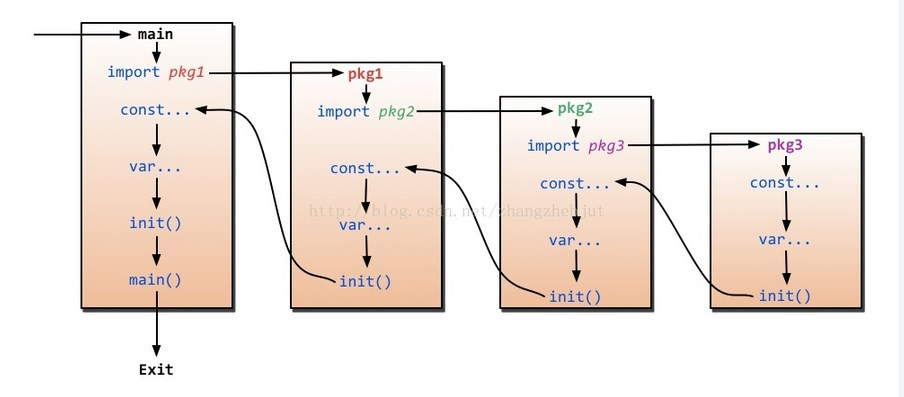

# Go 基础

## 默认约定

在Go里面有如下的约定：

> 1、如果文件名是以 "." 或者 "_" 开头的话编译的时候会被忽略
>
> 2、文件名如果是 suffix_test.go are 只会在运行go test的时候才会被编译和运行
>
> 3、文件名支持系统和architecture来指定系统的编译。文件名支持如下的格式:

```
*_GOOS
*_GOARCH
*_GOOS_GOARCH
```

  例如 name_linux.go 只会在 linux 编译, name_amd64.go 只会在 amd64 系统编译. 当然你也可以不用文件名，而是在文件顶端加上这一句 //+build amd64

  在go语言中，内置了许多很有用的命令，其中go install命令主要做了两件事，首先它会build我们的项目，运行每一个带main函数的包，可以存在多个main函数（因此我们在建项目时，会将每个文件都放在目录（包）下，防止main函数冲突），build之后生成可执行文件，放在bin目录下。

## 实用工具

（1）go get不能访问外网的问题
安装 gopm： go get -v github.com/gpmgo/gopm 
通过gopm获取包。具体命令gopm help查看。

（2）默认情况下，Go 的优化始终处于启用状态。可以使用 `-gcflags = -m` 开关查看编译器的逃逸分析和内联决策。
因为逃逸分析是在编译时执行的，而不是运行时，所以无论垃圾回收的效率如何，栈分配总是比堆分配快。

（3）运行时添加 -race 参数检测数据冲突，包括数据争用、死锁，线程安全等。

（4）go test

## 包的导入语法

 在写Go代码的时候经常用到import这个命令用来导入包文件，看到的方式参考如下：

```Go
import(
	"fmt"
)
```

  然后在代码里面可以通过如下的方式调用

```Go
fmt.Println("hello world")
```

上面这个fmt是Go语言的标准库，他其实是去GOROOT下去加载该模块，当然Go的import还支持如下两种方式来加载自己写的模块：

**相对路径**   import  "./model"  //当前文件同一目录的model目录，但是不建议这种方式import

**绝对路径**   import  "shorturl/model"  //加载GOPATH/src/shorturl/model模块

上面展示了一些import常用的几种方式，但是还有一些特殊的import，让很多新手很费解，下面是三种导入包的使用方法。

> * **点操作**  有时候会看到如下的方式导入包   import( . “fmt” ) 
>   这个点操作的含义就是这个包导入之后在你调用这个包的函数时，你可以省略前缀的包名，也就是前面你调用的fmt.Println(“hello world”) 可以省略的写成Println(“hello world”)
> *  **别名操作**  别名操作顾名思义可以把包命名成另一个用起来容易记忆的名字
>         import( f “fmt” )  别名操作调用包函数时前缀变成了重命名的前缀，即f.Println(“hello world”)
> * **_ 操作**  这个操作经常是让很多人费解的一个操作符，请看下面这个import
>        import ( “database/sql” _ “github.com/ziutek/mymysql/godrv” ) 
>       操作其实只是引入该包。当导入一个包时，它所有的init()函数就会被执行，但有些时候并非真的需要使用这些包，仅仅是希望它的init()函数被执行而已。这个时候就可以使用操作引用该包了。即使用_操作引用包是无法通过包名来调用包中的导出函数，而是只是为了简单的调用其init函数()。

**二 包的导入过程说明**

​    程序的初始化和执行都起始于main包。如果main包还导入了其它的包，那么就会在编译时将它们依次导入。有时一个包会被多个包同时导入，那么它只会被导入一次（例如很多包可能都会用到fmt包，但它只会被导入一次，因为没有必要导入多次）。当一个包被导入时，如果该包还导入了其它的包，那么会先将其它包导入进来，然后再对这些包中的包级常量和变量进行初始化，接着执行init函数（如果有的话），依次类推。等所有被导入的包都加载完毕了，就会开始对main包中的包级常量和变量进行初始化，然后执行main包中的init函数（如果存在的话），最后执行main函数。下图详细地解释了整个执行过程：



通过上面的介绍我们了解了import的时候其实是执行了该包里面的init函数，初始化了里面的变量，_操作只是说该包引入了，只初始化里面的init函数和一些变量，不能通过包名来调用其它的函数，这有什么用呢？往往这些init函数里面是注册自己包里面的引擎，让外部可以方便的使用，就很多实现database/sql的引起，在init函数里面都是调用了sql.Register(name string, driver driver.Driver)注册自己，然后外部就可以使用了。

## Array

>* 定义数组的格式：var   \<varName\>   \[n\]\<type\>，n >= 0
>* [10]int和[20]int是不同类型
>* 调用func f(arr [10]int)传参时会对数组进行拷贝
>* go语言中一般不直接使用数组，支持多维数组
>* 

```go
package main

import "fmt"

func PrintArray(arr [5]int) {
	arr[0] = 1000
	for _, v := range arr {
		fmt.Println(v)
	}
}

func PrintArray2(arr *[5]int) {
	arr[0] = 1000
	for _, v := range arr {
		fmt.Println(v)
	}
}

func main() {
	var arr1 [5]int
	arr2 := [3]int{1, 3, 5}
	arr3 := [...]int{2, 4, 6, 8, 10}
	var grid [4][5]int

	fmt.Println(arr1, arr2, arr3)
	fmt.Println(grid)

	//for i:=0; i<len(arr3); i++ {
	//	fmt.Println(arr3[i])
	//}

	//for _, v := range arr3 {
	//	fmt.Println(v)
	//}

	for i := range arr3 {
		fmt.Println(arr3[i])
	}

	PrintArray(arr3)  //1000 4 6 8 10 函数中处理的是数组的拷贝
	fmt.Println(arr3) //2 4 6 8 10

	PrintArray2(&arr3) //1000 4 6 8 10 通过数组指针来修改数组内容
	fmt.Println(arr3)  //1000 4 6 8 10
}
```

## Slice

**slice扩展**

```Go
arr := [...]int{0, 1, 2, 3, 4, 5, 6, 7}
s1 := arr[2:6]
s2 := s1[3:5]
```

s1 和 s2 的值分别为多少？
&emsp;&emsp;在此之前，我们需要了解一下slice的底层实现，slice中包含ptr、len和cap，ptr指向该slice在底层数组中的起始元素，len表示当前slice的长度，cap表示在底层数组中从ptr指向的元素开始，向后至最后一个元素的长度。

>* s1的值为[2 3 4 5],s2的值为[5 6]
>* slice可以向后扩展，不可以向前扩展
>* s[i]访问时，i的值要小于len(s)，向后扩展不能超越底层数组cap(s)，否则访问越界

```go
package main

import "fmt"

func updateSlice(slice []int) {
	slice[0] = 100
}

func main() {
	arr := [...]int{0, 1, 2, 3, 4, 5, 6, 7}

	fmt.Println("arr[2:6] = ", arr[2:6]) //左闭右开 arr[2]-arr[5]
	fmt.Println("arr[:6] = ", arr[:6])   //0-6     arr[0]-arr[5]
	fmt.Println("arr[2:] = ", arr[2:])   //2-8     arr[2]-arr[7]
	fmt.Println("arr[:] = ", arr[:])     //0-8     arr[0]-arr[7]

	fmt.Println("-----------------After updateSlice s1-----------------")
	s1 := arr[2:]
	fmt.Println(s1) //[2 3 4 5 6 7]
	updateSlice(s1) 
	fmt.Println(s1, arr) //[100 3 4 5 6 7] [0 1 100 3 4 5 6 7]

	fmt.Println("-----------------After updateSlice s2-----------------")
	s2 := arr[:5]
	fmt.Println(s2) //[0 1 100 3 4]
	updateSlice(s2)
	fmt.Println(s2, arr) //[100 1 100 3 4] [100 1 100 3 4 5 6 7]

	fmt.Println("-----------------Reslice s2-----------------")
	s2 = s2[:4]
	fmt.Println(s2) //[100 1 100 3]
	s2 = s2[2:]
	fmt.Println(s2) //[100 3]

	fmt.Println("-----------------Extending slice----------------")
	arr[0], arr[2] = 0, 2
	s1 = arr[2:6]
	s2 = s1[3:5]
	//fmt.Println(s1[4])  //index out of range
	fmt.Printf("s1=%v, len(s1)=%d, cap(s1)=%d   ", s1, len(s1), cap(s1)) //s1=[2 3 4 5], len(s1)=4, cap(s1)=6
	fmt.Printf("s2=%v, len(s2)=%d, cap(s2)=%d\n", s2, len(s2), cap(s2))  //s2=[5 6], len(s2)=2, cap(s2)=3

	fmt.Println("------------------slice append-----------------")
	s3 := append(s2, 10)
	s4 := append(s3, 11)
	s5 := append(s4, 12)
	fmt.Println("s3, s4, s5 = ", s3, s4, s5)
	//s4 and s5 no longer view arr.
	fmt.Println("before modify s4, arr = ", arr) //0 1 2 3 4 5 6 10
	s4[0] = 100
	fmt.Printf("s3=%v, len(s3)=%d, cap(s3)=%d   ", s3, len(s3), cap(s3)) // s3=[5 6 10], len(s3)=3, cap(s3)=3
	fmt.Printf("s4=%v, len(s4)=%d, cap(s4)=%d   ", s4, len(s4), cap(s4)) // s4=[100 6 10 11], len(s4)=4, cap(s4)=6
	fmt.Printf("s5=%v, len(s5)=%d, cap(s5)=%d\n", s5, len(s5), cap(s5))  // s5=[100 6 10 11 12], len(s5)=5, cap(s5)=6
	fmt.Println("behind modify s4，arr = ", arr) //0 1 2 3 4 5 6 10
}
```

**向slice添加元素**
&emsp;&emsp;当我们使用append向slice中添加元素时，

>* 添加元素时，如果超过slice的cap，系统会重新分配更大的底层数组新的数组大小一般为原slice的2倍（经过简单测试的结果，未看源码）
>* 由于Go语言中函数传参方式为值传递的关系，必须接受append的返回值。在append的内部不会修改slice参数。
>* append函数的使用如下所示， s = append(s, val) 

```go
package main

import (
	"fmt"
)

func printSlice(s []int) {
	fmt.Println("s=", s, "len=", len(s), "cap=", cap(s))
}

func main() {
	fmt.Println("---------------------Creating slice-------------------------")
	var s []int   // Zero value for slice is nil
	printSlice(s) //s= [] len= 0 cap= 0

	for i := 0; i < 100; i++ {
		printSlice(s)
		s = append(s, 2*i+1)
	}
	printSlice(s) //s= [1 3 5 ... 199] len= 100 cap= 128

	fmt.Println()
	s1 := []int{2, 4, 6, 8}
	printSlice(s1) //s= [2 4 6 8] len= 4 cap= 4

	s2 := make([]int, 16) //s= [0 0 0 0 0 0 0 0 0 0 0 0 0 0 0 0] len= 16 cap= 16
	printSlice(s2)

	s3 := make([]int, 16, 32) //s= [0 0 0 0 0 0 0 0 0 0 0 0 0 0 0 0] len= 16 cap= 32
	printSlice(s3)

	fmt.Println("------------------------------Copying slice----------------------")
	copy(s2, s1)
	printSlice(s2)

	fmt.Println("-------------------Deleting elements from slice------------------")
	s2 = append(s2[:3], s2[4:]...) //删除s2[3]，append的第二个参数为可变长参数，以s2[4:]...表示用该slice的所有元素做可变长参数
	printSlice(s2)

	fmt.Println("-------------------Popping from front--------------------")
	front := s2[0]
	s2 = s2[1:]
	fmt.Println(front)
	printSlice(s2)

	fmt.Println("-------------------Popping fron back---------------------")
	tail := s2[len(s2)-1]
	s2 = s2[:len(s2)-1]
	fmt.Println(tail)
	printSlice(s2)
}
```

**注意点**

>* slice传参是值拷贝的形式，而且是浅拷贝（能够修改底层数组）；
>* slice做函数参数传递，可以修改底层数组，但是不能够原slice；
>* 在使用slice的过程中，一定要注意slice和底层数组区分开来，这样才不容易出错，举例如下。

```go
package main

import (
	"fmt"
)

func TestSLice(myslice []int) {
	fmt.Println(myslice, len(myslice), cap(myslice))//[] 0 8
	for i := 0; i < 8; i++ {
		myslice = append(myslice, i)
	}

	fmt.Println(myslice, len(myslice), cap(myslice))//[0 1 2 3 4 5 6 7] 8 8
}

func test(s []int) {
	fmt.Println(s, len(s), cap(s))//[0 0 0] 3 3
	s = append(s, 100)
	fmt.Println(s, len(s), cap(s))[0 0 0 100] 4 6
}

func main() {
	myslice1 := make([]int, 8, 8)

	fmt.Println(myslice1, "hello")//0 0 0 0 0 0 0 0] hello

	s := myslice1[:0]
	fmt.Println(s, len(s), cap(s))//[] 0 8
	TestSLice(s)

	fmt.Println(myslice1)//[0 1 2 3 4 5 6 7] //底层数组已被修改
	fmt.Println(s, len(s), cap(s))//[] 0 8 //传入的引用未被修改

	fmt.Println()
	s1 := make([]int, 3, 3)
	test(s1)
	fmt.Println(s1)//[0 0 0]
}
```

## Map

**map的操作**

>* 创建：make(map[string]int)
>* 获取元素：m[key]
>* key不存在时，获取到的是Value类型的初始值
>* 用 value, ok:=m[key]来判断是否存在key
>* 用delete(m, key)删除一个key

**map的遍历**

>* 使用range遍历key，或者遍历key-value键值对
>* map是无序容器，如需要排序的话，需要手动对map里面的数据遍历然后进行排序。
>* 使用len获得元素个数

**map的key**

>* map使用哈希表，必须可以比较相等
>* 除了slice、map、function的内建类型都可以作为key
>* struct类型不包含上述字段，也可以作为key


## 面向对象
### 结构体和方法
定义方法时需要了解：
```go
func createNode(value int) *Node {
	return &Node{value : value}
}
```
>* Go 语言中没有构造和析构函数，因此一般都是通过普通函数来作为工厂函数创建结构体
>* 注意该函数返回了局部变量的地址，这在Go语言中是允许的。
>* 此时就需要考虑该局部变量是存在栈上还是堆上？
内存分配的位置是有编译器和运行环境决定的，在本环境中返回局部变量和返回局部变量的地址均可（经过测试）。

定义方法时需要注意：
```go
func (node *Node) SetValue(value int)  {
	if nil == node {
		fmt.Println("Setting value to nil node, ignored!")
		return
	}

	node.value = value
}
```
```go
func (node Node) Print() {
	fmt.Print(node.value, " ")
}
```
>* 要改变结构内容必须使用指针接收者，值接收者是Go语言特有的。
>* 结构过大也要考虑使用指针接收者，避免值接收者在拷贝时的花销过大。
>* 考虑到一致性，如有指针接收者，最好都是指针接收者

使用方法时需要注意：
```go
var pRoot *Node
pRoot.SetValue(2) 
```
>* nil指针也可以调用方法，但是nil指针指向不合法内存。
>* 无论是值接收者和指针接收者，它们调用方法的方式都是一样的

**示例**

```go
package main

import "fmt"

type Node struct {
	value int
	left, right *Node
}

func (node *Node) SetValue(value int)  {
	if nil == node {
		fmt.Println("Setting value to nil node, ignored!")
		return
	}

	node.value = value
}

func createNode(value int) *Node {
	return &Node{value : value}
}

func (node Node) Print() {
	fmt.Print(node.value, " ")
}

func (node *Node) traverse() {
	if node == nil {
		return
	}

	if node.left != nil {
		node.left.traverse()
	}
	node.Print()
	if node.right != nil {
		node.right.traverse()
	}
}

func main() {
	var root Node

	root = Node{value: 3}
	root.left = &Node{}
	root.right = &Node{5, nil, nil}
	root.right.left = new(Node)
	root.left.right = createNode(2)
	root.right.left.SetValue(4)

	var pRoot *Node
	pRoot.SetValue(2)

	root.traverse()
}
```

### 封装
>* 包名一般采用CamelCase，首字母大写连在一起
>* 首字母大写：public
>* 首字母小写：private，public和private都是相对于包来讲的
>* 在Go语言中，每个目录为一个包，包名可以和目录名不一样，main包包含了程序执行入口（main函数）
>* 为结构定义的所有方法，必须放在同一个包内，可以是不同的文件

**扩展已有的类型**
1.通过组合的方式
```go
type myTreeNode struct {
	node *tree.Node
}

func (myNode *myTreeNode) postOrder() {
	if myNode == nil || myNode.node == nil {
		return
	}

	left := myTreeNode{myNode.node.Left}
	right := myTreeNode{myNode.node.Right}

	left.postOrder()
	right.postOrder()
	myNode.node.Print()
}
```
2.通过别名的方式
```go
package queue
// 定义了新类型Queue，该类型具有几种方法
type Queue []int
// 因为需要改参数，所以传地址
func (q *Queue) Push(v int) {
    *q = append(*q, v)
}
func (q *Queue) Pop() int {
    head := (*q)[0] // 注意加括号
    *q = (*q)[1:]
    return head
}
func (q *Queue) IsEmpty() bool{
    return len(*q) == 0
}
```
## interface
### 接口的定义和使用

>* 接口的实现是隐式的,只需要结构实现了接口的方法，我们就说实现了这个接口。

在main包中我们定义了一个Retriever接口，里面包含一个Get方法。在mock包中我们定义一个Retriever结构体，实现了Get方法，我们就当做mock.Retriever实现了Retriever接口。
```go
package main
...

type Retriever interface {
	Get(url string) string
}

...
```
```go
package mock

type Retriever struct {
	Contents string
}

func (r Retriever) Get(url string) string {
	return r.Contents
}
```
>* 接口变量自带指针，指的是接口的实现时，接收者为指针类型
>* 接口变量也是值传递，几乎不需要使用接口的指针
>* 指针接收者实现只能以指针方式使用；值接收者既可以使用指针方式，也可以使用值方式。

在real包中我们定义Retriever结构实现了接口Retriever，实现了Get方法，并将其接收者定义为指针。
```go
package real

import (
	"time"
	"net/http"
	"net/http/httputil"
)

type Retriever struct {
	UserAgent string
	TimeOut   time.Duration
}

func (r *Retriever) Get(url string) string {
	resp, err := http.Get(url)
	if err != nil {
		panic(err)
	}

	bytes, err := httputil.DumpResponse(resp, true)
	resp.Body.Close()
	if err != nil {
		panic(err)
	}

	return string(bytes)
}
```
在定义real.Retriever结构中的方法Get时，采用的指针接收者，因此在使用时只能以指针方式使用，如下所示
```go
func download(r Retriever) string {
	return r.Get("http://www.imooc.com")
}
```
```go
var r Retriever
r = &real.Retriever{
	UserAgent: "Mozilla/5.0",
	TimeOut: time.Minute,
}

fmt.Printf("%T, %v\n", r, r)
fmt.Println(download(r))
```
而定义mock.Retriever结构中的Get方法时，采用的值接收者，在使用时，既可以采用值方式使用也可以使用指针方式使用，如下所示：
**值传递方式**

```go
var r Retriever 
r = mock.Retriever{"This is a mock retriever!"}

fmt.Printf("%T, %v\n", r, r)//mock.Retriever, &{This is a mock retriever!}
fmt.Println(download(r))
```
**指针传递方式**
```go
var r Retriever
r = &mock.Retriever{"This is a mock retriever!"}

fmt.Printf("%T, %v\n", r, r)//*mock.Retriever, &{This is a mock retriever!}
fmt.Println(download(r))
```
>* Go语言中的任意类型： interface{}
>* Type Assertion
>* Type Switch

可以通过 type Assertion 和 Type Switch 来判断接口变量表示的实体类型

**Type Assertion**
```go
//Type assertion
if realRetriever, ok := r.(*real.Retriever); ok {
	fmt.Println(realRetriever.UserAgent)
} else {
	fmt.Println("not a real retriever!")
}
```
**Type Switch**
```go
func inspect(r Retriever) {
	switch v := r.(type) {
	case mock.Retriever:
		fmt.Println("contents", v.Contents)
	case *real.Retriever:
		fmt.Println("UserAgent: ", v.UserAgent)
	}
}
```
### 接口的组合
一个接口可以包含一个或多个其他的接口，这相当于直接将这些内嵌接口的方法列举在外层接口中一样。
比如接口 File 包含了 ReadWrite 和 Lock 的所有方法，它还额外有一个 Close() 方法。

```go
type ReadWrite interface {
    Read(b Buffer) bool
    Write(b Buffer) bool
}

type Lock interface {
    Lock()
    Unlock()
}

type File interface {
    ReadWrite
    Lock
    Close()
}
```

## OO总结

我们总结一下前面看到的：Go没有类，而是松耦合的类型、方法对接口的实现。
OO 语言最重要的三个方面分别是：封装，继承和多态，在 Go 中它们是怎样表现的呢？

**封装（数据隐藏）**：和别的 OO 语言有 4 个或更多的访问层次相比:
>* 包范围内的：通过标识符首字母小写，对象 只在它所在的包内可见
>* 可导出的：通过标识符首字母大写，对象 对所在包以外也可见

类型只拥有自己所在包中定义的方法。

**继承**：用组合实现：内嵌一个（或多个）包含想要的行为（字段和方法）的类型；多重继承可以通过内嵌多个类型实现

**多态**：用接口实现：某个类型的实例可以赋给它所实现的任意接口类型的变量。类型和接口是松耦合的，并且多重继承可以通过实现多个接口实现。Go接口不是java和C#接口的变体，而且接口间是不相关的，并且是大规模编程和可适应的演进型设计的关键。

## Go语言协程（goroutine）和通道（channel）

Go 语言为构建并发程序的基本代码块是 协程 (goroutine) 与通道 (channel)。他们需要语言，编译器，和runtime的支持。Go 语言提供的垃圾回收器对并发编程至关重要。
**不要通过共享内存来通信，而通过通信来共享内存。**

### 并发和并行的区别
一个应用程序是运行在机器上的一个进程；进程是一个运行在自己内存地址空间里的独立执行体。一个进程由一个或多个操作系统线程组成，这些线程其实是共享同一个内存地址空间的一起工作的执行体。几乎所有'正式'的程序都是多线程的，以便让用户或计算机不必等待，或者能够同时服务多个请求（如 Web 服务器），或增加性能和吞吐量（例如，通过对不同的数据集并行执行代码）。一个并发程序可以在一个处理器或者内核上使用多个线程来执行任务，但是只有同一个程序在某个时间点同时运行在多核或者多处理器上才是真正的并行。
并行是一种通过使用多处理器以提高速度的能力。所以并发程序可以是并行的，也可以不是。

### 协程
在 Go 中，应用程序并发处理的部分被称作 `goroutines（协程）`，它可以进行更有效的并发运算。在协程和操作系统线程之间并无一对一的关系：协程是根据一个或多个线程的可用性，映射（多路复用，执行于）在他们之上的；协程调度器在 Go 运行时很好的完成了这个工作。

协程工作在相同的地址空间中，所以共享内存的方式一定是同步的；这个可以使用 `sync` 包来实现，不过我们很不鼓励这样做：Go 使用 `channels` 来同步协程等章节）

当系统调用（比如等待 I/O）阻塞协程时，其他协程会继续在其他线程上工作。协程的设计隐藏了许多线程创建和管理方面的复杂工作。

协程是轻量的，比线程更轻。它们痕迹非常不明显（使用少量的内存和资源）：使用 4K 的栈内存就可以在堆中创建它们。因为创建非常廉价，必要的时候可以轻松创建并运行大量的协程（在同一个地址空间中 100,000 个连续的协程）。并且它们对栈进行了分割，从而动态的增加（或缩减）内存的使用；栈的管理是自动的，但不是由垃圾回收器管理的，而是在协程退出后自动释放。

协程可以运行在多个操作系统线程之间，也可以运行在线程之内，让你可以很小的内存占用就可以处理大量的任务。由于操作系统线程上的协程时间片，你可以使用少量的操作系统线程就能拥有任意多个提供服务的协程，而且 Go 运行时可以聪明的意识到哪些协程被阻塞了，暂时搁置它们并处理其他协程。

存在两种并发方式：确定性的（明确定义排序）和非确定性的（加锁/互斥从而未定义排序）。Go 的协程和通道理所当然的支持确定性的并发方式（例如通道具有一个 sender 和一个 receiver）。

任何 Go 程序都必须有的 `main()` 函数也可以看做是一个协程，尽管它并没有通过 `go` 来启动。协程可以在程序初始化的过程中运行（在 `init()` 函数中）。

在一个协程中，比如它需要进行非常密集的运算，你可以在运算循环中周期的使用 `runtime.Gosched()`：这会让出处理器，允许运行其他协程；它并不会使当前协程挂起，所以它会自动恢复执行。使用 `Gosched()` 可以使计算均匀分布，使通信不至于迟迟得不到响应。

> * 轻量级“线程”
> * 非抢占式多任务处理，由协程主动交出控制权
> *  编译器/解释器/虚拟机层面的多任务
> * 多个协程可能在一个或多个线程上


**普通函数和协程的对比**

**普通函数：** 在一个线程内，main函数调用一个函数，假设是doWork()函数，等doWork()运行完成后才会将控制权还给main函数。
**协程：** main和doWork之间通过双向通道来通信，控制权可以互相交换，数据也可以双向流通，就像“并发执行的两个线程”，main和dowork可能在一个线程内，也可能不在一个线程内。

> * 任何函数只需要在调用时加上go就能送给调度器运行
> * 不需要在定义时区分是否是异步函数（相对于python中的asyn关键字来说，在此处就表示协程）
> *  调度器会在合适的点切换协程
> *  在编译时使用-race命令行参数来检测数据访问冲突
> *  协程可以通过调用`runtime.Goexit()`来停止，尽管这样做几乎没有必要

#### goroutine的调度器

Go语言进程中的goroutine的调度器，主要哪些协程放在一个线程或者哪些放在不同的线程，在合适的时候切换协程。
goroutine可能的切换点：

>* I/O, select
>* channel
>*  等待锁
>*  函数调用（有时）
>*  runtime.Gosched()

以上也只是参考，不能保证切换也不能保证在其他地方不切换。

### 使用GOMAXPROCS

在 gc 编译器下（6g 或者 8g）你必须设置 GOMAXPROCS 为一个大于默认值 1 的数值来允许运行时支持使用多于 1 个的操作系统线程，所有的协程都会共享同一个线程除非将 GOMAXPROCS 设置为一个大于 1 的数。当 GOMAXPROCS 大于 1 时，会有一个线程池管理许多的线程。通过 `gccgo` 编译器 GOMAXPROCS 有效的与运行中的协程数量相等。假设 n 是机器上处理器或者核心的数量。如果你设置环境变量 GOMAXPROCS>=n，或者执行 `runtime.GOMAXPROCS(n)`，接下来协程会被分割（分散）到 n 个处理器上。更多的处理器并不意味着性能的线性提升。有这样一个经验法则，对于 n 个核心的情况设置 GOMAXPROCS 为 n-1 以获得最佳性能，也同样需要遵守这条规则：协程的数量 > 1 + GOMAXPROCS > 1。
```go
var numCores = flag.Int("n", 2, "number of CPU cores to use")
in main()
flag.Parse()
runtime.GOMAXPROCS(*numCores)
```

### 协程间的通信（channel）

## 错误处理

## 逃逸分析

* 静态分配到栈上，性能一定比动态分配到堆上好
* 底层分配到堆，还是栈。实际上对你来说是透明的，不需要过度关心
* 每个 Go 版本的逃逸分析都会有所不同（会改变，会优化）
* 直接通过 `go build -gcflags '-m -l'` 就可以看到逃逸分析的过程和结果
* 到处都用指针传递并不一定是最好的，要用对

##  GO语言的一些坑

**case 1：**当切片被重新分配后，无法再修改原切片数据

**case 2 :** time包format格式化后的时间准度

**case 3：**闭包和for_range的坑

```Go
package main

import (
	"fmt"
	"time"
)

func Pingpong1(s []int) {
	s = append(s, 3) //因为原切片内存不够，会重新分配内存，此时的切片已不是原切片
}

func Pingpong2(s []int) []int {
	s = append(s, 3)
	return s
}

func main() {
	// case 1: 前篇地址修改后,无法修改原切片数据
	s1 := make([]int, 0)
	Pingpong1(s1)
	fmt.Println(s1)

	// case 2: fix case 1, 修改切片的函数返回修改后的数据, 原切片变量=函数返回的数据
	s2 := make([]int, 0)
	s2 = Pingpong2(s2)
	fmt.Println(s2)

	// case 3
	t1 := time.Now()
	fmt.Println(t1.Format(time.ANSIC))
	fmt.Println(t1.Format("Mon Jan _2 15:04:05 2006"))
	fmt.Println(t1.Format("Mon Jan _2 15:04:06 2006")) // 输出时间倒退了

	// case 4, 闭包问题,下面匿名函数输出的都是"c"
	s := []string{"a", "b", "c"}
	fmt.Println(s)
	for _, v := range s {
		go func() {
			fmt.Println(v)
		}()
	}
	time.Sleep(3 * time.Second)
	// fix, 将闭包中的变量改成参数传入,会分别输出
	s = []string{"a", "b", "c"}
	fmt.Println(s)
	for _, v := range s {
		go func(v string) {
			fmt.Println(v)
		}(v)
	}
	time.Sleep(3 * time.Second)
}
```

### 注意

golang 里的 `close` 只是用于通知信道的接收方，所有数据都已经发送完毕，信道**没有真正关闭**。
若用 `for range` 接收数据时，对于关闭了的信道，会接收完剩下的有效数据，并退出循环。如果没有 `close` 提示数据发送完毕的话，`for range` 会接收完剩下所有有效数据后发生阻塞。

close相当于给这个chan掷了一个标志，`for range`会自动把chan里的数据取完，如果不用`for range`而是用`<-chan`的话取到的则是零值，并且会有个ok的bool返回

## 相关测试


```go
package main
import (
  "fmt"
)

// type USB interface {
//   Name() string
//   Connect()
// }

type empty interface {}

type Connecter interface {
  Connect()
}

type USB interface {
  Name() string
  Connecter
}

type PhoneConnecter struct {
  name string
}

type TVConnecter struct {
  name string
}

func (pc PhoneConnecter) Name() string {
  return pc.name
}

func (pc PhoneConnecter) Connect() {
  fmt.Println("Connect:", pc.name)
}

func (tv TVConnecter) Connect() {
  fmt.Println("Connect:", tv.name)
}

// func Disconnect(usb USB) { // 这里要求的是USB类型, 而USB是interface类型
//   fmt.Println("Disconnect:", usb.Name())
// }

// func Disconnect(usb empty) { // 这里要求的是USB类型, 而USB是interface类型
//   if pc, ok := usb.(PhoneConnecter); ok {
//     fmt.Println("Disconnect:", pc.Name())
//     return
//   }
//   fmt.Println("Unknown device")
// }

func Disconnect(usb interface{}) { // 这里要求的是USB类型, 而USB是interface类型
  switch v := usb.(type) {
  case PhoneConnecter:
    fmt.Println("Disconnect:", v.Name())
  default:
    fmt.Println("Unknown device.")
  }
}

func main() {
  // var usb USB
  // usb = PhoneConnecter{"PhoneConnector"}
  pc := PhoneConnecter{"PhoneConnector"}
  pc.Connect()
  Disconnect(pc)

  other := 1
  Disconnect(other)

  var con Connecter
  con = Connecter(pc)
  con.Connect()

  pc.name = "pc"
  // 注意观察下面输出
  // 发现name还是"PhoneConnector", 不是上面修改后的"pc", 说明con是pc的复制品, 不是引用
  con.Connect()

  // con.Name() // error 转换为Connector类型后就不能非Connector的方法了
  // 注意观察下面语句输出
  // 这里con.(type)还是识别类型为PhoneConnector类型,因为数据类型没变, 上面变得是接口类型
  Disconnect(con)

  // tv := TVConnecter{"TVConnector"}
  // var usb USB
  // usb = USB(tv) // error: 由于tv没有实现USB接口, 所以不能强制转换
  // usb.Connect()

  var a interface{}
  fmt.Println(a == nil)
  var p *int = nil
  a = p
  fmt.Println(a == nil) // a虽然指向空指针, 但依然不是nil

}

\```


\```go
package main

import (
  "fmt"
  "reflect"
)

type User struct {
  Id  int
  Name string
  Age int
}

type Manger struct {
  User
  title string
}

func (u User) Hello(name string) (int, int) {
  fmt.Println("Hello ", name, ",", "my name is ", u.Name)
  return 10, 20
}

func main() {
  u := User{1, "OK", 12}
  Info(u)
  // Info(&u)

  m := Manger{User: User{1, "OK", 12}, title: "jack"}
  t := reflect.TypeOf(m)
  fmt.Println("---------")
  fmt.Printf("Field(0): %#v\n", t.Field(0))
  fmt.Println("---------")
  fmt.Printf("Field(1): %#v\n", t.Field(1))
  fmt.Println("---------")
  fmt.Printf("FieldByIndex[0,1]: %#v\n", t.FieldByIndex([]int{0, 1})) //0,1为Name字段，0,0为Id字段

  // 通过反射修改数据
  x := 123
  v := reflect.ValueOf(&x)
  v.Elem().SetInt(999)
  fmt.Println(x)

  uu := User{1, "OK", 12}
  Set(&uu)
  fmt.Println(uu)

  uu.Hello("joe")
}

func Info(o interface{}) {
  //
  t := reflect.TypeOf(o)
  fmt.Println("Type:", t.Name)

  if k := t.Kind(); k != reflect.Struct {
    fmt.Println("类型错误")
    return
  }
  v := reflect.ValueOf(o)
  fmt.Println("Fields:")

  // 取字段并调用它
  for i := 0; i < t.NumField(); i++ {
    f := t.Field(i)
    val := v.Field(i).Interface()
    fmt.Printf("%6s: %v = %v\n", f.Name, f.Type, val)
  }

  // 取方法
  for i := 0; i < t.NumMethod(); i++ {
    m := t.Method(i)
    fmt.Printf("%6s: %v\n", m.Name, m.Type)
  }

  fmt.Println("调用方法：")
  // 通过反射来调用对应方法
  md := v.MethodByName("Hello")          // 获得方法引用
  args := []reflect.Value{reflect.ValueOf("joe")} // 设置参数
  ret := md.Call(args)              // 调用方法
  fmt.Println("返回值:", ret)
  fmt.Println("返回值:", reflect.ValueOf(ret))
  fmt.Println("返回值类型:", reflect.TypeOf(ret))
  l := len(ret)
  fmt.Println("返回值长度", len(ret))
  fmt.Println("分别打印返回值:")
  for i := 0; i < l; i++ {
    fmt.Println(ret[i])
  }
}

func Set(o interface{}) {
  v := reflect.ValueOf(o)

  // 非指针 或者不能设置则退出
  if v.Kind() != reflect.Ptr && !v.Elem().CanSet() {
    fmt.Println("不为指针或者不能设置值")
    return
  } else {
    v = v.Elem()
  }

  // 通过字段名称取字段
  f := v.FieldByName("Name")

  // 无效字段忽略
  if !f.IsValid() {
    fmt.Println("BAD")
  }

  // 如果字段是字符串类型,则设置新值
  if f.Kind() == reflect.String {
    f.SetString("BYEBYE")
  }
}

/*
Type: 0x4c6ea0
  Fields:
    Id: int = 1
   Name: string = OK
    Age: int = 12
   Hello: func(main.User, string) (int, int)
  调用方法：
  Hello joe , my name is OK
  返回值: [<int Value> <int Value>]
  返回值: [<int Value> <int Value>]
  返回值类型: []reflect.Value
  返回值长度 2
  分别打印返回值:
  10
  20
  \---------
  Field(0): reflect.StructField{Name:"User", PkgPath:"", Type:(*reflect.rtype)(0x4ef2e0), Tag:"", Offset:0x0, Index:[]int{0}, Anonymous:true}
  \---------
  Field(1): reflect.StructField{Name:"title", PkgPath:"main", Type:(*reflect.rtype)(0x4da500), Tag:"", Offset:0x20, Index:[]int{1}, Anonymous:false}
  \---------
  FieldByIndex[0,1]: reflect.StructField{Name:"Name", PkgPath:"", Type:(*reflect.rtype)(0x4da500), Tag:"", Offset:0x8, Index:[]int{1}, Anonymous:false}
  999
  {1 BYEBYE 12}
  Hello joe , my name is BYEBYE
*/
```


```go
package main

import (
  "fmt"
  "runtime"
  "sync"
  "time"
)

func main() {

  // case 1: bad
  printCase(1)
  go Go()
  time.Sleep(2 * time.Second)

  // case 2
  printCase(2)
  c2 := make(chan bool)
  go func() {
    fmt.Println("case 2: Go Go Go!!")
    c2 <- true
  }()
  <-c2

  // case 3
  printCase(3)
  c3 := make(chan bool)
  go func() {
    fmt.Println("case 3: Go Go Go!!!")
    c3 <- true
    close(c3)
  }()
  // <-c
  for v := range c3 {
    fmt.Println("case 3, receive:", v)
  }

  // case 4: 有缓存,先取再读, BAD
  // printCase(4)
  // c4 := make(chan bool, 1)
  // <-c4
  // go func() {
  //   fmt.Println("case 4: Go Go Go!!!")
  //   c4 <- true
  // }()
  // 有缓存时异步执行，不管是否取出，独自执行。无缓存时，同步执行，阻塞至取出
  // case 5: 有缓存时, 主线程存, 子线程取, 主线程先退出, 子线程无效, BAD --> 除非无缓存
  printCase(5)
  c5 := make(chan bool, 1)
  go func() {
    fmt.Println("case 5: Go Go Go!!!")
    <-c5
  }()
  c5 <- true

  // case 6: 使用并发, 在最后一个并发中往channel中写入值通知主线程结束,
  // BAD: 最后一个启动的并发不一定是最后结束, 多核cpu调度不是按启动顺序调度的
  printCase(6)
  runtime.GOMAXPROCS(runtime.NumCPU()) // 经测试,在mac中不需要设置这个参数也能使用多核
  c6 := make(chan bool)
  for i := 0; i < 10; i++ {
    go Go2(c6, i)
  }
  <-c6

  // case 7: fix case 6, 所有启动的并发都往channel中写入执行结束通知, 主线程从channel中读取10次
  printCase(7)
  c7 := make(chan bool)
  for i := 0; i < 10; i++ {
    go Go3(c7, i)
  }

  for i := 0; i < 10; i++ {
    <-c7
  }

  // case 8: fix case 6, 通过sync.WaitGroup方法等待所有任务结束
  printCase(8)
  wg := sync.WaitGroup{}
  wg.Add(10)
  for i := 0; i < 10; i++ {
    go Go4(&wg, i) // 注意这里传递的是指针,非值拷贝
  }
  wg.Wait()

  // case 9: select
  c9x, c9y := make(chan int), make(chan string)
  o := make(chan bool)
  go func() {
    a, b := false, false
    for {
      select {
      case v, ok := <-c9x:
        if !ok {
          fmt.Println("c1")
          o <- true
          break
          if !a { //此方法无效, 因为即使c9x没有数据, select默认读到默认值0,所以不能在这里取消写
            a = true
            o <- true
            break
          }
        }
        fmt.Println("c9x", v)
      case v, ok := <-c9y:
        if !ok {
          fmt.Println("c2")
          o <- true
          break
          if !b { // 方法无效, 见上面c9x说明
            b = true
            o <- true
            break
          }
        }
        fmt.Println("c9y", v)
      }
    }
  }()
  c9x <- 1
  c9y <- "hi"
  c9x <- 3
  c9y <- "hello"
  close(c9x)
  close(c9y)

  for i := 0; i < 2; i++ {
    <-o
  }

  // case 10: 空select{}会阻塞?, 可用于阻塞main函数不退出?
  // 经测试,最近版本(1.6)不能使用此方法,报错: goroutine 1 [select (no cases)]:
  printCase(10)
  // select {} // error

  // case 11: 为select设置超时
  printCase(11)
  c11 := make(chan bool)
  select {
  case v := <-c11:
    fmt.Println(v)
  case <-time.After(3 * time.Second):
    fmt.Println("Timeout")
  }

  // case 12: 作业
  printCase(12)
  c12 := make(chan string)
  go func() { //Pingpong
    i := 0
    for {
      fmt.Println(<-c12)
      c12 <- fmt.Sprintf("From Pingpong: Hi, #%d", i)
    }
  }()

  for i := 0; i < 10; i++ {
    c12 <- fmt.Sprintf("From main: Hello, #%d", i)
    fmt.Println(<-c12)
  }
}

func printCase(caseN int) {
  fmt.Println("-------------- case", caseN, "-------------")
}

func Go() {
  fmt.Println("Go Go Go!")
}

// 最后一个任务才写入channel, BAD
func Go2(c chan bool, index int) {
  a := 1
  for i := 0; i < 100000000; i++ {
    a += i
  }
  fmt.Println("Go2", index, a)

  if index == 9 {
    c <- true
  }
}

// 每个任务都写入channel方案
func Go3(c chan bool, index int) {
  a := 1
  for i := 0; i < 100000000; i++ {
    a += i
  }
  fmt.Println("Go3", index, a)
  c <- true
}

// sync解决方案, 注意WaitGroup是传递的指针
func Go4(wg *sync.WaitGroup, index int) {
  a := 1
  for i := 0; i < 100000000; i++ {
    a += i
  }
  fmt.Println("Go4", index, a)
  wg.Done()
}
```

## 底层原理

### 逃逸分析

### 内存管理

### GC 算法

原文地址：**https://zhuanlan.zhihu.com/p/338200412?utm_source=ZHShareTargetIDMore&utm_medium=social&utm_oi=710816085917569024**

程序中用的到的数据，一定是从栈、数据段这些地方追踪得到的数据。也就是说可以从这些地方直接追踪到的变量作为根节点，可以追踪到数据范围大于等于真正的有用数据。虽然追踪到不表示后面一定会用到，但是追踪不到就一定不会用到，即是无用的垃圾。所以目前主流的垃圾回收算法，都是使用数据“可达性”近似等价于数据有用性的。

STW（stop the world）

#### 标记-清除

标记的过程需要扫描数据段和栈上的数据，把能够直接追踪到的数据作为root，基于这些root进一步追踪，把能追踪到的数据都进行标记，那剩下的没追踪到的就是垃圾了。

**三色抽象**可以清晰的展现追踪过程中数据标记的变化：

（1）垃圾回收开始会把所有数据都标记为白色；

（2）然后把直接追踪到的root节点都标记为灰色，灰色代表基于当前节点展开的追踪还未完成；

（3）当基于某个节点的追踪任务完成后，便会把该节点标记为黑色，表示它是有用数据，而且无需基于它再次进行追踪了。

（4）当没有灰色节点时，就意味着标记工作可以结束了。此时有用数据都为黑色，垃圾都为白色，在清除阶段回收这些白色的垃圾即可。


标记清除算法实现起来相对简单，但是比较容易造成内存碎片化，而碎片化会影响内存分配与程序执行的效率。

这一问题，可以配合相应的内存管理模型来缓解。例如Tcmalloc内存管理模型这样，把内存块分成不同的规格进行统一管理，可以很好的应对碎片化问题。还有人提出了标记——压缩（整理）算法。

BiBOP（Big back of pages）

**弱三色不变式**

**强三色不变式**

**读写屏障**

写屏障会在写操作中插入指令，目的就是把数据修改通知垃圾回收器，所以写屏障通常都有一个记录集。

#### 标记-压缩（整理）

标记——压缩算法的标记阶段与标记——清除算法相同，不同的是，它会在完成标记工作后对堆内存的使用进行压缩。所谓的压缩，就是移动非垃圾数据，使它们尽可能紧凑的放在内存中。


虽然标记—压缩算法有效解决了内存碎片化的问题，但是带来的多次扫描与移动开销也不容小觑。

标记—压缩算法比较鲜明的特点便是它会移动数据来减少碎片化，还有一种复制式回收算法，也会移动数据。

#### 复制式回收

（1）复制式回收算法会把堆内存划分成两个相等的空间，From和To。程序执行时使用From空间；

（2）垃圾回收执行时会扫描From空间，把能追踪到的数据复制到To空间。

（3）当所有有用的数据都复制到To空间后，把From和To空间的角色交换一下。原来的To空间用作From，原来的From空间则可以全部回收作为新的To空间。


每一轮垃圾回收都是如此，这种复制式回收也不会带来碎片化问题，而且因着使用连续的内存块，可以实现高速的内存分配。但是明显的不足之处就是只有一半的堆内存可以被使用。

为了提高堆内存的使用率，通常会和其它垃圾回收算法搭配使用，只在一部分堆内存中使用复制式回收。例如在分代回收中就经常搭配使用复制式回收。

#### 分代式回收

分代回收的提出，主要是基于弱分代假说（weak generational hypothesis）：

**“**大部分对象都在年轻时死亡**”**

如果我们把新创建的对象称为“新生代对象”，把经受住特定次数的垃圾回收而依然存活的对象称为“老年代对象”。

基于弱分代假说，新生代对象成为垃圾的概率高于老年代对象，所以可以把数据划分为新生代和老年代，降低老年代执行垃圾回收的频率。

对于标记、复制式等追踪类回收算法而言，不用每次都扫描所有数据，将明显提升垃圾回收执行的效率，而且新生代和老年代还可以分别采用不同的回收策略，进一步提升回收效益并减少开销。

分代回收算法大多通过复制式回收来处理新生代对象，只有经历过一定次数的垃圾回收还能依然存活的新生代对象才会被晋升为老年代对象。虽然分代回收算法将回收的注意力主要集中在新生代对象上，但是考虑到老年代到新生代的引用，也依然做不到只扫描新生代就把回收工作完成的地步。

到目前为止我们介绍的多为追踪式回收，都需要在执行垃圾回收时扫描数据识别垃圾对象，而引用计数式垃圾回收有所不同。

#### 引用计数

引用计数指的是一个数据对象被引用的次数，程序执行过程中会更新对象及其子对象的引用计数。当引用计数更新到0时，就表示这个对象不再有用，可以回收它占用的内存了。

所以，引用计数法不用专门执行扫描任务，因为垃圾识别的任务已经分摊到每一次对数据对象的操作中了。

这样说起来简单，但实现起来却并不容易。虽然引用计数法可以及时回收无用内存，但是高频率的更新引用计数也会造成不小的开销。而且还要专门想办法识别循环引用的情况，因为循环引用会导致引用计数无法更新到0，造成对应的内存无法被回收的情况。


### GMP模型

