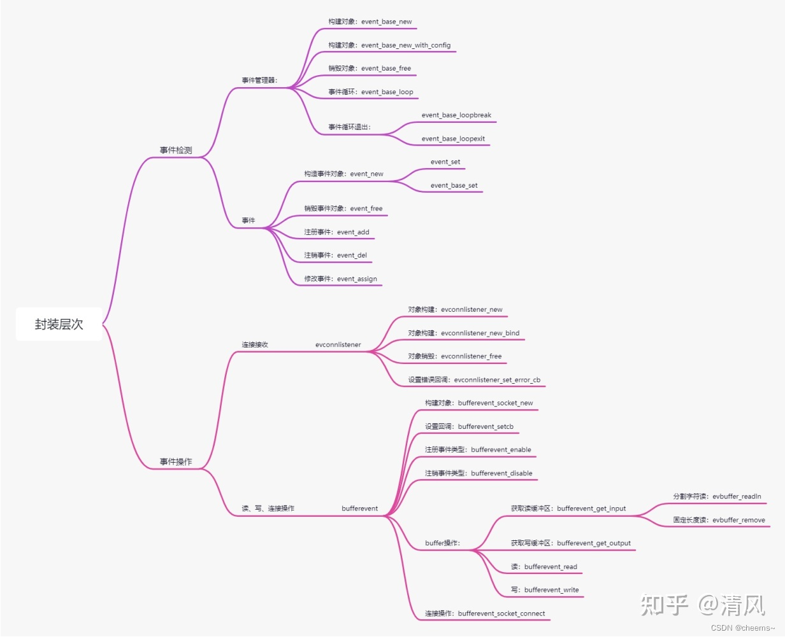
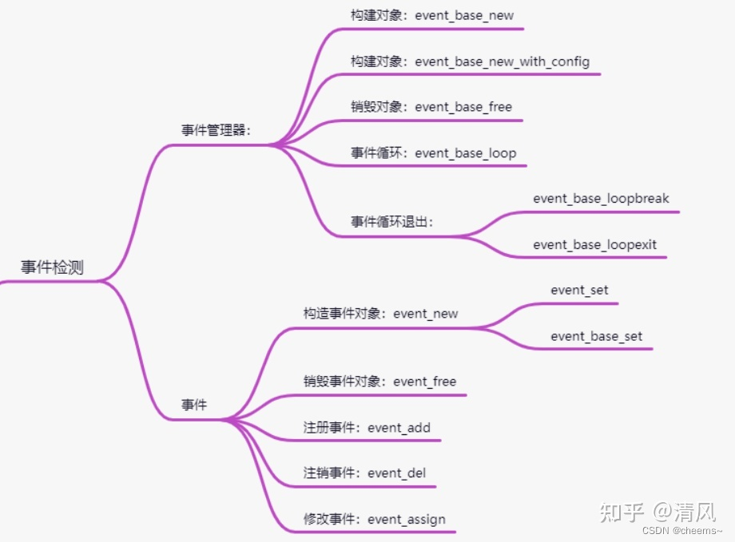
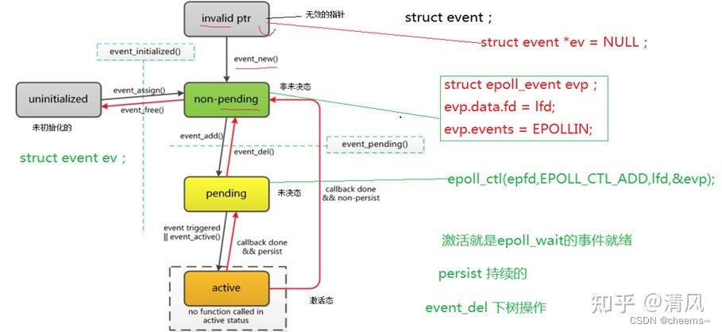
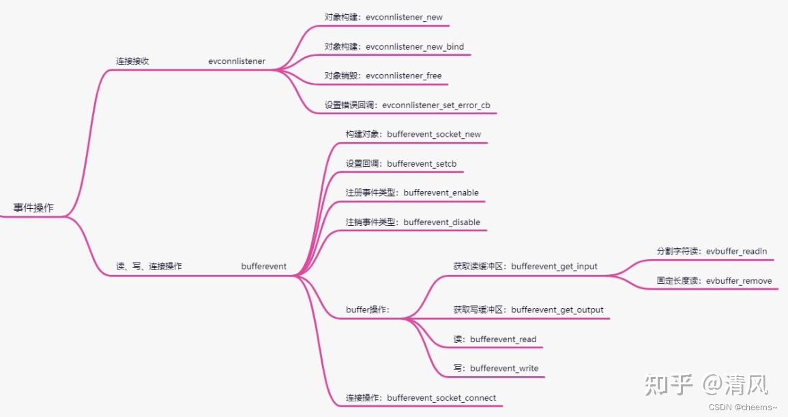
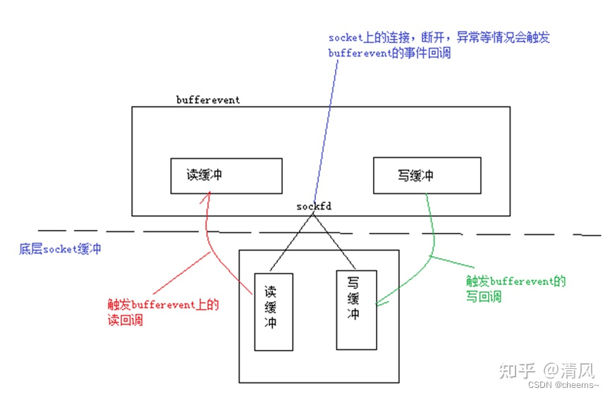
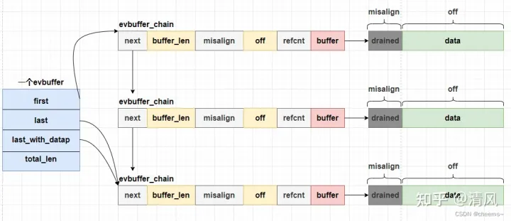

# Libevent

## 1. 简介与安装

### 1.1 简介

​		libevent,libev,libuv都是c实现的异步事件库，注册异步事件，检测异步事件，根据事件的触发先后顺序，调用相对应回调函数处理事件。处理的事件包括：`网络 io 事件、定时事件以及信号事件`。这三个事件驱动着服务器的运行。

```bash
1. 网络io事件：
    linux：epoll、poll、select
    mac：kqueue
    window：iocp
2. 定时事件：
    红黑树
    最小堆：二叉树、四叉树
    跳表
    时间轮
3. 信号事件
```

​		libevent 和 libev 主要封装了异步事件库与操作系统的交互简单的事件管理接口，让用户无需关注平台检测处理事件的机制的差异，只需关注事件的具体处理。

  	从设计理念出发，libev 是为了改进 libevent 中的一些架构决策；例如：全局变量的使用使得在多线程环境中很难安全地使用 libevent；event 的数据结构设计太大，它包含了 io、时间以及信号处理全封装在一个结构体中，额外的组件如 http、dns、openssl 等实现质量差（容易产生安全问题），计时器不精确，不能很好地处理时间事件；

​		libev 通过完全去除全局变量的使用，而是通过回调传参来传递上下文(后面libevent也这样做了)；并且根据不同事件类型构建不同的数据结构，以此来减低事件耦合性；计时器使用最小四叉堆。libev 小而高效；只关注事件处理。

​		libevent 和 libev 对 window 支持比较差，由此产生了 libuv 库；libuv 基于 libev，在window 平台上更好的封装了 iocp；node.js 基于 libuv；

- 事件驱动，高性能；
- 轻量级，专注于网络；
- 跨平台，支持 Windows、Linux、Mac Os等；
- 支持多种 I/O多路复用技术， epoll、poll、dev/poll、select 和kqueue 等；
- 支持 I/O，定时器和信号等事件；

### 1.2 编译安装

#### 1.2.1 windows下交叉编译

使用visual studio自带的交叉编译工具。新建build_zlib.bat编译zlib。

```bat
set VS="D:\IDE\VS2019\VC\Auxiliary\Build\vcvars64.bat"
set OUT=F:\Codebase\libevent\out\zlib
call %VS%

cd F:\Codebase\libevent\zlib-1.2.11
nmake /f win32\Makefile.msc clean
nmake /f win32\Makefile.msc

md %OUT%\lib
md %OUT%\bin
md %OUT%\include

copy /Y *.lib %OUT%\lib
copy /Y *.h %OUT%\include
copy /Y *.exe %OUT%\bin
copy /Y *.dll %OUT%\lib
pause
```

新建build_openssl.bat编译open-ssl，需要安装perl、nasm。

**perl Configure [VC-WIN32/VC-WIN64A/VC-WIN64I} --prefix=%OUTPATH% **

```bat
set VS="D:\IDE\VS2019\VC\Auxiliary\Build\vcvars64.bat"
set OUT=F:\Codebase\libevent\out\openssl
call %VS%

cd F:\Codebase\libevent\openssl-1.1.1
perl Configure VC-WIN64 --prefix=%OUT%

md %OUT%

nmake clean
nmake
nmake install
@echo "编译openssl完成"
pause
```

新增build_libevent.bat编译libevent。

```bat
set VS="D:\IDE\VS2019\VC\Auxiliary\Build\vcvars64.bat"
set OUT=F:\Codebase\libevent\out\libvent
call %VS%

cd F:\Codebase\libevent\libevent-master

nmake /f Makefile.nmake clean
nmake /f Makefile.nmake OPENSSL_DIR=F:\Codebase\libevent\out\openssl

md %OUT%
md %OUT%\lib
md %OUT%\bin
md %OUT%\include

::/Y表示不提示 /S表示包含目录
copy /Y *.lib %OUT%\lib
xcopy /S/Y include %OUT%\include\
xcopy /S/Y WIN32-Code\nmake %OUT%\include\
copy /Y *.exe %OUT%\bin
copy /Y *.dll %OUT%\lib

@echo "编译libevent完成"
pause
```

#### 1.2.2 Linux 下编译

**zlib:**

```bash
$ ./configure
$ make && make install
```

**openssl**:

```bash
$ ./config
$ make && make install
```

**libevent**

```bash
# 执行配置./configure, 检测安装环境, 生成makefile.
# 执行./configure的时候也可以指定路径, ./configure --\prefix=/usr/xxxxx, 
# 这样就可以安装到指定的目录下, 但是这样在进行源代码编译的时候
# 需要指定用-I头文件的路径和用-L库文件的路径. 若默认安装不指定--prefix, 
# 则会安装到系统默认的路径下, 编译的时候可以不指定头文件和库文件所在的路径.
# make install进行安装
# 执行make命令编译整个项目文件
# 头文件拷贝到了/usr/local/include目录下
# 库文件拷贝到了/usr/local/lib目录下
$ cd libevent
$ ./autogen.sh
$ ./configure
$ make && make install
```

### 1.3 参考资料

* libevent官网—https://libevent.org/
* 网友推荐—http://www.wangafu.net/~nickm/libevent-book/
* 

## 2. Libevent API

在看代码的时候，主要按照两个线索去看。第一个：网络的封装；第二个：解决的问题。网络的封装又分为：IO检测和IO操作。解决的问题分为：连接建立的问题(限制最大连接数，黑白名单等)和连接断开的问题，数据到达和数据发送。




### 2.1 事件检测



#### 2.1.1 事件管理器event_base

##### `构建事件管理器event_base_new`

 		使用libevent 函数之前需要分配一个或者多个 event_base 结构体, 每个event_base结构体持有一个事件集合, 可以检测以确定哪个事件是激活的, event_base结构相当于epoll红黑树的树根节点, 每个event_base都有一种用于检测某种事件已经就绪的 “方法”

```c
struct event_base *event_base_new(void);
函数说明: 获得event_base结构，当于epoll红黑树的树根节点
参数说明: 无
返回值: 
    成功返回event_base结构体指针;
    失败返回NULL;
```

```
选择事件管理模式 
	根据系统支持的方式，按照如下顺序按序筛查
	evport->kqueue->epoll->devpoll->poll->select->win32iocp
事件处理初始化，创建io多路复用资源，比如epoll对应epoll_init
```


##### `释放事件管理器event_base_free`

```c
void event_base_free(struct event_base *);
函数说明: 释放event_base指针
```

##### `event_reinit`

```c
int event_reinit(struct event_base *base);
函数说明: 如果有子进程, 且子进程也要使用base, 则子进程需要对event_base重新初始化, 此时需要调用event_reinit函数.
函数参数: 由event_base_new返回的执行event_base结构的指针
返回值: 成功返回0, 失败返回-1
对于不同系统而言, event_base就是调用不同的多路IO接口去判断事件是否已经被激活, 对于linux系统而言, 核心调用的就是epoll, 同时支持poll和select.
```

##### `event_get_supported_methods`

查看libevent支持的后端的方法有哪些:

```c
const char **event_get_supported_methods(void);
函数说明: 获得当前系统(或者称为平台)支持的方法有哪些
参数: 无
返回值: 返回二维数组, 类似与main函数的第二个参数**argv.
```

##### `event_base_get_method`

```cpp
const char * event_base_get_method(const struct event_base *base);
函数说明: 获得当前base节点使用的多路io方法
函数参数: event_base结构的base指针.
返回值: 获得当前base节点使用的多路io方法的指针
//获取libevent支持的方法和当前系统使用的方法
#include <stdio.h>
#include <string.h>
#include <event2/event.h>

int main() {
    //获取当前系统支持的方法有哪些
    //const char **event_get_supported_methods(void);
    const char **p = event_get_supported_methods();
    int i = 0;
    while (p[i] != NULL) {
        printf("[%s]  ", p[i++]);
    }
    printf("\n");

    //创建event_base结构体
    struct event_base *base = event_base_new();
    if (base == NULL) {
        printf("event_base_new error\n");
        return -1;
    }

    //const char * event_base_get_method(const struct event_base *base);
    printf("[%s]\n", event_base_get_method(base));

    //释放event_base节点
    event_base_free(base);

    return 0;
}
```

##### `事件循环event_base_dispatch和event_base_loop`

  libevent在event_base_new好之后, 需要等待事件的产生, 也就是等待事件被激活, 所以程序不能退出, 对于epoll来说, 我们需要自己控制循环, 而在libevent中也给我们提供了API接口, 类似where(1)的功能.

```cpp
//这个函数一般不用, 而大多数都调用libevent给我们提供的另外一个API：
int event_base_loop(struct event_base *base, int flags);
函数说明: 进入循环等待事件
参数说明:
    base: 由event_base_new函数返回的指向event_base结构的指针
    flags的取值：
    #define EVLOOP_ONCE 0x01
    只触发一次, 如果事件没有被触发, 阻塞等待
    #define EVLOOP_NONBLOCK 0x02
    非阻塞方式检测事件是否被触发, 不管事件触发与否, 都会立即返回.
int event_base_dispatch(struct event_base *base);
函数说明: 进入循环等待事件
参数说明:由event_base_new函数返回的指向event_base结构的指针
调用该函数, 相当于没有设置标志位的event_base_loop。程序将会一直运行, 直到没有需要检测的事件了, 或者被结束循环的API终止。
```

##### `事件循环退出event_base_loopbreak和event_base_loopexit`

```cpp
int event_base_loopexit(struct event_base *base, const struct timeval *tv);
int event_base_loopbreak(struct event_base *base);
struct timeval {
    long    tv_sec;                    
    long    tv_usec;            
};
```

两个函数的区别是`如果正在执行激活事件的回调函数`, 那么event_base_loopexit将在事件回调执行结束后终止循环（如果tv时间非NULL, 那么将等待tv设置的时间后立即结束循环）, 而`event_base_loopbreak会立即终止循环。`

#### 2.1.2 事件对象

##### `构建事件对象event_new`

```cpp
typedef void (*event_callback_fn)(evutil_socket_t fd, short events, void *arg);
struct event *event_new(struct event_base *base, evutil_socket_t fd, short events, event_callback_fn cb, void *arg);

#define evsignal_new(b, x, cb, arg)   event_new((b), (x), EV_SIGNAL|EV_PERSIST, (cb), (arg))
函数说明: event_new负责创建event结构指针, 同时指定对应的base(epfd), 还有对应的文件描述符, 事件, 以及回调函数和回调函数的参数。
参数说明：
    base: 对应的根节点--epfd
    fd: 要监听的文件描述符
    events:要监听的事件
        #define  EV_TIMEOUT    0x01   //超时事件
        #define  EV_READ       0x02    //读事件
        #define  EV_WRITE      0x04    //写事件
        #define  EV_SIGNAL     0x08    //信号事件
        #define  EV_PERSIST     0x10    //周期性触发
        #define  EV_ET         0x20    //边缘触发, 如果底层模型支持设置                                        则有效, 若不支持则无效.
        若要想设置持续的读事件则： EV_READ | EV_PERSIST

    cb: 回调函数, 原型如下：
    typedef void (*event_callback_fn)(evutil_socket_t fd, short events, void *arg);
    注意: 回调函数的参数就对应于event_new函数的fd, event和arg
```

##### `销毁事件对象event_free`

```cpp
void event_free(struct event *ev);
函数说明: 释放由event_new申请的event节点。
```

##### `注册事件event_add`

```cpp
int event_add(struct event *ev, const struct timeval *timeout);
函数说明: 将非未决态事件转为未决态, 相当于调用epoll_ctl函数(EPOLL_CTL_ADD), 开始监听事件是否产生, 相当于epoll的上树操作.
参数说明：
    ev: 调用event_new创建的事件
    timeout: 限时等待事件的产生(定时事件使用), 也可以设置为NULL, 没有限时。
```

##### `注销事件event_del`

```cpp
int event_del(struct event *ev);
函数说明: 将事件从未决态变为非未决态, 相当于epoll的下树（epoll_ctl调用            EPOLL_CTL_DEL操作）操作。
参数说明: ev指的是由event_new创建的事件.
```

#### 2.1.3 `事件驱动event介绍`

事件驱动实际上是libevent的核心思想



主要几个状态：

- 无效的指针: 此时仅仅是定义了 struct event *ptr；
- 非未决：相当于创建了事件, 但是事件还没有处于被监听状态, 类似于我们使用epoll的时候定义了struct epoll_event ev并且对ev的两个字段进行了赋值, 但是此时尚未调用epoll_ctl对事件上树.
- 未决：就是对事件开始监听, 暂时未有事件产生。相当于调用epoll_ctl对要监听的事件上树, 但是没有事件产生.
- 激活：代表监听的事件已经产生, 这时需要处理, 相当于调用epoll_wait函数有返回, 当事件被激活以后,  libevent会调用该事件对应的回调函数.

#### 2.1.4 `只用libevent事件检测，io操作自己来处理 Demo`

  像[memcached](https://www.zhihu.com/search?q=memcached&search_source=Entity&hybrid_search_source=Entity&hybrid_search_extra={"sourceType"%3A"answer"%2C"sourceId"%3A2633819012})它就是用这种层次(只使用libevent检测，io操作自己写)。我们从下面Demo中看到，使用libevent就像操作reactor一样，只需要传递回调函数，在回调函数里面去写io操作的逻辑。

```cpp
#include<stdio.h>
#include<string.h>
#include<errno.h>
#include<unistd.h>
#include <netinet/in.h>
#include "event2/event.h"

void socket_read_cb(int fd, short events, void *arg);

void socket_accept_cb(int fd, short events, void *arg) {
    struct sockaddr_in addr;
    socklen_t len = sizeof(addr);
    evutil_socket_t clientfd = accept(fd, (struct sockaddr *) &addr, &len);
    evutil_make_socket_nonblocking(clientfd);
    printf("accept a client %d\n", clientfd);
    struct event_base *base = (struct event_base *) arg;
    struct event *ev = event_new(NULL, -1, 0, NULL, NULL);
    event_assign(ev, base, clientfd, EV_READ | EV_PERSIST,
                 socket_read_cb, (void *) ev);
    event_add(ev, NULL);
}

void socket_read_cb(int fd, short events, void *arg) {
    char msg[4096];
    struct event *ev = (struct event *) arg;
    int len = read(fd, msg, sizeof(msg) - 1);
    if (len <= 0) {
        printf("client fd:%d disconnect\n", fd);
        event_free(ev);
        close(fd);
        return;
    }

    msg[len] = '\0';
    printf("recv the client msg: %s", msg);

    char reply_msg[4096] = "recvieced msg: ";
    strcat(reply_msg + strlen(reply_msg), msg);
    write(fd, reply_msg, strlen(reply_msg));
}

int socket_listen(int port) {
    int errno_save;

    evutil_socket_t listenfd = socket(AF_INET, SOCK_STREAM, 0);
    if (listenfd == -1)
        return -1;

    evutil_make_listen_socket_reuseable(listenfd);

    struct sockaddr_in sin;
    sin.sin_family = AF_INET;
    sin.sin_addr.s_addr = 0;
    sin.sin_port = htons(port);

    if (bind(listenfd, (struct sockaddr *) &sin, sizeof(sin)) < 0) {
        evutil_closesocket(listenfd);
        return -1;
    }

    if (listen(listenfd, 5) < 0) {
        evutil_closesocket(listenfd);
        return -1;
    }

    evutil_make_socket_nonblocking(listenfd);

    return listenfd;
}

int main(int argc, char **argv) {
    int listenfd = socket_listen(8080);
    if (listenfd == -1) {
        printf("socket_listen error\n");
        return -1;
    }
    struct event_base *base = event_base_new();

    struct event *ev_listen = event_new(base, listenfd, EV_READ | EV_PERSIST,
                                        socket_accept_cb, base);
    /*
    event_new 等价于
    struct event ev_listen;
    event_set(&ev_listen, listenfd, EV_READ | EV_PERSIST, socket_accept_cb, base);
    event_base_set(base, &ev_listen);
    */

    event_add(ev_listen, NULL);

    event_base_dispatch(base);
    return 0;
}

/*
gcc evmain1.c -o ev1 -levent
client:
    telnet 127.0.0.1 8080
*/
```

### 2.2 事件操作



作者：清风
链接：https://www.zhihu.com/question/21782376/answer/2633819012
来源：知乎
著作权归作者所有。商业转载请联系作者获得授权，非商业转载请注明出处。

#### 2.2.1 自带buffer的事件-bufferevent

bufferevent实际上也是一个event, 只不过比普通的event高级一些, 它的内部有两个缓冲区, 以及一个文件描述符（网络套接字）。一个网络套接字有读和写两个缓冲区, bufferevent同样也带有两个缓冲区, 还有就是libevent事件驱动的核心回调函数, 那么四个缓冲区以及触发回调的关系如下：




在这里插入图片描述

 从图中可以得知, 一个bufferevent对应两个缓冲区, 三个回调函数, 分别是写回调, 读回调和事件回调

bufferevent有三个回调函数： - 读回调 – 当bufferevent将底层读缓冲区的数据读到自身的读缓冲区时触发读事件回调. - 写回调 – 当bufferevent将自身写缓冲的数据写到底层写缓冲区的时候触发写事件回调, 由于数据最终是写入了内核的写缓冲区中, 应用程序已经无法控制, 这个事件对于应用程序来说基本没什么用, 只是通知功能. - 事件回调 – 当bufferevent绑定的socket连接, 断开或者异常的时候触发事件回调.

##### `构建bufferevent对象`

```cpp
struct bufferevent *bufferevent_socket_new(struct event_base *base, evutil_socket_t fd, int options);
函数说明: bufferevent_socket_new 对已经存在socket创建bufferevent事件, 可用于后面讲到的连接监听器的回调函数中.
参数说明：
    base :对应根节点
    fd   :文件描述符
    options : bufferevent的选项
        BEV_OPT_CLOSE_ON_FREE  -- 释放bufferevent自动关闭底层接口(当bufferevent被释放以后, 文件描述符也随之被close)    
        BEV_OPT_THREADSAFE  -- 使bufferevent能够在多线程下是安全的
```

##### `销毁bufferevent对象`

```cpp
void bufferevent_free(struct bufferevent *bufev);
函数说明: 释放bufferevent
```

##### `连接操作bufferevent_socket_connect`

```cpp
int bufferevent_socket_connect(struct bufferevent *bev, struct sockaddr *serv, int socklen);
函数说明: 该函数封装了底层的socket与connect接口, 通过调用此函数, 可以将bufferevent事件与通信的socket进行绑定, 参数如下：
    bev – 需要提前初始化的bufferevent事件
    serv – 对端(一般指服务端)的ip地址, 端口, 协议的结构指针
    socklen – 描述serv的长度
说明: 调用此函数以后, 通信的socket与bufferevent缓冲区做了绑定, 后面调用了bufferevent_setcb函数以后, 会对bufferevent缓冲区的读写操作的事件设置回调函数, 当往缓冲区中写数据的时候会触发写回调函数, 当数据从socket的内核缓冲区读到bufferevent读缓冲区中的时候会触发读回调函数.
```

##### `设置bufferevent回调bufferevent_setcb`

```cpp
void bufferevent_setcb(struct bufferevent *bufev,
    bufferevent_data_cb readcb,
    bufferevent_data_cb writecb,
    bufferevent_event_cb eventcb,
    void *cbarg
);
函数说明: bufferevent_setcb用于设置bufferevent的回调函数, 
readcb, writecb,eventcb分别对应了读回调, 写回调, 事件回调, 
cbarg代表回调函数的参数。
```

回调函数的原型：

```cpp
typedef void (*bufferevent_data_cb)(struct bufferevent *bev, void *ctx);
typedef void (*bufferevent_event_cb)(struct bufferevent *bev, short what, void *ctx);
What 代表 对应的事件
BEV_EVENT_EOF--遇到文件结束指示
BEV_EVENT_ERROR--发生错误
BEV_EVENT_TIMEOUT--发生超时
BEV_EVENT_CONNECTED--请求的过程中连接已经完成
```

##### `写数据到写缓冲区bufferevent_write`

```cpp
int bufferevent_write(struct bufferevent *bufev, const void *data, size_t size);

int bufferevent_write_buffer(struct bufferevent *bufev, struct evbuffer *buf);
bufferevent_write是将data的数据写到bufferevent的写缓冲区，bufferevent_write_buffer 是将数据写到写缓冲区另外一个写法, 实际上bufferevent的内部的两个缓冲区结构就是struct evbuffer。
```

##### `从读缓冲区读数据bufferevent_read`

```cpp
size_t bufferevent_read(struct bufferevent *bufev, void *data, size_t size);

int bufferevent_read_buffer(struct bufferevent *bufev, struct evbuffer *buf);
bufferevent_read 是将bufferevent的读缓冲区数据读到data中, 同时将读到的数据从bufferevent的读缓冲清除。
bufferevent_read_buffer 将bufferevent读缓冲数据读到buf中, 接口的另外一种。
```

##### `注册与注销 事件类型bufferevent_enable/disable`

```cpp
int bufferevent_enable(struct bufferevent *bufev, short event);

int bufferevent_disable(struct bufferevent *bufev, short event);
bufferevent_enable与bufferevent_disable是设置事件是否生效, 如果设置为disable, 事件回调将不会被触发。
```

##### `获取读写缓冲区bufferevent_get_input和bufferevent_get_output`

```cpp
struct evbuffer *bufferevent_get_input(struct bufferevent *bufev)

struct evbuffer *bufferevent_get_output(struct bufferevent *bufev)
获取bufferevent的读缓冲区和写缓冲区
```

##### `分割字符读evbuffer_readln，固定长度读evbuffer_remove`

```cpp
char *evbuffer_readln(struct evbuffer *buffer, size_t *n_read_out, enum evbuffer_eol_style eol_style);

int evbuffer_remove(struct evbuffer *buf, void *data, size_t datlen);
分割字符读evbuffer_readln

固定长度读evbuffer_remove
```

##### `bufferevent总结`

  对于bufferevent来说, 一个文件描述符, 2个缓冲区, 3个回调函数。文件描述符是用于和客户端进行通信的通信文件描述符, 并不是监听的文件描述符。

  2个缓冲区是指: 一个bufferevent包括读缓冲区和写缓冲区。3个回调函数指: 读回调函数  写回调函数  和事件回调函数

读回调函数的触发时机: - 当socket的内核socket读缓冲区中有数据的时候, bufferevent会将内核缓冲区中的数据读到自身的读缓冲区, 会触发bufferevent的读操作, 此时会调用bufferevent的读回调函数.

写回调函数的触发时机: - 当往bufferevent的写缓冲区写入数据的时候, bufferevent底层会把缓冲区中的数据写入到内核的socket的写缓冲区中, 此时会触发bufferevent的写回调函数, 最后由内核的驱动程序将数据发送出去.

事件(异常)回调函数的触发时机: - 客户端关闭连接或者是被信号终止进程会触发事件回调函数

#### 2.2.2 链接监听器-evconnlistener

  链接监听器封装了底层的socket通信相关函数, 比如socket, bind, listen, accept这几个函数。链接监听器创建后实际上相当于调用了socket, bind, listen, 此时等待新的客户端连接到来, 如果有新的客户端连接, 那么内部先进行调用accept处理, 然后调用用户指定的回调函数。可以先看看函数原型, 了解一下它是怎么运作的：

##### `构建链接监听器evconnlistener_new_bind`

```cpp
struct evconnlistener *evconnlistener_new_bind(
    struct event_base *base,evconnlistener_cb cb, 
    void *ptr, unsigned flags, int backlog,
    const struct sockaddr *sa, int socklen
);
函数说明: 
是在当前没有套接字的情况下对链接监听器进行初始化, 看最后2个参数实际上就是bind使用的关键参数, 
backlog是listen函数的关键参数（略有不同的是, 如果backlog是-1, 那么监听器会自动选择一个合适的值, 
如果填0, 那么监听器会认为listen函数已经被调用过了）, ptr是回调函数的参数, cb是有新连接之后的回调函数, 
但是注意这个回调函数触发的时候, 链接器已经处理好新连接了, 并将与新连接通信的描述符交给回调函数。

flags 需要参考几个值：
    LEV_OPT_LEAVE_SOCKETS_BLOCKING   文件描述符为阻塞的
    LEV_OPT_CLOSE_ON_FREE            关闭时自动释放
    LEV_OPT_REUSEABLE                端口复用
    LEV_OPT_THREADSAFE               分配锁, 线程安全
struct evconnlistener *evconnlistener_new(
    struct event_base *base,
    evconnlistener_cb cb, void *ptr, 
    unsigned flags, int backlog,
    evutil_socket_t fd
);
```

  evconnlistener_new函数与前一个函数不同的地方在与后2个参数, 使用本函数时, 认为socket已经初始化好, 并且bind完成, 甚至也可以做完listen, 所以大多数时候, 我们都可以使用第一个函数。

##### `accept的回调函数evconnlistener_cb`

```cpp
typedef void (*evconnlistener_cb)(struct evconnlistener *evl, evutil_socket_t fd, struct sockaddr *cliaddr, int socklen, void *ptr);
```

  回调函数`fd参数是与客户端通信的描述符`, 并非是等待连接的监听的那个描述符, 所以cliaddr对应的也是新连接的对端地址信息, 已经是accept处理好的。

##### `销毁链接监听器evconnlistener_free`

```cpp
void evconnlistener_free(struct evconnlistener *lev);
函数说明: 释放链接监听器
```

##### `使用libevent的事件检测与事件操作Demo`

```cpp
#include <netinet/in.h>
#include <sys/socket.h>
#include <stdio.h>
#include <stdlib.h>
#include <string.h>
#include <event.h>
#include <time.h>
#include <signal.h>
#include <event2/listener.h>
#include <event2/bufferevent.h>
#include <event2/buffer.h>

void socket_read_callback(struct bufferevent *bev, void *arg) {
    // 操作读缓冲当中的数据
    struct evbuffer *evbuf = bufferevent_get_input(bev); // 封装了读缓冲区
    char *msg = evbuffer_readln(evbuf, NULL, EVBUFFER_EOL_LF);
    // 也可以直接用 bufferevent_read 读数据
    // bufferevent_read(struct bufferevent *bufev, void *data, size_t size)
    if (!msg) return;

    printf("server read the data: %s\n", msg);

    char reply[4096] = {0};
    sprintf(reply, "recvieced msg: %s\n", msg);//echo
    // -WRN: 需要自己释放资源
    free(msg);
    bufferevent_write(bev, reply, strlen(reply));
}

// stdio标准输入触发读事件时的回调
void stdio_callback(struct bufferevent *bev, void *arg) {
    // 获取读缓冲区并操作读缓冲中的数据
    struct evbuffer *evbuf = bufferevent_get_input(bev); // 封装了读缓冲区
    // 从中读一行，需要指定换行符
    char *msg = evbuffer_readln(evbuf, NULL, EVBUFFER_EOL_LF);

    if (!msg) return;

    if (strcmp(msg, "quit") == 0) {
        printf("safe exit!!!\n");
        event_base_loopbreak(arg);
    }

    printf("stdio read the data: %s\n", msg);
}

// socket出现如错误、关闭等异常事件时的回调
void socket_event_callback(struct bufferevent *bev, short events, void *arg) {
    if (events & BEV_EVENT_EOF)
        printf("connection closed\n");
    else if (events & BEV_EVENT_ERROR)
        printf("some other error\n");
    else if (events & BEV_EVENT_TIMEOUT)
        printf("timeout\n");
    bufferevent_free(bev); // close
}

// accept的回调函数封装
void listener_callback(struct evconnlistener *listener, evutil_socket_t fd,
                       struct sockaddr *sock, int socklen, void *arg) {
    char ip[32] = {0};
    evutil_inet_ntop(AF_INET, sock, ip, sizeof(ip) - 1);
    printf("accept a client fd:%d ip:%s\n", fd, ip);
    struct event_base *base = (struct event_base *) arg;
    //创建一个bufferevent
    struct bufferevent *bev = bufferevent_socket_new(base, fd, BEV_OPT_CLOSE_ON_FREE);
    // 设置读、写、以及异常时的回调函数
    bufferevent_setcb(bev, socket_read_callback, NULL, socket_event_callback, NULL);
    // 使能这个bufferevent开启读事件
    bufferevent_enable(bev, EV_READ | EV_PERSIST);
}

static void
do_timer(int fd, short events, void *arg) {
    struct event *timer = (struct event *) arg;
    time_t now = time(NULL);
    printf("do_timer %s", (char *) ctime(&now));
    //event_del(timer);
    // struct timeval tv = {1,0};
    // event_add(timer, &tv);
}

static void
do_sig_int(int fd, short event, void *arg) {
    struct event *si = (struct event *) arg;
    event_del(si);
    printf("do_sig_int SIGINT\n");//CTRL + C
}

// 建立连接的事件封装   
int main() {
    struct sockaddr_in sin;
    memset(&sin, 0, sizeof(struct sockaddr_in));
    sin.sin_family = AF_INET;
    sin.sin_port = htons(8080);
    /* 底层IO多路复用抽象 */
    struct event_base *base = event_base_new();
    /* evconnlistener 监听 */
    struct evconnlistener *listener =
            evconnlistener_new_bind(base, listener_callback, base,
                                    LEV_OPT_REUSEABLE | LEV_OPT_CLOSE_ON_FREE,
                                    10, (struct sockaddr *) &sin,
                                    sizeof(struct sockaddr_in));

    /* 普通 fd 的 IO 事件管理，此处以标准输入 stdin 为例 */
    struct bufferevent *ioev = bufferevent_socket_new(base, 0, BEV_OPT_CLOSE_ON_FREE);
    bufferevent_setcb(ioev, stdio_callback, NULL, NULL, base);
    bufferevent_enable(ioev, EV_READ | EV_PERSIST);
    /* 定时事件 */
    struct event evtimer;
    struct timeval tv = {1, 0}; // {秒, 微秒}
    event_set(&evtimer, -1, EV_PERSIST, do_timer, &evtimer); // tv 为超时时间
    event_base_set(base, &evtimer);
    event_add(&evtimer, &tv);
    /* 信号事件 */
    struct event evint;
    event_set(&evint, SIGINT, EV_SIGNAL, do_sig_int, &evint);
    event_base_set(base, &evint);
    event_add(&evint, NULL);

    /* 开启主循环 */
    event_base_dispatch(base);
    /* 结束释放资源 */
    evconnlistener_free(listener);
    event_base_free(base);
    return 0;
}

/*
gcc evmain2.c -o ev2 -levent
client:
    telnet 127.0.0.1 8080
*/
```

## 3. Libevent源码剖析

### 3.1 结构体定义

#### 3.1.1 event_config

| 字段名 | 含义 |      |      |
| ------ | ---- | ---- | ---- |
|        |      |      |      |

```c
/** Internal structure: describes the configuration we want for an event_base
 * that we're about to allocate. */
struct event_config {
	TAILQ_HEAD(event_configq, event_config_entry) entries;

	int n_cpus_hint;
	struct timeval max_dispatch_interval;
	int max_dispatch_callbacks;
	int limit_callbacks_after_prio;
	enum event_method_feature require_features;
	enum event_base_config_flag flags;
};


```

```c
enum event_base_config_flag {
	/** Do not allocate a lock for the event base, even if we have
	    locking set up.

	    Setting this option will make it unsafe and nonfunctional to call
	    functions on the base concurrently from multiple threads.
	*/
	EVENT_BASE_FLAG_NOLOCK = 0x01,
	/** Do not check the EVENT_* environment variables when configuring
	    an event_base  */
	EVENT_BASE_FLAG_IGNORE_ENV = 0x02,
	/** Windows only: enable the IOCP dispatcher at startup

	    If this flag is set then bufferevent_socket_new() and
	    evconn_listener_new() will use IOCP-backed implementations
	    instead of the usual select-based one on Windows.
	 */
	EVENT_BASE_FLAG_STARTUP_IOCP = 0x04,
	/** Instead of checking the current time every time the event loop is
	    ready to run timeout callbacks, check after each timeout callback.
	 */
	EVENT_BASE_FLAG_NO_CACHE_TIME = 0x08,

	/** If we are using the epoll backend, this flag says that it is
	    safe to use Libevent's internal change-list code to batch up
	    adds and deletes in order to try to do as few syscalls as
	    possible.  Setting this flag can make your code run faster, but
	    it may trigger a Linux bug: it is not safe to use this flag
	    if you have any fds cloned by dup() or its variants.  Doing so
	    will produce strange and hard-to-diagnose bugs.

	    This flag can also be activated by setting the
	    EVENT_EPOLL_USE_CHANGELIST environment variable.

	    This flag has no effect if you wind up using a backend other than
	    epoll.
	 */
	EVENT_BASE_FLAG_EPOLL_USE_CHANGELIST = 0x10,

	/** Ordinarily, Libevent implements its time and timeout code using
	    the fastest monotonic timer that we have.  If this flag is set,
	    however, we use less efficient more precise timer, assuming one is
	    present.
	 */
	EVENT_BASE_FLAG_PRECISE_TIMER = 0x20
};
```

```c
enum event_method_feature {
    /** Require an event method that allows edge-triggered events with EV_ET. */
    EV_FEATURE_ET = 0x01,
    /** Require an event method where having one event triggered among
     * many is [approximately] an O(1) operation. This excludes (for
     * example) select and poll, which are approximately O(N) for N
     * equal to the total number of possible events. */
    EV_FEATURE_O1 = 0x02,
    /** Require an event method that allows file descriptors as well as
     * sockets. */
    EV_FEATURE_FDS = 0x04,
    /** Require an event method that allows you to use EV_CLOSED to detect
     * connection close without the necessity of reading all the pending data.
     *
     * Methods that do support EV_CLOSED may not be able to provide support on
     * all kernel versions.
     **/
    EV_FEATURE_EARLY_CLOSE = 0x08
};
```


#### 3.1.2 event_base

```c
struct event_base {
	/** Function pointers and other data to describe this event_base's
	 * backend. */
	const struct eventop *evsel;
	/** Pointer to backend-specific data. */
	void *evbase;

	/** List of changes to tell backend about at next dispatch.  Only used
	 * by the O(1) backends. */
	struct event_changelist changelist;

	/** Function pointers used to describe the backend that this event_base
	 * uses for signals */
	const struct eventop *evsigsel;
	/** Data to implement the common signal handler code. */
	struct evsig_info sig;

	/** Number of virtual events */
	int virtual_event_count;
	/** Maximum number of virtual events active */
	int virtual_event_count_max;
	/** Number of total events added to this event_base */
	int event_count;
	/** Maximum number of total events added to this event_base */
	int event_count_max;
	/** Number of total events active in this event_base */
	int event_count_active;
	/** Maximum number of total events active in this event_base */
	int event_count_active_max;

	/** Set if we should terminate the loop once we're done processing
	 * events. */
	int event_gotterm;
	/** Set if we should terminate the loop immediately */
	int event_break;
	/** Set if we should start a new instance of the loop immediately. */
	int event_continue;

	/** The currently running priority of events */
	int event_running_priority;

	/** Set if we're running the event_base_loop function, to prevent
	 * reentrant invocation. */
	int running_loop;

	/** Set to the number of deferred_cbs we've made 'active' in the
	 * loop.  This is a hack to prevent starvation; it would be smarter
	 * to just use event_config_set_max_dispatch_interval's max_callbacks
	 * feature */
	int n_deferreds_queued;

	/* Active event management. */
	/** An array of nactivequeues queues for active event_callbacks (ones
	 * that have triggered, and whose callbacks need to be called).  Low
	 * priority numbers are more important, and stall higher ones.
	 */
	struct evcallback_list *activequeues;
	/** The length of the activequeues array */
	int nactivequeues;
	/** A list of event_callbacks that should become active the next time
	 * we process events, but not this time. */
	struct evcallback_list active_later_queue;

	/* common timeout logic */

	/** An array of common_timeout_list* for all of the common timeout
	 * values we know. */
	struct common_timeout_list **common_timeout_queues;
	/** The number of entries used in common_timeout_queues */
	int n_common_timeouts;
	/** The total size of common_timeout_queues. */
	int n_common_timeouts_allocated;

	/** Mapping from file descriptors to enabled (added) events */
	struct event_io_map io;

	/** Mapping from signal numbers to enabled (added) events. */
	struct event_signal_map sigmap;

	/** Priority queue of events with timeouts. */
	struct min_heap timeheap;

	/** Stored timeval: used to avoid calling gettimeofday/clock_gettime
	 * too often. */
	struct timeval tv_cache;

	struct evutil_monotonic_timer monotonic_timer;

	/** Difference between internal time (maybe from clock_gettime) and
	 * gettimeofday. */
	struct timeval tv_clock_diff;
	/** Second in which we last updated tv_clock_diff, in monotonic time. */
	time_t last_updated_clock_diff;

#ifndef EVENT__DISABLE_THREAD_SUPPORT
	/* threading support */
	/** The thread currently running the event_loop for this base */
	unsigned long th_owner_id;
	/** A lock to prevent conflicting accesses to this event_base */
	void *th_base_lock;
	/** A condition that gets signalled when we're done processing an
	 * event with waiters on it. */
	void *current_event_cond;
	/** Number of threads blocking on current_event_cond. */
	int current_event_waiters;
#endif
	/** The event whose callback is executing right now */
	struct event_callback *current_event;

#ifdef _WIN32
	/** IOCP support structure, if IOCP is enabled. */
	struct event_iocp_port *iocp;
#endif

	/** Flags that this base was configured with */
	enum event_base_config_flag flags;

	struct timeval max_dispatch_time;
	int max_dispatch_callbacks;
	int limit_callbacks_after_prio;

	/* Notify main thread to wake up break, etc. */
	/** True if the base already has a pending notify, and we don't need
	 * to add any more. */
	int is_notify_pending;
	/** A socketpair used by some th_notify functions to wake up the main
	 * thread. */
	evutil_socket_t th_notify_fd[2];
	/** An event used by some th_notify functions to wake up the main
	 * thread. */
	struct event th_notify;
	/** A function used to wake up the main thread from another thread. */
	int (*th_notify_fn)(struct event_base *base);

	/** Saved seed for weak random number generator. Some backends use
	 * this to produce fairness among sockets. Protected by th_base_lock. */
	struct evutil_weakrand_state weakrand_seed;

	/** List of event_onces that have not yet fired. */
	LIST_HEAD(once_event_list, event_once) once_events;

};
```

```c
/** Structure to define the backend of a given event_base. */
struct eventop {
	/** The name of this backend. */
	const char *name;
	/** Function to set up an event_base to use this backend.  It should
	 * create a new structure holding whatever information is needed to
	 * run the backend, and return it.  The returned pointer will get
	 * stored by event_init into the event_base.evbase field.  On failure,
	 * this function should return NULL. */
	void *(*init)(struct event_base *);
	/** Enable reading/writing on a given fd or signal.  'events' will be
	 * the events that we're trying to enable: one or more of EV_READ,
	 * EV_WRITE, EV_SIGNAL, and EV_ET.  'old' will be those events that
	 * were enabled on this fd previously.  'fdinfo' will be a structure
	 * associated with the fd by the evmap; its size is defined by the
	 * fdinfo field below.  It will be set to 0 the first time the fd is
	 * added.  The function should return 0 on success and -1 on error.
	 */
	int (*add)(struct event_base *, evutil_socket_t fd, short old, short events, void *fdinfo);
	/** As "add", except 'events' contains the events we mean to disable. */
	int (*del)(struct event_base *, evutil_socket_t fd, short old, short events, void *fdinfo);
	/** Function to implement the core of an event loop.  It must see which
	    added events are ready, and cause event_active to be called for each
	    active event (usually via event_io_active or such).  It should
	    return 0 on success and -1 on error.
	 */
	int (*dispatch)(struct event_base *, struct timeval *);
	/** Function to clean up and free our data from the event_base. */
	void (*dealloc)(struct event_base *);
	/** Flag: set if we need to reinitialize the event base after we fork.
	 */
	int need_reinit;
	/** Bit-array of supported event_method_features that this backend can
	 * provide. */
	enum event_method_feature features;
	/** Length of the extra information we should record for each fd that
	    has one or more active events.  This information is recorded
	    as part of the evmap entry for each fd, and passed as an argument
	    to the add and del functions above.
	 */
	size_t fdinfo_len;
};
```


### 信号事件剖析

  信号也是能被epoll监听的，具体参考[epoll监听信号事件-signalfd](https://link.zhihu.com/?target=https%3A//gopher.blog.csdn.net/article/details/120443844) 。至于底层是怎么样的，我也不知道，反正epoll能监听信号，所有这里我们可以把信号当作网络IO事件来看。

### 定时事件和网络事件剖析

  libevent定时器的机制是最小堆+epoll_wait的机制，参考[定时器方案之红黑树与最小堆、时间轮详解](https://link.zhihu.com/?target=https%3A//blog.csdn.net/qq_42956653/article/details/126237909)。下面来进入源码康康流程。

`event_base_dispatch`内部调用的是`event_base_loop`，我们进入主循环看看，发现它先是去最小堆找timeout参数，然后执行epoll_wait。之后再将所有的超时任务取出`timeout_process`放到就绪队列，我们发现现在网络事件和定时事件都被加入到就绪队列中了，然后按照优先级进行处理，调用对应的回调函数。

```cpp
while (!done) {
    ......
    tv_p = &tv;
    if (!N_ACTIVE_CALLBACKS(base) && !(flags & EVLOOP_NONBLOCK)) {
        timeout_next(base, &tv_p);  // 返回的 tv_p 即是 最小堆实现的定时器中第一个事件的剩余等待时间
    } 
    ......
    clear_time_cache(base);

    res = evsel->dispatch(base, tv_p);  // 以tv_p作为 epoll_wait 的超时时间。这里相当于epoll_wait()，收集网络事件
    ......
    update_time_cache(base);    // 更新 time_cache，time_cache的作用在于不必每次都从系统调用获取时间值
    ......
    timeout_process(base);  // 将所有已超时的任务从最小堆中取出，插入到就绪队列（有优先级）收集定时事件

    if (N_ACTIVE_CALLBACKS(base)) {
        int n = event_process_active(base); // 处理这些就绪的任务，调用其回调函数
        ......
    } 
}

/* Activate every event whose timeout has elapsed. */
static void timeout_process(struct event_base *base)
{
    /* Caller must hold lock. */
    struct timeval now;
    struct event *ev;
    if (min_heap_empty_(&base->timeheap)) {
        return;
    }

    gettime(base, &now);
    while ((ev = min_heap_top_(&base->timeheap))) {
        if (evutil_timercmp(&ev->ev_timeout, &now, >))  // 从堆中取出所有 ev_timeout 已达到 now 的事件
            break;

        /* delete this event from the I/O queues */
        event_del_nolock_(ev, EVENT_DEL_NOBLOCK);   // 从所在的 event_base 中删除该事件
        event_active_nolock_(ev, EV_TIMEOUT, 1);    //  激活该事件，即 插入到就绪队列
    }
}
```

`event_active_nolock_()`底层将调用`event_queue_insert_active()`将事件插入到event_base下的就绪队列`activequeues`中，这个就绪队列实际上是有`nactivequeues`个元素的队列数组，数组下标越小的队列优先级越高，每次我们新建一个event时默认的优先级ev_pri都是`nactivequeues / 2`（by default, we put new events into the middle priority），而注册事件到event_base前可以通过该函数来手动设置优先级：

```cpp
/* Set's the priority of an event - if an event is already scheduled
 * changing the priority is going to fail. */
int event_priority_set(struct event *ev, int pri)
```

### 读写缓冲区evbuffer的实现(重点理解)

  我们在读写网络IO的时候，我们是不能确保一次读取，就是一个完整的数据包。比如我们写入size，但是实际写入n<size，数据没有全部写出去，那剩下的数据怎么办呢？我们需要缓存起来等待下次写数据触发，读数据同理。所以因为这个原因，我们需要设置缓冲区来解决这个问题。常用的解决方案有三种

1. fix buffer ：char rbuf[16 * 1024 * 1024];char wbuf[16 * 1024 * 1024] ，但是这样会造成两个新的问题，1. 存在空间浪费 2. 数据移动频繁
2. ringbuffer：环形缓冲区，解决了数据移动频繁的问题，但是数据空间浪费的问题没有解决
3. libevent中的evbuffer。下面开始介绍evbuffer。

  evbuffer 是 libevent 底层实现的一种链式缓冲区，当我们使用`bufferevent`来管理事件时，就会从每个事件的 evbuffer 中读写数据。每个 evbuffer 实质是一个缓冲区链表，其中的每个元素为 `struct evbuffer_chain`。一个`struct evbuffer`中的关键成员定义如下：

```cpp
struct evbuffer {
    /** The first chain in this buffer's linked list of chains. */
    struct evbuffer_chain *first;
    /** The last chain in this buffer's linked list of chains. */
    struct evbuffer_chain *last;
    /** Pointer to the next pointer pointing at the 'last_with_data' chain. */
    struct evbuffer_chain **last_with_datap;    // 指针指向最后一个可写的 chain
    /** Total amount of bytes stored in all chains.*/
    size_t total_len;
    ...... // 以上为关键成员
}
```

  每个`evbuffer_chain`的定义又如下所示：

```cpp
/** A single item in an evbuffer. */
struct evbuffer_chain {
    /** points to next buffer in the chain */
    struct evbuffer_chain *next;    // 指向下一个 evbuffer_chain 

    /** total allocation available in the buffer field. */
    size_t buffer_len;              // buffer 的长度

    /** unused space at the beginning of buffer or an offset into a file for sendfile buffers. */
    ev_misalign_t misalign;         // 实际数据在 buffer 中的偏移

    /** Offset into buffer + misalign at which to start writing.
     * In other words, the total number of bytes actually stored in buffer. */
    size_t off;                     // buffer 中有效数据的末尾，接下来的数据从这个位置开始填入（该位置即 buffer + misalign + off）

    /** number of references to this chain */
    int refcnt;                     // 这个 buffer的引用计数

    /** Usually points to the read-write memory belonging to this buffer allocated as part of the evbuffer_chain allocation.
     * For mmap, this can be a read-only buffer and EVBUFFER_IMMUTABLE will be set in flags.  For sendfile, it may point to NULL. */
    unsigned char *buffer;          // 指向实际数据存储的位置，这是真正的 buffer
};
```




在这里插入图片描述


  misaligin是什么意思呢？是已经被读取的数据，下一段有效数据是从【buffer+misaligin ， buffer+misaligin +off】这一段off的长，是我们待取的有效数据。而【buffer，buffer+misaligin 】这一段是之前就已经被读取过了，所以这里是失效的数据。所以misaligin 就解决了数据移动频繁的问题。而我们的evbuffer_chain是链表形式，所以又解决了数据空间浪费的问题。所以说evbuffer的设计是非常巧妙的。

### bufferevent_write

  当我们调用`bufferevent_write`往写缓冲区写数据时，实际上是调用了`evbuffer_add`,在写入后libevent自动帮我们写到内核缓冲区，之后会触发写回调函数。

  若这个evbuffer中没有一个 chain 可以写入数据，则需要根据写入的数据大小新申请一个 chain 挂到链表末尾，然后往这个chain中写数据，所以每个 chain 的 buffer 大小是不定的。还有更多细节内容我写到注释里面了，读者自行阅读。

```cpp
int evbuffer_add(struct evbuffer *buf, const void *data_in, size_t datlen) {
    //...
    //如果大于限定的容量
    if (datlen > EV_SIZE_MAX - buf->total_len) {
        goto done;
    }

    //使chain指向之后一个链表
    if (*buf->last_with_datap == NULL) {
        chain = buf->last;
    }
    else {
        chain = *buf->last_with_datap;
    }

    //...
    //如果没有chain，那么创建一个datlen大小的返回即可
    if (chain == NULL) {
        chain = evbuffer_chain_insert_new(buf, datlen);
        if (!chain)
            goto done;
    }

    if ((chain->flags & EVBUFFER_IMMUTABLE) == 0) {
        //...
        //remain为当前可用剩余空间还有多少
        remain = chain->buffer_len - (size_t) chain->misalign - chain->off;
        //如果剩余空间大于需求，那么直接分配即可
        if (remain >= datlen) {
            /* there's enough space to hold all the data in the
             * current last chain */
            memcpy(chain->buffer + chain->misalign + chain->off,
                   data, datlen);
            chain->off += datlen;
            buf->total_len += datlen;
            buf->n_add_for_cb += datlen;
            goto out;
        }
            //否则看一看剩余空间+misalign是否大于需求，大于则移动off数据
        else if (!CHAIN_PINNED(chain) &&
                 //里面涉及别的一些细节，这里不展开
                 evbuffer_chain_should_realign(chain, datlen)) {
            /* we can fit the data into the misalignment */
            evbuffer_chain_align(chain);

            memcpy(chain->buffer + chain->off, data, datlen);
            chain->off += datlen;
            buf->total_len += datlen;
            buf->n_add_for_cb += datlen;
            goto out;
        }
    }
    else {
        /* we cannot write any data to the last chain */
        remain = 0;
    }
    //走到这里代表一个chain不能满足datlen，那么预分配一个tmp chain
    /* we need to add another chain */
    to_alloc = chain->buffer_len;
    if (to_alloc <= EVBUFFER_CHAIN_MAX_AUTO_SIZE / 2)
        to_alloc <<= 1;
    if (datlen > to_alloc)
        to_alloc = datlen;
    tmp = evbuffer_chain_new_membuf(to_alloc);
    if (tmp == NULL)
        goto done;
    //把当前chain给分配完
    if (remain) {
        memcpy(chain->buffer + chain->misalign + chain->off,
               data, remain);
        chain->off += remain;
        buf->total_len += remain;
        buf->n_add_for_cb += remain;
    }
    //还需要多少大小从新的tmp里面分配
    data += remain;
    datlen -= remain;

    memcpy(tmp->buffer, data, datlen);
    tmp->off = datlen;
    evbuffer_chain_insert(buf, tmp);
    buf->n_add_for_cb += datlen;

    out:
    evbuffer_invoke_callbacks_(buf);
    result = 0;
    done:
    EVBUFFER_UNLOCK(buf);
    return result;
}
```

### bufferevent_read

`bufferevent_read()`底层调用`evbuffer_remove`，这代表它按照指定长度去读，其又调用了`evbuffer_copyout_from`，具体细节就不展开了，我们知道了怎么写，那么怎么读我们也就知道了。

```cpp
/* Reads data from an event buffer and drains the bytes read */
int evbuffer_remove(struct evbuffer *buf, void *data_out, size_t datlen)
{
    ev_ssize_t n;
    EVBUFFER_LOCK(buf);
    n = evbuffer_copyout_from(buf, NULL, data_out, datlen); // 拷贝数据
    if (n > 0) {
        if (evbuffer_drain(buf, n)<0)   // drain 就是丢弃已读走的数据，即 调整当前 chain 的 misalign 或 直接释放数据已全部读走的 chain
            n = -1;
    }
    EVBUFFER_UNLOCK(buf);
    return (int)n;
}
```

### evbuffer的缺点

  上面我们说了evbuffer的优点，那么evbuffer的缺点呢？其实也很明显，即我们的数据是存储在不连续的内存上面（例如我们读20B，结果着20B分别在两个chain里面），内存不连续会带来多次io，我们可能需要多次io才能把数据读完整。对于内存不连续的问题，Linux内核提供了一个接口，`readv和writev，解决内存不连续的读写问题`

readv：将读缓冲区的数据读到不连续的内存中 writev：将不连续的内存数据写到写缓冲区

```bash
man 2 readv
# 第二个参数是数组，第三个参数是数组的长度
ssize_t readv(int fd, const struct iovec *iov, int iovcnt);
ssize_t writev(int fd, const struct iovec *iov, int iovcnt);

struct iovec {
    void  *iov_base;    /* Starting address 起始地址*/
    size_t iov_len;     /* Number of bytes to transfer 长度*/
};
```

  在libevent的evbuffer_read里面，也用到了这个接口，有兴趣的可以看看，buffer.c的第2368行。

## libev

  libevhttp，dns，openssl等相关的都去掉了，甚至上文的evconnlistener和bufferevent都去掉了。只关注具体的网络IO事件，定时器事件，信号事件。libev的按照与libevent一样，不再赘述。

### libev的主要接口

ev_io_init

```cpp
#define ev_io_init(ev,cb,fd,events) do { ev_init ((ev), (cb)); ev_io_set ((ev),
(fd),(events)); } while (0)
//初始化 watcher 的 fd/events/callback
```

ev_io_start

```cpp
//注册并绑定 io watcher 到 ev_loop
void ev_io_start(struct ev_loop *loop, ev_io *w)
```

ev_timer_start

```cpp
//注册并绑定 timer watcher 到 ev_loop
void ev_timer_start(struct ev_loop *loop, ev_timer *w)
```

ev_run

```cpp
//开启改 ev_loop 的事件循环
int ev_run(struct ev_loop *loop, int flags)
```

### Demo1

```cpp
#include <stdio.h>
#include <stdlib.h>
#include <arpa/inet.h>
#include <errno.h>
#include <unistd.h>
#include <sys/socket.h>

#include <string.h>
#include <time.h>
#include <ev.h>

static void
do_accept(struct ev_loop *reactor, ev_io *w, int events) {
    struct sockaddr_in addr;
    memset(&addr, 0, sizeof(struct sockaddr_in));
    socklen_t len = sizeof(addr);
    int clientfd = accept(w->fd, (struct sockaddr *) &addr, &len);
    if (clientfd != -1)
        close(clientfd);

    printf("accept fd = %d\n", clientfd);
}

int socket_listen(uint16_t port) {
    int listenfd = socket(AF_INET, SOCK_STREAM, 0);
    struct sockaddr_in addr;
    memset(&addr, 0, sizeof(struct sockaddr_in));

    addr.sin_family = AF_INET;
    addr.sin_port = htons(port);
    addr.sin_addr.s_addr = INADDR_ANY;

    if (bind(listenfd, (struct sockaddr *) &addr, sizeof(struct sockaddr_in)) == -1)
        return -1;

    if (listen(listenfd, 5) == -1)
        return -1;

    printf("server start listening port:%d\n", port);
    return listenfd;
}

static void
do_timer(struct ev_loop *loop, ev_timer *timer_w, int e) {
    time_t now = time(NULL);
    printf("do_timer %s", (char *) ctime(&now));
    // ev_timer_stop(loop, timer_w);
}

int main() {
    struct ev_loop *loop = ev_loop_new(0);

    struct ev_timer t1;
    ev_timer_init(&t1, do_timer, 1, 1);
    ev_timer_start(loop, &t1);

    int listenfd = socket_listen(8989);
    if (listenfd == -1) return -2;
    struct ev_io i1;
    ev_io_init(&i1, do_accept, listenfd, EV_READ);
    ev_io_start(loop, &i1);
    ev_run(loop, 0);

    ev_loop_destroy(loop);
    return 0;
}

/*
gcc main-ev.c -o main-ev -I../libev/ -L../libev/.libs/ -lev
*/
```

### Demo2 用libevent的接口

  libev用大量的宏定义封装了libevent的接口，我们可以像使用libevent一样的使用libev

```cpp
#include <stdio.h>
#include <stdlib.h>
#include <errno.h>
#include <unistd.h>
#include <sys/socket.h>
#include <arpa/inet.h>

#include <string.h>
#include <time.h>
#include "event.h"

static struct event evtimer;

static void
do_accept(int fd, short events, void *arg) {
    struct event_base *ev = (struct event_base *) arg;
    struct sockaddr_in addr;
    memset(&addr, 0, sizeof(struct sockaddr_in));
    socklen_t len = sizeof(addr);
    int clientfd = accept(fd, (struct sockaddr *) &addr, &len);
    if (clientfd != -1)
        close(clientfd);

    printf("accept fd = %d\n", clientfd);
}

static void
do_timer(int fd, short events, void *arg) {
    time_t now = time(NULL);
    printf("do_timer %s", (char *) ctime(&now));
    struct timeval tv;
    tv.tv_sec = 1;
    tv.tv_usec = 0;
    event_add(&evtimer, &tv);
}

int socket_listen(uint16_t port) {
    int listenfd = socket(AF_INET, SOCK_STREAM, 0);
    struct sockaddr_in addr;
    memset(&addr, 0, sizeof(struct sockaddr_in));

    addr.sin_family = AF_INET;
    addr.sin_port = htons(port);
    addr.sin_addr.s_addr = INADDR_ANY;

    if (bind(listenfd, (struct sockaddr *) &addr, sizeof(struct sockaddr_in)) == -1)
        return -1;

    if (listen(listenfd, 5) == -1)
        return -1;

    printf("server start listening port:%d\n", port);

    return listenfd;
}

int main() {

    struct event_base *ev = event_init();

    struct event evlisten;

    struct timeval tv;
    tv.tv_sec = 1;
    tv.tv_usec = 0;

    int listenfd = socket_listen(8989);
    if (listenfd == -1) return -2;

    event_set(&evlisten, listenfd, EV_READ | EV_PERSIST, do_accept, ev);
    event_base_set(ev, &evlisten);
    event_add(&evlisten, NULL);

    event_set(&evtimer, -1, 0, do_timer, ev);
    event_base_set(ev, &evtimer);
    event_add(&evtimer, &tv);

    event_base_dispatch(ev);

    event_base_free(ev);
    return 0;
}

/*
// gcc main-event.c -o main-event -I../libev/ -L../libev/.libs/ -lev
*/
```

## 3. libevent实战
