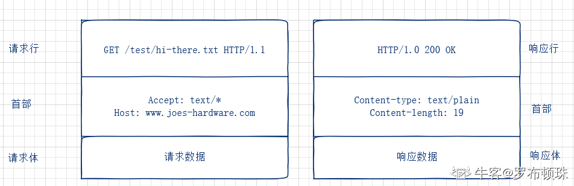
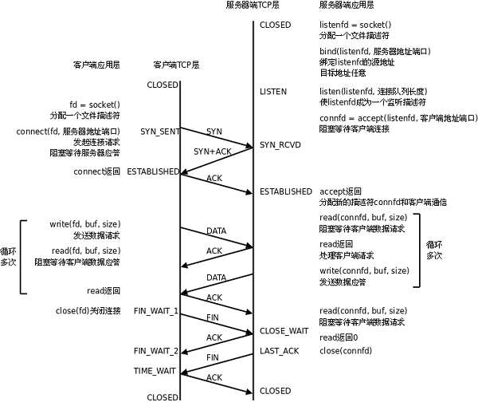

## C/C++基础

### 1. 内存对齐，带来的好处是什么

内存访问粒度是不变的，内存对齐有利于内存访问时，减少某些场景下读取数据时的次数，而且不需要做额外的操作，提高了效率。

### 2. 构造函数初始化列表和其他方式有什么区别

无论是在构造函数初始化列表中初始化成员，还是在构造函数体中对它们赋值，最终结果是相同的。不同之处在于，使用构造函数初始化列表的版本表示初始化数据成员，没有定义初始化列表的构造函数版本在构造函数体中对数据成员赋值。

首先把数据成员按类型分类： 
1、内置数据类型，复合类型（指针，引用） 
2、用户定义类型

对于类型1，在成员初始化列表和构造函数体内进行，在性能和结果上都是一样的 
对于类型2，结果上相同，但是性能上存在很大的差别。因为类类型的数据成员对象在进入函数体是已经构造完成，也就是说在成员初始化列表处进行构造对象的工作，这是调用一次构造函数，在进入函数体之后，进行的是对已经构造好的类对象的赋值，又调用个拷贝赋值操作符才能完成（如果并未提供，则使用编译器提供的默认按成员赋值行为）。

### 3. 指针与引用，sizeof(ptr)和sizeof(reference)

**指针和引用的几点差别：**

> * 在任何情况下都不能使用指向空值的引用。但指针可以给他赋空值。
> * 在C＋＋里，引用应被初始化。但指针可以是未初始化的指针（不过空指针合法但危险）。
> * 不存在指向空值的引用这个事实意味着使用引用的代码效率比使用指针的要高。因为在使用引用之前不需要测试它的合法性。相反，指针则应该总是被测试，防止其为空。
> * 指针与引用的另一个重要的不同是指针可以被重新赋值以指向另一个不同的对象。但是引用则总是指向在初始化时被指定的对象，以后不能改变。

总的来说，在以下情况下你应该使用指针，一是你考虑到存在不指向任何对象的可能（在这种情况下，你能够设置指针为空），二是你需要能够在不同的时刻指向不同的对象（在这种情况下，你能改变指针的指向）。如果总是指向一个对象并且一旦指向一个对象后就不会改变指向，那么你应该使用引用。

还有一种情况，就是当你重载某个操作符时，你应该使用引用。最普通的例子是操作符[]。这个操作符典型的用法是返回一个目标对象，其能被赋值。

### 4. C与C++的区别

### 5. 面向对象的特征

- 封装

  封装最好理解了。封装是面向对象的特征之一，是对象和类概念的主要特性。封装，也就是把客观事物封装成抽象的类，并且类可以把自己的数据和方法只让可信的类或者对象操作，对不可信的进行信息隐藏。

- 继承

  继承是指这样一种能力：它可以使用现有类的所有功能，并在无需重新编写原来的类的情况下对这些功能进行扩展。通过继承创建的新类称为“子类”或“派生类”，被继承的类称为“基类”、“父类”或“超类”。

  要实现继承，可以通过“继承”（Inheritance）和“组合”（Composition）来实现。

- 多态性

  多态性（polymorphisn）是允许你将父对象设置成为和一个或更多的他的子对象相等的技术，赋值之后，父对象就可以根据当前赋值给它的子对象的特性以不同的方式运作。简单的说，就是一句话：允许将子类类型的指针赋值给父类类型的指针。

  实现多态，有两种方式，覆盖和重载。覆盖和重载的区别在于，覆盖在运行时决定，重载是在编译时决定。并且覆盖和重载的机制不同，例如在 Java 中，重载方法的签名必须不同于原先方法的，但对于覆盖签名必须相同。

### 6. C语言如何实现多态

C语言可以通过宏实现编译时多态，下面是一个例子：

```c
// 对于不同的类型的A和B，带参数的宏 ADD 会根据传入的是 int类型或是string 类型而采取不同的 +的策略。
#define ADD(A, B) (A) + (B);
int main(){
    int a =1;
    int b =2;
    cout<<ADD(a,b);//输出3
    string c = "asd";
    string d = "fff";
    cout<<ADD(c,d);//输出 asdfff
    return 0;
}
```

C语言可以用函数指针实现动态多态，下面是例子：

```c
#include <stdio.h>
#include <stdlib.h>
 
//虚函数表结构
struct base_vtbl
{
    void(*dance)(void *);
    void(*jump)(void *);
};
 
//基类
struct base
{
    /*virtual table*/
    struct base_vtbl *vptr;
};
 
void base_dance(void *this)
{
    printf("base dance\n");
}
 
void base_jump(void *this)
{
    printf("base jump\n");
}
 
/* global vtable for base */
struct base_vtbl base_table =
{
	base_dance,
    base_jump
};
 
//基类的构造函数
struct base * new_base()
{
    struct base *temp = (struct base *)malloc(sizeof(struct base));
    temp->vptr = &base_table;
    return temp;
}
 
//派生类
struct derived1
{
    struct base super;
    /*derived members */
    int high;
};
 
void derived1_dance(void * this)
{
    /*implementation of derived1's dance function */
    printf("derived1 dance\n");
}
 
void derived1_jump(void * this)
{
    /*implementation of derived1's jump function */
    struct derived1* temp = (struct derived1 *)this;
    printf("derived1 jump:%d\n", temp->high);
}
 
/*global vtable for derived1 */
struct base_vtbl derived1_table =
{
    (void(*)(void *))&derived1_dance,
    (void(*)(void *))&derived1_jump
};
 
//派生类的构造函数
struct derived1 * new_derived1(int h)
{
    struct derived1 * temp= (struct derived1 *)malloc(sizeof(struct derived1));
    temp->super.vptr = &derived1_table;
    temp->high = h;
    return temp;
}

int main(void)
{ 
    struct base * bas = new_base();
    //这里调用的是基类的成员函数
    bas->vptr->dance((void *)bas);
    bas->vptr->jump((void *)bas);
 
 
    struct derived1 * child = new_derived1(100);
    //基类指针指向派生类
    bas  = (struct base *)child;
 
    //这里调用的其实是派生类的成员函数
    bas->vptr->dance((void *)bas);
    bas->vptr->jump((void *)bas);
    return 0;
}
```

### 7. new和malloc的区别和底层原理

* malloc是函数，new为运算符
* malloc分配内存参数为内存大小，返回值需要转换，new 直接返回类型与对象严格匹配；new内存分配失败时，会抛出bac_alloc异常。malloc分配内存失败时返回NULL
* new 会调用类的默认构造函数
* new会先调用operator new函数，申请足够的内存（通常底层使用malloc实现）。然后调用类型的构造函数，初始化成员变量，最后返回自定义类型指针。delete先调用析构函数，然后调用operator delete函数释放内存（通常底层使用free实现）。malloc/free是库函数，只能动态的申请和释放内存，无法强制要求其做自定义类型对象构造和析构工作.
* C++允许重载new/delete操作符，特别的，placement  new的就不需要为对象分配内存，而是指定了一个地址作为内存起始区域，new在这段内存上为对象调用构造函数完成初始化工作，并返回此地址。而malloc不允许重载
* new操作符从自由存储区（free store）上为对象动态分配内存空间，而malloc函数从堆上动态分配内存。自由存储区是C++基于new操作符的一个抽象概念，凡是通过new操作符进行内存申请，该内存即为自由存储区。而堆是操作系统中的术语，是操作系统所维护的一块特殊内存，用于程序的内存动态分配，C语言使用malloc从堆上分配内存，使用free释放已分配的对应内存。自由存储区不等于堆，如上所述**placement new就可以不位于堆中**。

### 8. 智能指针

#### 8.1 为什么要引用智能指针

防止已分配的内存忘记释放，防止使用野指针带来的问题等

#### 8.2 unique_ptr与auto_ptr

auto_ptr拷贝、赋值操作会导致原对象被释放，但是对程序员来说不够明显，很容易再次使用原对象导致异常。unique_ptr使用移动语义实现，使用时需要std::move显示转换对象为右值。

#### 8.3 shared_ptr原理，shared_ptr会造成什么问题，怎么解决

引用计数；循环引用；weak_ptr和shared_ptr搭配使用

### 9. 多重循环如何提高效率

```
1、实例化变量放在for循环外，减少实例化的次数
2、把能在循环外计算的，尽量在循环外计算，减少在内层的运算，有判断条件的语句和与循环不相关的操作语句尽量放在for外面
3、应当将最长的循环放在最内层，最短的循环放在最外层，以减少CPU跨切循环层的次数
4、将普通变量变为寄存器变量

在程序运行时，根据需要到内存中相应的存储单元中调用，如果一个变量在程序中频繁使用，例如循环变量，那么，系统就必须多次访问内存中的该单元，影响程序的执行效率。因此，C\C++语言定义了一种变量，不是保存在内存上，而是直接存储在CPU中的寄存器中，这种变量称为寄存器变量。
```

### 10. 如果类有虚函数，类的大小，空的类大小

空类为1，其他需要加上虚指针，然后按内存对齐

### 11. STL

#### 11.1 vector扩容时机，扩容机制，怎么减少扩容

不够了就扩，每次扩两倍，提前reserve减少扩容

#### 11.2 deque的底层实现

#### 11.3 说一下push_back和emplace_back的区别

C++11中也提供了参数为右值的push_back，然后调用emplace_back，emplace_back基于通用引用和forward，vector中都会通过placement new构造

#### 11.4 map和set的底层实现

红黑树

#### 11.5 vector的resize和reverse区别

#### 11.6 迭代器失效

### 12. calloc、malloc 和realloc


### 13. 拷贝构造函数什么时候被调用，为什么要传引用

防止递归构造

### 14. 多态的实现原理，怎么知道绑定对象的具体类型

虚函数指针，RTTI

### 15. 什么是右值引用？为什么引进右值引用？好处？与左值引用的区别是什么？

### 16. 类静态变量的初始化

c语言中：
用于函数内部修饰变量，即函数内的静态变量。这种变量的生存期长于该函数，使得函数具有一定的“状态”。使用静态变量的函数一般是不可重入的，也不是线程安全的，比如strtok(3)。
用在文件级别（函数体之外），修饰变量或函数，表示该变量或函数只在本文件可见，其他文件看不到也访问不到该变量或函数。专业的说法叫“具有internal linkage”（简言之：不暴露给别的translation unit）。
c++语言中（由于C++引入了类，在保持与C语言兼容的同时，static关键字又有了两种新用法）：
用于修饰类的数据成员，即所谓“静态成员”。这种数据成员的生存期大于class的对象（实例/instance）。静态数据成员是每个class有一份，普通数据成员是每个instance 有一份。
用于修饰class的成员函数，即所谓“静态成员函数”。这种成员函数只能访问静态成员和其他静态程员函数，不能访问非静态成员和非静态成员函数。

### 17. 虚函数的效率如何

### 18. 重载、重写和覆盖

```
重载：
（1）相同的范围（在同一个类中）；
（2）函数名字相同，参数不同；
（3）virtual 关键字可有可无。
函数后面有const也算，即this参数类型不一样

重写：
（1）不同的范围（分别位于派生类与基类）；
（2）函数名字相同，参数相同；
（3）基类函数必须有virtual关键字
```

### 19. C语言如何实现C++对象以及私有成员

struct的生命放在头文件中，定义放在cpp中

### 20. 虚函数指针的初始化过程

### 21. C++11原子变量介绍

### 22. 怎样理解C++中的static关键字

### 23. C++中的内存分配，运行时内存分布

在C++中，内存分成5个区，他们分别是堆、栈、自由存储区、全局/静态存储区和常量存储区。
　　**栈**：在执行函数时，函数内局部变量的存储单元都可以在栈上创建，函数执行结束时这些存储单元自动被释放。栈内存分配运算内置于处理器的指令集中，效率很高，但是分配的内存容量有限。
　　**堆**：就是那些由 `new`分配的内存块，他们的释放编译器不去管，由我们的应用程序去控制，一般一个`new`就要对应一个 `delete`。如果程序员没有释放掉，那么在程序结束后，操作系统会自动回收。
　　**自由存储区**：就是那些由`malloc`等分配的内存块，他和堆是十分相似的，不过它是用`free`来结束自己的生命的。
　　**全局/静态存储区**：全局变量和静态变量被分配到同一块内存中，在以前的C语言中，全局变量又分为初始化的和未初始化的，在C++里面没有这个区分了，他们共同占用同一块内存区。
　　**常量存储区**：这是一块比较特殊的存储区，他们里面存放的是常量，不允许修改。

### 24. 析构函数可以是虚函数？为什么

### 25. 深拷贝与浅拷贝

拿指向动态分配内存的指针来说，拷贝的是指向的内容，浅拷贝只拷贝指针变量本身的值。

### 26. 指针常量、常量指针的区别

const char* （指针指向的内存值不能修改）、char* const(指针变量值不能修改) 

### 27. inline和define的区别

### 28. 堆栈的区别

```
(1). 管理方式不同
(2). 空间大小不同
(3). 能否产生碎片不同
(4). 生长方向不同
(5). 分配方式不同
(6). 分配效率不同
```

###  29. 移动语义、完美转发

`std::move`接受一个对象，并允许您将其视为临时(Rvalue)。虽然它不是语义要求，但通常接受对rvalue的引用的函数将使其失效。当你看到`std::move`，它表示不应该在以后使用对象的值，但是仍然可以分配一个新值并继续使用它。

`std::forward`只有一个用例：要将模板化函数参数(函数内部)转换为调用方用来传递它的值类别(lvalue或rvalue)。这允许rvalue参数作为rvalue传递，lvalue作为lvalue传递，这是一种称为“完美转发”的方案。

### 30. 右值引用、通用引用、引用折叠

### 31. 虚函数的原理，虚表的第一项和第二项

第一项：offset to top 	第二项：type_info

### 32. 菱形继承时，内存布局，虚继承

### 33. 自由存储区

### 34. explicit使用场景

- **修饰只含一个参数的构造函数；**

- **修饰除了第一个参数外其余参数都有默认值的构造函数。**

  当在上面两种情况以外的构造函数前加explicit时，explicit失效。

### 35. 异常安全


## 数据结构和算法

### 1. 红黑树

### 2. B树、B+树、B-树

### 3. hash

#### 3.1 hash处理冲突的解决办法

#### 3.2 hash算法

### 4. 数组链表的区别

### 5. redis数据结构用过那些，了解跳表？

### 6. 红黑树比平衡二叉树有那些优点

### 7. AC自动机时间复杂度

### 8. 二分查找及其变种

### 9. 一致性hash

### 10. 常见的负载均衡策略

### 11. 前缀树

### 12. 排序算法时间复杂度

### 13. LSM tree

### 14. 大小堆

### 15. 排序


## 网络基础

### 1. 网络编程的模型

### 2. UDP

#### 2.1 udp包长度

#### 2.2 udp实现可靠传输

#### 2.3 udp的接收缓冲区、发送缓冲区和tcp的区别

### 3. HTTP与HTTPS

#### 3.1 HTTP和HTTPS的区别

#### 3.2 是否了解中间人劫持原理

#### 3.3 http协议格式，几种方法，功能是什么



 **1.GET** 请求指定的页面信息，并返回实体主体 

 **2.HEAD** 类似于GET请求，只不过返回的响应体，用于获取报头。 

 **3.POST** 向指定的资源提交数据进行处理请求。数据被包含在请求体中。POST请求可能会导致新的资源的建立或已有资源的修改。 

 **4.PUT** 从[客户端]()向服务端传送的数据取代指定的文档的内容 

 **5.DELETE** 请求服务器删除指定的页面 

 **6.CONNECT** HTTP/1.1协议中预留给能将连接改为管道方式的代理服务器 

 **7.OPTIONS** 允许[客户端]()查看服务端的性能 

 **8.TRACE** 回显服务端收到的请求，主要用于测试或诊断 

 **9.PATCH** 是对PUT方法的补充，用来对已知资源进行局部更新。 

#### 3.4 chunked块了解？介绍下

#### 3.5 有chunked的时候，contentlength是什么样子

#### 3.6 http长连接和短连接的区别

#### 3.7 session和cookie

### 4. TCP

**TCP头部为20字节:** 

```
源端口和目的端口
   各占2个字节，这两个值加上IP首部中的源端IP地址和目的端IP地址唯一确定一个TCP连接。有时一个IP地址和一个端口号也称为socket（插口）。
   
序号(seq)
   占4个字节，是本报文段所发送的数据项目组第一个字节的序号。在TCP传送的数据流中，每一个字节都有一个序号。例如，一报文段的序号为300，而且数据共100字节，则下一个报文段的序号就是400；序号是32bit的无符号数，序号到达2^32-1后从0开始。
   
确认序号(ack)
   占4字节，是期望收到对方下次发送的数据的第一个字节的序号，也就是期望收到的下一个报文段的首部中的序号；确认序号应该是上次已成功收到数据字节序号+1。只有ACK标志为1时，确认序号才有效。
   
数据偏移
   占4比特，表示数据开始的地方离TCP段的起始处有多远。实际上就是TCP段首部的长度。由于首部长度不固定，因此数据偏移字段是必要的。数据偏移以32位为长度单位，也就是4个字节，因此TCP首部的最大长度是60个字节。即偏移最大为15个长度单位=1532位=154字节。保留6比特，供以后应用，现在置为0。

6个标志位比特
URG：当URG=1时，注解此报文应尽快传送，而不要按本来的列队次序来传送。与“紧急指针”字段共同应用，紧急指针指出在本报文段中的紧急数据的最后一个字节的序号，使接管方可以知道紧急数据共有多长。
ACK：只有当ACK=1时，确认序号字段才有效；
PSH：当PSH=1时，接收方应该尽快将本报文段立即传送给其应用层。
通过允
许客户应用程序通知其 TCP设置PUSH标志，客户进程通知TCP在向服务器发送一个报文段时不要因等待额外数据而使已提交数据在缓存中滞留。类似地，当服务器的TCP接收到一个设置了PUSH标志的报文段时，它需要立即将这些数据递交给服务器进程而不能等待判断是否还会有额外的数据到达。
RST：当RST=1时，表示出现连接错误，必须释放连接，然后再重建传输连接。复位比特还用来拒绝一个不法的报文段或拒绝打开一个连接；
SYN：SYN=1,ACK=0时表示请求建立一个连接，携带SYN标志的TCP报文段为同步报文段；
FIN：发端完成发送任务。

窗口
   TCP通过滑动窗口的概念来进行流量控制。设想在发送端发送数据的速度很快而接收端接收速度却很慢的情况下，为了保证数据不丢失，显然需要进行流量控制， 协调好通信双方的工作节奏。所谓滑动窗口，可以理解成接收端所能提供的缓冲区大小。TCP利用一个滑动的窗口来告诉发送端对它所发送的数据能提供多大的缓冲区。窗口大小为字节数起始于确认序号字段指明的值（这个值是接收端正期望接收的字节）。窗口大小是一个16bit字段，因而窗口大小最大为65535字节。

检验和
	检验和覆盖了整个TCP报文段：TCP首部和数据。这是一个强制性的字段，一定是由发端计算和存储，并由收端进行验证。

紧急指针
   只有当URG标志置1时紧急指针才有效。紧急指针是一个正的偏移量，和序号字段中的值相加表示紧急数据最后一个字节的序号。
```




#### 4.1 tcp粘包

#### 4.2 tcp的三次握手，client端如果不会ack会怎么样？

如果最后一次ACK在网络中丢失，那么Server端（服务端）该TCP连接的状态仍为SYN_RECV，并且根据TCP的超时重传机制依次等待3秒、6秒、12秒后重新发送 SYN+ACK 包，以便 Client（客户端]）重新发送ACK包。 

如果重发指定次数后，仍然未收到ACK应答，那么一段时间后，Server（服务端）自动关闭这个连接。 

但是Client（客户端）认为这个连接已经建立，如果Client（客户端）端向Server（服务端）发送数据，Server端（服务端）将以RST包（Reset，标示复位，用于异常的关闭连接）响应，此时，客户端知道第三次握手失败。

#### 4.3. 如果tcp握手大量的发syn会怎样呢

SYN Flood利用TCP协议缺陷，发送大量伪造的TCP连接请求，常用假冒的IP或IP号段发来海量的请求连接的第一个握手包（SYN包），被攻击服务器回应第二个握手包（SYN+ACK包），因为对方是假冒IP，对方永远收不到包且不会回应第三个握手包。导致被攻击服务器保持大量SYN_RECV状态的“半连接”，并且会重试默认5次回应第二个握手包，大量随机的恶意syn占满了未完成连接队列，导致正常合法的syn排不上队列，让正常的业务请求连接不进来。【服务器端的资源分配是在二次握手时分配的，而[客户端]()的资源是在完成三次握手时分配的，所以服务器容易受到SYN洪泛攻击】 

检测 SYN 攻击非常的方便，当你在服务器上看到大量的半连接状态时，特别是源IP地址是随机的，基本上可以断定这是一次SYN攻击【在 Linux/Unix 上可以使用系统自带的 netstats 命令来检测 SYN 攻击】 

怎么解决？  

- 缩短超时（SYN Timeout）时间 
- 增加最大半连接数 
- 过滤网关防护 
- SYN cookies技术： 

1. 当服务器接受到 SYN 报文段时，不直接为该 TCP 分配资源，而只是打开一个半开的套接字。接着会使用 SYN 报文段的源 Id，目的 Id，端口号以及只有服务器自己知道的一个秘密函数生成一个 cookie，并把 cookie 作为序列号响应给客户端。 
2. 如果客户端是正常建立连接，将会返回一个确认字段为 cookie + 1 的报文段。接下来服务器会根据确认报文的源 Id，目的 Id，端口号以及秘密函数计算出一个结果，如果结果的值 + 1 等于确认字段的值，则证明是刚刚请求连接的客户端，这时候才为该 TCP 分配资源。

#### 4.5 讲一下流量控制

滑动窗口

#### 4.6 三次握手四次挥手越详细越好

**三次握手：**

为了保证数据能到达目标，TCP采用三次握手策略。

1. 发送端首先发送一个带SYN（synchronize）标志的数据包给接收方【第一次的seq序列号是随机产生的，这样是为了网络安全，如果不是随机产生初始序列号，黑客将会以很容易的方式获取到你与其他主机之间的初始化序列号，并且伪造序列号进行攻击】 
2. 接收端收到后，回传一个带有SYN/ACK（acknowledgement）标志的数据包以示传达确认信息【SYN 是为了告诉发送端，发送方到接收方的通道没问题；ACK 用来验证接收方到发送方的通道没问题】 
3. 最后，发送端再回传一个带ACK标志的数据包，代表握手结束
   若在握手某个过程中某个阶段莫名中断，TCP协议会再次以相同的顺序发送相同的数据包

三次握手的目的是建立可靠的通信信道，说到通讯，简单来说就是数据的发送与接收，而三次握手最主要的目的就是双方确认自己与对方的发送与接收是正常的

1. 第一次握手，发送端：什么都确认不了；接收端：对方发送正常，自己接受正常 
2. 第二次握手，发送端：对方发送，接受正常，自己发送，接受正常 ；接收端：对方发送正常，自己接受正常 
3. 第三次握手，发送端：对方发送，接受正常，自己发送，接受正常；接收端：对方发送，接受正常，自己发送，接受正常

**四次挥手：**

1. 主动断开方（客户端/服务端）-发送一个 FIN，用来关闭主动断开方（客户端/服务端）到被动断开方（客户端/服务端）的数据传送 
2. 被动断开方（客户端/服务端）-收到这个 FIN，它发回一 个 ACK，确认序号为收到的序号加1 。和 SYN 一样，一个 FIN 将占用一个序号 
3. 被动点开方（客户端/服务端）-关闭与主动断开方（客户端/服务端）的连接，发送一个FIN给主动断开方（客户端/服务端） 
4. 主动断开方（客户端/服务端）-发回 ACK 报文确认，并将确认序号设置为收到序号加1 

**为什么连接的时候是三次握手，关闭的时候却是四次握手？**

- 建立连接的时候， 服务器在LISTEN状态下，收到建立连接请求的SYN报文后，把ACK和SYN放在一个报文里发送给客户端。 
- 关闭连接时，服务器收到对方的FIN报文时，仅仅表示对方不再发送数据了但是还能接收数据，而自己也未必全部数据都发送给对方了,所以服务器可以立即关闭，也可以发送一些数据给对方后，再发送FIN报文给对方来表示同意现在关闭连接。因此，服务器ACK和FIN一般都会分开发送，从而导致多了一次

#### 4.7 accept发生在三次握手哪个阶段

客户端ACK，established

#### 4.8 SYN如果丢了，重传多少次

默认5次，tcp_syn_retries 

#### 4.9 seq为1000， 发送了1000个数据，下一个seq是多少

假设对方接收到数据，比如sequence number = 1000，TCP Payload = 1000，数据第一个字节编号为1000，最后一个为1999，回应一个确认报文，确认号为2000，意味着编号2000前的字节接收完成，准备接收编号为2000及更多的数据 。

确认收到的序列，并且告诉发送端下一次发送的序列号从哪里开始（便于接收方对数据排序，便于选择重传）

#### 4.10 讲一下拥塞控制

拥塞控制（用于网络）主要是为了在发生网络拥堵后不进一步触发 TCP 的超时重传进制导致进一步的网络拥堵和网络性能下降。所以发送方会自己维护一个拥堵窗口，默认为 1 **MSS**[4]（最大长度报文段）。

控制手段主要有**慢启动**、**拥塞避免**、**快重传**、**快恢复**。

- **慢启动**思路是一开始不要传输大量的数据，而是先试探网络中的拥堵程度再去逐渐增加拥塞窗口大小（一般是指数规律增长）。
- **拥塞避免**思路也和慢启动类似，只是按照线性规律去增加拥堵窗口的大小。而慢启动和拥塞避免一般会配合使用，有个慢启动阈值，这个阈值取值是在发生拥塞时的窗口的一半大小。当小于慢启动阈值时则使用慢启动策略，大于则使用拥塞避免策略。当达到拥塞（超时）后，会把拥塞窗口重置为 1，慢启动阈值会设置为拥塞时刻窗口的一半，循环这个过程。但是超时的原因不一定是因为网络拥塞，也有可以发送方那一刻刚好丢包了。所以就有了快重传和慢启动进行优化。
- **快重传**指的是使发送方尽快重传丢失报文，而不是等超时避免去触发慢启动。所以接受方要收到失序报文后马上发送重复确认以及发送方收到三个重复的接受报文要接受重发。
- 快重传成功后，就会执行**快恢复**算法，一般是将慢启动阈值和拥塞窗口都调整为现有窗口的一半，之后进行拥塞避免算法，也有实现是把调整为一半后，在增加3个MSS。

#### 4.11 半连接在哪个阶段

三次握手SYN_RECV状态

#### 4.12 tcp可靠性体现在哪里

#### 4.13 为什么TCP挥手每两次中间有一个 FIN-WAIT2等待时间？

主动关闭的一端调用完close以后（即发FIN给被动关闭的一端， 并且收到其对FIN的确认ACK）则进入FIN_WAIT_2状态。如果这个时候因为网络突然断掉、被动关闭的一段宕机等原因，导致主动关闭的一端不能收到被动关闭的一端发来的FIN（防止对端不发送关闭连接的FIN包给本端），这个时候就需要FIN_WAIT_2定时器， 如果在该定时器超时的时候，还是没收到被动关闭一端发来的FIN，那么直接释放这个链接，进入CLOSE状态

#### 4.14 为什么客户端最后还要等待2MSL？为什么还有个TIME-WAIT的时间等待？
1. 保证客户端发送的最后一个ACK报文能够到达服务器，因为这个ACK报文可能丢失，服务器已经发送了FIN+ACK报文，请求断开，客户端却没有回应，于是服务器又会重新发送一次，而客户端就能在这个2MSL时间段内收到这个重传的报文，接着给出回应报文，并且会重启2MSL计时器。 
2. 防止类似与“三次握手”中提到了的“已经失效的连接请求报文段”出现在本连接中。客户端发送完最后一个确认报文后，在这个2MSL时间中，就可以使本连接持续的时间内所产生的所有报文段都从网络中消失，这样新的连接中不会出现旧连接的请求报文。 
3. 2MSL，最大报文生存时间，一个MSL 30 秒，2MSL = 60s

#### 4.15 客户端TIME-WAIT 状态过多会产生什么后果？怎样处理？
1. 作为服务器，短时间内关闭了大量的Client连接，就会造成服务器上出现大量的TIME_WAIT连接，占据大量的tuple /tApl/ ，严重消耗着服务器的资源，此时部分客户端就会显示连接不上。 
2. 作为客户端，短时间内大量的短连接，会大量消耗的Client机器的端口，毕竟端口只有65535个，端口被耗尽了，后续就无法在发起新的连接了 

- 在高并发短连接的TCP服务器上，当服务器处理完请求后立刻主动正常关闭连接。这个场景下会出现大量socket处于TIME_WAIT状态。如果客户端的并发量持续很高，此时部分客户端就会显示连接不上
  - **高并发可以让服务器在短时间范围内同时占用大量端口**，而端口有个0~65535的范围，并不是很多，刨除系统和其他服务要用的，剩下的就更少了 
  - **短连接表示“业务处理+传输数据的时间 远远小于 TIMEWAIT超时的时间”的连接** 
- 解决方法：  
  - 用负载均衡来抗这些高并发的短请求； 
  - 服务器可以设置 SO_REUSEADDR 套接字选项来避免 TIME_WAIT状态，TIME_WAIT 状态可以通过优化服务器参数得到解决，因为发生TIME_WAIT的情况是服务器自己可控的，要么就是对方连接的异常，要么就是自己没有迅速回收资源，总之不是由于自己程序错误导致的 
  - 强制关闭，发送 RST 包越过TIMEWAIT状态，直接进入CLOSED状态

#### 4.16 服务器出现了大量 CLOSE_WAIT 状态如何解决？
大量 CLOSE_WAIT 表示程序出现了问题，对方的 socket 已经关闭连接，而我方忙于读或写没有及时关闭连接，需要检查代码，特别是释放资源的代码，或者是处理请求的线程配置。

#### 4.17 服务端会有一个TIME_WAIT状态吗？如果是服务端主动断开连接呢？
- 发起链接的主动方基本都是客户端，但是**断开连接的主动方服务器和客户端都可以充当**，也就是说，只要是主动断开连接的，就会有 TIME_WAIT状态 。
- 四次挥手是指断开一个TCP连接时，需要客户端和服务端总共发送4个包以确认连接的断开。在socket编程中，这一过程由客户端或服务端任一方执行close来触发 。
- 由于TCP连接时全双工的，因此，每个方向的数据传输通道都必须要单独进行关闭。

#### 4.18 nagle算法

该算法要求一个 TCP连接上最多只能有一个未被确认的未完成的小分组（包长度小于MSS），在该分组的确认到达之前不能发送其他的小分组。相反， TCP收集这些少量的分组，并在确认到来时以一个分组的方式发出去。该算法的优越之处在于它是自适应的：确认到达得越快，数据也就发送得越快。而在希望减少微小分组数目的低速广域网上，则会发送更少的分组。

> * 如果包长度达到MSS，则允许发送；
> * 如果该包含有FIN，则允许发送；
> * 设置了TCP_NODELAY选项，则允许发送；
> * 未设置TCP_CORK选项时，若所有发出去的包均被确认，或所有发出去的小数据包(包长度小于MSS)均被确认，则允许发送。就是说要求一个TCP连接上最多只能有一个未被确认的小数据包，在该分组的确认到达之前，不能发送其他的小数据包。

#### 4.19 经受时延的确认

通常TCP在接收到数据时并不立即发送ACK；相反，它推迟发送，以便将 ACK与需要沿该方向发送的数据一起发送（有时称这种现象为数据捎带 ACK）。绝大多数实现采用的时延为 200 ms （现在好像是40ms），也就是说，TCP将以最大200 ms的时延等待是否有数据一起发送。

#### 4.20 TCP_QUICKACK选项是需要在每次调用recv后重新设置的

其实linux下socket有一个pingpong属性来表明当前链接是否为交互数据流，如其值为1，则表明为交互数据流，会使用延迟确认机制。但是pingpong这个值是会动态变化的。

如果当前时间与最近一次接受数据包的时间间隔小于计算的延迟确认超时时间，则重新进入交互数据流模式。也可以这么理解：延迟确认机制被确认有效时，会自动进入交互式。

要求满足两个条件才能算是quickack模式：

1. pingpong被设置为0。
2. 快速确认数(quick)必须为非0。

关于pingpong这个值，在前面有描述。而quick这个属性其代码中的注释为：scheduled number of quick acks，即快速确认的包数量，每次进入quickack模式，quick被初始化为接收窗口除以2倍MSS值(linux-2.6.39.1/net/ipv4/tcp_input.c, Line 174)，每次发送一个ACK包，quick即被减1。

https://blog.csdn.net/doitsjz/article/details/73459906

#### 4.21 TCP_CORK

### 5. 介绍下proactor和reactor

Reactor处理的是就绪事件，而Proactor处理的是完成事件。

### 6. reactor和proactor的组成

reactor：handle、事件分离器、处理器接口、reactor管理器


### 7. IP为什么要分片

### 8. IO复用 

#### 8.1 select什么时候返回0，select和poll的区别

#### 8.2 epoll可读情况有哪些

#### 8.3 10. epoll中的ET和LT模式

#### 8.4 epoll的实现原理

### 11. 什么是零拷贝

### 12. libevent结构，内部实现

### 13. ARP协议工作流程

### 14. 一次url访问会经历那些过程

### 15. 数据包乱序会处理吗

### 16. 

### 17. 


## 操作系统

### 1. 线程和进程的区别，应用场景

### 2. 线程栈和进程栈的区别

### 3. 进程内存的划分，分别存放那些内容

### 4. 自旋锁和互斥锁，怎么实现

### 5. 进程切换和线程切换分别有什么开销呢

### 6. 操作系统的写时拷贝

### 7. LRU怎么实现的

### 8. 动态库和静态库

### 9. volatile和原子变量的区别

### 10. proc文件系统

### 11. 虚拟内存

### 12. 栈内存为什么由系统自动分配和释放

### 13. 守护进程如何创建

### 14. 进程间通信方式，应用场景

### 15. 死锁条件和解除

### 16. 进程调度方式

### 17. 对编译链接的理解

### 18. 共享内存实现原理

### 19. 僵尸进程是什么如何处理，孤儿进程呢？

 **孤儿进程：** 如果一个父进程先于子进程结束，子进程就会成为一个孤儿进程，它由init/systemd进程(现在系统有所更新，一号进程有的已经不再init进程而是systemd进程)收养，成为init进程的子进程。

**僵尸进程：** 如果一个子进程先于父进程终止，而父进程又没有调用wait函数等待子进程结束，子进程会进入僵死状态，即变为一个僵尸进程，并且会一直保持下去除非系统重启。子进程处于僵死状态时，内核只保存该进程的一些必要信息以备父进程所需。此时进程程始终占用资源，同时也减少了系统可以创建的最大进程数。

### 20. 自旋锁在单cpu和多cpu下的使用

### 21. 用户态和内核态

### 22. 进程间通信及原理

### 23. 怎么设计一个线程池

### 24. 死锁

### 25. 中断

### 26. CPU调度方式

### 27. 线程同步的方式及优缺点

### 28. 进程间通信的方式及优缺点

### 29. 内存管理

### 30. 多线程中，一个线程可能生成单例，其他线程有没有可能在其他单例还没有构造好的情况下使用单例，如果有怎么处理？

### 31. 程序局部性原理

顺序执行的指令和线性结构的数据(如数组)，它们通常被限定在某一连续区域。一旦某一位置被访问后，那么它附近的位置很快也会被访问。  

### 32. 内存页大小和进程栈、线程栈的大小怎么查看

## 设计模式

### 1. 基本原则

### 2. 单例模式

### 3. 工厂模式

### 4. 职责链模式

### 5. 代理模式

## CC++第三方库

### 1. Libevent

### 2. Boost

## 数据库

### 1. 隔离级别及未解决的问题

### 2. Serializable带来了别的什么问题

### 3. 实际应用中使用哪个级别

read committed？

### 4. Redis

#### 4.1 什么是redis？Reids的特点？使用redis有哪些好处？redis适用于的场景?

redis是一个高性能的key-value数据库，它是完全开源免费的，而且redis是一个NOSQL类型数据库，是为了解决高并发、高扩展，大数据存储等一系列的问题而产生的数据库解决方案，是一个非关系型的数据库。

Redis本质上是一个Key-Value类型的内存数据库，很像memcached，整个数据库统统加载在内存当中进行操作，定期通过异步操作把数据库数据flush到硬盘上进行保存。因为是纯内存操作，Redis的性能非常出色，每秒可以处理超过 10万次读写操作，是已知性能最快的Key-Value DB。

Redis的出色之处不仅仅是性能，Redis最大的魅力是支持保存多种数据结构，此外单个value的最大限制是1GB，不像 memcached只能保存1MB的数据，因此Redis可以用来实现很多有用的功能，比方说用他的List来做FIFO双向链表，实现一个轻量级的高性 能消息队列服务，用他的Set可以做高性能的tag系统等等。另外Redis也可以对存入的Key-Value设置expire时间，因此也可以被当作一 个功能加强版的memcached来用。

Redis的主要缺点是数据库容量受到物理内存的限制，不能用作海量数据的高性能读写，因此Redis适合的场景主要局限在较小数据量的高性能操作和运算上。

**特点：**

速度快，因为数据存在内存中，类似于HashMap，HashMap的优势就是查找和操作的时间复杂度都是O(1)

支持丰富数据类型，支持string，list，set，sorted set，hash

**String**

**常用命令** ：set/get/decr/incr/mget等；

**应用场景** ：String是最常用的一种数据类型，普通的key/value存储都可以归为此类；

实现方式：String在redis内部存储默认就是一个字符串，被redisObject所引用，当遇到incr、decr等操作时会转成数值型进行计算，此时redisObject的encoding字段为int。

**Hash**

**常用命令** ：hget/hset/hgetall等

**应用场景** ：我们要存储一个用户信息对象数据，其中包括用户ID、用户姓名、年龄和生日，通过用户ID我们希望获取该用户的姓名或者年龄或者生日；

实现方式：Redis的Hash实际是内部存储的Value为一个HashMap，并提供了直接存取这个Map成员的接口。如图所示，Key是用户ID, value是一个Map。这个Map的key是成员的属性名，value是属性值。这样对数据的修改和存取都可以直接通过其内部Map的Key(Redis里称内部Map的key为field)，也就是通过 key(用户ID) + field(属性标签) 就可以操作对应属性数据。当前HashMap的实现有两种方式：当HashMap的成员比较少时Redis为了节省内存会采用类似一维数组的方式来紧凑存储，而不会采用真正的HashMap结构，这时对应的value的redisObject的encoding为zipmap，当成员数量增大时会自动转成真正的HashMap,此时redisObject的encoding字段为int。

**List**

**常用命令** ：lpush/rpush/lpop/rpop/lrange等；

**应用场景** ：Redis list的**应用场景** 非常多，也是Redis最重要的数据结构之一，比如twitter的关注列表，粉丝列表等都可以用Redis的list结构来实现；

实现方式：Redis list的实现为一个双向链表，即可以支持反向查找和遍历，更方便操作，不过带来了部分额外的内存开销，Redis内部的很多实现，包括发送缓冲队列等也都是用的这个数据结构。

**Set**

**常用命令** ：sadd/spop/smembers/sunion等；

**应用场景** ：Redis set对外提供的功能与list类似是一个列表的功能，特殊之处在于set是可以自动排重的，当你需要存储一个列表数据，又不希望出现重复数据时，set是一个很好的选择，并且set提供了判断某个成员是否在一个set集合内的重要接口，这个也是list所不能提供的；

实现方式：set 的内部实现是一个 value永远为null的HashMap，实际就是通过计算hash的方式来快速排重的，这也是set能提供判断一个成员是否在集合内的原因。

**Sorted Set**

**常用命令** ：zadd/zrange/zrem/zcard等；

**应用场景** ：Redis sorted set的使用场景与set类似，区别是set不是自动有序的，而sorted set可以通过用户额外提供一个优先级(score)的参数来为成员排序，并且是插入有序的，即自动排序。当你需要一个有序的并且不重复的集合列表，那么可以选择sorted set数据结构，比如twitter 的public timeline可以以发表时间作为score来存储，这样获取时就是自动按时间排好序的。

实现方式：Redis sorted set的内部使用HashMap和跳跃表(SkipList)来保证数据的存储和有序，HashMap里放的是成员到score的映射，而跳跃表里存放的是所有的成员，排序依据是HashMap里存的score,使用跳跃表的结构可以获得比较高的查找效率，并且在实现上比较简单。

**Redis最适合所有数据in-momory的场景，如：**

**会话缓存（Session Cache）**

最常用的一种使用Redis的情景是会话缓存（session cache）。用Redis缓存会话比其他存储（如Memcached）的优势在于：Redis提供持久化。

**全页缓存（FPC）**

除基本的会话token之外，Redis还提供很简便的FPC平台。回到一致性问题，即使重启了Redis实例，因为有磁盘的持久化，用户也不会看到页面加载速度的下降，这是一个极大改进，类似PHP本地FPC。

**队列**

Reids在内存存储引擎领域的一大优点是提供 list 和 set 操作，这使得Redis能作为一个很好的消息队列平台来使用。Redis作为队列使用的操作，就类似于本地程序语言（如Python）对 list 的 push/pop 操作。

如果你快速的在Google中搜索“Redis queues”，你马上就能找到大量的开源项目，这些项目的目的就是利用Redis创建非常好的后端工具，以满足各种队列需求。例如，Celery有一个后台就是使用Redis作为broker，你可以从这里去查看。

**排行榜/计数器**

Redis在内存中对数字进行递增或递减的操作实现的非常好。集合（Set）和有序集合（Sorted Set）也使得我们在执行这些操作的时候变的非常简单，Redis只是正好提供了这两种数据结构。所以，我们要从排序集合中获取到排名最靠前的10个用户–我们称之为“user_scores”，我们只需要像下面一样执行即可：

当然，这是假定你是根据你用户的分数做递增的排序。如果你想返回用户及用户的分数，你需要这样执行：

ZRANGE user_scores 0 10 WITHSCORES

Agora Games就是一个很好的例子，用Ruby实现的，它的排行榜就是使用Redis来存储数据的，你可以在这里看到。

**发布/订阅**

最后（但肯定不是最不重要的）是Redis的发布/订阅功能。发布/订阅的使用场景确实非常多。

#### 4.2 缓存常见的问题，缓存穿透该怎么办

#### 4.3 分布式锁是怎么做的，不要说插件的处理，讲讲原生redis操作

#### 4.4 Redis的hash字典数据结构是啥样的

#### 4.5 Redis主从同步靠什么

#### 4.6 讲讲RDB和AOF吧，AOF怎么保证数据处理的没问题？如果同步的时候挂了丢了数据咋办？

#### 4.7 Redis过期策略是咋样的？惰性和定期删分别有啥优缺点？

1. 定时删除：在设置键的过期时间时，创建一个定时事件，当过期时间到达时，由事件处理器自动执行键的删除操作。
2. 惰性删除：放任键过期不管，但是在每次从 `dict` 字典中取出键值时，要检查键是否过期，如果过期的话，就删除它，并返回空；如果没过期，就返回键值。
3. 定期删除：每隔一段时间，对 `expires` 字典进行检查，删除里面的过期键。

定时和惰性这两种删除方式在单一使用时都有明显的缺陷： 定时删除占用太多 CPU 时间， 惰性删除浪费太多内存。定期删除是这两种策略的一种折中：

- 它每隔一段时间执行一次删除操作，并通过限制删除操作执行的时长和频率，籍此来减少删除操作对 CPU 时间的影响。
- 另一方面，通过定期删除过期键，它有效地减少了因惰性删除而带来的内存浪费

Redis 使用的过期键删除策略是惰性删除加上定期删除， 这两个策略相互配合，可以很好地在合理利用 CPU 时间和节约内存空间之间取得平衡。

#### 4.8 redis相比memcached有哪些优势？

* memcached所有的值均是简单的字符串，redis作为其替代者，支持更为丰富的数据类型
*  redis的速度比memcached快很多
*  redis可以持久化其数据

#### 4.9 Memcache与Redis的区别都有哪些？

* 存储方式 Memecache把数据全部存在内存之中，断电后会挂掉，数据不能超过内存大小。Redis有部份存在硬盘上，这样能保证数据的持久性。
* 数据支持类型 Memcache对数据类型支持相对简单。Redis有复杂的数据类型。
* 使用底层模型不同：它们之间底层实现方式以及与客户端之间通信的应用协议不一样。Redis直接自己构建了VM 机制 ，因为一般的系统调用系统函数的话，会浪费一定的时间去移动和请求.

#### 4.10 redis的缓存失效策略和主键失效机制

作为缓存系统都要定期清理无效数据，就需要一个主键失效和淘汰策略.在Redis当中，有生存期的key被称为volatile。在创建缓存时，要为给定的key设置生存期，当key过期的时候（生存期为0），它可能会被删除。

**影响生存时间的一些操作**

生存时间可以通过使用 DEL 命令来删除整个 key 来移除，或者被 SET 和 GETSET 命令覆盖原来的数据，也就是说，修改key对应的value和使用另外相同的key和value来覆盖以后，当前数据的生存时间不同。

比如说，对一个 key 执行INCR命令，对一个列表进行LPUSH命令，或者对一个哈希表执行HSET命令，这类操作都不会修改 key 本身的生存时间。另一方面，如果使用RENAME对一个 key 进行改名，那么改名后的 key的生存时间和改名前一样。

RENAME命令的另一种可能是，尝试将一个带生存时间的 key 改名成另一个带生存时间的 another_key ，这时旧的 another_key (以及它的生存时间)会被删除，然后旧的 key 会改名为 another_key ，因此，新的 another_key 的生存时间也和原本的 key 一样。使用PERSIST命令可以在不删除 key 的情况下，移除 key 的生存时间，让 key 重新成为一个persistent key 。

**如何更新生存时间**

可以对一个已经带有生存时间的 key 执行EXPIRE命令，新指定的生存时间会取代旧的生存时间。过期时间的精度已经被控制在1ms之内，主键失效的时间复杂度是O（1），EXPIRE和TTL命令搭配使用，TTL可以查看key的当前生存时间。设置成功返回 1；当 key 不存在或者不能为 key 设置生存时间时，返回 0 。

最大缓存配置在 redis 中，允许用户设置最大使用内存大小 server.maxmemory 默认为0，没有指定最大缓存，如果有新的数据添加，超过最大内存，则会使redis崩溃，所以一定要设置。redis 内存数据集大小上升到一定大小的时候，就会实行数据淘汰策略。redis 提供 6种数据淘汰策略：

**volatile-lru：** 从已设置过期时间的数据集（ `server.db\[i\].expires`）中挑选最近最少使用的数据淘汰

**volatile-ttl：** 从已设置过期时间的数据集（ `server.db\[i\].expires`）中挑选将要过期的数据淘汰

**volatile-random：** 从已设置过期时间的数据集（ `server.db\[i\].expires`）中任意选择数据淘汰

**allkeys-lru：** 从数据集（ `server.db\[i\].dict`）中挑选最近最少使用的数据淘汰

**allkeys-random：** 从数据集（ `server.db\[i\].dict`）中任意选择数据淘汰

**no-enviction（驱逐）：** 禁止驱逐数据

注意这里的6种机制，volatile和allkeys规定了是对已设置过期时间的数据集淘汰数据还是从全部数据集淘汰数据，后面的lru、ttl以及random是三种不同的淘汰策略，再加上一种no-enviction永不回收的策略。

使用策略规则：

**1、** 如果数据呈现幂律分布，也就是一部分数据访问频率高，一部分数据访问频率低，则使用allkeys-lru

**2、** 如果数据呈现平等分布，也就是所有的数据访问频率都相同，则使用allkeys-random

三种数据淘汰策略：

ttl和random比较容易理解，实现也会比较简单。主要是Lru最近最少使用淘汰策略，设计上会对key 按失效时间排序，然后取最先失效的key进行淘汰

#### 4.11 为什么redis需要把所有数据放到内存中?

Redis为了达到最快的读写速度将数据都读到内存中，并通过异步的方式将数据写入磁盘。所以redis具有快速和数据持久化的特征。如果不将数据放在内存中，磁盘I/O速度为严重影响redis的性能。在内存越来越便宜的今天，redis将会越来越受欢迎。

如果设置了最大使用的内存，则数据已有记录数达到内存限值后不能继续插入新值。

#### 4.12 Redis是单进程单线程的?

redis利用队列技术将并发访问变为串行访问，消除了传统数据库串行控制的开销

#### 4.13 redis的并发竞争问题如何解决?

Redis为单进程单线程模式，采用队列模式将并发访问变为串行访问。Redis本身没有锁的概念，Redis对于多个客户端连接并不存在竞争，但是在Jedis客户端对Redis进行并发访问时会发生连接超时、数据转换错误、阻塞、客户端关闭连接等问题，这些问题均是

由于客户端连接混乱造成。对此有2种解决方法：

**1.** 客户端角度，为保证每个客户端间正常有序与Redis进行通信，对连接进行池化，同时对客户端读写Redis操作采用内部锁synchronized。

**2** 服务器角度，利用setnx实现锁。注：对于第一种，需要应用程序自己处理资源的同步，可以使用的方法比较通俗，可以使用synchronized也可以使用lock；第二种需要用到Redis的setnx命令，但是需要注意一些问题。

#### 4.14 redis常见性能问题和解决方案

**1.** Master写内存快照，save命令调度rdbSave函数，会阻塞主线程的工作，当快照比较大时对性能影响是非常大的，会间断性暂停服务，所以Master最好不要写内存快照。

**2.** Master AOF持久化，如果不重写AOF文件，这个持久化方式对性能的影响是最小的，但是AOF文件会不断增大，AOF文件过大会影响Master重启的恢复速度。Master最好不要做任何持久化工作，包括内存快照和AOF日志文件，特别是不要启用内存快照做持久化,如果数据比较关键，某个Slave开启AOF备份数据，策略为每秒同步一次。

**3.** Master调用BGREWRITEAOF重写AOF文件，AOF在重写的时候会占大量的CPU和内存资源，导致服务load过高，出现短暂服务暂停现象。

**4.** Redis主从复制的性能问题，为了主从复制的速度和连接的稳定性，Slave和Master最好在同一个局域网内。

#### 4.15 redis事物的了解？

和众多其它数据库一样，Redis作为NoSQL数据库也同样提供了事务机制。在Redis中，MULTI/EXEC/DISCARD/WATCH这四个命令是我们实现事务的基石。相信对有关系型数据库开发经验的开发者而言这一概念并不陌生，即便如此，我们还是会简要的列出Redis中

**事务的实现特征：**

**1** 在事务中的所有命令都将会被串行化的顺序执行，事务执行期间，Redis不会再为其它客户端的请求提供任何服务，从而保证了事物中的所有命令被原子的执行。

**2** 和关系型数据库中的事务相比，在Redis事务中如果有某一条命令执行失败，其后的命令仍然会被继续执行。

**3** 我们可以通过MULTI命令开启一个事务，有关系型数据库开发经验的人可以将其理解为"BEGIN TRANSACTION"语句。在该语句之后执行的命令都将被视为事务之内的操作，最后我们可以通过执行EXEC/DISCARD命令来提交/回滚该事务内的所有操作。这两个Redis命令可被视为等同于关系型数据库中的COMMIT/ROLLBACK语句。

**4** 在事务开启之前，如果客户端与服务器之间出现通讯故障并导致网络断开，其后所有待执行的语句都将不会被服务器执行。然而如果网络中断事件是发生在客户端执行EXEC命令之后，那么该事务中的所有命令都会被服务器执行。

**5** 当使用Append-Only模式时，Redis会通过调用系统函数write将该事务内的所有写操作在本次调用中全部写入磁盘。然而如果在写入的过程中出现系统崩溃，如电源故障导致的宕机，那么此时也许只有部分数据被写入到磁盘，而另外一部分数据却已经丢失。Redis服务器会在重新启动时执行一系列必要的一致性检测，一旦发现类似问题，就会立即退出并给出相应的错误提示。此时，我们就要充分利用Redis工具包中提供的redis-check-aof工具，该工具可以帮助我们定位到数据不一致的错误，并将已经写入的部分数据进行回滚。修复之后我们就可以再次重新启动Redis服务器了。

#### 4.16 WATCH命令和基于CAS的乐观锁?

在Redis的事务中，WATCH命令可用于提供CAS(check-and-set)功能。假设我们通过WATCH命令在事务执行之前监控了多个Keys，倘若在WATCH之后有任何Key的值发生了变化，EXEC命令执行的事务都将被放弃，同时返回Null multi-bulk应答以通知调用者事务执行失败。例如，我们再次假设Redis中并未提供incr命令来完成键值的原子性递增，如果要实现该功能，我们只能自行编写相应的代码。其伪码如下：

```
val = GET mykey val = val + 1 SET mykey $val
```

以上代码只有在单连接的情况下才可以保证执行结果是正确的，因为如果在同一时刻有多个客户端在同时执行该段代码，那么就会出现多线程程序中经常出现的一种错误场景--竞态争用(race condition)。比如，客户端A和B都在同一时刻读取了mykey的原有值，假设该值为10，此后两个客户端又均将该值加一后set回Redis服务器，这样就会导致mykey的结果为11，而不是我们认为的12。为了解决类似的问题，我们需要借助WATCH命令的帮助，见如下代码：

```
WATCH mykey val = GET mykey val = val + 1 MULTI SET mykey $val EXEC
```

和此前代码不同的是，新代码在获取mykey的值之前先通过WATCH命令监控了该键，此后又将set命令包围在事务中，这样就可以有效的保证每个连接在执行EXEC之前，如果当前连接获取的mykey的值被其它连接的客户端修改，那么当前连接的EXEC命令将执行失败。这样调用者在判断返回值后就可以获悉val是否被重新设置成功。

#### 4.17 使用过Redis分布式锁么，它是什么回事？

先拿setnx来争抢锁，抢到之后，再用expire给锁加一个过期时间防止锁忘记了释放。

这时候对方会告诉你说你回答得不错，然后接着问如果在setnx之后执行expire之前进程意外crash或者要重启维护了，那会怎么样？

这个锁就永远得不到释放了。set指令有非常复杂的参数，这个应该是可以同时把setnx和expire合成一条指令来用的。

#### 4.18 假如Redis里面有1亿个key，其中有10w个key是以某个固定的已知的前缀开头的，如果将它们全部找出来？

使用keys指令可以扫出指定模式的key列表。

对方接着追问：如果这个redis正在给线上的业务提供服务，那使用keys指令会有什么问题？

这个时候你要回答redis关键的一个特性：redis的单线程的。keys指令会导致线程阻塞一段时间，线上服务会停顿，直到指令执行完毕，服务才能恢复。这个时候可以使用scan指令，scan指令可以无阻塞的提取出指定模式的key列表，但是会有一定的重复概率，在客户端做一次去重就可以了，但是整体所花费的时间会比直接用keys指令长。

#### 4.19 使用过Redis做异步队列么，你是怎么用的？

一般使用list结构作为队列，rpush生产消息，lpop消费消息。当lpop没有消息的时候，要适当sleep一会再重试。

如果对方追问可不可以不用sleep呢？list还有个指令叫blpop，在没有消息的时候，它会阻塞住直到消息到来。

如果对方追问能不能生产一次消费多次呢？使用pub/sub主题订阅者模式，可以实现1:N的消息队列。

如果对方追问pub/sub有什么缺点？在消费者下线的情况下，生产的消息会丢失，得使用专业的消息队列如rabbitmq等。

如果对方追问redis如何实现延时队列？使用sortedset，拿时间戳作为score，消息内容作为key调用zadd来生产消息，消费者用zrangebyscore指令获取N秒之前的数据轮询进行处理。

#### 4.20 如果有大量的key需要设置同一时间过期，一般需要注意什么？

如果大量的key过期时间设置的过于集中，到过期的那个时间点，redis可能会出现短暂的卡顿现象。一般需要在时间上加一个随机值，使得过期时间分散一些。

#### 4.21 Redis如何做持久化的？

bgsave做镜像全量持久化，aof做增量持久化。因为bgsave会耗费较长时间，不够实时，在停机的时候会导致大量丢失数据，所以需要aof来配合使用。在redis实例重启时，会使用bgsave持久化文件重新构建内存，再使用aof重放近期的操作指令来实现完整恢复重启之前的状态。

对方追问那如果突然机器掉电会怎样？取决于aof日志sync属性的配置，如果不要求性能，在每条写指令时都sync一下磁盘，就不会丢失数据。但是在高性能的要求下每次都sync是不现实的，一般都使用定时sync，比如1s1次，这个时候最多就会丢失1s的数据。

对方追问bgsave的原理是什么？你给出两个词汇就可以了，fork和cow。fork是指redis通过创建子进程来进行bgsave操作，cow指的是copy on write，子进程创建后，父子进程共享数据段，父进程继续提供读写服务，写脏的页面数据会逐渐和子进程分离开来

#### 4.22 Pipeline有什么好处，为什么要用pipeline？

可以将多次IO往返的时间缩减为一次，前提是pipeline执行的指令之间没有因果相关性。使用redis-benchmark进行压测的时候可以发现影响redis的QPS峰值的一个重要因素是pipeline批次指令的数目。

#### 4.23 Redis的同步机制了解么？

Redis可以使用主从同步，从从同步。第一次同步时，主节点做一次bgsave，并同时将后续修改操作记录到内存buffer，待完成后将rdb文件全量同步到复制节点，复制节点接受完成后将rdb镜像加载到内存。加载完成后，再通知主节点将期间修改的操作记录同步到复制节点进行重放就完成了同步过程。

#### 4.24 是否使用过Redis集群，集群的原理是什么？

Redis Sentinal着眼于高可用，在master宕机时会自动将slave提升为master，继续提供服务。Redis Cluster着眼于扩展性，在单个redis内存不足时，使用Cluster进行分片存储。


### 5. Mysql

#### 5.1 Mysql索引底层啥数据结构（B+树），为啥没用红黑树

#### 5.2 Mysql性能如何，读写瓶颈是怎样的？缓存呢？

#### 5.3 Mysql常用的优化是怎样的？

#### 5.4 讲讲你见过什么情况索引设了但没用到

#### 5.5 讲讲Mysql分表吧，常用分表有哪些

#### 5.6 Mysql主从同步靠什么？

#### 5.7 如何提高查询速度，加了索引就快了？

#### 5.8 数据库索引底层结构

#### 5.9 mysql与memcache的区别

#### 5.10 mysql常见的三种存储引擎

#### 5.11 mysql B+树索引和hash索引的区别

#### 5.12 mysql常见查询优化方案

#### 5.13 where和having的区别

> * 与 where 功能、用法相同，执行时机不同。
> * where 在开始时执行检测数据，对原数据进行过滤。
> * having 对筛选出的结果再次进行过滤。
> * having 字段必须是查询出来的，where 字段必须是数据表存在的。
> * where 不可以使用字段的别名，having 可以。因为执行WHERE代码时，可能尚未确定列值。
> * where 不可以使用聚合函数（SUM, COUNT, MAX, AVG）。一般需用聚合函数才会用 having
> * SQL标准要求HAVING必须引用GROUP BY子句中的列或用于合计函数中的列。

#### 5.14 什么是外连接


### 6. 非关系型数据库和关系型数据库区别，优势比较


## 分布式

### 1. CAP理论

### 2. Zookeeper

#### 2.1 ZAB协议

## 其他专题

### Linux专题

#### 1.  如何查看进程打开的文件

#### 2. 介绍下nm和ldd命令

#### 3. shell命令查内存，端口，io访问量，读写速率

#### 4. awk grep 具体应用

#### 5. 硬链接和软链接，目录可不可以用硬链接

#### 6. 常见命令 netstat iptable tcpdump top

#### 7. makefile介绍下（cmake介绍下）

#### 8. gdb查看堆栈中所有遍历

#### 9. gdb查看shared_ptr

#### 10. gdb如何调试多进程多线程

#### 11. g++和gcc编译出来有什么区别

#### 12. 死锁怎么调试

#### 13. core文件是什么，gdb调试core文件

#### 14. 如何读取一个10G文件，cat一个10g文件会发生什么 

### 手撕代码

#### 1. 链表有无环判断

#### 2. 给一个字符串判断单词数

#### 3. 开方算法

#### 4. 青蛙跳台阶

#### 5. 常用排序

#### 6. 反转链表

#### 7. 两个链表寻找公共节点

#### 8. 查找字符串中不重复的最长子串

#### 9. LRU

#### 10. 求树的深度代码

#### 11. 生产者消费者

#### 12. 编写string类

#### 13. 两个数组A有的B都有，求B-A

#### 14 . 输入一个字符串，输出全排列

#### 15. 统计完全二叉树有多少个节点

#### 16. memcpy、memmove实现


### 场景题

#### 1. 设计定时对url进行爬虫

#### 2. 设计服务器实现对爬虫的url进行去重，如何让多个服务器对一个url爬虫指定次数

#### 3. 好多小文件，设计一个服务器来如何存储

#### 4. 设计两地高效传输文件