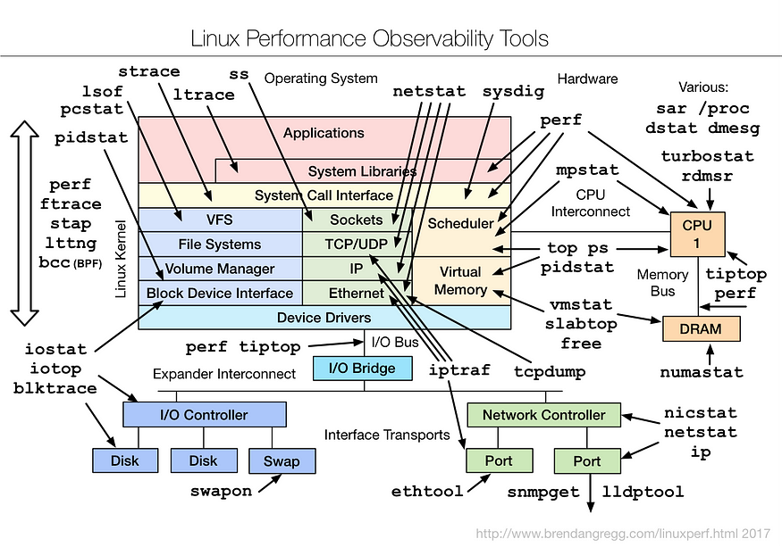

# Linux 性能分析



​		如今有很多 Linux 性能工具，但它们是如何组合在一起的，我们又该在什么时候使用它们呢？在 Velocity 2015 大会上，我做了 90 分钟的 Linux 性能工具教程[Linux performance tools](http://velocityconf.com/devops-web-performance-2015/public/schedule/detail/42513)。我以前曾就这一主题发表过演讲，但在 90 分钟的时间里，我能够将更多方法论、工具和现场演示纳入其中，使其成为我所做过的最完整的主题巡讲。视频和幻灯片如下。

​		在本教程中，我总结了传统和高级性能工具，包括：`top`、`ps`、`vmstat`、`iostat`、`mpstat`、`free`、`strace`、`tcpdump`、`netstat`、`nicstat`、`pidstat`、`swapon`、`lsof`、`sar`、`ss`、`iptraf`、`iotop`、`slaptop`、`pcstat`、`tiptop`、`rdmsr`、`lmbench`、`fio`、`pchar`、`perf_events`、`ftrace`、`SystemTap`、`ktap`、`sysdig` 和 `eBPF`，并参考了更多工具。我还提供了用于可观察性、sar、基准测试和优化的最新工具图（包括上图）。

​		本教程可以作为 Linux 性能工具的免费速成课程，与广大 Linux 系统工作人员分享。希望大家喜欢并觉得有用。下面是[播放列表](https://www.youtube.com/watch?v=FJW8nGV4jxY&list=PLhhdIMVi0o5RNrf8E2dUijvGpqKLB9TCR)。

**原文地址：**[Netflix at Velocity 2015: Linux Performance Tools](https://netflixtechblog.com/netflix-at-velocity-2015-linux-performance-tools-51964ddb81cf)

## perf 

```

```


## 性能分析文章

### 1. 60s Linux 性能分析

​		你登录的 Linux 服务器存在性能问题：在第一分钟，你会检查什么？

​		在 Netflix，我们有一个庞大的 EC2 Linux 云，并有许多性能分析工具来监控和研究其性能。其中包括用于全云监控的 Atlas 和用于按需实例分析的 Vector。虽然这些工具可以帮助我们解决大多数问题，但有时我们也需要登录到实例并运行一些标准的 Linux 性能工具。

#### 前 60 秒：总结
​		在本篇文章中，Netflix 性能工程团队将向您展示如何使用标准的 Linux 工具，在命令行下进行前 60 秒的性能优化调查。通过运行以下十条命令，您可以在 60 秒内对系统资源使用情况和运行进程有一个高层次的了解。查找错误和饱和度指标，因为它们都很容易解释，然后再查找资源利用率。饱和度是指资源的负载超过了它的处理能力，可以通过请求队列的长度或等待时间来体现。

`````
uptime
dmesg | tail
vmstat 1
mpstat -P ALL 1
pidstat 1
iostat -xz 1
free -m
sar -n DEV 1
sar -n TCP,ETCP 1
top
`````

​		其中一些命令需要安装 sysstat 软件包。这些命令所显示的指标将帮助您完成 USE 方法中的一部分：一种定位性能瓶颈的方法。这包括检查所有资源（CPU、内存、磁盘等）的利用率、饱和度和错误指标。还要注意何时检查并排除了某项资源，因为通过排除法可以缩小研究目标，并指导后续调查。

​		下文将总结这些命令，并以生产系统为例进行说明。有关这些工具的更多信息，请参阅其手册。

#### 1. uptime

```shell
$ uptime 
23:51:26 up 21:31, 1 user, load average: 30.02, 26.43, 19.02
```

​		这个工具能够快速查看负载的平均值，负载平均值表示等待运行的任务（进程）数量。在 Linux 系统中，这些数字包括等待在 CPU 上运行的进程，以及被不可中断 I/O（通常是磁盘 I/O）阻塞的进程。这提供了资源负载（或需求）的高层次概念，但如果没有其他工具，就无法正确理解。仅值得快速查看。

​		这三个数字分别是 1 分钟、5 分钟和 15 分钟常数的指数阻尼移动平均值。通过这三个数字，我们可以了解负载随时间的变化情况。例如，如果您被要求检查有问题的服务器，而 1 分钟的值远远低于 15 分钟的值，那么您可能登录得太晚，错过了问题。

​		在上面的示例中，负载平均值显示最近有所上升，1 分钟值达到 30，而 15 分钟值为 19。数字如此之大说明了很多问题：可能是 CPU 需求；`vmstat` 或 `mpstat` 将予以确认，它们是此序列中的第 3 和第 4 号命令。

#### 2. dmesg | tail

```shell
$ dmesg | tail
[1880957.563150] perl invoked oom-killer: gfp_mask=0x280da, order=0, oom_score_adj=0
[...]
[1880957.563400] Out of memory: Kill process 18694 (perl) score 246 or sacrifice child
[1880957.563408] Killed process 18694 (perl) total-vm:1972392kB, anon-rss:1953348kB, file-rss:0kB
[2320864.954447] TCP: Possible SYN flooding on port 7001. Dropping request.  Check SNMP counters.
```

​		如果有的话，可查看最近 10 条系统日志信息，查找可能导致性能问题的错误。上面的例子包括 oom-killer 和 TCP 丢弃请求。

​		不要错过这一步！`dmesg` 总是值得检查的。

#### 3. vmstat 1

```shell
$ vmstat 1
procs ------------memory---------- ----swap--- ----io--- --system-- ------cpu-----
 r  b   swpd   free   buff  cache    si   so    bi    bo   in   cs  us sy id wa st
34  0    0 200889792  73708 591828    0    0     0     5    6   10  96  1  3  0  0
32  0    0 200889920  73708 591860    0    0     0   592 13284 4282 98  1  1  0  0
32  0    0 200890112  73708 591860    0    0     0     0 9501  2154 99  1  0  0  0
32  0    0 200889568  73712 591856    0    0     0    48 11900 2459 99  0  0  0  0
32  0    0 200890208  73712 591860    0    0     0     0 15898 4840 98  1  1  0  0
```

​	`vmstat` 是虚拟内存统计（virtual memory stat）的简称，是一种常用工具（几十年前首次为 BSD 创建）。它每一行都打印了关键服务器统计数据的摘要信息。

​	`vmstat` 运行时参数 1 表示以打印一秒钟的摘要信息。第一行输出（在此版本的 `vmstat` 中）的某些列显示的是启动后的平均值，而不是前一秒的值。除非您想学习并记住哪一列是哪一列，否则请暂时跳过第一行。

**待检查的列：**

* **r:** 在 CPU 上运行并等待轮到的进程数。在确定 CPU 饱和度时，这比负载平均值提供了更好的信号，因为它不包括 I/O。解释：“r” 值大于 CPU 数量即为饱和。
* **free:** 可用内存（千字节）。如果数字多到数不过来，则表示有足够的可用内存。命令 7 中的 "free -m "命令可以更好地解释可用内存的状态。
* **si, so:** 换入和换出。如果这些数据不为零，则表示内存不足。
* **us, sy, id, wa, st:**  这些是所有 CPU 平均 CPU 时间的细分。它们分别是用户时间、系统时间（内核）、空闲时间、等待 I/O 时间和被盗时间（被其他客户机或 Xen 客户机自己的隔离驱动域）。

​		CPU 时间明细表将通过用户时间+系统时间的加总来确认 CPU 是否繁忙。恒定程度的等待 I/O 表明存在磁盘瓶颈；这是 CPU 闲置的原因，因为任务在等待磁盘 I/O 时被阻塞。您可以将等待 I/O 视为 CPU 空闲的另一种形式，它提供了 CPU 空闲原因的线索。

​		系统时间是 I/O 处理所必需的。如果系统时间平均值很高，超过 20%，就值得进一步研究：也许内核处理 I/O 的效率很低。

​		在上述示例中，CPU 使用时间几乎完全是用户级使用时间，而不是应用程序级使用时间。CPU 的平均使用率也远远超过 90%。这不一定是个问题；使用 “r” 列检查饱和程度。

#### 4. mpstat -P ALL 1

```shell
$ mpstat -P ALL 1
Linux 3.13.0-49-generic (titanclusters-xxxxx)  07/14/2015  _x86_64_ (32 CPU)

07:38:49 PM  CPU   %usr  %nice   %sys %iowait   %irq  %soft  %steal  %guest  %gnice  %idle
07:38:50 PM  all  98.47   0.00   0.75    0.00   0.00   0.00    0.00    0.00    0.00   0.78
07:38:50 PM    0  96.04   0.00   2.97    0.00   0.00   0.00    0.00    0.00    0.00   0.99
07:38:50 PM    1  97.00   0.00   1.00    0.00   0.00   0.00    0.00    0.00    0.00   2.00
07:38:50 PM    2  98.00   0.00   1.00    0.00   0.00   0.00    0.00    0.00    0.00   1.00
07:38:50 PM    3  96.97   0.00   0.00    0.00   0.00   0.00    0.00    0.00    0.00   3.03
[...]
```

​		该命令可打印每个 CPU 的 CPU 时间明细，用于检查是否存在不平衡。单个 CPU 繁忙可能是单线程应用程序导致的。

#### 5. pidstat 1

```shell
$ pidstat 1
Linux 3.13.0-49-generic (titanclusters-xxxxx)  07/14/2015    _x86_64_    (32 CPU)

07:41:02 PM   UID       PID    %usr %system  %guest    %CPU   CPU  Command
07:41:03 PM     0         9    0.00    0.94    0.00    0.94     1  rcuos/0
07:41:03 PM     0      4214    5.66    5.66    0.00   11.32    15  mesos-slave
07:41:03 PM     0      4354    0.94    0.94    0.00    1.89     8  java
07:41:03 PM     0      6521 1596.23    1.89    0.00 1598.11    27  java
07:41:03 PM     0      6564 1571.70    7.55    0.00 1579.25    28  java
07:41:03 PM 60004     60154    0.94    4.72    0.00    5.66     9  pidstat

07:41:03 PM   UID       PID    %usr %system  %guest    %CPU   CPU  Command
07:41:04 PM     0      4214    6.00    2.00    0.00    8.00    15  mesos-slave
07:41:04 PM     0      6521 1590.00    1.00    0.00 1591.00    27  java
07:41:04 PM     0      6564 1573.00   10.00    0.00 1583.00    28  java
07:41:04 PM   108      6718    1.00    0.00    0.00    1.00     0  snmp-pass
07:41:04 PM 60004     60154    1.00    4.00    0.00    5.00     9  pidstat
```

​		`pidstat` 有点像 `top` 的每个进程摘要，但它打印的是滚动摘要而不是清屏。这对观察一段时间内的运行模式很有用，还能将看到的情况记录下来（复制粘贴），作为调查记录。

​		上面的示例确定了两个负责消耗 CPU 的 java 进程。%CPU 列是所有 CPU 的总和；1591% 表明该 java 进程消耗了近 16 个 CPU。

#### 6. iostat -xz 1

```shell
$ iostat -xz 1
Linux 3.13.0-49-generic (titanclusters-xxxxx)  07/14/2015  _x86_64_ (32 CPU)

avg-cpu:  %user   %nice %system %iowait  %steal   %idle
          73.96    0.00    3.73    0.03    0.06   22.21

Device:   rrqm/s   wrqm/s     r/s     w/s    rkB/s    wkB/s avgrq-sz avgqu-sz   await r_await w_await  svctm  %util
xvda        0.00     0.23    0.21    0.18     4.52     2.08    34.37     0.00    9.98   13.80    5.42   2.44   0.09
xvdb        0.01     0.00    1.02    8.94   127.97   598.53   145.79     0.00    0.43    1.78    0.28   0.25   0.25
xvdc        0.01     0.00    1.02    8.86   127.79   595.94   146.50     0.00    0.45    1.82    0.30   0.27   0.26
dm-0        0.00     0.00    0.69    2.32    10.47    31.69    28.01     0.01    3.23    0.71    3.98   0.13   0.04
dm-1        0.00     0.00    0.00    0.94     0.01     3.78     8.00     0.33  345.84    0.04  346.81   0.01   0.00
dm-2        0.00     0.00    0.09    0.07     1.35     0.36    22.50     0.00    2.55    0.23    5.62   1.78   0.03
[...]
```

这是分析块设备（磁盘）的工作负载和性能问题的绝佳工具。查找：

* **r/s、w/s、rkB/s、wkB/s：**这些是每秒交付给设备的读取、写入、读取 Kbytes 和写入 Kbytes。使用这些数据进行工作负载鉴定。性能问题可能仅仅是由于负载过大造成的。
* **await：**以毫秒为单位的 I/O 平均时间。这是应用程序遭受损失的时间，因为它包括排队时间和服务时间。平均时间超过预期可能是设备饱和或设备问题的指标。
* **avgqu-sz：**向设备发出的平均请求数。大于 1 的值可能是饱和的证据（尽管设备通常可以并行处理请求，尤其是前置多个后端磁盘的虚拟设备）。
* **%util：**设备利用率。这实际上是一个繁忙百分比，显示设备每秒工作的时间。超过 60% 的值通常会导致性能不佳（应在 await 能够看到），但这取决于设备。接近 100% 的值通常表示饱和。

​		如果存储设备是一个逻辑磁盘设备，面向许多后端磁盘，那么 100% 的利用率可能只是意味着某些 I/O 在 100% 的时间内都在处理，但后端磁盘可能远未饱和，可以处理更多的工作。

​		请记住，磁盘 I/O 性能不佳并不一定是应用程序的问题。通常会使用许多技术来异步执行 I/O，这样应用程序就不会阻塞并直接承受延迟（例如，读取时的超前读取和写入时的缓冲）。

#### 7. free -m

```shell
$ free -m
             total       used       free     shared    buffers     cached
Mem:        245998      24545     221453         83         59        541
-/+ buffers/cache:      23944     222053
Swap:            0          0          0
```

**右边两列表明：**

* **buffers：**缓冲区缓存，用于块设备 I/O。
* **cached：**页面缓存，用于文件系统。

​		我们只想检查这些列的大小是否接近零，否则会导致磁盘 I/O 增加（使用 iostat 确认），性能下降。上面的例子看起来很好，每个文件都有很多 MB。

​		”-/+ buffers/cache“ 为已用内存和空闲内存提供了不太容易混淆的数值。Linux 将空闲内存用于缓存，但如果应用程序需要，可以快速回收。因此，在某种程度上，缓存内存应该包含在可用内存列中，而这一行就是这样做的。甚至有一个网站 [linuxatemyram](https://www.linuxatemyram.com/) 也在讨论这种混淆。

​		如果使用 Linux 上的 ZFS（我们在某些服务中就是这么做的），这可能会造成额外的混乱，因为 ZFS 有自己的文件系统缓存，而 `free -m` 列并不能正确反映这一点。这可能会导致系统可用内存不足，而实际上这些内存可以在需要时从 ZFS 缓存中使用。

#### 8. sar -n DEV 1

```shell
$ sar -n DEV 1
Linux 3.13.0-49-generic (titanclusters-xxxxx)  07/14/2015     _x86_64_    (32 CPU)

12:16:48 AM     IFACE   rxpck/s   txpck/s    rxkB/s    txkB/s   rxcmp/s   txcmp/s  rxmcst/s   %ifutil
12:16:49 AM      eth0  18763.00   5032.00  20686.42    478.30      0.00      0.00      0.00      0.00
12:16:49 AM        lo     14.00     14.00      1.36      1.36      0.00      0.00      0.00      0.00
12:16:49 AM   docker0      0.00      0.00      0.00      0.00      0.00      0.00      0.00      0.00

12:16:49 AM     IFACE   rxpck/s   txpck/s    rxkB/s    txkB/s   rxcmp/s   txcmp/s  rxmcst/s   %ifutil
12:16:50 AM      eth0  19763.00   5101.00  21999.10    482.56      0.00      0.00      0.00      0.00
12:16:50 AM        lo     20.00     20.00      3.25      3.25      0.00      0.00      0.00      0.00
12:16:50 AM   docker0      0.00      0.00      0.00      0.00      0.00      0.00      0.00      0.00
```

​		使用此工具可检查网络接口吞吐量：rxkB/s 和 txkB/s，作为工作量的衡量标准，还可检查是否已达到任何限制。在上例中，eth0 的接收速度达到 22 Mbytes/s，即 176 Mbits/sec（远低于 1 Gbit/sec 的限制）。

​		该版本还有设备利用率 %ifutil（全双工双向最大利用率），我们也可以使用 Brendan 的 [nicstat tool](https://github.com/scotte/nicstat) 来测量。和 nicstat 一样，这个功能也很难正确使用，而且在本例中似乎不起作用（0.00）。

#### 9. sar -n TCP,ETCP 1

```shell
$ sar -n TCP,ETCP 1
Linux 3.13.0-49-generic (titanclusters-xxxxx)  07/14/2015    _x86_64_    (32 CPU)

12:17:19 AM  active/s passive/s    iseg/s    oseg/s
12:17:20 AM      1.00      0.00  10233.00  18846.00

12:17:19 AM  atmptf/s  estres/s retrans/s isegerr/s   orsts/s
12:17:20 AM      0.00      0.00      0.00      0.00      0.00

12:17:20 AM  active/s passive/s    iseg/s    oseg/s
12:17:21 AM      1.00      0.00   8359.00   6039.00

12:17:20 AM  atmptf/s  estres/s retrans/s isegerr/s   orsts/s
12:17:21 AM      0.00      0.00      0.00      0.00      0.00
```

**这是一些关键 TCP 指标的汇总视图。其中包括：**

* **active/s:**  每秒本地启动的 TCP 连接数（例如，通过 connect() 连接）。
* **passive/s:** 每秒远程启动的 TCP 连接数（如通过 accept()）。
* **retrans/s:** 重传次数： 每秒 TCP 重传次数。

​		active 和 passive 计数通常可用于粗略衡量服务器负载：新接受连接数（passive）和下游连接数（active）。将主动连接视为出站连接，将被动连接视为入站连接可能会有帮助，但严格来说并非如此（例如，考虑一下本地主机到本地主机的连接）。

​		重传是网络或服务器出现问题的信号；可能是网络不可靠（如公共互联网），也可能是服务器负载过重而丢弃数据包。上例显示每秒只有一个新的 TCP 连接。

#### 10. top

```shell
$ top
top - 00:15:40 up 21:56,  1 user,  load average: 31.09, 29.87, 29.92
Tasks: 871 total,   1 running, 868 sleeping,   0 stopped,   2 zombie
%Cpu(s): 96.8 us,  0.4 sy,  0.0 ni,  2.7 id,  0.1 wa,  0.0 hi,  0.0 si,  0.0 st
KiB Mem:  25190241+total, 24921688 used, 22698073+free,    60448 buffers
KiB Swap:        0 total,        0 used,        0 free.   554208 cached Mem

   PID USER      PR  NI    VIRT    RES    SHR S  %CPU %MEM     TIME+ COMMAND
 20248 root      20   0  0.227t 0.012t  18748 S  3090  5.2  29812:58 java
  4213 root      20   0 2722544  64640  44232 S  23.5  0.0 233:35.37 mesos-slave
 66128 titancl+  20   0   24344   2332   1172 R   1.0  0.0   0:00.07 top
  5235 root      20   0 38.227g 547004  49996 S   0.7  0.2   2:02.74 java
  4299 root      20   0 20.015g 2.682g  16836 S   0.3  1.1  33:14.42 java
     1 root      20   0   33620   2920   1496 S   0.0  0.0   0:03.82 init
     2 root      20   0       0      0      0 S   0.0  0.0   0:00.02 kthreadd
     3 root      20   0       0      0      0 S   0.0  0.0   0:05.35 ksoftirqd/0
     5 root       0 -20       0      0      0 S   0.0  0.0   0:00.00 kworker/0:0H
     6 root      20   0       0      0      0 S   0.0  0.0   0:06.94 kworker/u256:0
     8 root      20   0       0      0      0 S   0.0  0.0   2:38.05 rcu_sched
```

​		`top` 命令包括我们之前检查过的许多指标。运行该命令可以很方便地查看是否有任何内容与之前的命令大相径庭，这将表明负载是可变的。

​		`top` 的一个缺点是很难看到随时间变化的模式，而 `vmstat` 和 `pidstat` 等提供滚动输出的工具可能更清楚。如果没有足够快地暂停输出（Ctrl-S 暂停，Ctrl-Q 继续），屏幕就会清空，间歇性问题的证据也可能丢失。

#### Follow-on Analysis

​		你还可以应用更多命令和方法来深入研究。请参阅布兰登在 Velocity 2015上的 Linux 性能工具教程 [Linux Performance Tools tutorial](https://medium.com/@Netflix_Techblog/netflix-at-velocity-2015-linux-performance-tools-51964ddb81cf)，其中介绍了40多种命令，涵盖可观察性、基准测试、调优、静态性能调优、剖析和跟踪。


**原文地址：**[Linux Performance Analysis in 60,000 Milliseconds](https://netflixtechblog.com/linux-performance-analysis-in-60-000-milliseconds-accc10403c55)