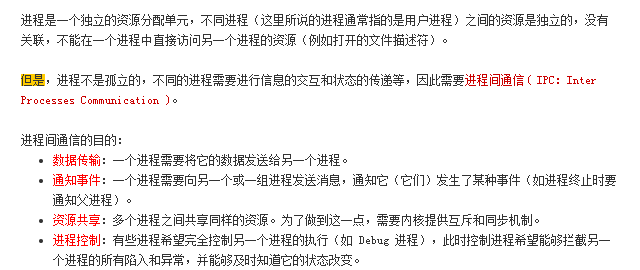
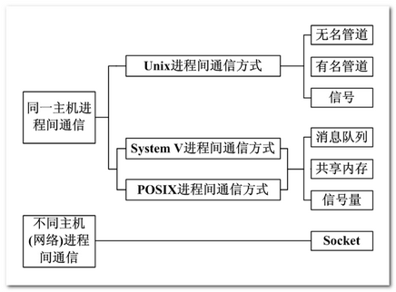

# Linux

## IO

### BIO


### AIO

### NIO

BIO : 一次连接一个线程

NIO: 一次请求一个线程

AIO : 一次有效请求一个线程

### MMAP

mmap只适合读多写少的场景，写频率过高会导致大量脏页落回硬盘，io**剧增系统卡顿**

## 进程

### 创建进程

#### fork()

```
#include <sys/types.h>
#include <unistd.h>
pid_t fork(void);
```

​    fork函数调用一次返回两次，函数调用成功后，当前进程分裂为两个进程，一个原来的父进程，一个新创建的子进程。fork函数有两个返回值，在父进程返回子进程ID，在子进程返回0。fork函数返回两次的前提是进程创建成功，如果进程创建失败，则只返回-1。

​    创建成功之后，子进程和父进程的执行顺序往往是不确定的，这取决于内核所使用的调度算法。创建失败的原因通常是父进程拥有的子进程的个数超过了规定的限制，此时errno为EAGAIN。如果可供使用的内存不足也会导致进程创建失败，此时errno值为ENOMEM。

​     子进程会继承父进程的属性有：用户ID、组ID、当前工作目录、根目录、打开的文件、创建时使用的屏蔽字、信号屏蔽字、上下文环境、共享的存储段、资源限制等。子进程与父进程不同的属性主要有：    

```
1.子进程有自己唯一的ID；    
2. fork的返回值不同，在父进程中返回子进程ID，在子进程中返回0；
3. 不同的父进程ID。子进程的父进程ID为创建它的父进程ID；
4. 子进程共享父进程打开的文件描述符，但父进程对文件描述符的改变不会影响子进程中的文件描述符;
5. 子进程不继承父进程设置的文件锁；
6. 子进程不继承父进程设置的警告。
7. 子进程的未决信号集被清空。（执行信号的处理动作称为信号递达（Delivery），信号从产生到递达之间的状态，称为信号未决（Pending））
```

#### vfork()

​    vfork与fork相比：

```
1. vfork与fork一样都是调用一次成功返回两次；
2. 使用fork创建一个子进程时，子进程只是完全复制父进程的资源。这样得到的子进程独立与父进程，具有良好的并发性。而使用vfork创建的进程共享父进程的地址空间，也就是所子进程对改地址空间中任何数据的修改同样为父进程可见。
3. 使用fork创建一个子进程时，哪个进程先运行取决于系统调度算法，**而vfork创建一个进程时，vfork保证子进程先执行并且子进程执行时处于不可中断状态，而父进程处于阻塞状态。当它调用exec或exit之后，父进程才能被调度运行。如果在调用exec或exit之前子进程要依赖父进程的某个行为，就会导致死锁。
```

​    **Linux还专门对fork作了优化：通常fork会将调用进程的所有内容原封不动的拷贝到新产生的子进程中去，这些拷贝的动作很消耗时 间，而如果fork完之后我们马上就调用exec，那这些辛辛苦苦拷贝来的东西就会被立刻抹掉，这看起来非常不划算，于是人们设计了一种"写时复制（copy-on-write） " 技术，使得fork结束后并不立刻复制父进程的内容到子进程，而是到了真正使用时才复制。**

  **使用vfork+exec时，exec函数会帮助我们创建新进程的内存布局**

  注意：使用vfork是要谨慎，尽量不要允许子进程修改与父进程共享的全局变量和局部变量。

### 孤儿进程和僵尸进程

  #### 孤儿进程

如果一个父进程先于子进程结束，子进程就会成为一个孤儿进程，它由init/systemd进程(现在系统有所更新，一号进程有的已经不再init进程而是systemd进程)收养，成为init进程的子进程。

 #### 僵尸进程

 如果一个子进程咸鱼父进程终止，而父进程又没有调用wait函数等待子进程结束，子进程会进入僵死状态，即变为一个僵尸进程，并且会一直保持下去除非系统重启。子进程处于僵死状态时，内核只保存该进程的一些必要信息以备父进程所需。此时进程程始终占用资源，同时也减少了系统可以创建的最大进程数。

### 守护进程

​    守护进程是指在后台运行的、没有控制终端与之相连的进程。它独立于控制终端，通常周期性的执行某种任务。

​    守护进程的启动方式有多种：它可以在Linux启动时从启动脚本/etc/rc.d中启动；可以由作业规划进程crond启动，还可以由户从终端（通常是shell）执行。

​     编写守护进程程序的要点：

```
1. 让进程在后台执行，方法是调用fork产生一个子进程，然后使得父进程退出。
2. 调用setsid创建一个新对话期。控制终端，登录会话和进程组通常都是从父进程继承下来的，守护进程要摆脱们，      不受它们影响，其方法是调用setsid使进程成为一个会话组长。
3. 禁止进程重新打开控制终端，经过以上步骤，进程已经成为一个无终端的会话组长，但是它可以重新申请打开一个终端。为了避免这种事情发生，可以通过使进程不再是会话组长来实现。再一次fork创建新的子进程，使调用fork的进程退 出。
4. 关闭不再需要的文件描述符。创建的子进程从父进程继承打开的文件描述符。如不关闭，将会浪费系统资源，造成进程所在的文件系统无法卸下，以及引起无法预料的错误。先得到文件描述符的值，然后再用一个循环程序，关闭0到最高文件描述符值得所有文件描述符。
5.将当前目录更改为根目录。当守护进程当前工作目录在一个装配文件系统中时，该文件系统不能被拆卸。一般将工作目录改为根目录。  
6. 将文件创建时的使用的屏蔽字设为0。进程从创建它的父进程哪里继承的文件创建屏蔽字可能会拒绝某些许可权。为防止这一点，使用unmask(0)将屏蔽字清零。
```

​      对于deamon程序，读者如果有更高的要求，可以查看man手册（man 7 deamon）。

### 进程退出

​    进程退出表示进程即将结束运行。在Linux进程退出的方法有五种，其中三种正常退出，两种异常退出：

```
(1) 正常退出：
a. 在main函数中执行return  
b. 调用exit 函数 
c. 调用_exit 函数    
```

   ```
(2) 异常退出
a. 调用abort函数
b. 进程收到某个信号，而该信号使程序终止  
   ```

​    不管哪种退出方式，都会调用内核中的同一种代码，这段代码用来关闭进程所有已打开的文件描述符，释放它所占用的内存和其他资源。

```
（3）各种退出方式的比较：
​exit和return的区别：
	exit是一个函数，有参数；而return是函数执行完后的返回。exit把控制权交给系统，而return把控制权交给调用函数。
​ exit和abort的区别：
	exit是正常终止，而abort是异常终止。
​ exit(int exit_code)：
	exit中的参数exit_code为0代表异常终止，若为其他值表示程序执行过程中有错误发生。
​ exit()和_exit() : 
	exit在头文件stdlib.h中声明，而_exit()声明在unistd.h中，两个函数均能正常终止进程，但是_exit()执行完成后会立即返回给内核，而exit()要执行一些清除操作，然后将控制权交给内核。
```

### 等待进程结束

```
#include <sys/types.h>
#include <sys/wait.h>
pid_t wait(int *statloc);
pid_t waitpid(pid_t pid, int *statloc, int options);
```

​    wait函数时父进程暂停执行，知道它的一个子进程结束为止。该函数的返回值是终止运行的进程的PID。参数statloc所指向的变量存放子进程的退出码，即从子进程的main函数返回的值或子进程中exit函数的参数。如果statloc不是一个空指针，则状态信息被写入它指向的变量。**如果一个没有任何子进程的进程调用wait函数，会立即出错返回。**

​    wait_pid也用来等待子进程结束，但他用来等待某个特定进程。参数statloc与wait函数中含义一样，参数option允许用户改变waitpid的行为，**若将此参数设为WNOHANG，则使父进程不被挂起而立即返回并执行其后的代码**，参数pid含义如下所示：

| 取值     | 意义                                     |
| -------- | ---------------------------------------- |
| pid > 0  | 等待其进程ID等于pid的进程退出            |
| pid = 0  | 等待其组ID等于调用进程的组ID的任一子进程 |
| pid < -1 | 等待其组ID等于pid绝对值的任一子进程      |
| pid = -1 | 等待任一子进程                           |

  想让父进程周期性检查某个特定的子进程是否退出，可如下操作：

```
waitpid(child_pid, (int *)0, WNOHANG);
```

 如果子进程尚未退出返回0， 子进程已经结束，返回子进程ID，调用失败返回-1。

以下宏定义让我们更好的了解进程退出状态。

| 宏定义                | 说 明                                                        |
| --------------------- | ------------------------------------------------------------ |
| WIFEXITED(stat_val)   | 若子进程是正常退出，该宏返回一个非零值，表示真，异常结束，返回零，表示假 |
| WEXITSTATUS(stat_val) | 若WIFEXITED返回值非零，它返回子进程中exit或_exit参数的低八位 |
| WIFSIGNALED(stat_val) | 若子进程异常终止，它就取得一个非零值，表示真                 |
| WTETMSIG(stat_val)    | 若WIFSIGNALED的值非零，该宏返回使子进程异常终止的信号编号    |
| WIFSTOPPED(stat_val)  | 若子进程暂停，它取得一个非零值，表示真                       |
| WSTOPSIG(stat_val)    | 若WIFSTOPPED非零，它返回使子进程暂停的信号编号               |

**7. 改变进程优先级**

​     在此之前最好先了解一下进程优先级和nice值的关系，可以查看笔记**《**进程优先级和进程nice值**》**

​    Linux中可以通过nice系统调用来改变进程优先级。可以通过终端 man 2 nice查看相关信息。

```
#include <unistd.h>
int nice(int increment);
```

首先我们先了解两个函数：getpriority和setpriority，他们声明如下：

```c
#include <sys/resource.h>
int getpriority(int which, int who);
int setpriority(int which, int who, int prio);
```

**getpriority函数：**返回一组进程的优先级，如果一组进程的优先级不同时，返回其中优先级最低的一个。出错返回-1。

​    参数which和who组合确定返回哪一组进程的优先级。which的可能取值以及who的意义如下：

​    PRIO_PROCESS : 一个特定的进程，此时who的取值为进程ID。

​    PRIO_PGRP : 一个进程组的所有进程，此时who的取值为进程组ID

​    PRIO_USER : 一个用户拥有的所有进程，此时参数who取值为实际用户ID。

**setpriority函数**：该函数用来设置指定进程的优先级。进程指定的方法与getpriority函数相同。调用成功返回指定进程优先级，失    败返回-1。

**nice系统调用是以上两种函数的组合，其等价于：**

```c
int nice(int increment)
{
    int oldpro = getpriority(PRIO_PROCESS, getpid());
    return setpriority(PRIO_PROCESS, getpid(), oldpro + increment);
}
```

### 执行新程序

​    exec() family用于执行一个可执行程序以代替当前进程的执行映像，exec调用并没有产生新进程，一个进程一旦调用exec函数，他本身就“死亡了”， 系统把代码段换成新的程序的代码，废弃原有的数据段和堆栈段，并为新程序分配新的数据段与堆栈段。

  execve是exec函数族中唯一一个系统调用，其他函数都是调用execve实现。

```c
 int execve(const char *filename, char *const argv[], char *const envp[]);
```

   ```
execve() executes the program pointed to by filename. filename must be either a binary executable, or a script starting with a line of the form:

​    #! interpreter [optional-arg]**
	For details of the latter case, see "Interpreter scripts" below. argv is an array of argument strings passed to the new program. By convention, the first of these strings should contain the filename associated with the file being executed. envp is an array of strings, conventionally of the form key=value, which are passed as environment to the new program. Both argv and envp must be terminated by a NULL pointer. The argument vector and environment can be accessed by the called program's main function, when it is defined as:
​ int main(int argc, char *argv[], char *envp[])
execve() does not return on success, and the text, data, bss, and stack of the calling process are overwritten by that of the program loaded.If the current program is being ptraced, a SIGTRAP is sent to it after a successful execve().
   ```

```c
 int execl(const char *path, const char *arg, ...);
 int execlp(const char *file, const char *arg, ...);
 int execle(const char *path, const char *arg, ..., char * const envp[]);

 int execv(const char *path, char *const argv[]);
 int execvp(const char *file, char *const argv[]);
 int execvpe(const char *file, char *const argv[], char *const envp[]);
```

事实上，无论哪个exec函数，都是将可执行程序的路径、命令行参数和环境变量3个参数传递给可执行程序的main函数。

main函数的完整形式应该是：

```
int main(int argc, char *argv[], char **envp);
```

 通过打印main函数的参数envp，同样可以得到环境变量。  

 执行一个新程序之后的进程保持原来进程ID，父进程ID、实际用户ID和实际组ID之外，还有：

```
a. 当前工作目录  
b. 根目录  
c. 创建文件使用的屏蔽字。 
d. 未决警告  
e. 和进程有关的使用处理器的时间
f. 控制终端       
e. 文件锁
```

### 进程间通信



 

#### 管道(pipe)

​    管道是一种半双工的通信方式，数据只能单向流动，而且只能在具有亲缘关系的进程间使用。进程的亲缘关通常指的是父子进程关系或兄弟关系。进程向管道读写数据是通过创建管道时，系统设置的文件描述符进行的。因此对于管道两端的进程来说，管道是一个特殊文件，存在于内存。在创建管道时，系统为管道分配一个页面作为数据缓冲区，进行管道通信的两个进程通过读写这个缓冲区来进行通信。


#### 有名管道(named pipe)

​    有名管道也是半双工的通信方式，但是它允许无亲缘关系进程间的通信。FIFO不同于管道之处在于它提供一个路径名与之关联，以FIFO的文件形式存储于文件系统中。有名管道是一个设备文件，因此即使进程与创建FIFO的进程无亲缘关系，只要可以访问该路径，就可以通过FIFO相互通信。值得注意的是：FIFO总是按照先进先出的原则工作。

#### 信号量(semophore)

​    信号量是一个计数器，常用于处理进程或线程的同步问题， 特别是对临界资源访问的同步。临界资源可以简单的理解为在某一时刻只能由一个进程或线程进行操作的资源。这里的资源可以时一段代码、一个变量或某种硬件资源。信号量的值大于或等于0时表示可供并发进程使用的资源实体数；小于0代表正在等待使用临界资源的进程数。

​    信号量常用来作为一种锁机制，防止某进程正在访问共享资源时，其他进程也访问该资源。因此主要作为进程间以及同一进程内不同线程间的同步手段。

​    与消息队列类似，Linux内核也为每个信号集维护了一个semid_ds数据结构实例。该结构在linux/sem.h中，各字段含义如下：

```
struct semid_ds
{
        struct ipc_perm  sem_perm;               /* 对信号进行操作的许可权 */
        __kernel_time_t  sem_otime;              /* 对信号操作的最后时间 */
        __kernel_time_t  sem_ctime;              /* 对信号进行修改的最后时间 */
        struct sem       *sem_base;              /* 指向数组中的第一个信号 */
        struct sem_queue *sem_pending;          /* 等待处理的挂起操作 */
        struct sem_queue **sem_pending_last;    /* 最后一个正在挂起的操作 */
        struct sem_undo  *undo;                  /* 撤销的请求 */
        unsigned short   sem_nsems;              /* 数组中的信号数 */
};
```

**信号量的使用**

```
int semop(int semid, struct sembuf *sops, unsigned nsops);
```

   第一个参数表示信号集的标识符，第二个参数sops指向进行操作的结构体数组首地址；

 第三个参数nsops指出将要进行操作的信号的个数。

   函数调用成功返回0，失败返回-1。                                             

   第二个参数sops指向的结构体数组中，每个sembuf结构体对应一个特定信号的操作。因

 此对信号进行操作必须熟悉该数据结构，该结构体定义在linux/sem.h中。

```
struct sembuf
{
    unsigned short sem_num;  //信号在信号集中的索引
    short          sem_op;  //操作类型
    short          sem_flg;  //操作标志
};      
```

**sem_op取值：**

| sem_op>0 | 信号加上sem_op的值，表示进程释放控制的资源                   |
| -------- | ------------------------------------------------------------ |
| sem_op=0 | 如果没有设置IPC_NOWAIT，则调用进程进入睡眠状态，直到信号值为0；否则进程不会睡眠，直接返回EAGAIN。 |
| sem_op<0 | 信号加上sem_op的值，若没有设置IPC_NOWAIT，则调用进程阻塞，直到资源可用；否则进程直接返回EAGAIN。 |

**sem_flg取值：**

   IPC_NOWAIT:

   SEM_UNDO:

#### 消息队列(message queue)

​    消息队列是消息的链表，存放在内核中并由消息队列标识符标识。消息队列克服了信号传递信息量少、管道只能承载无格式字节流以及缓冲区大小受限等缺点。与管道不同的是，消息队列存放在内核中，只有在内核重启（即操作系统重启）或者显示地删除一个消息队列时，该息队列才会被真正的删除。想要掌握消息队列，必须熟悉一些特定的数据结构：
​    **a.** linux系统定义了一个消息模板数据结构msgbuf：

```
#include <linux/msg.h>
struct msgbuf 
{
    long mtype;    //表示消息类型，可以使消息在一个队列中重复使用。
    char mtext[1]; //消息内容
};
```

​    注意：mtext字段虽然定义为char类型，但并不代表消息只能是一个字符，消息内容可以为任意类型，由用户根据需要定义。如下就是用户自定的一个消息结构：

```
struct myMsgbuf
{
    long mtype;
    struct student stu;
};
```

​    消息队列中，消息的大小是受限制的，由<linux/msg.h>中的宏MSGMAX给出消息的最大长度，在实际应用中需要注意。

​    **b.** 在Linux内核中，每个消息队列都维护了一个结构体msqid_ds，定义在<linux/msg.h>中，此结构体保存消息队列当前的状态信息。

```
#include <linux/msg.h>
struct msqid_ds
{
     struct ipc_perm   msg_perm;         //是一个ipc_perm结构，保存消息队列的存取权限等，详情看下面
     struct _msg       *msg_first;      //队列的第一条消息
     struct _msg       *sg_last;        //队列最后一条消息
    __kernel_t time_t  msg_stime;       //向消息队列发送最后一条消息的时间
    __kernel_t time_t  msg_rtime;       //从消息队列取第一条消息的时间
    __kernel_t time_t  msg_ctime;       //最后一次变更消息队列的时间
    unsigned long      msg_lcbytes;     
    unsigned long      msg_lqbytes;
    unsigned short     msg_cbytes;      //消息队列中所有消息占的字节数
    unsigned short     msg_qnum;        //消息队列中消息的数目
    unsigned short     msg_qbytes;      //消息队列的最大字节数
    __Kernel_ipc_pid_t msg_lspid;       //向消息队列发送最后一条消息的进程ID
    __kernel_ipc_pid_t msg_lrpid;       //从消息队列读取最后一条消息的进程ID
};
```

​    **c.** ipc_perm内核数据结构

```
#include <linux/ipc.h>
struct ipc_perm
{
    __kernel_key_t  key;    //创建消息队列用到的key值
    __kernel_uid_t  uid;    //消息队列的用户ID
    __kernel_gid_t  gid;    //消息队列的组ID
    __kernel_uid_t  cuid;   //创建消息队列的进程用户ID
    __kernel_gid_t  cgid;   //创建消息队列的进程组ID
    __kernel_mode_t mode;
    unsigned_short  seq;
};
```

#### 信号（signal）

​    信号是一种比较复杂的通信方式，用于通知接收进程某个时间已经发生。是一种进程间异步通信方式。

#### 共享内存（shared memory）

​    共享内存就是映射一段能被其他进程所访问的内存，这段内存有一个进程创建但是多个进程都可以访问。共享内存是最快的IPC方式，它是针对其他进程间通信方式运行效率低而专门设计的。他往往与其他通信机制，如信号量，配合使用，来实现进程间同步和异步。

​    与消息队列类似，Linux内核也为每个共享内存段维护了一个shmid_ds内部数据结构，该结构在linux/sem.h中，各字段含义如下：

```
struct shmid_ds {
        struct ipc_perm         shm_perm;       /* operation perms */
        int                     shm_segsz;      /* size of segment (bytes) */
        __kernel_time_t         shm_atime;      /* last attach time */
        __kernel_time_t         shm_dtime;      /* last detach time */
        __kernel_time_t         shm_ctime;      /* last change time */
        __kernel_ipc_pid_t      shm_cpid;       /* pid of creator */
        __kernel_ipc_pid_t      shm_lpid;       /* pid of last operator */
        unsigned short          shm_nattch;     /* no. of current attaches */
        unsigned short          shm_unused;     /* compatibility */
        void                    *shm_unused2;   /* ditto - used by DIPC */
        void                    *shm_unused3;   /* unused */
};
```

#### 套接字（socket）

套接字也是一种进程间通信机制，与其他不同的是，它可以用于不同机器间的进程通信（网络socket）。

UNIX Domain Socket是在socket架构上发展起来的用于同一台主机的进程间通讯（IPC），它不需要经过网络协议栈，不需要打包拆包、计算校验和、维护序号和应答等，只是将应用层数据从一个进程拷贝到另一个进程。UNIX Domain Socket有SOCK_DGRAM或SOCK_STREAM两种工作模式，类似于UDP和TCP，但是面向消息的UNIX Domain Socket也是可靠的，消息既不会丢失也不会顺序错乱。

UNIX Domain Socket可用于两个没有亲缘关系的进程，是全双工的，是目前使用最广泛的IPC机制，比如X Window服务器和GUI程序之间就是通过UNIX Domain Socket通讯的。

UNIX Domain socket与网络socket类似，可以与网络socket对比应用。

上述二者编程的不同如下：

> * address family为AF_UNIX
> * 因为应用于IPC，所以UNIXDomain socket不需要IP和端口，取而代之的是文件路径来表示“网络地址”。这点体现在下面两个方面。
> * 地址格式不同，UNIXDomain socket用结构体sockaddr_un表示，是一个socket类型的文件在文件系统中的路径，这个socket文件由bind()调用创建，如果调用bind()时该文件已存在，则bind()错误返回。
> * UNIX Domain Socket客户端一般要显式调用bind函数，而不像网络socket一样依赖系统自动分配的地址。客户端bind的socket文件名可以包含客户端的pid，这样服务器就可以区分不同的客户端。

UNIX Domain socket的工作流程简述如下（与网络socket相同）。

> * 服务器端：创建socket—绑定文件（端口）—监听—接受客户端连接—接收/发送数据—…—关闭
> * 客户端：创建socket—绑定文件（端口）—连接—发送/接收数据—…—关闭

#### 优缺点

> * 1. 管道的缺点：管道没有名字，管道的缓冲区大小受限，管道所传送的是无格式的字节流，这就要求管道的输入方和输出方事先约定好数据格式。

## 线程


### 线程同步

#### 互斥量

#### 读写锁

#### 条件变量

#### 自旋锁

##### 屏障

##### CAS（Compare And Swap）

https://blog.csdn.net/qq_35571554/article/details/82892806https://blog.csdn.net/qq_35571554/article/details/82906091​https://www.ibm.com/developerworks/cn/linux/l-cn-lockfree/​https://www.cnblogs.com/gaochundong/p/lock_free_programming.html​

https://blog.csdn.net/caisongcheng_good/article/details/79916873

**缺点**

**1.CPU开销较大**

在并发量比较高的情况下，如果许多线程反复尝试更新某一个变量，却又一直更新不成功，循环往复，会给CPU带来很大的压力。

**2.不能保证代码块的原子性**

CAS机制所保证的只是一个变量的原子性操作，而不能保证整个代码块的原子性。比如需要保证3个变量共同进行原子性的更新，就不得不使用Synchronized了。因为它本身就只是一个锁住总线的原子交换操作啊。两个CAS操作之间并不能保证没有重入现象。

**3.ABA问题**

这是CAS机制最大的问题所在。

#### 锁优化

https://www.ibm.com/developerworks/cn/java/java-lo-concurrenthashmap/https://www.cnblogs.com/Mainz/p/3546347.html​​

> * 1. 