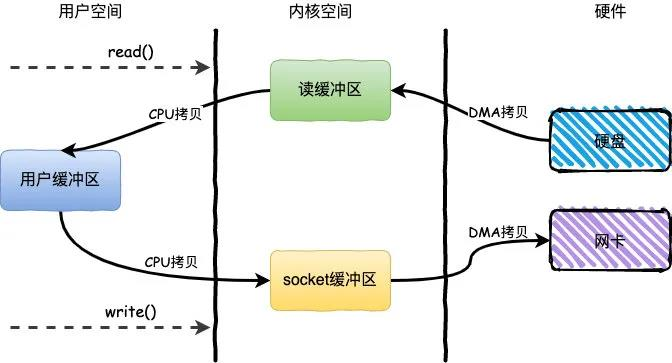
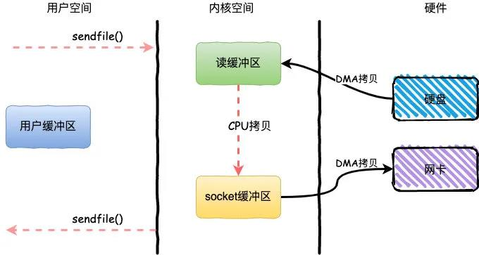
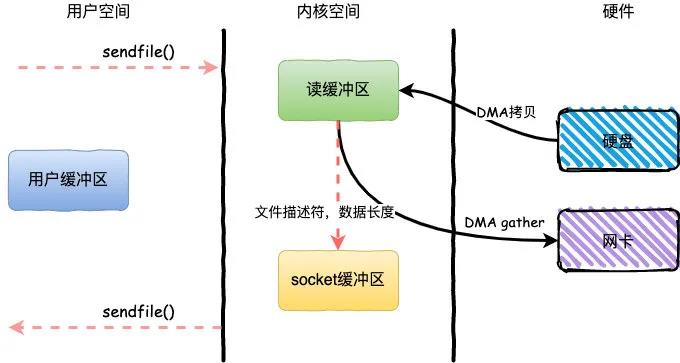
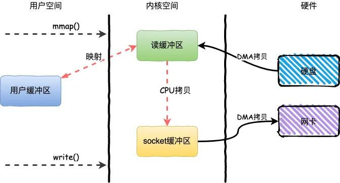

# Linux

## 文件系统


## IO

基于传统的IO方式，底层实际上通过调用`read()`和`write()`来实现。

通过`read()`把数据从硬盘读取到内核缓冲区，再复制到用户缓冲区；然后再通过`write()`写入到`socket缓冲区`，最后写入网卡设备。



整个过程发生了**4次用户态和内核态的上下文切换**和**4次拷贝**，具体流程如下：

1. 用户进程通过`read()`方法向操作系统发起调用，此时上下文从用户态转向内核态
2. DMA控制器把数据从硬盘中拷贝到读缓冲区
3. CPU把读缓冲区数据拷贝到应用缓冲区，上下文从内核态转为用户态，`read()`返回
4. 用户进程通过`write()`方法发起调用，上下文从用户态转为内核态
5. CPU将应用缓冲区中数据拷贝到socket缓冲区
6. DMA控制器把数据从socket缓冲区拷贝到网卡，上下文从内核态切换回用户态，`write()`返回

```c
// stat.h
#define S_IFMT 00170000
#define S_IFSOCK 0140000
#define S_IFLNK 0120000
#define S_IFREG 0100000
#define S_IFBLK 0060000
#define S_IFDIR 0040000
#define S_IFCHR 0020000
#define S_IFIFO 0010000
#define S_ISUID 0004000
#define S_ISGID 0002000
#define S_ISVTX 0001000

#define S_ISLNK(m) (((m) & S_IFMT) == S_IFLNK)
#define S_ISREG(m) (((m) & S_IFMT) == S_IFREG)
#define S_ISDIR(m) (((m) & S_IFMT) == S_IFDIR)
#define S_ISCHR(m) (((m) & S_IFMT) == S_IFCHR)
#define S_ISBLK(m) (((m) & S_IFMT) == S_IFBLK)
#define S_ISFIFO(m) (((m) & S_IFMT) == S_IFIFO)
#define S_ISSOCK(m) (((m) & S_IFMT) == S_IFSOCK)

#define S_IRWXU 00700
#define S_IRUSR 00400
#define S_IWUSR 00200
#define S_IXUSR 00100

#define S_IRWXG 00070
#define S_IRGRP 00040
#define S_IWGRP 00020
#define S_IXGRP 00010

#define S_IRWXO 00007
#define S_IROTH 00004
#define S_IWOTH 00002
#define S_IXOTH 00001

#endif

#ifdef __KERNEL__
#define S_IRWXUGO (S_IRWXU|S_IRWXG|S_IRWXO)
#define S_IALLUGO (S_ISUID|S_ISGID|S_ISVTX|S_IRWXUGO)
#define S_IRUGO (S_IRUSR|S_IRGRP|S_IROTH)
#define S_IWUGO (S_IWUSR|S_IWGRP|S_IWOTH)
#define S_IXUGO (S_IXUSR|S_IXGRP|S_IXOTH)
```


### BIO（同步阻塞IO）

### NIO（同步非阻塞IO）

### AIO（异步非阻塞IO）

BIO : 一次连接一个线程

NIO: 一次请求一个线程

AIO : 一次有效请求一个线程

### IO复用

#### select

> * 跨平台（windows、linux都支持）
> * 每次都要从用户空间拷贝到内核空间
> * 遍历整个fd_set，O(n)
> * 最大可监听的fd数量不能超过FD_SETSIZE

#### poll

> * 基本类似于select，无FD_SETSIZE限制

#### epoll

> * 不支持windows
> * 内核态，红黑树
> * 共享内存交互，mmap
> * 不需要全部复制，返回双向链表
> * LT（level triggered）事件没有处理，一直通知epoll_wait
> * ET（edge_triggered）只通知一次，每当状态变化时，触发一个事件

**LT水平触发**


------


------

水平触发的主要特点是，如果用户在监听epoll事件，当内核有事件的时候，会拷贝给用户态事件，但是如果用户只处理了一次，那么剩下没有处理的会在下一次epoll_wait再次返回该事件。

这样如果用户永远不处理这个事件，就导致每次都会有该事件从内核到用户的拷贝，耗费性能，但是水平触发相对安全，最起码事件不会丢掉，除非用户处理完毕。

**ET边缘触发**


------


边缘触发，相对跟水平触发相反，当内核有事件到达， 只会通知用户一次，至于用户处理还是不处理，以后将不会再通知。这样减少了拷贝过程，增加了性能，但是相对来说，如果用户马虎忘记处理，将会产生事件丢的情况。

```c
/**
 * @param size 告诉内核监听的数目
 * @returns 返回一个epoll句柄（即一个文件描述符）
 */
int epoll_create(int size);

/**
 * @param epfd 用epoll_create所创建的epoll句柄
 * @param op 表示对epoll监控描述符控制的动作
 *
 * EPOLL_CTL_ADD(注册新的fd到epfd)
 * EPOLL_CTL_MOD(修改已经注册的fd的监听事件)
 * EPOLL_CTL_DEL(epfd删除一个fd)
 *
 * @param fd 需要监听的文件描述符
 * @param event 告诉内核需要监听的事件
 *
 * @returns 成功返回0，失败返回-1, errno查看错误信息
 */
int epoll_ctl(int epfd, int op, int fd, 
            struct epoll_event *event);

struct epoll_event {
 __uint32_t events; /* epoll 事件 */
 epoll_data_t data; /* 用户传递的数据 */
}

/*
 * events : {EPOLLIN, EPOLLOUT, EPOLLPRI, EPOLLHUP, EPOLLET, EPOLLONESHOT}
 */
typedef union epoll_data {
    void *ptr;
    int fd;
    uint32_t u32;
    uint64_t u64;
} epoll_data_t;

/**
 * @param epfd 用epoll_create所创建的epoll句柄
 * @param event 从内核得到的事件集合
 * @param maxevents 告知内核这个events有多大,
 *             注意: 值 不能大于创建epoll_create()时的size.
 * @param timeout 超时时间
 *     -1: 永久阻塞
 *     0: 立即返回，非阻塞
 *     >0: 指定微秒
 *
 * @returns 成功: 有多少文件描述符就绪,时间到时返回0
 *          失败: -1, errno 查看错误
 */
int epoll_wait(int epfd, struct epoll_event *event, 
            int maxevents, int timeout);
```

**编程框架**

```c
//创建 epoll
int epfd = epoll_crete(1000);
//将 listen_fd 添加进 epoll 中
epoll_ctl(epfd, EPOLL_CTL_ADD, listen_fd,&listen_event);
while (1) {
    //阻塞等待 epoll 中 的fd 触发
    int active_cnt = epoll_wait(epfd, events, 1000, -1);
    for (i = 0 ; i < active_cnt; i++) {
        if (evnets[i].data.fd == listen_fd) {
            //accept. 并且将新accept 的fd 加进epoll中.
        }
        else if (events[i].events & EPOLLIN) {
            //对此fd 进行读操作
        }
        else if (events[i].events & EPOLLOUT) {
            //对此fd 进行写操作
        }
    }
}
```

####  iocp

> * 仅支持windows
> * 线程池

### reactor&proactor

### 高级IO函数

#### pipe & socketpair

```c
#include <unistd.h>
#include <unistd.h>

/* On Alpha, IA-64, MIPS, SuperH, and SPARC/SPARC64; see NOTES */
struct fd_pair {
	long fd[2];
};
struct fd_pair pipe();
/* On all other architectures */
int pipe(int pipefd[2]);

#define _GNU_SOURCE             /* See feature_test_macros(7) */
#include <fcntl.h>              /* Obtain O_* constant definitions */
#include <unistd.h>
int pipe2(int pipefd[2], int flags);
```

pipe函数生成一对打开的文件描述符，通过参数返回，两个文件描述符f[0]和fd[1]，只能往fd[1]写入数据，从fd[0]读取数据，不能反过来使用。默认情况下都是阻塞的，需要修改可以使用pipe2

如果管道的读端文件描述符fd[0]的read操作将返回0， 即读取到了文件结束标记（EOF）；反之，如果管道的读端文件描述符fd[0]的引用计数减少至0，即没有任何进程需要从管道读取数据，则针对该管道的写端文件描述符fd[1]的write操作将失败，并引发SIGPIPE信号。

管道内部传输都是字节流，默认容量大小是65536字节，我们可以使用fcntl函数来修改。

````c
#include <sys/types.h>          /* See NOTES */
#include <sys/socket.h>
int socketpair(int domain, int type, int protocol, int sv[2]);
````

socketpair能够很方便的创建双向管道。前三个参数与socket系统调用一致，但domain只能使用UNIX本地域协议族AF_UNIX，因为我们只能在本地使用双向管道，最后一个参数和pipe系统调用的参数一样，只不过socketpair创建的这对文件描述符可读可写。

#### sendfile

```c
#include <sys/sendfile.h>
ssize_t sendfile(int out_fd, int in_fd, off_t *offset, size_t count);
```

sendfile系统调用可以在两个文件描述符之间传递数据（完全在内核中操作），避免了内核缓冲区和用户缓冲区之间的数据拷贝，效率很高，被称为零拷贝。

in_fd参数是待读出内容的文件描述符，out_fd是待写入内容的文件描述符。offset参数指定从读入文件流的哪个位置开始读，如果为空，则使用读入文件流默认的起始位置。count指定在传输的字节数。

in_fd必须是一个支持类似mmap函数的文件描述符，必须指向真实的文件，不能是socket和管道；out_fd必须是一个socket。



整个过程发生了**2次用户态和内核态的上下文切换**和**3次拷贝**，具体流程如下：

1. 用户进程通过`sendfile()`方法向操作系统发起调用，上下文从用户态转向内核态
2. DMA控制器把数据从硬盘中拷贝到读缓冲区
3. CPU将读缓冲区中数据拷贝到socket缓冲区
4. DMA控制器把数据从socket缓冲区拷贝到网卡，上下文从内核态切换回用户态，`sendfile`调用返回

`sendfile`方法IO数据对用户空间完全不可见，所以只能适用于完全不需要用户空间处理的情况，比如静态文件服务器。

**sendfile+DMA Scatter/Gather**

Linux2.4内核版本之后对`sendfile`做了进一步优化，通过引入新的硬件支持，这个方式叫做DMA Scatter/Gather 分散/收集功能。

它将读缓冲区中的数据描述信息--内存地址和偏移量记录到socket缓冲区，由 DMA 根据这些将数据从读缓冲区拷贝到网卡，相比之前版本减少了一次CPU拷贝的过程



整个过程发生了**2次用户态和内核态的上下文切换**和**2次拷贝**，其中更重要的是完全没有CPU拷贝，具体流程如下：

1. 用户进程通过`sendfile()`方法向操作系统发起调用，上下文从用户态转向内核态
2. DMA控制器利用scatter把数据从硬盘中拷贝到读缓冲区离散存储
3. CPU把读缓冲区中的文件描述符和数据长度发送到socket缓冲区
4. DMA控制器根据文件描述符和数据长度，使用scatter/gather把数据从内核缓冲区拷贝到网卡
5. `sendfile()`调用返回，上下文从内核态切换回用户态

`DMA gather`和`sendfile`一样数据对用户空间不可见，而且需要硬件支持，同时输入文件描述符只能是文件，但是过程中完全没有CPU拷贝过程，极大提升了性能。

#### dup & dup2

```c
#include <unistd.h>

int dup(int oldfd);
int dup2(int oldfd, int newfd);

#define _GNU_SOURCE             /* See feature_test_macros(7) */
#include <fcntl.h>              /* Obtain O_* constant definitions */
#include <unistd.h>

int dup3(int oldfd, int newfd, int flags);
```

dup系统调用创建一个文件描述符oldfd的拷贝。新的文件描述符与原有的文件描述符指向相同的文件、管道或者网络连接，并且**dup返回永远是系统当前可用的最小的整数值**。dup2与dup类似，但是他返回的是第一个不小于newfd的整数值。

通过dup和dup2创建的文件描述符并不继承原文件描述符的属性，比如close-on-exec和non-blocking等。

#### readv & writev

```c
#include <sys/uio.h>

ssize_t readv(int fd, const struct iovec *iov, int iovcnt);
ssize_t writev(int fd, const struct iovec *iov, int iovcnt);
```

readv函数将数据从文件描述符读取到分散的内存块中，即分散读；writev将多块分散的内存数据一并写入文件描述符中，即集中写。

#### mmap & munmap

```c
#include <sys/mman.h>

void *mmap(void *addr, size_t length, int prot, int flags, int fd, off_t offset);
int munmap(void *addr, size_t length);
```

mmap函数用于申请一段内存空间。我们可以将这段内存作为进程间通信的共享内存，也可以将文件直接映射到其中。

mmap+write简单来说就是使用`mmap`替换了read+write中的read操作，减少了一次CPU的拷贝。

mmap主要实现方式是将读缓冲区的地址和用户缓冲区的地址进行映射，内核缓冲区和应用缓冲区共享，从而减少了从读缓冲区到用户缓冲区的一次CPU拷贝。

mmap只适合读多写少的场景，写频率过高会导致大量脏页落回硬盘，io**剧增系统卡顿**




整个过程发生了**4次用户态和内核态的上下文切换**和**3次拷贝**，具体流程如下：

1. 用户进程通过`mmap()`方法向操作系统发起调用，上下文从用户态转向内核态
2. DMA控制器把数据从硬盘中拷贝到读缓冲区
3. **上下文从内核态转为用户态，mmap调用返回**
4. 用户进程通过`write()`方法发起调用，上下文从用户态转为内核态
5. **CPU将读缓冲区中数据拷贝到socket缓冲区**
6. DMA控制器把数据从socket缓冲区拷贝到网卡，上下文从内核态切换回用户态，`write()`返回

`mmap`的方式节省了一次CPU拷贝，同时由于用户进程中的内存是虚拟的，只是映射到内核的读缓冲区，所以可以节省一半的内存空间，比较适合大文件的传输。

#### splice

```c
#define _GNU_SOURCE         /* See feature_test_macros(7) */
#include <fcntl.h>
ssize_t splice(int fd_in, loff_t *off_in, int fd_out, loff_t *off_out, size_t len, unsigned int flags);
```

splice用于在两个文件描述符之间移动数据，也是零拷贝操作。splice要求fd_in和fd_out必须至少有一个是管道文件描述符。fd_in是待输入数据的文件描述符。

> * 如果fd_in是一个管道文件描述符，那么off_in必须是NULL。
> * 如果fd_in不引用管道并且off_in为NULL，则 从文件偏移量开始从fd_in读取字节，并且 文件偏移量已适当调整。
> * 如果fd_in不引用管道并且off_in不为NULL，则off_in必须指向指定起始位置的缓冲区从fd_in读取字节的偏移量；在这种情况下，fd_in的文件偏移量保持不变。
> * fd_out/off_out与上面同理。

#### tee

```c
#include <fcntl.h>
ssize_t tee(int fd_in, int fd_out, size_t len, unsigned int flags);
```

tee函数在两个管道文件描述符之间复制数据，也是零拷贝操作，不消耗数据，因此源文件上的数据仍然可以用于后续的读操作。

### 应用场景

对于文章开头说的两个场景：RocketMQ和Kafka都使用到了零拷贝的技术。

对于MQ而言，无非就是生产者发送数据到MQ然后持久化到磁盘，之后消费者从MQ读取数据。

对于RocketMQ来说这两个步骤使用的是`mmap+write`，而Kafka则是使用`mmap+write`持久化数据，发送数据使用`sendfile`。


## 信号

## 定时事件

