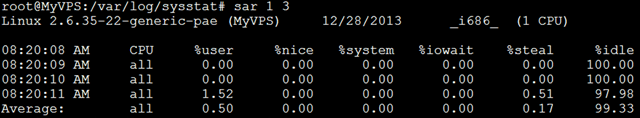
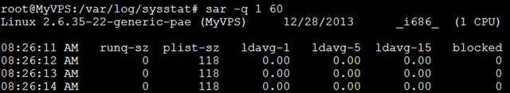
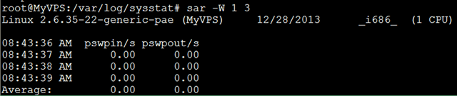
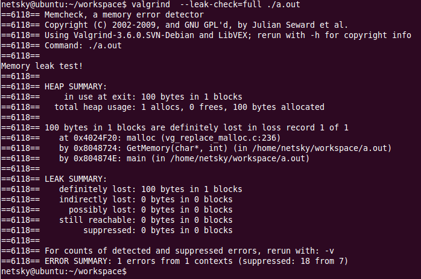

# Linux手册

## 1. 常用工具

### 查看系统信息

```
# 总核数 = 物理CPU个数 X 每颗物理CPU的核数 
# 总逻辑CPU数 = 物理CPU个数 X 每颗物理CPU的核数 X 超线程数
 
# 查看物理CPU个数
cat /proc/cpuinfo | grep "physical id" | sort | uniq | wc -l
 
# 查看每个物理CPU中core的个数(即核数)
cat /proc/cpuinfo | grep "cpu cores" | uniq
 
# 查看逻辑CPU的个数
cat /proc/cpuinfo | grep "processor" | wc -l

#uname -a
```

### setenv/export/env/set/export

setenv/export/env/set/export -p 环境变量相关

### useradd/password
> * useradd 添加用户
> * passwd+用户名 修改用户密码

### usermod

### groupadd

### ll 

**文件类型：**

```
“-”表示普通文件；“d”表示目录；“l”表示链接文件；“p”表示管理文件；“b”表示块设备文件；“c”表示字符设备文件；“s”表示套接字文件；
```
**权限：**

```​
其属性可分为三段：[rwx][rwx][r-x]，其中：
    第一段表示文件创建者/所有者对该文件所具有的权限;
    第二段表示创建者/所有者所在的组的其他用户所具有的权限;
    第三段表示其他组的其他用户所具有的权限。

r（Read，读取权限）：对文件而言，具有读取文件内容的权限；对目录来说，具有浏览目录的权限。
w（Write，写入权限）：对文件而言，具有新增、修改文件内容的权限；对目录来说，具有删除、移动目录内文件的权限。
x（eXecute，执行权限）：对文件而言，具有执行文件的权限；对目录来说，该用户具有进入目录的权限。

另外，这里还有2个很特殊的属性，平时不怎么常见，这里也顺带解释一下：
    s或S（SUID,Set UID）：可执行的文件搭配这个权限，便能得到特权，任意存取该文件的所有者能使用的全部系统资源。请注意具备SUID权限的文件，黑客经常利用这种权限，以SUID配上root帐号拥有者，无声无息地在系统中开扇后门，供日后进出使用。
    t或T（Sticky）：/tmp和 /var/tmp目录供所有用户暂时存取文件，亦即每位用户皆拥有完整的权限进入该目录，去浏览、删除和移动文件。
```
**目录/链接个数**

对于目录文件，表示它的第一级子目录的个数。注意此处看到的值要减2才等于该目录下的子目录的实际个数。这是因为要去掉.目录和..目录。在linux下，.目录表示当前目录，..目录表示上一级目录。

对于其他文件，表示指向它的链接文件的个数。

**所有者/用户组**

表示该文件的所有者/创建者（owner）及其所在的组（group）。

**其他**

带‘*’的文件是linux系统下用于标记可执行文件的一种方式。

### ps 

### find

```bash
find $DATA01/rating/ -type f -exec rm {} \; 
find $DATA01/rating/ -type f | wc -l 
find $DATA02/rating/ -type f | xargs rm -f 
find $MDB_USER_BAK -mtime +3 -name "*aimdb*" -exec rm {} \;

find lib -type f  -a -newer lib/xxxx -o -type l -a -newer lib/xxxx |xargs tar -czvf patch_all.tar.gz 
```

### grep

```bash
# 去除配置中的注释和所有的空行
$ cat sentinel.conf | grep -v "#" | grep -v "^$" > sentinel-26379.conf
```

### xargs

```bash
 find -mtime 0 -type f | xargs -i cp {} /data01/jxbillbm2/brcs/t 
```

### awk


**示例：**

```
awk -F ";" '{subfix=substr($23,length($23)-3,length($23)-1); if(length(subfix) < 4){subfix="OTHER"}; print $0 >> "'$GROUPBY'de_wlan"subfix".s" }'  
$0	表示整个当前行 
$1  每行第一个字段 
NF  字段数量变量
```

### sed

```bash
# 替换某个字段并重定向
$ sed "s/26379/26380/g" redis-sentinel-26379.conf > redis-sentinel-26380.conf
```

### top 


**相关选项**

> * -c ： 命令行/程序名切换
> * -d ： 延迟时间间隔为：-d 秒数。小数秒钟将被允许，但不允许使用负数。然而，在所有情况下，如果top在安全模式下运行，则禁止这样的更改，除了root。
> * -H :  线程模式操作。指示显示单个线程。如果没有此命令行选项，将显示每个进程中所有线程的总和。
> * -p： Monitor-PIDs模式为：-pN1 -pN2 ...或-pN1，N2，N3 ...仅监视具有指定进程ID的进程。此选项最多可以给出20次，或者您可以提供最多20个字符的逗号分隔列表。允许合并两种方法。

**统计信息区前五行**

top命令输出结果中，统计信息区前五行是系统整体的统计信息。
 第一行是任务队列信息，同 uptime 命令的执行结果。其内容如下：

| 符号                           | 含义                                                         |
| :----------------------------- | :----------------------------------------------------------- |
| 18:52:04                       | 当前时间                                                     |
| up 10days, 3:49                | 系统运行时间，格式为：天，时:分                              |
| 1 user                         | 当前登录用户数                                               |
| load average: 0.00, 0.01, 0.05 | 系统负载，即任务队列的平均长度。三个数值分别为 1分钟、5分钟、15分钟前到现在的平均值 |

第二、三行为进程和CPU的信息。当有多个CPU时，这些内容可能会超过两行。内容如下：

|   符号   | 含义                                          |
| :------: | :-------------------------------------------- |
|  total   | 进程总数                                      |
| running  | 正在运行的进程数                              |
| sleeping | 睡眠的进程数                                  |
| stopped  | 停止的进程数                                  |
|  zombie  | 僵尸进程数                                    |
| %Cpu(s)  |                                               |
|  0.0 us  | 用户空间占用CPU百分比                         |
|  0.1 sy  | 内核空间占用CPU百分比                         |
|  0.0 ni  | 用户进程空间内改变过优先级的进程占用CPU百分比 |
| 98.7 id  | 空闲CPU百分比;                                |
|  0.0 wa  | 等待输入输出的CPU时间百分比                   |
|  0.0 hi  | 硬件CPU中断占用百分比                         |
|  0.0 si  | 软中断占用百分比                              |
|  0.0 st  | 虚拟机占用百分比                              |

```
I/O wait time:
	For a given CPU, the I/O wait time is the time during which that CPU was idle (i.e. didn’t execute any tasks) and there was at least one outstanding disk I/O operation requested by a task scheduled on that CPU (at the time it generated that I/O request).
	Note that the nuance is not innocent and has practical consequences. For example, on a system with many CPUs, even if there is a problem with I/O performance, the observed overall I/O wait time may still be small if the problem only affects a single task. It also means that while it is generally correct to say that faster CPUs tend to increase I/O wait time (simply because a faster CPU tends to be idle more often), that statement is no longer true if one replaces “faster” by “more”.

来自：http://veithen.io/2013/11/18/iowait-linux.html
```

最后两行为内存信息。内容如下：

|         符号         | 含义                                                         |
| :------------------: | :----------------------------------------------------------- |
|       KiB Mem        |                                                              |
|    7993560 total     | 物理内存总量                                                 |
|     207064 free      | 空闲内存总量                                                 |
|     723688 used      | 使用的物理内存总量                                           |
| 7062808 buffer/cache | 用作内核缓存的内存量                                         |
|       KiB Swap       |                                                              |
|    8257532 total     | 交换区总量                                                   |
|     8257356 free     | 空闲交换区总量                                               |
|       176 used       | 使用的交换区总量                                             |
|  6479580  avail Mem  | 缓冲的交换区总量,内存中的内容被换出到交换区，而后又被换入到内存，但使用过的交换区尚未被覆盖，该数值即为这些内容已存在于内存中的交换区的大小,相应的内存再次被换出时可不必再对交换区写入 |

进程信息区统计信息区域的下方显示了各个进程的详细信息。首先来认识一下各列的含义。

| 序号 | 列名    | 含义                                                         |
| :--: | :------ | :----------------------------------------------------------- |
|  a   | PID     | 进程id                                                       |
|  b   | PPID    | 父进程id                                                     |
|  c   | RUSER   | Real user name                                               |
|  d   | UID     | 进程所有者的用户id                                           |
|  e   | USER    | 进程所有者的用户名                                           |
|  f   | GROUP   | 进程所有者的组名                                             |
|  g   | TTY     | 启动进程的终端名。不是从终端启动的进程则显示为 ?             |
|  h   | PR      | 优先级                                                       |
|  i   | NI      | nice值。负值表示高优先级，正值表示低优先级                   |
|  j   | P       | 最后使用的CPU，仅在多CPU环境下有意义                         |
|  k   | %CPU    | 上次更新到现在的CPU时间占用百分比                            |
|  l   | TIME    | 进程使用的CPU时间总计，单位秒                                |
|  m   | TIME+   | 进程使用的CPU时间总计，单位1/100秒                           |
|  n   | %MEM    | 进程使用的物理内存百分比                                     |
|  o   | VIRT    | 进程使用的虚拟内存总量，单位kb。VIRT=SWAP+RES                |
|  p   | SWAP    | 进程使用的虚拟内存中，被换出的大小，单位kb。                 |
|  q   | RES     | 进程使用的、未被换出的物理内存大小，单位kb。RES=CODE+DATA    |
|  r   | CODE    | 可执行代码占用的物理内存大小，单位kb                         |
|  s   | DATA    | 可执行代码以外的部分(数据段+栈)占用的物理内存大小，单位kb    |
|  t   | SHR     | 共享内存大小，单位kb                                         |
|  u   | nFLT    | 页面错误次数                                                 |
|  v   | nDRT    | 最后一次写入到现在，被修改过的页面数。                       |
|  w   | S       | 进程状态(D=不可中断的睡眠状态,R=运行,S=睡眠,T=跟踪/停止,Z=僵尸进程) |
|  x   | COMMAND | 命令名/命令行                                                |
|  y   | WCHAN   | 若该进程在睡眠，则显示睡眠中的系统函数名                     |
|  z   | Flags   | 任务标志，参考 sched.h                                       |

默认情况下仅显示比较重要的 PID、USER、PR、NI、VIRT、RES、SHR、S、%CPU、%MEM、TIME+、COMMAND 列。可以通过下面的快捷键来更改显示内容。

- 更改显示内容
   通过 f 键可以选择显示的内容。按 f 键之后会显示列的列表，按 a-z 即可显示或隐藏对应的列，最后按回车键确定。
- 更改列显示顺序
   按 o 键可以改变列的显示顺序。按小写的 a-z 可以将相应的列向右移动，而大写的 A-Z 可以将相应的列向左移动。最后按回车键确定。
- 按列排序
   按大写的 F 或 O 键，然后按 a-z 可以将进程按照相应的列进行排序。而大写的 R 键可以将当前的排序倒转。

### du&df

### sort

```
sort -n -k 22 -t ";" 文件名 -o 排序后的文件名

-c：检测给定的文件是否已经已经排序。如未排序，则会输出诊断信息，提示从哪一行开始乱序。
-C：类似于"-c"，只不过不输出任何诊断信息。可以通过退出状态码1判断出文件未排序。
-m：对给定的多个已排序文件进行合并。在合并过程中不做任何排序动作。
-b：忽略字段的前导空白字符。空格数量不固定时，该选项几乎是必须要使用的。"-n"选项隐含该选项。
-d：按照字典顺序排序，只支持字母、数值、空白。除了特殊字符，一般情况下基本等同于默认排序规则。
--debug：将显示排序的过程以及每次排序所使用的字段、字符。同时还会在最前几行显示额外的信息。
-f：将所有小写字母当成大写字母。例如，"b"和"B"是相同的。
  ：在和"-u"选项一起使用时，如果排序字段的比较结果相等，则丢弃小写字母行。
-k：指定要排序的key，key由字段组成。key格式为"POS1[,POS2]"，POS1为key起始位置，POS2为key结束位置。
-n：按数值排序。空字符串""或"\0"被当作空。该选项除了能识别负号"-"，其他所有非数字字符都不识别。
  ：当按数值排序时，遇到不识别的字符时将立即结束该key的排序。
-M：按字符串格式的月份排序。会自动转换成大写，并取缩写值。规则：unknown<JAN<FEB<...<NOV<DEC。
-o：将结果输出到指定文件中。
-r：默认是升序排序，使用该选项将得到降序排序的结果。
  ：注意："-r"不参与排序动作，只是操作排序完成后的结果。
-s：禁止sort做"最后的排序"。
-t：指定字段分隔符。
  ：对于特殊符号(如制表符)，可使用类似于-t$'\t'或-t'ctrl+v,tab'(先按ctrl+v，然后按tab键)的方法实现。
-u：只输出重复行的第一行。结合"-f"使用时，重复的小写行被丢弃。 
```

### rsync

### wc

### tail

```
-f 循环读取
-q 不显示处理信息
-v 显示详细的处理信息
-c<数目> 显示的字节数
-n<行数> 显示文件的尾部 n 行内容
--pid=PID 与-f合用,表示在进程ID,PID死掉之后结束
-q, --quiet, --silent 从不输出给出文件名的首部
-s, --sleep-interval=S 与-f合用,表示在每次反复的间隔休眠S秒
```

### crontab


### wget

### scp

### free

### uniq

检查及删除文本文件中重复出现的行列，一般与 sort 命令结合使用，当重复的行并不相邻时，uniq 命令是不起作用的。 

**uniq [-cdu] [-f<栏位>] [-s<字符位置>] [-w<字符位置>] [--help] [--version] [输入文件] [输出文件] **

```
-c或--count 在每列旁边显示该行重复出现的次数
-d或--repeated 仅显示重复出现的行列
-f<栏位>或--skip-fields=<栏位> 忽略比较指定的栏位
-s<字符位置>或--skip-chars=<字符位置> 忽略比较指定的字符
-u或--unique 仅显示出一次的行列
-w<字符位置>或--check-chars=<字符位置> 指定要比较的字符
[输入文件] 指定已排序好的文本文件。如果不指定此项，则从标准读取数据
[输出文件] 指定输出的文件。如果不指定此选项，则将内容显示到标准输出设备（显示终端） 
```

### mount

### expect

自动交互脚本

### ldconfig

### tar

```bash
# 解压和压缩：
$ tar -vxf ctags-5.8.tar.gz  //解压ctags-5.8.tar.gz
$ tar -zvf tool.rar tools/
```

```
选项
-c: 建立压缩档案
-x：解压
-t：查看内容
-r：向压缩归档文件末尾追加文件
-u：更新原压缩包中的文件
这五个是独立的命令，压缩解压都要用到其中一个，可以和别的命令连用但只能用其中一个。下面的参数是根据需要在压缩或解压档案时可选的。
-z：有gzip属性的
-j：有bz2属性的
-Z：有compress属性的
-v：显示所有过程
-O：将文件解开到标准输出
下面的参数-f是必须的
-f: 使用档案名字，切记，这个参数是最后一个参数，后面只能接档案名。
```

### unzip

### rar

## 2. 网络工具

### netstat

​		netstat命令用于显示与IP、TCP、UDP和ICMP协议相关的统计数据，一般用于检验本机各端口的网络连接情况。netstat是在内核中访问网络及相关信息的程序，它能提供TCP连接，TCP和UDP监听，进程内存管理的相关报告。

**netstat  [-acCeFghilMnNoprstuvVwx] [-A<网络类型>] [--ip]**

```
命令参数：
-a或–all 显示所有连线中的Socket。
-A<网络类型>或–<网络类型> 列出该网络类型连线中的相关地址。
-c或–continuous 持续列出网络状态。
-C或–cache 显示路由器配置的快取信息。
-e或–extend 显示网络其他相关信息。
-F或–fib 显示FIB。
-g或–groups 显示多重广播功能群组组员名单。
-h或–help 在线帮助。
-i或–interfaces 显示网络界面信息表单。
-l或–listening 显示监控中的服务器的Socket。
-M或–masquerade 显示伪装的网络连线。
-n或–numeric 直接使用IP地址，而不通过域名服务器。
-N或–netlink或–symbolic 显示网络硬件外围设备的符号连接名称。
-o或–timers 显示计时器。
-p或–programs 显示正在使用Socket的程序识别码和程序名称。
-r或–route 显示Routing Table。
-s或–statistice 显示网络工作信息统计表，显示每个协议的统计信息
-t或–tcp 显示TCP传输协议的连线状况。
-u或–udp 显示UDP传输协议的连线状况。
-v或–verbose 显示指令执行过程。
-V或–version 显示版本信息。
-w或–raw 显示RAW传输协议的连线状况。
-x或–unix 此参数的效果和指定”-A unix”参数相同。
–ip或–inet 此参数的效果和指定”-A inet”参数相同。

套接口类型：
-t ：TCP
-u ：UDP
-raw ：RAW类型
--unix ：UNIX域类型
--ax25 ：AX25类型
--ipx ：ipx类型
--netrom ：netrom类型

状态说明：
LISTEN：侦听来自远方的TCP端口的连接请求
SYN-SEND：再发送连接请求后等待匹配的连接请求（如果有大量这样的状态包，检查是否中招了）
SYN-RECEIVED：再收到和发送一个连接请求后等待对方对连接请求的确认（如有大量此状态，估计被flood攻击了）
ESTABLISHED：代表一个打开的连接
FIN-WAIT-1：等待远程TCP连接中断请求，或先前的连接中断请求的确认
FIN-WAIT-2：从远程TCP等待连接中断请求
CLOSE-WAIT：等待从本地用户发来的连接中断请求
CLOSING：等待远程TCP对连接中断的确认
LAST-ACK：等待原来的发向远程TCP的连接中断请求的确认（不是什么好东西，此项出现，检查是否被攻击）
TIME-WAIT：等待足够的时间以确保远程TCP接收到连接中断请求的确认
CLOSED：没有任何连接状态

CLOSED -- 初始（无连接）状态。
LISTEN -- 侦听状态，等待远程机器的连接请求。
SYN_SEND -- 在TCP三次握手期间，主动连接端发送了SYN包后，进入SYN_SEND状态，等待对方的ACK包。
SYN_RECV -- 在TCP三次握手期间，主动连接端收到SYN包后，进入SYN_RECV状态。
ESTABLISHED -- 完成TCP三次握手后，主动连接端进入ESTABLISHED状态。此时，TCP连接已经建立，可以进行通信。
FIN_WAIT_1 -- 在TCP四次挥手时，主动关闭端发送FIN包后，进入FIN_WAIT_1状态。
FIN_WAIT_2 -- 在TCP四次挥手时，主动关闭端收到ACK包后，进入FIN_WAIT_2状态。
TIME_WAIT -- 在TCP四次挥手时，主动关闭端发送了ACK包之后，进入TIME_WAIT状态，等待最多MSL时间，让被动关闭端收到ACK包。
CLOSING -- 在TCP四次挥手期间，主动关闭端发送了FIN包后，没有收到对应的ACK包，却收到对方的FIN包，此时，进入CLOSING状态。
CLOSE_WAIT -- 在TCP四次挥手期间，被动关闭端收到FIN包后，进入CLOSE_WAIT状态。
LAST_ACK -- 在TCP四次挥手时，被动关闭端发送FIN包后，进入LAST_ACK状态，等待对方的ACK包。时
```

**netstat的输出结果可以分为两个部分：**
		一个是Active Internet connections，称为有源TCP连接，其中"Recv-Q"和"Send-Q"指的是接收队列和发送队列。这些数字一般都应该是0。如果不是则表示软件包正在队列中堆积。这种情况只能在非常少的情况见到。
		另一个是Active UNIX domain sockets，称为有源Unix域套接口(和网络套接字一样，但是只能用于本机通信，性能可以提高一倍)。
		Proto显示连接使用的协议,RefCnt表示连接到本套接口上的进程号,Types显示套接口的类型,State显示套接口当前的状态,Path表示连接到套接口的其它进程使用的路径名。

```bash
Active Internet connections (w/o servers)
Proto Recv-Q Send-Q Local Address               Foreign Address             State
tcp        0      0 10.135.140.109:http         ec2-52-221-254-177.ap:15672 SYN_RECV
tcp        0     40 10.135.140.109:opsec-uaa    171.212.208.223:51167       ESTABLISHED
tcp        0      0 10.135.140.109:43963        101.226.68.166:nsesrvr      ESTABLISHED
Active UNIX domain sockets (w/o servers)
Proto RefCnt Flags       Type       State         I-Node Path
unix  6      [ ]         DGRAM                    60962  /dev/log
unix  2      [ ]         DGRAM                    49689  @/org/kernel/udev/udevd
unix  2      [ ]         DGRAM                    18148696
unix  2      [ ]         DGRAM                    18143862
unix  3      [ ]         STREAM     CONNECTED     17474862 /usr/local/sa/agent/secubase/secu-tcs-agent-v5.unix
```

**输出说明：**

**Active Internet connections (w/o servers)**

| Proto    | Recv-Q   | Send-Q   | Local Address | Foreign Address | State |
| -------- | -------- | -------- | ------------- | --------------- | ----- |
| 协议类型 | 接收队列 | 发送队列 | 本地地址      | 外部地址        | 状态  |

> * 协议类型: 这里会出现  UDP、TCP、SCTP、ICMP 和 IP 协议 ， 最常见的应该就是TCP和UDP
> * 接收队列: 一般都是0，表示没有堆积的数据包
> * 发送队列: 一般都是0，表示没有堆积的数据包
> * 本地地址: 一般是在内网的地址，也有可能看到localhost或者127.0.0.1
> * 外部地址: 与外部建立连接的外部ip以及端口。
> * 状态: 连接状态

**Active UNIX domain sockets (w/o servers)**

| Proto    | RefCnt   | Flags | Type         | State      | I-Node              | Path       |
| -------- | -------- | ----- | ------------ | ---------- | ------------------- | ---------- |
| 协议类型 | 引用次数 | TODO  | 数据传输类型 | 连接的状态 | Linux中的文件标识号 | 使用的路径 |
> * 协议类型: 这里可以看见只有unix,表示这是一个unix socket
> * 引用次数: 被程序引用的次数，不同的程序或者同一个程序中可以使用同一个管道来交换数据。
> * Flags : 未查到，TODO
> * 数据传输类型: stream 字节  datagram 数据包
> * 连接的状态: 与上面网络Socket的状态相同
> * Linux中的文件标识号: Inode
> * 使用的路径: 管道使用的文件路径

**示例：**

**netstat -s**  显示每个协议的统计信息

```
[root@VM_140_109_centos ~]# netstat -s
Ip:
    14150245 total packets received
    2 with invalid addresses
    0 forwarded
    8 with unknown protocol
    0 incoming packets discarded
    11105122 incoming packets delivered
    11088052 requests sent out
    12 reassemblies required
    5 packets reassembled ok
Icmp:
    2012695 ICMP messages received
    3621 input ICMP message failed.
    ICMP input histogram:
        destination unreachable: 4071
        timeout in transit: 135
        redirects: 6
        echo requests: 2008442
        echo replies: 39
        timestamp request: 2
    2212368 ICMP messages sent
    0 ICMP messages failed
    ICMP output histogram:
        destination unreachable: 203924
        echo replies: 2008442
        timestamp replies: 2
IcmpMsg:
        InType0: 39
        InType3: 4071
        InType5: 6
        InType8: 2008442
        InType11: 135
        InType13: 2
        OutType0: 2008442
        OutType3: 203924
        OutType14: 2
Tcp:
    1852 active connections openings
    20442 passive connection openings
    5494 failed connection attempts
    661 connection resets received
    2 connections established
    8820870 segments received
    8805804 segments send out
    15430 segments retransmited
    63 bad segments received.
    7878728 resets sent
Udp:
    44596 packets received
    226787 packets to unknown port received.
    45 packet receive errors
    54450 packets sent
```

**netstat -anpl | grep :8088  ** 找出监听指定端口8088的应用

```bash
root@wzt-dev2-PC:/home/wzy# netstat -anpl | grep :8088
tcp        0      0 0.0.0.0:8088          0.0.0.0:*      LISTEN      928/nginx.conf
```

**查询出netstat -ano命令结果中包含"1415"的总数**

```
netstat -ano|find /c ":1415 "
```

**查询netstat -n命令结果中包含"ESTABLISH"并且包含"80"的行数**

```
netstat -n|find  "ESTABLISH"|find  ":80" /c
```

### tcpdump

```bash
$ tcpdump -i bond0 -s 0 tcp port 38910 -G 3000000 -Z billapp -w  /data01/billapp/users/yujm/5g_sa/jiangxi%Y%m%d_%H%M%S_00000008.cap
```


### nc(netcat)

### telnet

### ping

### traceroute

### iptables

### curl

curl 是常用的命令行工具，用来请求 Web 服务器。它的功能非常强大，命令行参数多达几十种。如果熟练的话，完全可以取代 Postman 这一类的图形界面工具。不带有任何参数时，curl 就是发出 GET 请求，服务器返回的内容会在命令行输出。

````bash
$ curl https://www.example.com
````

**-A**

-A 参数指定客户端的用户代理标头，即User-Agent，curl的默认用户代理字符串是curl/[version]。

```bash
$ curl -A 'Mozilla/5.0 (Windows NT 10.0; Win64; x64) AppleWebKit/537.36 (KHTML, like Gecko) Chrome/76.0.3809.100 Safari/537.36' https://google.com
```


## 3. 实用工具

### pstack

### sar

sar是System Activity Reporter（系统活动情况报告）的缩写。sar工具将对系统当前的状态进行取样，然后通过计算数据和比例来表达系统的当前运行状态。它的特点是可以连续对系统取样，获得大量的取样数据；取样数据和分析的结果都可以存入文件，所需的负载很小。sar是目前Linux上最为全面的系统性能分析工具之一，可以从14个大方面对系统的活动进行报告，包括文件的读写情况、系统调用的使用情况、串口、CPU效率、内存使用状况、进程活动及IPC有关的活动等，使用也是较为复杂。

sar是查看操作系统报告指标的各种工具中，最为普遍和方便的；它有两种用法；

> * 追溯过去的统计数据（默认）
> * 周期性的查看当前数据

**参数说明**

```
-A 汇总所有的报告
-a 报告文件读写使用情况
-B 报告附加的缓存的使用情况
-b 报告缓存的使用情况
-c 报告系统调用的使用情况
-d 报告磁盘的使用情况
-g 报告串口的使用情况
-h 报告关于buffer使用的统计数据
-m 报告IPC消息队列和信号量的使用情况
-n 报告命名cache的使用情况
-p 报告调页活动的使用情况
-q 报告运行队列和交换队列的平均长度
-R 报告进程的活动情况
-r 报告没有使用的内存页面和硬盘块
-u 报告CPU的利用率
-v 报告进程、i节点、文件和锁表状态
-w 报告系统交换活动状况
-y 报告TTY设备活动状况
```

**追溯过去的统计数据**

默认情况下，sar从最近的0点0分开始显示数据；如果想继续查看一天前的报告；可以查看保存在/var/log/sysstat/下的sa日志； 使用sar工具查看:

```
$sar -f /var/log/sysstat/sa28 \| head sar -r -f
/var/log/sysstat/sa28
```

[](https://linuxtools-rst.readthedocs.io/zh_CN/latest/_images/sar1.png)

**查看CPU使用率**

sar -u : 默认情况下显示的cpu使用率等信息就是sar -u；

[](https://linuxtools-rst.readthedocs.io/zh_CN/latest/_images/sar2.png)

可以看到这台机器使用了虚拟化技术，有相应的时间消耗； 各列的指标分别是:

- %user 用户模式下消耗的CPU时间的比例；
- %nice 通过nice改变了进程调度优先级的进程，在用户模式下消耗的CPU时间的比例
- %system 系统模式下消耗的CPU时间的比例；
- %iowait CPU等待磁盘I/O导致空闲状态消耗的时间比例；
- %steal 利用Xen等操作系统虚拟化技术，等待其它虚拟CPU计算占用的时间比例；
- %idle CPU空闲时间比例；

**查看平均负载**

sar -q: 查看平均负载

指定-q后，就能查看运行队列中的进程数、系统上的进程大小、平均负载等；与其它命令相比，它能查看各项指标随时间变化的情况；

- runq-sz：运行队列的长度（等待运行的进程数）
- plist-sz：进程列表中进程（processes）和线程（threads）的数量
- ldavg-1：最后1分钟的系统平均负载 ldavg-5：过去5分钟的系统平均负载
- ldavg-15：过去15分钟的系统平均负载

[](https://linuxtools-rst.readthedocs.io/zh_CN/latest/_images/sar3.png)

**查看内存使用状况**

sar -r： 指定-r之后，可查看物理内存使用状况；

[](https://linuxtools-rst.readthedocs.io/zh_CN/latest/_images/sar4.png)

- kbmemfree：这个值和free命令中的free值基本一致,所以它不包括buffer和cache的空间.
- kbmemused：这个值和free命令中的used值基本一致,所以它包括buffer和cache的空间.
- %memused：物理内存使用率，这个值是kbmemused和内存总量(不包括swap)的一个百分比.
- kbbuffers和kbcached：这两个值就是free命令中的buffer和cache.
- kbcommit：保证当前系统所需要的内存,即为了确保不溢出而需要的内存(RAM+swap).
- %commit：这个值是kbcommit与内存总量(包括swap)的一个百分比.

**查看页面交换发生状况**

sar -W：查看页面交换发生状况

页面发生交换时，服务器的吞吐量会大幅下降；服务器状况不良时，如果怀疑因为内存不足而导致了页面交换的发生，可以使用这个命令来确认是否发生了大量的交换；

[](https://linuxtools-rst.readthedocs.io/zh_CN/latest/_images/sar5.png)

- pswpin/s：每秒系统换入的交换页面（swap page）数量
- pswpout/s：每秒系统换出的交换页面（swap page）数量

要判断系统瓶颈问题，有时需几个 sar 命令选项结合起来；

- 怀疑CPU存在瓶颈，可用 sar -u 和 sar -q 等来查看
- 怀疑内存存在瓶颈，可用sar -B、sar -r 和 sar -W 等来查看
- 怀疑I/O存在瓶颈，可用 sar -b、sar -u 和 sar -d 等来查看

**安装**

1. 有的linux系统下，默认可能没有安装这个包，使用apt-get install sysstat 来安装；
2. 安装完毕，将性能收集工具的开关打开： vi /etc/default/sysstat

> 设置 ENABLED=”true”

1. 启动这个工具来收集系统性能数据： /etc/init.d/sysstat start

### mpstat

**mpstat [ options... ] [ <interval> [ <count> ] ]**

```bash
# mpstat 1  111  [1秒刷新，111次]
$ mpstat 1
Linux 2.6.9-89.ELsmp (WebServer) 08/18/09

10:08:25 CPU %user %nice %system %iowait %irq %soft %idle intr/s
10:08:26 all 0.00 0.00 0.00 0.00 0.00 0.00 100.00 1005.00
10:08:27 all 0.00 0.00 0.00 0.12 0.00 0.00 99.88 1031.00
10:08:28 all 0.00 0.00 0.00 0.00 0.00 0.00 100.00 1009.00
10:08:29 all 0.00 0.00 0.00 0.00 0.00 0.00 100.00 1030.00
10:08:30 all 0.00 0.00 0.00 0.00 0.00 0.00 100.00 1006.00
```

```
- 1.CPU （处理器编号，all表示所有处理器的平均数值） Processor number. The keyword all indicates that statistics are calculated as averages among all processors.
- 2.%user （用户态的CPU利用率百分比） Show the percentage of CPU utilization that occurred while executing at the user level (application).
- 3.%nice （用户态的优先级别CPU的利用率百分比） Show the percentage of CPU utilization that occurred while executing at the user level with nice priority.
- 4.%system （内核态的CPU利用率百分比） Show the percentage of CPU utilization that occurred while executing at the system level (kernel). Note that this does not include the time spent servicing interrupts or softirqs.
- 5.%iowait （在interval间段内io的等待百分比，interval 为采样频率，如本文的1为每一秒钟采样一次） Show the percentage of time that the CPU or CPUs were idle during which the system had an outstanding disk I/O request.
- 6.%irq （在interval间段内,CPU的中断百分比） Show the percentage of time spent by the CPU or CPUs to service interrupts.
- 7.%soft （在interval间段内,CPU的软中断百分比） Show the percentage of time spent by the CPU or CPUs to service softirqs. A softirq (software interrupt) is one of up to 32 enumerated software interrupts which can run on multiple CPUs at once.
- 8.%idle （在interval间段内，CPU的闲置百分比，不包括I/O请求的等待） Show the percentage of time that the CPU or CPUs were idle and the system did not have an outstanding disk I/O request.
- 9.intr/s （在interval间段内所有的CPU每秒中断数） Show the total number of interrupts received per second by the CPU or CPUs.
```

### iostat

iostat 吞吐量

```bash
# iostat -x   1

avg-cpu:  %user   %nice %system %iowait  %steal   %idle
                    24.13    0.00    8.22       2.50         0.00   65.15

Device:         rrqm/s   wrqm/s     r/s     w/s   rsec/s   wsec/s avgrq-sz avgqu-sz   await  svctm  %util
sda              17.51   107.98    9.98   14.52   250.06   980.07    50.20     3.23  131.70   2.53   6.19
```

```
参数 
-d 表示，显示设备（磁盘）使用状态；
-k 某些使用block为单位的列强制使用Kilobytes为单位；
1 10表示，数据显示每隔1秒刷新一次，共显示10次。
tin 显示了系统为所有 tty 读取的字符总数。
tout 显示了系统为所有 tty 写入的字符总数。
% user 显示了在用户级（应用程序）执行时产生的 CPU 使用率百分比。
% sys 显示了在系统级（内核）执行时产生的 CPU 使用率百分比。
% idle 显示了在 CPU 空闲并且系统没有未完成的磁盘 I/O 请求时的时间百分比。
% iowait 显示了 CPU 空闲期间系统有未完成的磁盘 I/O 请求时的时间百分比。

rrqm/s: 每秒进行 merge 的读操作数目.即 delta(rmerge)/s
wrqm/s: 每秒进行 merge 的写操作数目.即 delta(wmerge)/s
r/s: 每秒完成的读 I/O 设备次数.即 delta(rio)/s
w/s : 每秒完成的写 I/O 设备次数.即 delta(wio)/s
rsec/s: 每秒读扇区数.即 delta(rsect)/s
wsec/s: 每秒写扇区数.即 delta(wsect)/s
rkB/s: 每秒读K字节数.是 rsect/s 的一半,因为每扇区大小为512字节.(需要计算)
wkB/s: 每秒写K字节数.是 wsect/s 的一半.(需要计算)
avgrq-sz: 平均每次设备I/O操作的数据大小 (扇区).delta(rsect+wsect)/delta(rio+wio)
avgqu-sz : 平均I/O队列长度.即 delta(aveq)/s/1000 (因为aveq的单位为毫秒).
await: 平均每次设备I/O操作的等待时间 (毫秒).即 delta(ruse+wuse)/delta(rio+wio)
svctm: 平均每次设备I/O操作的服务时间 (毫秒).即 delta(use)/delta(rio+wio)
%util : 一秒中有百分之多少的时间用于 I/O 操作,或者说一秒中有多少时间 I/O 队列是非空的.即 delta(use)/s/1000 (因为use的单位为毫秒)
```

如果 %util 接近 100%,说明产生的I/O请求太多,I/O系统已经满负荷,该磁盘可能存在瓶颈.

idle小于70% IO压力就较大了,一般读取速度有较多的wait. 同时可以结合vmstat 查看查看b参数(等待资源的进程数) 和wa参数(IO等待所占用的CPU时间的百分比,高过30%时IO压力高)

另外 await 的参数也要多和 svctm 来参考.差的过高就一定有 IO 的问题. avgqu-sz 也是个做 IO

调优时需要注意的地方,这个就是直接每次操作的数据的大小,如果次数多,但数据拿的小的话,其实 IO 也会很小.如果数据拿的大,才IO 的数据会高.也可以通过 avgqu-sz × ( r/s or w/s ) = rsec/s or wsec/s.也就是讲,读定速度是这个来决定的.

Linux系统出现了性能问题，一般我们可以通过top、iostat、free、vmstat等命令来查看初步定位问题。其中iostat可以给我们提供丰富的IO状态数据。

**1. 基本使用**

```bash
$iostat -d -k 1 10
```

参数 -d 表示，显示设备（磁盘）使用状态；-k某些使用block为单位的列强制使用Kilobytes为单位；1 10表示，数据显示每隔1秒刷新一次，共显示10次。

```bash
$iostat -d -k 1 10

Device: tps kB_read/s kB_wrtn/s kB_read kB_wrtn
sda 39.29 21.14 1.44 441339807 29990031
sda1 0.00 0.00 0.00 1623 523
sda2 1.32 1.43 4.54 29834273 94827104
sda3 6.30 0.85 24.95 17816289 520725244
sda5 0.85 0.46 3.40 9543503 70970116
sda6 0.00 0.00 0.00 550 236
sda7 0.00 0.00 0.00 406 0
sda8 0.00 0.00 0.00 406 0
sda9 0.00 0.00 0.00 406 0
sda10 60.68 18.35 71.43 383002263 1490928140

Device: tps kB_read/s kB_wrtn/s kB_read kB_wrtn
sda 327.55 5159.18 102.04 5056 100 sda1 0.00 0.00 0.00 0 0
```

```
tps：该设备每秒的传输次数（Indicate the number of transfers per second that were issued to the device.）。“一次传输”意思是“一次I/O请求”。多个逻辑请求可能会被合并为“一次I/O请求”。“一次传输”请求的大小是未知的。
kB_read/s：每秒从设备（drive expressed）读取的数据量；
kB_wrtn/s：每秒向设备（drive expressed）写入的数据量；
kB_read：读取的总数据量；
kB_wrtn：写入的总数量数据量；
这些单位都为Kilobytes。
```

上面的例子中，我们可以看到磁盘sda以及它的各个分区的统计数据，当时统计的磁盘总TPS是39.29，下面是各个分区的TPS。（因为是瞬间值，所以总TPS并不严格等于各个分区TPS的总和）

**2.-x 参数**

使用-x参数我们可以获得更多统计信息。

```bash
$iostat -d -x -k 1 10

Device: rrqm/s wrqm/s r/s w/s rsec/s wsec/s rkB/s wkB/s avgrq-sz avgqu-sz await svctm %util
sda 1.56 28.31 7.80 31.49 42.51 2.92 21.26 1.46 1.16 0.03 0.79 2.62 10.28

Device: rrqm/s wrqm/s r/s w/s rsec/s wsec/s rkB/s wkB/s avgrq-sz avgqu-sz await svctm %util
sda 2.00 20.00 381.00 7.00 12320.00 216.00 6160.00 108.00 32.31 1.75 4.50 2.17 84.20
```

```
rrqm/s：每秒这个设备相关的读取请求有多少被Merge了（当系统调用需要读取数据的时候，VFS将请求发到各个FS，如果FS发现不同的读取请求读取的是相同Block的数据，FS会将这个请求合并Merge）；wrqm/s：每秒这个设备相关的写入请求有多少被Merge了。
rsec/s：每秒读取的扇区数；wsec/：每秒写入的扇区数。r/s：The number of read requests that were issued to the device per second；w/s：The number of write requests that were issued to the device per second；
await：每一个IO请求的处理的平均时间（单位是微秒毫秒）。这里可以理解为IO的响应时间，一般地系统IO响应时间应该低于5ms，如果大于10ms就比较大了。
%util：在统计时间内所有处理IO时间，除以总共统计时间。例如，如果统计间隔1秒，该设备有0.8秒在处理IO，而0.2秒闲置，那么该设备的%util = 0.8/1 = 80%，所以该参数暗示了设备的繁忙程度。一般地，如果该参数是100%表示设备已经接近满负荷运行了 （当然如果是多磁盘，即使%util是100%，因为磁盘的并发能力，所以磁盘使用未必就到了瓶颈）。
```


**3.-c 参数**

iostat还可以用来获取cpu部分状态值：

```bash
$iostat -c 1 10

avg-cpu: %user %nice %sys %iowait %idle 1.98 0.00 0.35 11.45 86.22
avg-cpu: %user %nice %sys %iowait %idle 1.62 0.00 0.25 34.46 63.67
```

**4.常见用法**

```bash
$iostat -d -k 1 10 
#查看TPS和吞吐量信息 iostat -d -x -k 1 10 #查看设备使用率（%util）、响应时间（await） 
$iostat -c 1 10 #查看cpu状态
```

**5.实例分析**

```bash
$iostat -d -k 1 |grep sda10

Device: tps kB_read/s kB_wrtn/s kB_read kB_wrtn
sda10 60.72 18.95 71.53 395637647 1493241908
sda10 299.02 4266.67 129.41 4352 132
sda10 483.84 4589.90 4117.17 4544 4076
sda10 218.00 3360.00 100.00 3360 100
sda10 546.00 8784.00 124.00 8784 124
sda10 827.00 13232.00 136.00 13232 136
```

上面看到，磁盘每秒传输次数平均约400；每秒磁盘读取约5MB，写入约1MB。

```bash
$iostat -d -x -k 1

Device: rrqm/s wrqm/s r/s w/s rsec/s wsec/s rkB/s wkB/s avgrq-sz avgqu-sz await svctm %util 
sda 1.56 28.31 7.84 31.50 43.65 3.16 21.82 1.58 1.19 0.03 0.80 2.61 10.29
sda 1.98 24.75 419.80 6.93 13465.35 253.47 6732.67 126.73 32.15 2.00 4.70 2.00 85.25
sda 3.06 41.84 444.90 54.08 14204.08 2048.98 7102.04 1024.49 32.57 2.10 4.21 1.85 92.24
```

可以看到磁盘的平均响应时间<5ms，磁盘使用率>80。磁盘响应正常，但是已经很繁忙了。

### iotop

### iftop

### vmstat

vmstat是一个很全面的性能分析工具，可以观察到系统的进程状态、内存使用、虚拟内存使用、磁盘的IO、中断、上下文切换、CPU使用等。对于 Linux 的性能分析，100%理解 vmstat 输出内容的含义，并能灵活应用，那对系统性能分析的能力就算是基本掌握了。

下面是vmstat命令的输出结果：

```bash
[root@monitor-www ~]# vmstat 1 5
procs — ———–memory——————–swap——io—– —-system— —–cpu—
r  b  swpd       free     buff      cache  si so  bi    bo       in    cs   us sy  id wa st
1 0 84780 909744 267428 1912076  0 0  20   94      0        0     2  1  95  1 0
1 2 84780 894968 267428 1912216  0 0   0 1396   2301 11337  8  3  89  0 0
1 0 84780 900680 267428 1912340  0 0 76 1428  1854 8082     7  2  90  0 0
1 0 84780 902544 267432 1912548  0 0 116 928  1655 7502    7  2  92   0 0
2 0 84780 900076 267432 1912948  0 0 180 904 1963 8703    10  3  87  0 0
```

对输出解释如下：

```
1）procs 
a.r列表示运行和等待CPU时间片的进程数，这个值如果长期大于系统CPU个数，就说明CPU资源不足，可以考虑增加CPU；
b.b列表示在等待资源的进程数，比如正在等待I/O或者内存交换等。

2）memory
a.swp 列表示切换到内存交换区的内存数量（以KB为单位）。如果swp的值不为0或者比较大，而且si、so的值长期为0，那么这种情况一般不用担心，不会影响系统性能；
b.free列表示当前空闲的物理内存数量（以KB为单位）；
c. buff列表示buffers cache的内存数量，一般对块设备的读写才需要缓冲；
d. cache列表示page cached的内存数量，一般作文件系统的cached，频繁访问的文件都会被cached。如果cached值较大，就说明cached文件数较多。如果此时IO中的bi比较小，就说明文件系统效率比较好。

3）swap
a.si列表示由磁盘调入内存 ，也就是内存进入内存交换区的数量；
b.so 列表示由内存调入磁盘 ，也就是内存交换区进入内存的数量
c.一般情况下，si、so的值都为0，如果si、so的值长期不为0，则表示系统内存不足，需要考虑是否增加系统内存 。

4）IO
a.bi列表示从块设备读入的数据总量（即读磁盘，单位KB/秒）
b.bo列表示写入到块设备的数据总量（即写磁盘，单位KB/秒） 这里设置的bi+bo参考值为1000，如果超过1000，而且wa值比较大，则表示系统磁盘IO性能瓶颈。

5）system
a.in列表示在某一时间间隔中观察到的每秒设备中断数；
b.cs列表示每秒产生的上下文切换次数。 上面这两个值越大，会看到内核消耗的CPU时间就越多。

6）CPU
a.us列显示了用户进程消耗CPU的时间百分比。us的值比较高时，说明用户进程消耗的CPU时间多，如果长期大于50%，需要考虑优化程序啥的。
b.sy列显示了内核进程消耗CPU的时间百分比。sy的值比较高时，就说明内核消耗的CPU时间多；如果us+sy超过80%，就说明CPU的资源存在不足。
c.id列显示了CPU处在空闲状态的时间百分比；
d.wa列表示IO等待所占的CPU时间百分比。wa值越高，说明IO等待越严重。如果wa值超过20%，说明IO等待严重 。
e.st列一般不关注，虚拟机占用的时间百分比。 （Linux 2.6.11）
```


### perf

### lsof

lsof -a -p <pid> 可以查看一个进程打开的文件信息

要监测该端口的状态信息。这里用22端口讲解

```javascript
[root@WebServer ~]# lsof -i:22
COMMAND PID USER FD TYPE DEVICE SIZE NODE NAME
sshd 11664 root 3u IPv6 109820 TCP 192.168.0.157:22->192.168.0.99:1174 (ESTABLISHED)
sshd 24927 root 3u IPv6 62643 TCP *:22 (LISTEN)
```

### vtune

### pmap

**pmap [options] pid [...]**

```
选项：
-x, --extended	    Show the extended format.
-d, --device		Show the device format.
-q, --quiet			Do not display some header or footer lines.
-A, --range low,high	Limit  results  to  the given range to low and high address range.  Notice that the 						low and high arguments are single string separated with comma.
-X     				Show even more details than the -x option. WARNING: format changes according to 							/proc/PID/smaps
-XX    				Show everything the kernel provides
-p, --show-path		Show full path to files in the mapping column
-c, --read-rc				Read the default configuration
-C, --read-rc-from file		Read the configuration from file
-n, --create-rc 			Create new default configuration
-N, --create-rc-to file		Create new configuration to file

EXIT STATUS
	0      Success.
    1      Failure.          
    42     Did not find all processes asked for.
```

pmap -x <pid> 可以查看进程的内存占用信息 最后一行的值 mapped 表示该进程映射的虚拟地址空间大小，也就是该进程预先分配的虚拟内存大小，即ps出的vsz writeable/private 表示进程所占用的私有地址空间大小，也就是该进程实际使用的内存大小    shared 表示进程和其他进程共享的内存大小


### ipcs/ipcrm

### dmesg

### strace

### nm

nm用于显示二进制目标文件的符号表 

```
-A：每个符号前显示文件名
-D：显示动态符号
-g：仅显示外部符号
-r：反序显示符号表

例如:	
	nm -D libuser_mdbD.so | grep freeResTime_cell_info
	nm -A [libsesmgr_svrD.so](http://libsesmgr_svrD.so) | grep query_number | c++filt
```

### ldd

查看对应的可执行文件或库文件依赖哪些库，但可执行文件或库文件要求与操作系统的编译器类型相同，即电脑是X86的GCC编译器， 那么无法通过ldd命令查看ARM交叉编译器编译出来的可执行文件或库文件。

### objdump

### readelf

```
readelf -d xxx.so | grep NEEDED
```

### c++filt

```
c++filt + <symbol> -- 查看符号的原型
```

### less

### mtrace

### valgind



### 

### ipcs

### ipcrm

## 4. 查漏补缺

### 内核态和用户态

```
1. 内核模式
   在内核模式下，执行代码对底层硬件具有完整且不受限制的访问权限。它可以执行任何CPU指令并引用任何内存地址。内核模式通常保留给操作系统的最低级别，最受信任的功能。内核模式下的崩溃是灾难性的；他们将停止整个PC。

2. 用户模式
   在用户模式下，执行代码无法直接访问硬件或参考存储器。在用户模式下运行的代码必须委托给系统API才能访问硬件或内存。由于这种隔离提供了保护，因此用户模式下的崩溃总是可以恢复的。您计算机上运行的大多数代码都将在用户模式下执行。

3. 切换如何发生?
	CPU不会自动完成从用户模式到内核模式的切换。CPU被中断（定时器，键盘，I / O）中断。发生中断时，CPU停止执行当前正在运行的程序，切换到内核模式，执行中断处理程序。该处理程序保存CPU的状态，执行其操作，恢复状态并返回到用户模式。
```

### 软连接和硬链接

在Linux的文件系统中，保存在磁盘分区中的文件不管是什么类型都给它分配一个inode 索引节点。

- **软连接**  软链接产生的是一个新的文件，但这个文件的作用就是专门指向某个文件的，删了这个软连接文件，那就等于不需要这个连接，和原来的存在的实体原文件没有任何关系，但删除原来的文件，则相应的软连接不可用（cat那个软链接文件，则提示“没有该文件或目录“）。

  软连接可以对目录连接，硬链接不可以。

- **硬连接** 硬链接是不会建立inode的，他、只是在文件原来的inode link count域再增加1而已，也因此硬链接是**不可以跨越文件系统**的。相反是软连接会重新建立一个inode，当然inode的结构跟其他的不一样，只是一个指明源文件的字符串信息。一旦删除源文件，那么软连接将变得毫无意义。而硬链接删除的时候，系统调用会检查inode link count的数值，如果他大于等于1，那么inode不会被回收。因此文件的内容不会被删除，类似于引用计数的概念。可以通过ls -i来查看一下，这两个文件的inode号是同一个，说明它们是同一个文件。

- 软链接可以对一个不存在的文件名(filename)进行链接（当然此时如果你vi这个软链接文件，linux会自动新建一个文件名为filename的文件）,硬链接不可以（其文件必须存在，inode必须存在）；

- 软连接可以对目录连接，硬链接不可以。

- 两种链接都可以通过命令 ln 来创建。ln 默认创建的是硬链接。

  ```
  ln [参数] [源文件或目录] [目标文件或目录]
  -s 软链接(符号链接)	-f 强制执行		-v 显示详细的处理过程    
  -n 将指向目录的链接视为普通文件
  ```

```bash
$ mkdir foo1 foo2
$ ln -s foo1 bar
$ ls -l bar
  lrwxrwxrwx 1 drew users 4 Sep 17 12:51 bar -> foo1
$ ln -sf foo2 bar
$ ls -l bar
  lrwxrwxrwx 1 drew users 4 Sep 17 12:51 bar -> foo1
$ ls -l foo1
  total 0
  lrwxrwxrwx 1 drew users 4 Sep 17 12:51 foo2 -> foo2
$ ln -snf foo2 bar
$ ls -l bar
  lrwxrwxrwx 1 drew users 4 Sep 17 12:52 bar -> foo2
```

### 孤儿进程和僵尸进程

**孤儿进程**

​        在操作系统领域中，孤儿进程指的是在其父进程执行完成或被终止后仍继续运行的一类进程。这些孤儿进程将被init进程(进程号为1)所收养，并由init进程对它们完成状态收集工作。

**僵尸进程**

​		在UNIX 系统中，一个进程结束了，但是他的父进程没有等待(调用wait / waitpid)他， 那么他将变成一个僵尸进程。

​        在每个进程退出的时候，内核释放该进程所有的资源，包括打开的文件，占用的内存等。但是仍然为其保留一定的信息（包括进程号the process ID，退出状态the termination status of the process，运行时间the amount of CPU time taken by the process等）。直到父进程通过wait / waitpid来取时才释放. 但这样就导致了问题，如果进程不调用wait / waitpid的话，那么保留的那段信息就不会释放，其进程号就会一直被占用，但是系统所能使用的进程号是有限的，如果大量的产生僵尸进城，将因为没有可用的进程号而导致系统不能产生新的进程. 此即为僵尸进程的危害，应当避免。

### 查看文件是否拥有软链接或硬链接

**硬链接**

```
- 查找文件可以利用find命令。
- 硬链接的特性，不会跨文件系统，所以源文件在哪个文件系统中，就在那里找
- 硬链接文件和源文件具有相同的inode号，可以利用find的-inum参数和-samefile参数来查找。
- -inum参数表示按照inode号去查找，首先要查看文件的inode号(ll -i)
- -samefile参数表示查找和某个文件相同的inode的文件，不用查看文件的inode号
```

```bash
[root@lixin oldboy]# stat oldboy.txt  //获取文件的inode号码
  File:`oldboy.txt'
  Size:55              Blocks: 8          IO Block: 4096   regular file
Device: 803h/2051d      Inode: 148677      Links: 2
Access: (0644/-rw-r--r--)  Uid: (   0/    root)   Gid: (   0/    root)
Access: 2016-04-17 15:32:13.861206307 +0800
Modify: 2016-04-17 14:20:13.246213893 +0800
Change: 2016-04-17 16:04:17.023206128 +0800
[root@lixin oldboy]# find / -inum 1486772>/dev/null //根据Inode号码查找，把错误提示丢弃
/usr/local/xiaoming
/data/oldboy/oldboy.txt
[root@lixin oldboy]#
```

**软连接**

  ```
- 软链接可以跨文件系统，并且inode、属性都和源文件的不同没有规律可以寻
- 当我们使用ls –l命令查看链接文件的时候，它都会以：filename -> link filename方式显示。
- 我们寻找当前系统内所有的链接文件，然后过滤我们要找的源文件名n，就能查看有哪些文件指向了源文件。
  ```

```bash
[root@lixin oldboy]# find -type l -exec ls -l {} \;        
lrwxrwxrwx 1 root root 1 Apr 17 16:21 ./xiaohong-> 1
lrwxrwxrwx 1 root root 10 Apr 17 16:16./oldgirl.txt -> oldboy.txt
[root@lixin oldboy]#    //找到文件后，长格式显示，然后过滤源文件名
[root@lixin oldboy]# find -type l -exec ls -l {}\;| grep 'oldboy.txt'
lrwxrwxrwx 1 root root 10 Apr 17 16:16./oldgirl.txt -> oldboy.txt
```

### Linux中的文件标识号inode


## 5. 性能优化


## 6. 问题分析

### CPU过高问题排查

> * top	查看占用cpu高的进程
> * top -H -p + 进程号      查看进程下哪个线程的cpu占用高
> * pstack/jstack + 进程号     查看进程下各线程调用栈，找到对应的cpu占用高的线程

### lib库undefined symbol问题

> * file [xxx.so](http://xxx.so) --查看so库的架构，是否与平台一样
> * ldd -r xxx.so或 nm -u [xxx.so](http://xxx.so) --命令查看so库链接状态和错误信息
> * c++filt + <symbol> -- 查看符号的原型，找到对应的库