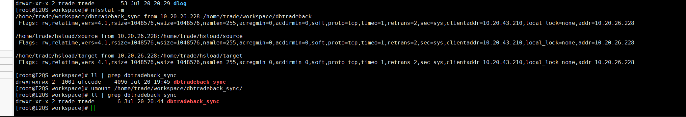
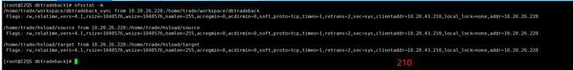

# NFS服务器

## 1. NFS 介绍

​	nfs（Network FileSystem ）


- RFC 1094, NFS 协议解释 <http://www.faqs.org/rfcs/rfc1094.html>
- Linux NFS-HOWTO：<http://www.tldp.org/HOWTO/NFS-HOWTO/index.html>

## 3. NFS 常用命令

### 3.1 nfsstat - list NFS statistics

```
nfsstat [OPTION]...
```

```
DESCRIPTION
       The nfsstat displays statistics kept about NFS client and server activity.
```

```
OPTIONS
       -s, --server
              Print only server-side statistics. The default is to print both server and client statistics.
       -c, --client
              Print only client-side statistics.
       -n, --nfs
              Print only NFS statistics. The default is to print both NFS and RPC information.
       -2     Print only NFS v2 statistics. The default is to only print information about the versions of NFS that have non-zero counts.
       -3     Print only NFS v3 statistics. The default is to only print information about the versions of NFS that have non-zero counts.
       -4     Print only NFS v4 statistics. The default is to only print information about the versions of NFS that have non-zero counts.
       -m, --mounts
              Print information about each of the mounted NFS file systems.
              If this option is used, all other options are ignored.
       -r, --rpc
              Print only RPC statistics. 
       -o facility
              Display statistics for the specified facility, which must be one of:
              nfs    NFS protocol information, split up by RPC call.
              rpc    General RPC information.
              net    Network layer statistics, such as the number of received packets, number of TCP connections, etc.
              fh     Usage information on the server's file handle cache, including the total number of lookups, and the number of hits and misses.
              rc     Usage information on the server's request reply cache, including the total number of lookups, and the number of hits and misses.
              all    Display all of the above facilities.
       -v, --verbose
              This is equivalent to -o all.
       -l, --list
              Print information in list form.
       -S, --since file
              Instead  of  printing  current  statistics,  nfsstat  imports  statistics  from  file and displays the difference between those and the current statistics.  Valid input files may be in the form of /proc/net/rpc/nfs (raw client stats), /proc/net/rpc/nfsd (raw server stats), or saved output from nfsstat itself (client and/or server stats). Any statistics missing from a saved nfsstat  output file are treated as zeroes.
       -Z[interval], --sleep=[interval]
              Instead  of  printing  current statistics and immediately exiting, nfsstat takes a snapshot of the current statistics and pauses until it receives SIGINT (typically from Ctrl-C), at which point it takes another snapshot and displays the difference between the two.  If interval is specified, nfsstat will print the number of NFS calls made since the previous report. Stats will be printed repeatedly every interval seconds.
```

```
EXAMPLES
       nfsstat -o all -234
              Show all information about all versions of NFS.
       nfsstat --verbose -234
              Same as above.
       nfsstat -o all
              Show all information about active versions of NFS.
       nfsstat --nfs --server -3
              Show statistics for NFS version 3 server.
       nfsstat -m
              Show information about mounted NFS filesystems.

DISPLAY
       The Flags output from the -m option is the same as the flags give to the mount command.

FILES
       /proc/net/rpc/nfsd
              procfs-based interface to kernel NFS server statistics.
       /proc/net/rpc/nfs
              procfs-based interface to kernel NFS client statistics.
       /proc/mounts
              procfs-based interface to the mounted filesystems.
```

```
BUGS
       The default output has been changed.  To get the old default output you must run nfsstat --auto -2.
       The function of the -v and -a options have changed. The -a option is now reserved for future use. The -v does what the -a option used to do, and the new -[234] options replace the -v option.
       The Display section should be more complete.

       Further bugs can be found or reported at http://nfs.sf.net/.
```

### 3.2 rpcinfo

### 3.3 mount

### 3.4 umount

### 3.5 showmount

### 3.6 exportfs

## 4. NFS相关实践

#### 4.1 开启启动

**挂载**

```shell
$ /root/scripts/mount_nfs.sh -c trade@{$client_ip}:/home/trade/workspace/dbtradeback_sync mount to trade@{$server_ip}:/home/trade/workspace/dbtradeback 1 
```

**卸载**

```shell
$ /root/scripts/umount_nfs.sh -c trade@{$client_ip}:/home/trade/workspace/dbtradeback_sync mount to trade@{$server_ip}:/home/trade/workspace/dbtradeback
```


## 常见问题

### umount.nfs4: /home/trade/workspace/dbtradeback: device is busy


### 连续两次安装有一个报错了，一个机器目录归属用户是trade，另一个是ufccode


### 从修改之前的版本升级到当前改动后的版本就会出现死循环的问题，挂载失败 


### 手动解绑之后这个目录就从777变成755了，归属用户也从ufccode变成trade了  



目前不报错了，但是用户还是ufccode，基础组反馈用户没有关系

### 服务端dbtradeback_sync目录偶现没挂载成功 


