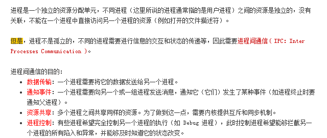

# 进程间通信

### ** **

### **1. 管道(pipe)**

​    管道是一种半双工的通信方式，数据只能单向流动，而且只能在具有亲缘关系的进程间使用。进程的亲缘关通常指的是父子进程关系或兄弟关系。进程向管道读写数据是通过创建管道时，系统设置的文件描述符进行的。因此对于管道两端的进程来说，管道是一个特殊文件，存在于内存。在创建管道时，系统为管道分配一个页面作为数据缓冲区，进行管道通信的两个进程通过读写这个缓冲区来进行通信。

### **2. 有名管道(named pipe)**

​    有名管道也是半双工的通信方式，但是它允许无亲缘关系进程间的通信。FIFO不同于管道之处在于它提供一个路径名与之关联，以FIFO的文件形式存储于文件系统中。有名管道是一个设备文件，因此即使进程与创建FIFO的进程无亲缘关系，只要可以访问该路径，就可以通过FIFO相互通信。值得注意的是：FIFO总是按照先进先出的原则工作。

### **3. 信号量(semophore)**

​    信号量是一个计数器，常用于处理进程或线程的同步问题， 特别是对临界资源访问的同步。临界资源可以简单的理解为在某一时刻只能由一个进程或线程进行操作的资源。这里的资源可以时一段代码、一个变量或某种硬件资源。信号量的值大于或等于0时表示可供并发进程使用的资源实体数；小于0代表正在等待使用临界资源的进程数。

​    信号量常用来作为一种锁机制，防止某进程正在访问共享资源时，其他进程也访问该资源。因此主要作为进程间以及同一进程内不同线程间的同步手段。

​    与消息队列类似，Linux内核也为每个信号集维护了一个semid_ds数据结构实例。该结构在linux/sem.h中，各字段含义如下：

```
struct semid_ds
{
        struct ipc_perm  sem_perm;               /* 对信号进行操作的许可权 */
        __kernel_time_t  sem_otime;              /* 对信号操作的最后时间 */
        __kernel_time_t  sem_ctime;              /* 对信号进行修改的最后时间 */
        struct sem       *sem_base;              /* 指向数组中的第一个信号 */
        struct sem_queue *sem_pending;          /* 等待处理的挂起操作 */
        struct sem_queue **sem_pending_last;    /* 最后一个正在挂起的操作 */
        struct sem_undo  *undo;                  /* 撤销的请求 */
        unsigned short   sem_nsems;              /* 数组中的信号数 */
};
```

**信号量的使用**

```
int semop(int semid, struct sembuf *sops, unsigned nsops);
```

   第一个参数表示信号集的标识符，第二个参数sops指向进行操作的结构体数组首地址；

 第三个参数nsops指出将要进行操作的信号的个数。

   函数调用成功返回0，失败返回-1。                                             

   第二个参数sops指向的结构体数组中，每个sembuf结构体对应一个特定信号的操作。因

 此对信号进行操作必须熟悉该数据结构，该结构体定义在linux/sem.h中。

```
struct sembuf
{
    unsigned short sem_num;  //信号在信号集中的索引
    short          sem_op;  //操作类型
    short          sem_flg;  //操作标志
};      
```

**sem_op取值：**

| sem_op>0 | 信号加上sem_op的值，表示进程释放控制的资源                   |
| -------- | ------------------------------------------------------------ |
| sem_op=0 | 如果没有设置IPC_NOWAIT，则调用进程进入睡眠状态，直到信号值为0；否则进程不会睡眠，直接返回EAGAIN。 |
| sem_op<0 | 信号加上sem_op的值，若没有设置IPC_NOWAIT，则调用进程阻塞，直到资源可用；否则进程直接返回EAGAIN。 |

**sem_flg取值：**

   IPC_NOWAIT:

   SEM_UNDO:

**4. 消息队列(message queue)**

​    消息队列是消息的链表，存放在内核中并由消息队列标识符标识。消息队列克服了信号传递信息量少、管道只能承载无格式字节流以及缓冲区大小受限等缺点。与管道不同的是，消息队列存放在内核中，只有在内核重启（即操作系统重启）或者显示地删除一个消息队列时，该息队列才会被真正的删除。想要掌握消息队列，必须熟悉一些特定的数据结构：
​    **a.** linux系统定义了一个消息模板数据结构msgbuf：

```
#include <linux/msg.h>
struct msgbuf 
{
    long mtype;    //表示消息类型，可以使消息在一个队列中重复使用。
    char mtext[1]; //消息内容
};
```

​    注意：mtext字段虽然定义为char类型，但并不代表消息只能是一个字符，消息内容可以为任意类型，由用户根据需要定义。如下就是用户自定的一个消息结构：

```
struct myMsgbuf
{
    long mtype;
    struct student stu;
};
```

​    消息队列中，消息的大小是受限制的，由<linux/msg.h>中的宏MSGMAX给出消息的最大长度，在实际应用中需要注意。

​    **b.** 在Linux内核中，每个消息队列都维护了一个结构体msqid_ds，定义在<linux/msg.h>中，此结构体保存消息队列当前的状态信息。

```
#include <linux/msg.h>
struct msqid_ds
{
     struct ipc_perm   msg_perm;         //是一个ipc_perm结构，保存消息队列的存取权限等，详情看下面
     struct _msg       *msg_first;      //队列的第一条消息
     struct _msg       *sg_last;        //队列最后一条消息
    __kernel_t time_t  msg_stime;       //向消息队列发送最后一条消息的时间
    __kernel_t time_t  msg_rtime;       //从消息队列取第一条消息的时间
    __kernel_t time_t  msg_ctime;       //最后一次变更消息队列的时间
    unsigned long      msg_lcbytes;     
    unsigned long      msg_lqbytes;
    unsigned short     msg_cbytes;      //消息队列中所有消息占的字节数
    unsigned short     msg_qnum;        //消息队列中消息的数目
    unsigned short     msg_qbytes;      //消息队列的最大字节数
    __Kernel_ipc_pid_t msg_lspid;       //向消息队列发送最后一条消息的进程ID
    __kernel_ipc_pid_t msg_lrpid;       //从消息队列读取最后一条消息的进程ID
};
```

​    **c.** ipc_perm内核数据结构

```
#include <linux/ipc.h>
struct ipc_perm
{
    __kernel_key_t  key;    //创建消息队列用到的key值
    __kernel_uid_t  uid;    //消息队列的用户ID
    __kernel_gid_t  gid;    //消息队列的组ID
    __kernel_uid_t  cuid;   //创建消息队列的进程用户ID
    __kernel_gid_t  cgid;   //创建消息队列的进程组ID
    __kernel_mode_t mode;
    unsigned_short  seq;
};
```

###  **5. 信号（signal）**

​    信号是一种比较复杂的通信方式，用于通知接收进程某个时间已经发生。是一种进程间异步通信方式。

###  **6. 共享内存（shared memory）**

​    共享内存就是映射一段能被其他进程所访问的内存，这段内存有一个进程创建但是多个进程都可以访问。共享内存是最快的IPC方式，它是针对其他进程间通信方式运行效率低而专门设计的。他往往与其他通信机制，如信号量，配合使用，来实现进程间同步和异步。

​    与消息队列类似，Linux内核也为每个共享内存段维护了一个shmid_ds内部数据结构，该结构在linux/sem.h中，各字段含义如下：

```
struct shmid_ds {
        struct ipc_perm         shm_perm;       /* operation perms */
        int                     shm_segsz;      /* size of segment (bytes) */
        __kernel_time_t         shm_atime;      /* last attach time */
        __kernel_time_t         shm_dtime;      /* last detach time */
        __kernel_time_t         shm_ctime;      /* last change time */
        __kernel_ipc_pid_t      shm_cpid;       /* pid of creator */
        __kernel_ipc_pid_t      shm_lpid;       /* pid of last operator */
        unsigned short          shm_nattch;     /* no. of current attaches */
        unsigned short          shm_unused;     /* compatibility */
        void                    *shm_unused2;   /* ditto - used by DIPC */
        void                    *shm_unused3;   /* unused */
};
```

###  7. 套接字（socket）

套接字也是一种进程间通信机制，与其他不同的是，它可以用于不同机器间的进程通信（网络socket）。

UNIX Domain Socket是在socket架构上发展起来的用于同一台主机的进程间通讯（IPC），它不需要经过网络协议栈，不需要打包拆包、计算校验和、维护序号和应答等，只是将应用层数据从一个进程拷贝到另一个进程。UNIX Domain Socket有SOCK_DGRAM或SOCK_STREAM两种工作模式，类似于UDP和TCP，但是面向消息的UNIX Domain Socket也是可靠的，消息既不会丢失也不会顺序错乱。

UNIX Domain Socket可用于两个没有亲缘关系的进程，是全双工的，是目前使用最广泛的IPC机制，比如X Window服务器和GUI程序之间就是通过UNIX Domain Socket通讯的。

UNIX Domain socket与网络socket类似，可以与网络socket对比应用。

上述二者编程的不同如下：

> * address family为AF_UNIX
> * 因为应用于IPC，所以UNIXDomain socket不需要IP和端口，取而代之的是文件路径来表示“网络地址”。这点体现在下面两个方面。
> * 地址格式不同，UNIXDomain socket用结构体sockaddr_un表示，是一个socket类型的文件在文件系统中的路径，这个socket文件由bind()调用创建，如果调用bind()时该文件已存在，则bind()错误返回。
> * UNIX Domain Socket客户端一般要显式调用bind函数，而不像网络socket一样依赖系统自动分配的地址。客户端bind的socket文件名可以包含客户端的pid，这样服务器就可以区分不同的客户端。

UNIX Domain socket的工作流程简述如下（与网络socket相同）。

> * 服务器端：创建socket—绑定文件（端口）—监听—接受客户端连接—接收/发送数据—…—关闭
> * 客户端：创建socket—绑定文件（端口）—连接—发送/接收数据—…—关闭

###  **8. 环境变量** 


> * 1. 管道的缺点：管道没有名字，管道的缓冲区大小受限，管道所传送的是无格式的字节流，这就要求管道的输入方和输出方事先约定好数据格式。