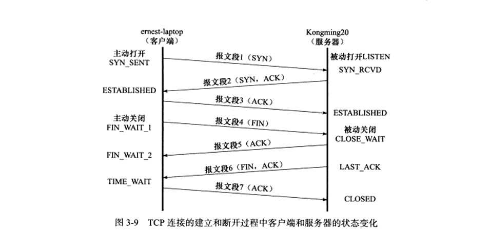

# TCP

## TCP简介

​		TCP是一种面向连接的、可靠的、基于字节流的传输层通信协议。
面向连接： 面向连接意味着使用tcp的应用程序在传输数据前必须先建立连接，就如打电话一样，要先进行拨号，等待对方响应才能开始说话。
可靠性：tcp协议通过下列方式来提高可靠性：

- 应用数据被分割成TCP认为最适合发送的数据块。这和UDP完全不同，应用程序产生的数据报长度将保持不变。由TCP传递给IP的信息单位称为报文段或段

- 当TCP发出一个段后，它启动一个定时器，等待目的端确认收到这个报文段。如果不能及时收到一个确认，将重发这个报文段。

- 当TCP收到发自TCP连接另一端的数据，它将发送一个确认。这个确认不是立即发送，通常将推迟几分之一秒。

- TCP将保持它首部和数据的检验和。这是一个端到端的检验和，目的是检测数据在传输过程中的任何变化。如果收到段的检验和有差错，TCP将丢弃这个报文段和不确认收到此报文段（希望发端超时并重发）。

- 既然TCP报文段作为IP数据报来传输，而IP数据报的到达可能会失序，因此TCP报文段的到达也可能会失序。如果必要，TCP将对收到的数据进行重新排序，将收到的数据以正确的顺序交给应用层。

- 既然I P数据报会发生重复，TCP的接收端必须丢弃重复的数据。

- TCP还能提供流量控制。TCP连接的每一方都有固定大小的缓冲空间。TCP的接收端只允许另一端发送接收端缓冲区所能接纳的数据。这将防止较快主机致使较慢主机的缓冲区溢出。
  

字节流：两个应用程序通过TCP连接交换8 bit字节构成的字节流。

　　另外，TCP对字节流的内容不作任何解释。TCP不知道传输的数据字节流是二进制数据，还是ASCII字符或者其他类型数据。对字节流的解释由TCP连接双方的应用层解释。

TCP首部格式

　　tcp数据是被封装在IP数据包中的，和udp类似，在IP数据包的数据部分。tcp数据包的格式如下：
　　
　　

```
源端口和目的端口
   各占2个字节，这两个值加上IP首部中的源端IP地址和目的端IP地址唯一确定一个TCP连接。有时一个IP地址和一个端口号也称为socket（插口）。
   
序号(seq)
   占4个字节，是本报文段所发送的数据项目组第一个字节的序号。在TCP传送的数据流中，每一个字节都有一个序号。例如，一报文段的序号为300，而且数据共100字节，则下一个报文段的序号就是400；序号是32bit的无符号数，序号到达2^32-1后从0开始。
   
确认序号(ack)
   占4字节，是期望收到对方下次发送的数据的第一个字节的序号，也就是期望收到的下一个报文段的首部中的序号；确认序号应该是上次已成功收到数据字节序号+1。只有ACK标志为1时，确认序号才有效。
   
数据偏移
   占4比特，表示数据开始的地方离TCP段的起始处有多远。实际上就是TCP段首部的长度。由于首部长度不固定，因此数据偏移字段是必要的。数据偏移以32位为长度单位，也就是4个字节，因此TCP首部的最大长度是60个字节。即偏移最大为15个长度单位=1532位=154字节。保留6比特，供以后应用，现在置为0。

6个标志位比特
URG：当URG=1时，注解此报文应尽快传送，而不要按本来的列队次序来传送。与“紧急指针”字段共同应用，紧急指针指出在本报文段中的紧急数据的最后一个字节的序号，使接管方可以知道紧急数据共有多长。
ACK：只有当ACK=1时，确认序号字段才有效；
PSH：当PSH=1时，接收方应该尽快将本报文段立即传送给其应用层。
RST：当RST=1时，表示出现连接错误，必须释放连接，然后再重建传输连接。复位比特还用来拒绝一个不法的报文段或拒绝打开一个连接；
SYN：SYN=1,ACK=0时表示请求建立一个连接，携带SYN标志的TCP报文段为同步报文段；
FIN：发端完成发送任务。

窗口
   TCP通过滑动窗口的概念来进行流量控制。设想在发送端发送数据的速度很快而接收端接收速度却很慢的情况下，为了保证数据不丢失，显然需要进行流量控制， 协调好通信双方的工作节奏。所谓滑动窗口，可以理解成接收端所能提供的缓冲区大小。TCP利用一个滑动的窗口来告诉发送端对它所发送的数据能提供多大的缓 冲区。窗口大小为字节数起始于确认序号字段指明的值（这个值是接收端正期望接收的字节）。窗口大小是一个16bit字段，因而窗口大小最大为65535字节。

检验和
	检验和覆盖了整个TCP报文段：TCP首部和数据。这是一个强制性的字段，一定是由发端计算和存储，并由收端进行验证。

紧急指针
   只有当URG标志置1时紧急指针才有效。紧急指针是一个正的偏移量，和序号字段中的值相加表示紧急数据最后一个字节的序号。
```


**三次握手：**

​    在服务器准备好接受外来的连接后，

​    （1）客户端通过connect发起主动打开（active open）。这导致客户端TCP发送一个SYN分节，告诉服务器客户将在连接中发送的数据的初始序列号，如上图中的SYN seq=x, x为初始序列号。

​    （2）服务器必须确认（ACK）客户端的SYN，同时自己也得发送一个SYN分节；它含有服务器将在同一连接中发送的数据的初始序列号。服务器在单个分节中发送SYN和对客户SYN的ACK。

​    （3）客户端确认（ACK）服务器的SYN。

**四次挥手：**

​    （1）某个应用进程首先调用close，我们称该端执行主动关闭（active close）。该端的TCP于是发送一个FIN分节，表示数据发送完毕。

​    （2）接收到这个FIN的对端执行被动关闭（passive close）。这个FIN由接收端TCP确认（ACK）。它的接收也作为一个文件结束符传递给接收端应用进程（放在已排队等候该应用进程接收的任何其他数据之后），因为FIN的接收意味着接收端应用进程在相应连接上再无额外数据可接收。

​    （3）一段时间后，接收到这个文件结束符的应用进程将调用close关闭它的套接字。这导致它的TCP也发送一个FIN分节。

​    （4）接收这个最终FIN的原发送端TCP（即执行主动关闭的一端）确认（ACK）这个FIN。



 **其中大多数状态都很好理解，但是关于TIME_WAIT状态，有以下几点需要了解。**

​    TIME_WAIT状态存在的原因有两点：

​     （1）可靠地终止TCP连接；

​     （2）保证让迟来的TCP报文段有足够的的时间被识别并抛弃。

​		第一个原因的理解：如果上图中用于确认报文段6的报文段7丢失，那么服务器将重新发送结束报文段。因此客户端需要停留在某个状态以处理重复收到的结束报文段（即向服务器发送确认报文段）。否则，客户端将以复位报文段来回应服务器，服务器则认为这是一个错误，因为它期望的是一个像TCP报文段7一样的确认报文段。

​		第二个原因的理解：一个TCP端口不能被同时打开多次（两次及以上）。当一个TCP连接处于TIME_WAIT状态时，我们将无法立即使用该连接占用着的端口来建立一个新连接。反过来思考，如果不存在TIME_WAIT状态，则应用程序能够立即建立一个和刚关闭的连接相似的连接（这里的相似是指具有相同的IP地址和端口号）。这个新的和原来相似的连接被称为原来的连接的化身。新的化身可能接收到属于原来的连接的、携带应用程序数据的报文段（迟到的报文），这显然时不应该发生的。

​		被动关闭的服务无需任何 wait time，直接释放资源。但主动关闭一方并不知道被动关闭一方是否接到自己的 ACK，则会有：

1）如果被动关闭一方没有收到主动关闭一方的 ACK，即报文段7，则会超时重传 FIN，那么主动关闭的一方再次接到被动关闭方重传的 FIN，会再次发送 ACK。

2）如果被动关闭方收到主动关闭方的 ACK，也不会再发任何消息，包括ACK，这个时候可以通过等待MSL 时间确保被动关闭方没有再重传 FIN，则认为被动关闭方正常收到 ACK。

```
TIME_WAIT 2MSL = 报文段7 ACK消息最大存活时间（MSL) + 发生超时时来向FIN消息的最大存活时间（MSL）。
```

​		TCP报文段最大生存时间为MSL（Maximum Segment Life）,所以坚持2MSL时间的TIME_WAIT状态能够确保网络上两个传输方向上尚未被接收到的、迟到的TCP报文段都已经消失。

​		有时候我们希望避免TIME_WAIT状态，因为当程序退出后，我们希望立即重启它。这时，我们可以通过设置socket选项SO_REUSERADDR来强制进程立即使用TIME_WAIT状态占用的端口。

* 首先，能用长连接就少用短连接
* 其次，如果能使用 N 个 ip 作为 src ip，那么你的可用源端口数量将增大 N 倍
* 再次，如果前两项做不到，则可以根据你的实际应用场景，调节可用源端口范围 (**net.ipv4.ip_local_port_range**) 和最大可用 TIME_WAIT 数量 (**net.ipv4.tcp_max_tw_buckets**)
* 最后，还可使能针对 TIME_WAIT 的重用和回收特性 (**net.ipv4.tcp_tw_reuse**和**net.ipv4.tcp_tw_recycle**) 实现“复用”

```
net.ipv4.tcp_max_tw_buckets = 150000  // 甚至可以更大
net.ipv4.ip_local_port_range = 32768 61000 // 按需调整
net.ipv4.tcp_timestamps = 1
net.ipv4.tcp_tw_recycle = 0
net.ipv4.tcp_tw_reuse = 1
```


## TCP 流量控制（滑动窗口）

​		TCP流量控制主要是针对接收端的处理速度不如发送端发送速度快的问题，消除发送方使接收方缓存溢出的可能性。

​		TCP流量控制主要使用滑动窗口协议，滑动窗口是接受数据端使用的窗口大小，用来告诉发送端接收端的缓存大小，以此可以控制发送端发送数据的大小，从而达到流量控制的目的。这个窗口大小就是我们一次传输几个数据。对所有数据帧按顺序赋予编号，发送方在发送过程中始终保持着一个发送窗口，只有落在发送窗口内的帧才允许被发送；

​		同时接收方也维持着一个接收窗口，只有落在接收窗口内的帧才允许接收。这样通过调整发送方窗口和接收方窗口的大小可以实现流量控制。

我们可以通过下图来分析:


```
1. 发送方接收到了对方发来的报文 ack = 33, win = 10，知道对方收到了 33 号前的数据，现在期望接收 [33, 43) 号数据。那我们开始发送[33, 43) 号的数据。
2. [33, 43) 号的数据你是已经发送了,但接受方并没有接受到[36,37]数据。所以接收方发送回对报文段 A 的确认：ack = 35,win =10。
3. 发送方收到了 ack = 35, win = 10，对方期望接收 [35, 45) 号数据。那么发送方在发送[35, 45) 。
	这里面需要思考一个问题？
	第一步发送了[33, 43),如果这次发送[35, 45),那中间重叠部分不是发送了两次,所以这里要思考: 是全部重新发送还是只发送接收端没有收到的数据,如果全部发送那么重复发送的数据接收端怎么处理。这个下面快速重传会讲。
4. 接收方接收到了报文段 [35, 41)，接收方发送：ack = 41, win = 10. （这是一个累积确认）
5. 发送方收到了 ack = 41, win = 10，对方期望接收 [41, 51) 号数据。

6. .......
```

 		这样一直传输数据,直到数据发送完成。这么一来就保证数据数据的可靠性,因为如果某数据没有获取到,那么ack永远不会跳过它。

 这里也要思考一个问题,如果某一数据一直没有获取到,总不能一直这样堵塞在这里吧,这里就要讲接下来有关堵塞的解决方法

## TCP拥塞控制

​		流量控制是通过接收方来控制流量的一种方式；而拥塞控制则是通过发送方来控制流量的一种方式。TCP发送方可能因为IP网络的拥塞而被遏制，TCP拥塞控制就是为了解决这个问题（注意和TCP流量控制的区别）。

​		TCP拥塞控制的几种方法：慢启动，拥塞避免，快重传和快恢复。

​		这里先理解一个概念: 拥塞窗口，拥塞窗口：发送方维持一个叫做拥塞窗口 cwnd的状态变量。拥塞窗口的大小取决于网络的拥塞程度，并且动态变化。

​		发送方的让自己的发送窗口=min(cwnd，接受端接收窗口大小）。说明: 发送方取拥塞窗口与滑动窗口的最小值作为发送的上限。

​		发送方控制拥塞窗口的原则是：只要网络没有出现拥塞，拥塞窗口就增大一些，以便把更多的分组发送出去。但只要网络出现拥塞，拥塞窗口就减小一些，以减少注入到网络中的分组数。

​		下面将讨论拥塞窗口 cwnd 的大小是怎么变化的。

### 慢启动

​		TCP在连接过程的三次握手完成后，开始传数据，并不是一开始向网络通道中发送大量的数据包。因为假如网络出现问题，很多这样的大包会积攒在路由器上，很容易导致网络中路由器缓存空间耗尽，从而发生拥塞。因此现在的TCP协议规定了，新建立的连接不能够一开始就发送大尺寸的数据包，而只能从一个小尺寸的包开始发送，在发送和数据被对方确认的过程中去计算对方的接收速度，来逐步增加每次发送的数据量（最后到达一个稳定的值，进入高速传输阶段。相应的，慢启动过程中，TCP通道处在低速传输阶段），以避免上述现象的发生。这个策略就是慢启动。

画个简单的图从原理上粗略描述一下

 

**思考一个慢启动引起的性能问题？**

​		在海量用户高并发访问的大型网站后台，有一些基本的系统维护需求。比如迁移海量小文件，就是从一些机器拷贝海量小碎文件到另一些机器，来完成一些系统维护的基本需求。

**慢启动为什么会对拷贝海量小文件的需求造成重大性能损失？**

  		举个简单的例子，我们对每个文件都采用独立的TCP连接来传输（循环使用scp拷贝就是这个例子的实际场景，很常见的用法）。那么工作过程应该是，每传输一个文件建立一个连接，然后连接处于慢启动阶段，传输小文件，每个小文件几乎都处于独立连接的慢启动阶段被传输，这样传输过程所用的TCP包的总量就会增多。更细致的说一说这个事，如果慢启动过程中传输一个小文件，我们可能需要2至3个小包，而在一个已经完成慢启动的TCP通道中（TCP通道已进入在高速传输阶段），我们传输这个文件可能只需要1个大包。网络拷贝文件的时间基本上全部消耗都在网络传输的过程中（发数据过去等对端ACK，ACK确认归来继续再发，这样的数据来回交互相比较本机的文件读写非常耗时间），撇开三次握手和四次握手那些包，如果文件的数量足够大，这个总时间就会被放大到需求难以忍受的地步。

​		因此，在迁移海量小文件的需求下，我们不能使用“对每个文件都采用独立的TCP连接来传输（循环使用scp拷贝）“这样的策略，它会使每个文件的传输都处于在一个独立TCP的慢启动阶段。

**如何避免慢启动，进而提升性能？**

​		很简单，尽量把大量小文件放在一个TCP连接中排队传输。起初的一两个文件处于慢启动过程传输，后续的文件传输全部处于高速通道中传输，用这样的方式来减少发包的数目，进而降低时间消耗。同样，实际上这种传输策略带来的性能提升的功劳不仅仅归于避免慢启动，事实上也避免了大量的3次握手和四次握手，这个对海量小文件传输的性能消耗也非常致命。

### 拥塞避免

​		先补充下: 慢启动中拥塞窗口的 cwnd 值，开始是1，接下开是指数型增涨的。1、2、4、8、16.....这样涨太快了吧。那么就有了堵塞避免。cwnd 不能一直这样无限增长下去，一定需要某个限制。TCP使用了一个叫慢启动门限（ssthresh）的变量，一旦cwnd >= ssthresh（大多数TCP的实现，通常大小都是65536），慢启动过程结束，拥塞避免阶段开始；

​		拥塞避免：cwnd 的值不再指数级往上升，开始加法增加。此时当窗口中所有的报文段都被确认时，cwnd 的大小加1，cwnd 的值就随着 RTT（Round Trip Time）开始线性增加，这样就可以避免增长过快导致网络拥塞，慢慢的增加调整到网络的最佳值，它逻辑很简单就是到一定值后，cwnd 不在是指数增长，而是+1增长，这样显然慢多了。

非 ECN（显式拥塞通知）环境下的拥塞判断，发送方RTO（Retransmission TimeOut）超时，重传了一个报文段，它的逻辑如下：

```
1）把ssthresh降低为cwnd值的一半。
2）把cwnd重新设置为1。
3）重新进入慢启动过程。
```

  

 上面的图还是蛮好理解的。

### 快重传

​		TCP要保证所有的数据包都可以到达，所以，必需要有重传机制。

​		注意: 接收端给发送端的 Ack 确认只会确认最后一个连续的包，比如，发送端发了1,2,3,4,5一共五份数据，接收端收到了1，2，于是回 ack 3，然后收到了4（注意此时3没收到）此时的 TCP 会怎么办？我们要知道，因为正如前面所说的，SeqNum 和 Ack 是以字节数为单位，所以 ack 的时候，不能跳着确认，只能确认最大的连续收到的包，不然，发送端就以为之前的都收到了。

**3.1）超时重传机制**

​		一种是不回 ack，死等 3，当发送方发现收不到 3 的 ack 超时后，会重传 3。一旦接收方收到 3 后，会ack 回 4 ——意味着 3 和 4 都收到了。但是，这种方式会有比较严重的问题，那就是因为要死等3，所以会导致 4 和 5 即便已经收到了，而发送方也完全不知道发生了什么事，因为没有收到 Ack，所以，发送方可能会悲观地认为也丢了，所以有可能也会导致4和5的重传。

对此有两种选择：

> * 一种是仅重传 timeout 的包。也就是第3份数据。
> *  另一种是重传 timeout 后所有的数据，也就是第3，4，5这三份数据。

​		这两种方式有好也有不好。第一种会节省带宽，但是慢，第二种会快一点，但是会浪费带宽，也可能会有无用功。但总体来说都不好。因为都在等 timeout，timeout可能会很长。

**3.2）快速重传机制**

​		于是，TCP引入了一种叫 Fast Retransmit 的算法，不以时间驱动，而以数据驱动重传。也就是说，如果包没有连续到达，就 ack 最后那个可能被丢了的包，如果发送方连续收到 3 次相同的 ack，就重传。Fast Retransmit 的好处是不用等 timeout 了再重传，而是只是三次相同的 ack 就重传。

**比如**：如果发送方发出了 1，2，3，4，5 份数据，第一份先到送了，于是就 ack 回 2，结果 2 因为某些原因没收到，3 到达了，于是还是 ack 回 2，后面的 4 和 5 都到了，但是还是 ack 回 2，因为 2 还是没有收到，于是发送端收到了三个 ack = 2 的确认，知道了 2 还没有到，于是就马上重传 2。然后接收端收到了 2，此时因为 3，4，5 都收到了，于是 ack 回 6。示意图如下：

 

 		Fast Retransmit只解决了一个问题，就是timeout的问题，它依然面临一个艰难的选择，就是重转之前的一个还是重传所有的问题。对于上面的示例来说，是重传#2呢还是重传\#2，#3，#4，#5呢？因为发送端并不清楚这连续的3个ack(2)是谁传回来的？也许发送端发了20份数据，是#6，#10，#20传来的呢。这样，发送端很有可能要重传从#2到\#20的这堆数据（这就是某些TCP的实际的实现）。可见，这是一把双刃剑。

**总结**: 不管是超时重传还是快速重传确实能保证数据的可靠性,但它无法解决的问题就是：比如发送端发了 1、2、3、4、5，而接收端收到了 1、3、4、5，那么这个时候它发送的 ack 是 2。那么发送端发送的是重传 #2 呢还是重传 #2，#3，#4，#5 的问题。如果在发送 #2，#3，#4，#5，本身资源是一种浪费，因为接收方 #3，#4，#5 已经缓存下来，只需 #2，所以再发一遍是无意义的。

## TCP 调优

来源：https://zhuanlan.zhihu.com/p/146752547


### **01 TCP 三次握手的性能提升**

TCP 是面向连接的、可靠的、双向传输的传输层通信协议，所以在传输数据之前需要经过三次握手才能建立连接。


那么，三次握手的过程在一个 HTTP 请求的平均时间占比 10% 以上，在网络状态不佳、高并发或者遭遇 SYN 攻击等场景中，如果不能有效正确的调节三次握手中的参数，就会对性能产生很多的影响。

如何正确有效的使用这些参数，来提高 TCP 三次握手的性能，这就需要理解「三次握手的状态变迁」，这样当出现问题时，先用 `netstat` 命令查看是哪个握手阶段出现了问题，再来对症下药，而不是病急乱投医。


客户端和服务端都可以针对三次握手优化性能。主动发起连接的客户端优化相对简单些，而服务端需要监听端口，属于被动连接方，其间保持许多的中间状态，优化方法相对复杂一些。

所以，客户端（主动发起连接方）和服务端（被动连接方）优化的方式是不同的，接下来分别针对客户端和服务端优化。

#### 客户端优化

三次握手建立连接的首要目的是「同步序列号」。

只有同步了序列号才有可靠传输，TCP 许多特性都依赖于序列号实现，比如流量控制、丢包重传等，这也是三次握手中的报文称为 SYN 的原因，SYN 的全称就叫 *Synchronize Sequence Numbers*（同步序列号）。


> SYN_SENT 状态的优化

客户端作为主动发起连接方，首先它将发送 SYN 包，于是客户端的连接就会处于 `SYN_SENT` 状态。

客户端在等待服务端回复的 ACK 报文，正常情况下，服务器会在几毫秒内返回 SYN+ACK ，但如果客户端长时间没有收到 SYN+ACK 报文，则会重发 SYN 包，**重发的次数由 tcp_syn_retries 参数控制**，默认是 5 次：


通常，第一次超时重传是在 1 秒后，第二次超时重传是在 2 秒，第三次超时重传是在 4 秒后，第四次超时重传是在 8 秒后，第五次是在超时重传 16 秒后。没错，**每次超时的时间是上一次的 2 倍**。

当第五次超时重传后，会继续等待 32 秒，如果服务端仍然没有回应 ACK，客户端就会终止三次握手。

所以，总耗时是 1+2+4+8+16+32=63 秒，大约 1 分钟左右。


你可以根据网络的稳定性和目标服务器的繁忙程度修改 SYN 的重传次数，调整客户端的三次握手时间上限。比如内网中通讯时，就可以适当调低重试次数，尽快把错误暴露给应用程序。

#### 服务端优化

当服务端收到 SYN 包后，服务端会立马回复 SYN+ACK 包，表明确认收到了客户端的序列号，同时也把自己的序列号发给对方。

此时，服务端出现了新连接，状态是 `SYN_RCV`。在这个状态下，Linux 内核就会建立一个「半连接队列」来维护「未完成」的握手信息，当半连接队列溢出后，服务端就无法再建立新的连接。


SYN 攻击，攻击的是就是这个半连接队列。

> 如何查看由于 SYN 半连接队列已满，而被丢弃连接的情况？

我们可以通过该 `netstat -s` 命令给出的统计结果中， 可以得到由于半连接队列已满，引发的失败次数：


上面输出的数值是**累计值**，表示共有多少个 TCP 连接因为半连接队列溢出而被丢弃。**隔几秒执行几次，如果有上升的趋势，说明当前存在半连接队列溢出的现象**。

> 如何调整 SYN 半连接队列大小？

要想增大半连接队列，**不能只单纯增大 tcp_max_syn_backlog 的值，还需一同增大 somaxconn 和 backlog，也就是增大 accept 队列。否则，只单纯增大 tcp_max_syn_backlog 是无效的。**

增大 tcp_max_syn_backlog 和 somaxconn 的方法是修改 Linux 内核参数：


增大 backlog 的方式，每个 Web 服务都不同，比如 Nginx 增大 backlog 的方法如下：


最后，改变了如上这些参数后，要重启 Nginx 服务，因为 SYN 半连接队列和 accept 队列都是在 `listen()` 初始化的。

> 如果 SYN 半连接队列已满，只能丢弃连接吗？

并不是这样，**开启 syncookies 功能就可以在不使用 SYN 半连接队列的情况下成功建立连接**。

syncookies 的工作原理：服务器根据当前状态计算出一个值，放在己方发出的 SYN+ACK 报文中发出，当客户端返回 ACK 报文时，取出该值验证，如果合法，就认为连接建立成功，如下图所示。


syncookies 参数主要有以下三个值：

- 0 值，表示关闭该功能；
- 1 值，表示仅当 SYN 半连接队列放不下时，再启用它；
- 2 值，表示无条件开启功能；

那么在应对 SYN 攻击时，只需要设置为 1 即可：


> SYN_RCV 状态的优化

当客户端接收到服务器发来的 SYN+ACK 报文后，就会回复 ACK 给服务器，同时客户端连接状态从 SYN_SENT 转换为 ESTABLISHED，表示连接建立成功。

服务器端连接成功建立的时间还要再往后，等到服务端收到客户端的 ACK 后，服务端的连接状态才变为 ESTABLISHED。

如果服务器没有收到 ACK，就会重发 SYN+ACK 报文，同时一直处于 SYN_RCV 状态。

当网络繁忙、不稳定时，报文丢失就会变严重，此时应该调大重发次数。反之则可以调小重发次数。**修改重发次数的方法是，调整 tcp_synack_retries 参数**：


tcp_synack_retries 的默认重试次数是 5 次，与客户端重传 SYN 类似，它的重传会经历 1、2、4、8、16 秒，最后一次重传后会继续等待 32 秒，如果服务端仍然没有收到 ACK，才会关闭连接，故共需要等待 63 秒。

服务器收到 ACK 后连接建立成功，此时，内核会把连接从半连接队列移除，然后创建新的完全的连接，并将其添加到 accept 队列，等待进程调用 accept 函数时把连接取出来。

如果进程不能及时地调用 accept 函数，就会造成 accept 队列（也称全连接队列）溢出，最终导致建立好的 TCP 连接被丢弃。


> accept 队列已满，只能丢弃连接吗？

丢弃连接只是 Linux 的默认行为，我们还可以选择向客户端发送 RST 复位报文，告诉客户端连接已经建立失败。打开这一功能需要将 tcp_abort_on_overflow 参数设置为 1。


tcp_abort_on_overflow 共有两个值分别是 0 和 1，其分别表示：

- 0 ：如果 accept 队列满了，那么 server 扔掉 client 发过来的 ack ；
- 1 ：如果 accept 队列满了，server 发送一个 `RST` 包给 client，表示废掉这个握手过程和这个连接；

如果要想知道客户端连接不上服务端，是不是服务端 TCP 全连接队列满的原因，那么可以把 tcp_abort_on_overflow 设置为 1，这时如果在客户端异常中可以看到很多 `connection reset by peer` 的错误，那么就可以证明是由于服务端 TCP 全连接队列溢出的问题。

通常情况下，应当把 tcp_abort_on_overflow 设置为 0，因为这样更有利于应对突发流量。

举个例子，当 accept 队列满导致服务器丢掉了 ACK，与此同时，客户端的连接状态却是 ESTABLISHED，客户端进程就在建立好的连接上发送请求。只要服务器没有为请求回复 ACK，客户端的请求就会被多次「重发」。**如果服务器上的进程只是短暂的繁忙造成 accept 队列满，那么当 accept 队列有空位时，再次接收到的请求报文由于含有 ACK，仍然会触发服务器端成功建立连接。**


所以，tcp_abort_on_overflow 设为 0 可以提高连接建立的成功率，只有你非常肯定 TCP 全连接队列会长期溢出时，才能设置为 1 以尽快通知客户端。

> 如何调整 accept 队列的长度呢？

accept 队列的长度取决于 somaxconn 和 backlog 之间的最小值，也就是 min(somaxconn, backlog)，其中：

- somaxconn 是 Linux 内核的参数，默认值是 128，可以通过 `net.core.somaxconn` 来设置其值；
- backlog 是 `listen(int sockfd, int backlog)` 函数中的 backlog 大小；

Tomcat、Nginx、Apache 常见的 Web 服务的 backlog 默认值都是 511。

> 如何查看服务端进程 accept 队列的长度？

可以通过 `ss -ltn` 命令查看：


- Recv-Q：当前 accept 队列的大小，也就是当前已完成三次握手并等待服务端 `accept()` 的 TCP 连接；
- Send-Q：accept 队列最大长度，上面的输出结果说明监听 8088 端口的 TCP 服务，accept 队列的最大长度为 128；

> 如何查看由于 accept 连接队列已满，而被丢弃的连接？

当超过了 accept 连接队列，服务端则会丢掉后续进来的 TCP 连接，丢掉的 TCP 连接的个数会被统计起来，我们可以使用 netstat -s 命令来查看：


上面看到的 41150 times ，表示 accept 队列溢出的次数，注意这个是累计值。可以隔几秒钟执行下，如果这个数字一直在增加的话，说明 accept 连接队列偶尔满了。

如果持续不断地有连接因为 accept 队列溢出被丢弃，就应该调大 backlog 以及 somaxconn 参数。

#### 如何绕过三次握手？

以上我们只是在对三次握手的过程进行优化，接下来我们看看如何绕过三次握手发送数据。

三次握手建立连接造成的后果就是，HTTP 请求必须在一个 RTT（从客户端到服务器一个往返的时间）后才能发送。


在 Linux 3.7 内核版本之后，提供了 TCP Fast Open 功能，这个功能可以减少 TCP 连接建立的时延。

> 接下来说说，TCP Fast Open 功能的工作方式。


在客户端首次建立连接时的过程：

1. 客户端发送 SYN 报文，该报文包含 Fast Open 选项，且该选项的 Cookie 为空，这表明客户端请求 Fast Open Cookie；
2. 支持 TCP Fast Open 的服务器生成 Cookie，并将其置于 SYN-ACK 数据包中的 Fast Open 选项以发回客户端；
3. 客户端收到 SYN-ACK 后，本地缓存 Fast Open 选项中的 Cookie。

所以，第一次发起 HTTP GET 请求的时候，还是需要正常的三次握手流程。

之后，如果客户端再次向服务器建立连接时的过程：

1. 客户端发送 SYN 报文，该报文包含「数据」（对于非 TFO 的普通 TCP 握手过程，SYN 报文中不包含「数据」）以及此前记录的 Cookie；
2. 支持 TCP Fast Open 的服务器会对收到 Cookie 进行校验：如果 Cookie 有效，服务器将在 SYN-ACK 报文中对 SYN 和「数据」进行确认，服务器随后将「数据」递送至相应的应用程序；如果 Cookie 无效，服务器将丢弃 SYN 报文中包含的「数据」，且其随后发出的 SYN-ACK 报文将只确认 SYN 的对应序列号；
3. 如果服务器接受了 SYN 报文中的「数据」，服务器可在握手完成之前发送「数据」，**这就减少了握手带来的 1 个 RTT 的时间消耗**；
4. 客户端将发送 ACK 确认服务器发回的 SYN 以及「数据」，但如果客户端在初始的 SYN 报文中发送的「数据」没有被确认，则客户端将重新发送「数据」；
5. 此后的 TCP 连接的数据传输过程和非 TFO 的正常情况一致。

所以，之后发起 HTTP GET 请求的时候，可以绕过三次握手，这就减少了握手带来的 1 个 RTT 的时间消耗。

开启了 TFO 功能，cookie 的值是存放到 TCP option 字段里的：


注：客户端在请求并存储了 Fast Open Cookie 之后，可以不断重复 TCP Fast Open 直至服务器认为 Cookie 无效（通常为过期）。

> Linux 下怎么打开 TCP Fast Open 功能呢？

在 Linux 系统中，可以通过**设置 tcp_fastopn 内核参数，来打开 Fast Open 功能**：


tcp_fastopn 各个值的意义:

- 0 关闭
- 1 作为客户端使用 Fast Open 功能
- 2 作为服务端使用 Fast Open 功能
- 3 无论作为客户端还是服务器，都可以使用 Fast Open 功能

**TCP Fast Open 功能需要客户端和服务端同时支持，才有效果。**

#### 小结

本小结主要介绍了关于优化 TCP 三次握手的几个 TCP 参数。


> 客户端的优化

当客户端发起 SYN 包时，可以通过 `tcp_syn_retries` 控制其重传的次数。

> 服务端的优化

当服务端 SYN 半连接队列溢出后，会导致后续连接被丢弃，可以通过 `netstat -s` 观察半连接队列溢出的情况，如果 SYN 半连接队列溢出情况比较严重，可以通过 `tcp_max_syn_backlog、somaxconn、backlog` 参数来调整 SYN 半连接队列的大小。

服务端回复 SYN+ACK 的重传次数由 `tcp_synack_retries` 参数控制。如果遭受 SYN 攻击，应把 `tcp_syncookies` 参数设置为 1，表示仅在 SYN 队列满后开启 syncookie 功能，可以保证正常的连接成功建立。它的原理是，在TCP服务器收到TCP SYN包并返回TCP SYN+ACK包时，不分配一个专门的数据区，而是根据这个SYN包计算出一个cookie值。在收到TCP ACK包时，TCP服务器在根据那个cookie值检查这个TCP ACK包的合法性。如果合法，再分配专门的数据区进行处理未来的TCP连接。

服务端收到客户端返回的 ACK，会把连接移入 accpet 队列，等待进行调用 accpet() 函数取出连接。

可以通过 `ss -lnt` 查看服务端进程的 accept 队列长度，如果 accept 队列溢出，系统默认丢弃 ACK，如果可以把 `tcp_abort_on_overflow` 设置为 1 ，表示用 RST 通知客户端连接建立失败。

如果 accpet 队列溢出严重，可以通过 listen 函数的 `backlog` 参数和 `somaxconn` 系统参数提高队列大小，accept 队列长度取决于 min(backlog, somaxconn)。

> 绕过三次握手

TCP Fast Open 功能可以绕过三次握手，使得 HTTP 请求减少了 1 个 RTT 的时间，Linux 下可以通过 `tcp_fastopen` 开启该功能，同时必须保证服务端和客户端同时支持。

------

### **02 TCP 四次挥手的性能提升**

接下来，我们一起看看针对 TCP 四次挥手关闭连接时，如何优化性能。

在开始之前，我们得先了解四次挥手状态变迁的过程。

客户端和服务端双方都可以主动断开连接，**通常先关闭连接的一方称为主动方，后关闭连接的一方称为被动方。**


可以看到，**四次挥手过程只涉及了两种报文，分别是 FIN 和 ACK**：

- FIN 就是结束连接的意思，谁发出 FIN 报文，就表示它将不会再发送任何数据，关闭这一方向上的传输通道；
- ACK 就是确认的意思，用来通知对方：你方的发送通道已经关闭；

四次挥手的过程:

- 当主动方关闭连接时，会发送 FIN 报文，此时发送方的 TCP 连接将从 ESTABLISHED 变成 FIN_WAIT1。
- 当被动方收到 FIN 报文后，内核会自动回复 ACK 报文，连接状态将从 ESTABLISHED 变成 CLOSE_WAIT，表示被动方在等待进程调用 close 函数关闭连接。
- 当主动方收到这个 ACK 后，连接状态由 FIN_WAIT1 变为 FIN_WAIT2，也就是表示**主动方的发送通道就关闭了**。
- 当被动方进入 CLOSE_WAIT 时，被动方还会继续处理数据，等到进程的 read 函数返回 0 后，应用程序就会调用 close 函数，进而触发内核发送 FIN 报文，此时被动方的连接状态变为 LAST_ACK。
- 当主动方收到这个 FIN 报文后，内核会回复 ACK 报文给被动方，同时主动方的连接状态由 FIN_WAIT2 变为 TIME_WAIT，**在 Linux 系统下大约等待 1 分钟后，TIME_WAIT 状态的连接才会彻底关闭**。
- 当被动方收到最后的 ACK 报文后，**被动方的连接就会关闭**。

你可以看到，每个方向都需要**一个 FIN 和一个 ACK**，因此通常被称为**四次挥手**。

这里一点需要注意是：**主动关闭连接的，才有 TIME_WAIT 状态。**

主动关闭方和被动关闭方优化的思路也不同，接下来分别说说如何优化他们。

#### 主动方的优化

关闭连接的方式通常有两种，分别是 RST 报文关闭和 FIN 报文关闭。

如果进程异常退出了，内核就会发送 RST 报文来关闭，它可以不走四次挥手流程，是一个暴力关闭连接的方式。

安全关闭连接的方式必须通过四次挥手，它由进程调用 `close` 和 `shutdown` 函数发起 FIN 报文（shutdown 参数须传入 SHUT_WR 或者 SHUT_RDWR 才会发送 FIN）。

> 调用 close 函数和 shutdown 函数有什么区别？

调用了 close 函数意味着完全断开连接，**完全断开不仅指无法传输数据，而且也不能发送数据。 此时，调用了 close 函数的一方的连接叫做「孤儿连接」，如果你用 netstat -p 命令，会发现连接对应的进程名为空。**

使用 close 函数关闭连接是不优雅的。于是，就出现了一种优雅关闭连接的 `shutdown` 函数，**它可以控制只关闭一个方向的连接**：


第二个参数决定断开连接的方式，主要有以下三种方式：

- SHUT_RD(0)：**关闭连接的「读」这个方向**，如果接收缓冲区有已接收的数据，则将会被丢弃，并且后续再收到新的数据，会对数据进行 ACK，然后悄悄地丢弃。也就是说，对端还是会接收到 ACK，在这种情况下根本不知道数据已经被丢弃了。
- SHUT_WR(1)：**关闭连接的「写」这个方向**，这就是常被称为「半关闭」的连接。如果发送缓冲区还有未发送的数据，将被立即发送出去，并发送一个 FIN 报文给对端。
- SHUT_RDWR(2)：相当于 SHUT_RD 和 SHUT_WR 操作各一次，**关闭套接字的读和写两个方向**。

close 和 shutdown 函数都可以关闭连接，但这两种方式关闭的连接，不只功能上有差异，控制它们的 Linux 参数也不相同。

> FIN_WAIT1 状态的优化

主动方发送 FIN 报文后，连接就处于 FIN_WAIT1 状态，正常情况下，如果能及时收到被动方的 ACK，则会很快变为 FIN_WAIT2 状态。

但是当迟迟收不到对方返回的 ACK 时，连接就会一直处于 FIN_WAIT1 状态。此时，**内核会定时重发 FIN 报文，其中重发次数由 tcp_orphan_retries 参数控制**（注意，orphan 虽然是孤儿的意思，该参数却不只对孤儿连接有效，事实上，它对所有 FIN_WAIT1 状态下的连接都有效），默认值是 0。


你可能会好奇，这 0 表示几次？**实际上当为 0 时，特指 8 次**，从下面的内核源码可知：


如果 FIN_WAIT1 状态连接很多，我们就需要考虑降低 tcp_orphan_retries 的值，当重传次数超过 tcp_orphan_retries 时，连接就会直接关闭掉。

对于普遍正常情况时，调低 tcp_orphan_retries 就已经可以了。如果遇到恶意攻击，FIN 报文根本无法发送出去，这由 TCP 两个特性导致的：

- 首先，TCP 必须保证报文是有序发送的，FIN 报文也不例外，当发送缓冲区还有数据没有发送时，FIN 报文也不能提前发送。
- 其次，TCP 有流量控制功能，当接收方接收窗口为 0 时，发送方就不能再发送数据。所以，当攻击者下载大文件时，就可以通过接收窗口设为 0 ，这就会使得 FIN 报文都无法发送出去，那么连接会一直处于 FIN_WAIT1 状态。

解决这种问题的方法，是**调整 tcp_max_orphans 参数，它定义了「孤儿连接」的最大数量**：


当进程调用了 `close` 函数关闭连接，此时连接就会是「孤儿连接」，因为它无法再发送和接收数据。Linux 系统为了防止孤儿连接过多，导致系统资源长时间被占用，就提供了 `tcp_max_orphans` 参数。如果孤儿连接数量大于它，新增的孤儿连接将不再走四次挥手，而是直接发送 RST 复位报文强制关闭。

> FIN_WAIT2 状态的优化

当主动方收到 ACK 报文后，会处于 FIN_WAIT2 状态，就表示主动方的发送通道已经关闭，接下来将等待对方发送 FIN 报文，关闭对方的发送通道。

这时，**如果连接是用 shutdown 函数关闭的，连接可以一直处于 FIN_WAIT2 状态，因为它可能还可以发送或接收数据。但对于 close 函数关闭的孤儿连接，由于无法再发送和接收数据，所以这个状态不可以持续太久，而 tcp_fin_timeout 控制了这个状态下连接的持续时长**，默认值是 60 秒：


它意味着对于孤儿连接（调用 close 关闭的连接），如果在 60 秒后还没有收到 FIN 报文，连接就会直接关闭。

这个 60 秒不是随便决定的，它与 TIME_WAIT 状态持续的时间是相同的，后面我们再来说说为什么是 60 秒。

> TIME_WAIT 状态的优化

TIME_WAIT 是主动方四次挥手的最后一个状态，也是最常遇见的状态。

当收到被动方发来的 FIN 报文后，主动方会立刻回复 ACK，表示确认对方的发送通道已经关闭，接着就处于 TIME_WAIT 状态。在 Linux 系统，TIME_WAIT 状态会持续 60 秒后才会进入关闭状态。

TIME_WAIT 状态的连接，在主动方看来确实快已经关闭了。然后，被动方没有收到 ACK 报文前，还是处于 LAST_ACK 状态。如果这个 ACK 报文没有到达被动方，被动方就会重发 FIN 报文。重发次数仍然由前面介绍过的 tcp_orphan_retries 参数控制。

TIME-WAIT 的状态尤其重要，主要是两个原因：

- 防止具有相同「四元组」的「旧」数据包被收到；
- 保证「被动关闭连接」的一方能被正确的关闭，即保证最后的 ACK 能让被动关闭方接收，从而帮助其正常关闭；

*原因一：防止旧连接的数据包*

TIME-WAIT 的一个作用是**防止收到历史数据，从而导致数据错乱的问题。**

假设 TIME-WAIT 没有等待时间或时间过短，被延迟的数据包抵达后会发生什么呢？


- 如上图黄色框框服务端在关闭连接之前发送的 `SEQ = 301` 报文，被网络延迟了。
- 这时有相同端口的 TCP 连接被复用后，被延迟的 `SEQ = 301` 抵达了客户端，那么客户端是有可能正常接收这个过期的报文，这就会产生数据错乱等严重的问题。

所以，TCP 就设计出了这么一个机制，经过 `2MSL` 这个时间，**足以让两个方向上的数据包都被丢弃，使得原来连接的数据包在网络中都自然消失，再出现的数据包一定都是新建立连接所产生的。**

*原因二：保证连接正确关闭*

TIME-WAIT 的另外一个作用是**等待足够的时间以确保最后的 ACK 能让被动关闭方接收，从而帮助其正常关闭。**

假设 TIME-WAIT 没有等待时间或时间过短，断开连接会造成什么问题呢？


- 如上图红色框框客户端四次挥手的最后一个 `ACK` 报文如果在网络中被丢失了，此时如果客户端 `TIME-WAIT` 过短或没有，则就直接进入了 `CLOSE` 状态了，那么服务端则会一直处在 `LAST-ACK` 状态。
- 当客户端发起建立连接的 `SYN` 请求报文后，服务端会发送 `RST` 报文给客户端，连接建立的过程就会被终止。

我们再回过头来看看，为什么 TIME_WAIT 状态要保持 60 秒呢？这与孤儿连接 FIN_WAIT2 状态默认保留 60 秒的原理是一样的，**因为这两个状态都需要保持 2MSL 时长。MSL 全称是 Maximum Segment Lifetime，它定义了一个报文在网络中的最长生存时间**（报文每经过一次路由器的转发，IP 头部的 TTL 字段就会减 1，减到 0 时报文就被丢弃，这就限制了报文的最长存活时间）。

为什么是 2 MSL 的时长呢？这其实是相当于**至少允许报文丢失一次**。比如，若 ACK 在一个 MSL 内丢失，这样被动方重发的 FIN 会在第 2 个 MSL 内到达，TIME_WAIT 状态的连接可以应对。

为什么不是 4 或者 8 MSL 的时长呢？你可以想象一个丢包率达到百分之一的糟糕网络，连续两次丢包的概率只有万分之一，这个概率实在是太小了，忽略它比解决它更具性价比。

**因此，TIME_WAIT 和 FIN_WAIT2 状态的最大时长都是 2 MSL，由于在 Linux 系统中，MSL 的值固定为 30 秒，所以它们都是 60 秒。**

虽然 TIME_WAIT 状态有存在的必要，但它毕竟会消耗系统资源。**如果发起连接一方的 TIME_WAIT 状态过多，占满了所有端口资源，则会导致无法创建新连接。**

- **客户端受端口资源限制**：如果客户端 TIME_WAIT 过多，就会导致端口资源被占用，因为端口就65536个，被占满就会导致无法创建新的连接；
- **服务端受系统资源限制**：由于一个四元组表示TCP连接，理论上服务端可以建立很多连接，服务端确实只监听一个端口，但是会把连接扔给处理线程，所以理论上监听的端口可以继续监听。但是线程池处理不了那么多一直不断的连接了。所以当服务端出现大量 TIME_WAIT 时，系统资源被占满时，会导致处理不过来新的连接；

另外，**Linux 提供了 tcp_max_tw_buckets 参数，当 TIME_WAIT 的连接数量超过该参数时，新关闭的连接就不再经历 TIME_WAIT 而直接关闭：**


当服务器的并发连接增多时，相应地，同时处于 TIME_WAIT 状态的连接数量也会变多，此时就应当调大 `tcp_max_tw_buckets` 参数，减少不同连接间数据错乱的概率。

tcp_max_tw_buckets 也不是越大越好，毕竟内存和端口都是有限的。

**有一种方式可以在建立新连接时，复用处于 TIME_WAIT 状态的连接，那就是打开 tcp_tw_reuse 参数。但是需要注意，该参数是只用于客户端（建立连接的发起方），因为是在调用 connect() 时起作用的，而对于服务端（被动连接方）是没有用的。**


tcp_tw_reuse 从协议角度理解是安全可控的，可以复用处于 TIME_WAIT 的端口为新的连接所用。

什么是协议角度理解的安全可控呢？主要有两点：

- 只适用于连接发起方，也就是 C/S 模型中的客户端；
- 对应的 TIME_WAIT 状态的连接创建时间超过 1 秒才可以被复用。

使用这个选项，还有一个前提，需要打开对 TCP 时间戳的支持（对方也要打开 ）：


由于引入了时间戳，它能带来了些好处：

- 我们在前面提到的 2MSL 问题就不复存在了，因为重复的数据包会因为时间戳过期被自然丢弃；
- 同时，它还可以防止序列号绕回，也是因为重复的数据包会由于时间戳过期被自然丢弃；

时间戳是在 TCP 的选项字段里定义的，开启了时间戳功能，在 TCP 报文传输的时候会带上发送报文的时间戳。


我们来看看开启了 tcp_tw_reuse 功能，如果四次挥手中的最后一次 ACK 在网络中丢失了，会发生什么？


上图的流程：

- 四次挥手中的最后一次 ACK 在网络中丢失了，服务端一直处于 LAST_ACK 状态；
- 客户端由于开启了 tcp_tw_reuse 功能，客户端再次发起新连接的时候，会复用超过 1 秒后的 time_wait 状态的连接。**但客户端新发的 SYN 包会被忽略（由于时间戳），因为服务端比较了客户端的上一个报文与 SYN 报文的时间戳，过期的报文就会被服务端丢弃**；
- 服务端 FIN 报文迟迟没有收到四次挥手的最后一次 ACK，于是超时重发了 FIN 报文给客户端；
- **处于 SYN_SENT 状态的客户端，由于收到了 FIN 报文，则会回 RST 给服务端，于是服务端就离开了 LAST_ACK 状态；**
- **最初的客户端 SYN 报文超时重发了（ 1 秒钟后）**，此时就与服务端能正确的三次握手了。

所以大家都会说开启了 tcp_tw_reuse，可以在复用了 time_wait 状态的 1 秒过后成功建立连接，这 1 秒主要是花费在 SYN 包重传。

另外，老版本的 Linux 还提供了 tcp_tw_recycle 参数，但是当开启了它，就有两个坑：

- **Linux 会加快客户端和服务端 TIME_WAIT 状态的时间**，也就是它会使得 TIME_WAIT 状态会小于 60 秒，很容易导致数据错乱；
- 另外，**Linux 会丢弃所有来自远端时间戳小于上次记录的时间戳（由同一个远端发送的）的任何数据包**。就是说要使用该选项，则必须保证数据包的时间戳是单调递增的。那么，问题在于，此处的时间戳并不是我们通常意义上面的绝对时间，而是一个相对时间。很多情况下，我们是没法保证时间戳单调递增的，比如使用了 NAT、LVS 等情况；

所以，不建议设置为 1 ，在 Linux 4.12 版本后，Linux 内核直接取消了这一参数，建议关闭它：


另外，我们可以在程序中设置 socket 选项，来设置调用 close 关闭连接行为。


如果 `l_onoff` 为非 0， 且 `l_linger` 值为 0，**那么调用 close 后，会立该发送一个 RST 标志给对端，该 TCP 连接将跳过四次挥手，也就跳过了 TIME_WAIT 状态，直接关闭。**

但这为跨越 TIME_WAIT 状态提供了一个可能，不过是一个非常危险的行为，不值得提倡。

#### 被动方的优化

当被动方收到 FIN 报文时，内核会自动回复 ACK，同时连接处于 CLOSE_WAIT 状态，顾名思义，它表示等待应用进程调用 close 函数关闭连接。

内核没有权利替代进程去关闭连接，因为如果主动方是通过 shutdown 关闭连接，那么它就是想在半关闭连接上接收数据或发送数据。因此，Linux 并没有限制 CLOSE_WAIT 状态的持续时间。

当然，大多数应用程序并不使用 shutdown 函数关闭连接。所以，**当你用 netstat 命令发现大量 CLOSE_WAIT 状态。就需要排查你的应用程序，因为可能因为应用程序出现了 Bug，read 函数返回 0 时，没有调用 close 函数。**

处于 CLOSE_WAIT 状态时，调用了 close 函数，内核就会发出 FIN 报文关闭发送通道，同时连接进入 LAST_ACK 状态，等待主动方返回 ACK 来确认连接关闭。

如果迟迟收不到这个 ACK，内核就会重发 FIN 报文，重发次数仍然由 tcp_orphan_retries 参数控制，这与主动方重发 FIN 报文的优化策略一致。

还有一点我们需要注意的，**如果被动方迅速调用 close 函数，那么被动方的 ACK 和 FIN 有可能在一个报文中发送，这样看起来，四次挥手会变成三次挥手，这只是一种特殊情况，不用在意。**

> 如果连接双方同时关闭连接，会怎么样？

由于 TCP 是双全工的协议，所以是会出现两方同时关闭连接的现象，也就是同时发送了 FIN 报文。

此时，上面介绍的优化策略仍然适用。两方发送 FIN 报文时，都认为自己是主动方，所以都进入了 FIN_WAIT1 状态，FIN 报文的重发次数仍由 tcp_orphan_retries 参数控制。


接下来，**双方在等待 ACK 报文的过程中，都等来了 FIN 报文。这是一种新情况，所以连接会进入一种叫做 CLOSING 的新状态，它替代了 FIN_WAIT2 状态**。接着，双方内核回复 ACK 确认对方发送通道的关闭后，进入 TIME_WAIT 状态，等待 2MSL 的时间后，连接自动关闭。

#### 小结

针对 TCP 四次挥手的优化，我们需要根据主动方和被动方四次挥手状态变化来调整系统 TCP 内核参数。


> 主动方的优化

主动发起 FIN 报文断开连接的一方，如果迟迟没收到对方的 ACK 回复，则会重传 FIN 报文，重传的次数由 `tcp_orphan_retries` 参数决定。

当主动方收到 ACK 报文后，连接就进入 FIN_WAIT2 状态，根据关闭的方式不同，优化的方式也不同：

- 如果这是 close 函数关闭的连接，那么它就是孤儿连接。如果 `tcp_fin_timeout` 秒内没有收到对方的 FIN 报文，连接就直接关闭。同时，为了应对孤儿连接占用太多的资源，`tcp_max_orphans` 定义了最大孤儿连接的数量，超过时连接就会直接释放。
- 反之是 shutdown 函数关闭的连接，则不受此参数限制；

当主动方接收到 FIN 报文，并返回 ACK 后，主动方的连接进入 TIME_WAIT 状态。这一状态会持续 1 分钟，为了防止 TIME_WAIT 状态占用太多的资源，`tcp_max_tw_buckets` 定义了最大数量，超过时连接也会直接释放。

当 TIME_WAIT 状态过多时，还可以通过设置 `tcp_tw_reuse` 和 `tcp_timestamps` 为 1 ，将 TIME_WAIT 状态的端口复用于作为客户端的新连接，注意该参数只适用于客户端。

> 被动方的优化

被动关闭的连接方应对非常简单，它在回复 ACK 后就进入了 CLOSE_WAIT 状态，等待进程调用 close 函数关闭连接。因此，出现大量 CLOSE_WAIT 状态的连接时，应当从应用程序中找问题。

当被动方发送 FIN 报文后，连接就进入 LAST_ACK 状态，在未等到 ACK 时，会在 `tcp_orphan_retries` 参数的控制下重发 FIN 报文。

------

### **03 TCP 传输数据的性能提升**

在前面介绍的是三次握手和四次挥手的优化策略，接下来主要介绍的是 TCP 传输数据时的优化策略。

TCP 连接是由内核维护的，内核会为每个连接建立内存缓冲区：

- 如果连接的内存配置过小，就无法充分使用网络带宽，TCP 传输效率就会降低；
- 如果连接的内存配置过大，很容易把服务器资源耗尽，这样就会导致新连接无法建立；

因此，我们必须理解 Linux 下 TCP 内存的用途，才能正确地配置内存大小。

#### 滑动窗口是如何影响传输速度的？

TCP 会保证每一个报文都能够抵达对方，它的机制是这样：报文发出去后，必须接收到对方返回的确认报文 ACK，如果迟迟未收到，就会超时重发该报文，直到收到对方的 ACK 为止。

**所以，TCP 报文发出去后，并不会立马从内存中删除，因为重传时还需要用到它。**

由于 TCP 是内核维护的，所以报文存放在内核缓冲区。如果连接非常多，我们可以通过 free 命令观察到 `buff/cache` 内存是会增大。

如果 TCP 是每发送一个数据，都要进行一次确认应答。当上一个数据包收到了应答了， 再发送下一个。这个模式就有点像我和你面对面聊天，你一句我一句，但这种方式的缺点是效率比较低的。


所以，这样的传输方式有一个缺点：数据包的**往返时间越长，通信的效率就越低**。

**要解决这一问题不难，并行批量发送报文，再批量确认报文即可。**


然而，这引出了另一个问题，发送方可以随心所欲的发送报文吗？**当然这不现实，我们还得考虑接收方的处理能力。**

当接收方硬件不如发送方，或者系统繁忙、资源紧张时，是无法瞬间处理这么多报文的。于是，这些报文只能被丢掉，使得网络效率非常低。

**为了解决这种现象发生，TCP 提供一种机制可以让「发送方」根据「接收方」的实际接收能力控制发送的数据量，这就是滑动窗口的由来。**

接收方根据它的缓冲区，可以计算出后续能够接收多少字节的报文，这个数字叫做接收窗口。当内核接收到报文时，必须用缓冲区存放它们，这样剩余缓冲区空间变小，接收窗口也就变小了；当进程调用 read 函数后，数据被读入了用户空间，内核缓冲区就被清空，这意味着主机可以接收更多的报文，接收窗口就会变大。

因此，接收窗口并不是恒定不变的，接收方会把当前可接收的大小放在 TCP 报文头部中的**窗口字段**，这样就可以起到窗口大小通知的作用。

发送方的窗口等价于接收方的窗口吗？如果不考虑拥塞控制，发送方的窗口大小「约等于」接收方的窗口大小，因为窗口通知报文在网络传输是存在时延的，所以是约等于的关系。


从上图中可以看到，窗口字段只有 2 个字节，因此它最多能表达 65535 字节大小的窗口，也就是 64KB 大小。

这个窗口大小最大值，在当今高速网络下，很明显是不够用的。所以后续有了扩充窗口的方法：**在 TCP 选项字段定义了窗口扩大因子，用于扩大 TCP 通告窗口，其值大小是 2^14，这样就使 TCP 的窗口大小从 16 位扩大为 30 位（2^16 \* 2^ 14 = 2^30），所以此时窗口的最大值可以达到 1GB。**


Linux 中打开这一功能，需要把 tcp_window_scaling 配置设为 1（默认打开）：


要使用窗口扩大选项，通讯双方必须在各自的 SYN 报文中发送这个选项：

- 主动建立连接的一方在 SYN 报文中发送这个选项；
- 而被动建立连接的一方只有在收到带窗口扩大选项的 SYN 报文之后才能发送这个选项。

这样看来，只要进程能及时地调用 read 函数读取数据，并且接收缓冲区配置得足够大，那么接收窗口就可以无限地放大，发送方也就无限地提升发送速度。

**这是不可能的，因为网络的传输能力是有限的，当发送方依据发送窗口，发送超过网络处理能力的报文时，路由器会直接丢弃这些报文。因此，缓冲区的内存并不是越大越好。**

#### 如何确定最大传输速度？

在前面我们知道了 TCP 的传输速度，受制于发送窗口与接收窗口，以及网络设备传输能力。其中，窗口大小由内核缓冲区大小决定。如果缓冲区与网络传输能力匹配，那么缓冲区的利用率就达到了最大化。

问题来了，如何计算网络的传输能力呢？

相信大家都知道网络是有「带宽」限制的，带宽描述的是网络传输能力，它与内核缓冲区的计量单位不同:

- 带宽是单位时间内的流量，表达是「速度」，比如常见的带宽 100 MB/s；
- 缓冲区单位是字节，当网络速度乘以时间才能得到字节数；

这里需要说一个概念，就是带宽时延积，它决定网络中飞行报文的大小，它的计算方式：


比如最大带宽是 100 MB/s，网络时延（RTT）是 10ms 时，意味着客户端到服务端的网络一共可以存放 100MB/s * 0.01s = 1MB 的字节。

这个 1MB 是带宽和时延的乘积，所以它就叫「带宽时延积」（缩写为 BDP，Bandwidth Delay Product）。同时，这 1MB 也表示「飞行中」的 TCP 报文大小，它们就在网络线路、路由器等网络设备上。如果飞行报文超过了 1 MB，就会导致网络过载，容易丢包。

**由于发送缓冲区大小决定了发送窗口的上限，而发送窗口又决定了「已发送未确认」的飞行报文的上限。因此，发送缓冲区不能超过「带宽时延积」。**

发送缓冲区与带宽时延积的关系：

- 如果发送缓冲区「超过」带宽时延积，超出的部分就没办法有效的网络传输，同时导致网络过载，容易丢包；
- 如果发送缓冲区「小于」带宽时延积，就不能很好的发挥出网络的传输效率。

所以，发送缓冲区的大小最好是往带宽时延积靠近。

#### 怎样调整缓冲区大小？

在 Linux 中发送缓冲区和接收缓冲都是可以用参数调节的。设置完后，Linux 会根据你设置的缓冲区进行**动态调节**。

> 调节发送缓冲区范围

先来看看发送缓冲区，它的范围通过 tcp_wmem 参数配置；


上面三个数字单位都是字节，它们分别表示：

- 第一个数值是动态范围的最小值，4096 byte = 4K；
- 第二个数值是初始默认值，87380 byte ≈ 86K；
- 第三个数值是动态范围的最大值，4194304 byte = 4096K（4M）；

**发送缓冲区是自行调节的**，当发送方发送的数据被确认后，并且没有新的数据要发送，就会把发送缓冲区的内存释放掉。

> 调节接收缓冲区范围

而接收缓冲区的调整就比较复杂一些，先来看看设置接收缓冲区范围的 tcp_rmem 参数：


上面三个数字单位都是字节，它们分别表示：

- 第一个数值是动态范围的最小值，表示即使在内存压力下也可以保证的最小接收缓冲区大小，4096 byte = 4K；
- 第二个数值是初始默认值，87380 byte ≈ 86K；
- 第三个数值是动态范围的最大值，6291456 byte = 6144K（6M）；

**接收缓冲区可以根据系统空闲内存的大小来调节接收窗口：**

- 如果系统的空闲内存很多，就可以自动把缓冲区增大一些，这样传给对方的接收窗口也会变大，因而提升发送方发送的传输数据数量；
- 反之，如果系统的内存很紧张，就会减少缓冲区，这虽然会降低传输效率，可以保证更多的并发连接正常工作；

发送缓冲区的调节功能是自动开启的，**而接收缓冲区则需要配置 tcp_moderate_rcvbuf 为 1 来开启调节功能**：


> 调节 TCP 内存范围

接收缓冲区调节时，怎么知道当前内存是否紧张或充分呢？这是通过 tcp_mem 配置完成的：


上面三个数字单位不是字节，而是「页面大小」，1 页表示 4KB，它们分别表示：

- 当 TCP 内存小于第 1 个值时，不需要进行自动调节；
- 在第 1 和第 2 个值之间时，内核开始调节接收缓冲区的大小；
- 大于第 3 个值时，内核不再为 TCP 分配新内存，此时新连接是无法建立的；

一般情况下这些值是在系统启动时根据系统内存数量计算得到的。根据当前 tcp_mem 最大内存页面数是 177120，当内存为 (177120 * 4) / 1024K ≈ 692M 时，系统将无法为新的 TCP 连接分配内存，即 TCP 连接将被拒绝。

> 根据实际场景调节的策略

在高并发服务器中，为了兼顾网速与大量的并发连接，**我们应当保证缓冲区的动态调整的最大值达到带宽时延积，而最小值保持默认的 4K 不变即可。而对于内存紧张的服务而言，调低默认值是提高并发的有效手段。**

同时，如果这是网络 IO 型服务器，那么，**调大 tcp_mem 的上限可以让 TCP 连接使用更多的系统内存，这有利于提升并发能力**。需要注意的是，tcp_wmem 和 tcp_rmem 的单位是字节，而 tcp_mem 的单位是页面大小。而且，**千万不要在 socket 上直接设置 SO_SNDBUF 或者 SO_RCVBUF，这样会关闭缓冲区的动态调整功能。**

#### 小结

本节针对 TCP 优化数据传输的方式，做了一些介绍。


TCP 可靠性是通过 ACK 确认报文实现的，又依赖滑动窗口提升了发送速度也兼顾了接收方的处理能力。

可是，默认的滑动窗口最大值只有 64 KB，不满足当今的高速网络的要求，要想提升发送速度必须提升滑动窗口的上限，在 Linux 下是通过设置 `tcp_window_scaling` 为 1 做到的，此时最大值可高达 1GB。

滑动窗口定义了网络中飞行报文的最大字节数，当它超过带宽时延积时，网络过载，就会发生丢包。而当它小于带宽时延积时，就无法充分利用网络带宽。因此，滑动窗口的设置，必须参考带宽时延积。

内核缓冲区决定了滑动窗口的上限，缓冲区可分为：发送缓冲区 tcp_wmem 和接收缓冲区 tcp_rmem。

Linux 会对缓冲区动态调节，我们应该把缓冲区的上限设置为带宽时延积。发送缓冲区的调节功能是自动打开的，而接收缓冲区需要把 tcp_moderate_rcvbuf 设置为 1 来开启。其中，调节的依据是 TCP 内存范围 tcp_mem。

但需要注意的是，如果程序中的 socket 设置 SO_SNDBUF 和 SO_RCVBUF，则会关闭缓冲区的动态整功能，所以不建议在程序设置它俩，而是交给内核自动调整比较好。

有效配置这些参数后，既能够最大程度地保持并发性，也能让资源充裕时连接传输速度达到最大值。

## 优化算法

### nagle 算法


## 实战

### TIME_WAIT过多

```bash
$ netstat -an | awk '/^tcp/ {++State[$NF]}END{for(key in State)print key "\t" State[key]}'
$ netstat -ant|awk '/^tcp/ {++S[$NF]} END {for(a in S) print (a,S[a])}'
LAST_ACK 14
SYN_RECV 348
ESTABLISHED 70
FIN_WAIT1 229
FIN_WAIT2 30
CLOSING 33
TIME_WAIT 18122
```

```
netstat命令解释：
netstat -n
Active Internet connections (w/o servers)
Proto Recv-Q Send-Q Local Address Foreign Address State
tcp 0 0 123.123.123.123:80 234.234.234.234:12345 TIME_WAIT
你实际执行这条命令的时候，可能会得到成千上万条类似上面的记录，不过我们就拿其中的一条就足够了。

再来看看awk：
/^tcp/
滤出tcp开头的记录，屏蔽udp, socket等无关记录。
state[]相当于定义了一个名叫state的数组
NF
表示记录的字段数，如上所示的记录，NF等于6
$NF
表示某个字段的值，如上所示的记录，$NF也就是$6，表示第6个字段的值，也就是TIME_WAIT
state[$NF]表示数组元素的值，如上所示的记录，就是state[TIME_WAIT]状态的连接数
++state[$NF]表示把某个数加一，如上所示的记录，就是把state[TIME_WAIT]状态的连接数加一
END
表示在最后阶段要执行的命令
for(key in state)
遍历数组
```

**查看参数设置**

```bash
$ sysctl -a | grep time | grep wait
$ sysctl -a|grep net.ipv4.tcp_tw
```

**解决方法：调整参数**

```
/etc/sysctl.conf中添加：
net.ipv4.tcp_fin_timeout = 30
net.ipv4.tcp_keepalive_time = 1200
net.ipv4.tcp_syncookies = 1
net.ipv4.tcp_tw_reuse = 1
net.ipv4.tcp_tw_recycle = 1
net.ipv4.ip_local_port_range = 1024 65000
net.ipv4.tcp_max_syn_backlog = 8192
net.ipv4.tcp_max_tw_buckets = 5000
```

**参数生效**

```bash
$ sysctl -p
```

