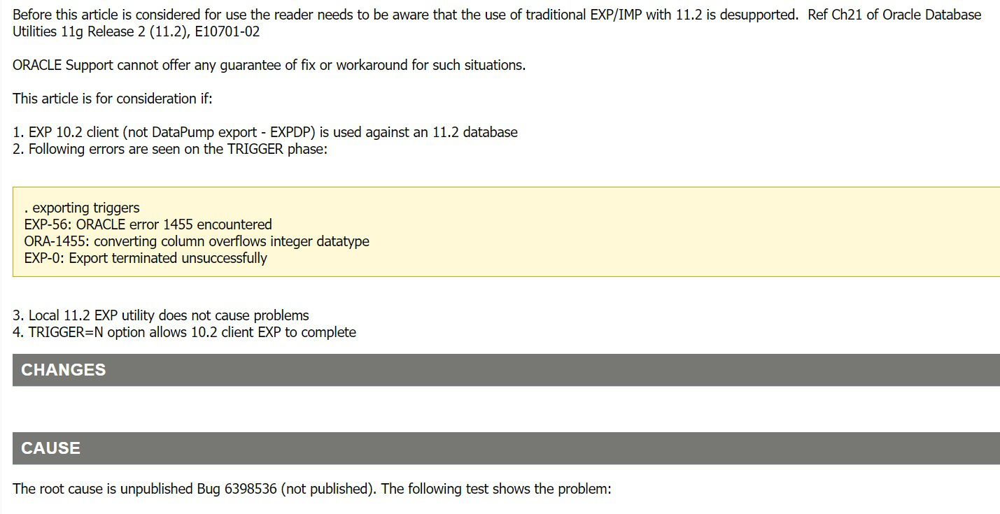

# Oracle手册

## 1. 常用操作

### 查看监听

```
重启Oracle数据库的操作步骤
1.查看监听器状态：lsnrctl status
2.停止监听器：lsnrctl stop
3.连接数据库：sqlplus / as sysdba
4.停止数据库：shutdown immediate
5.启动数据库：startup
6.退出数据库：exit
7.启动监听：lsnrctl start
```

```bash
$ ps -ef | grep lsn
$ lsnrctl status
```

### 登录

```
sqlplus [ [<option>] [{logon | /nolog}] [<start>] ]
<option> 为: [-C <version>] [-L] [-M "<options>"] [-R <level>] [-S]

-C <version>   将受影响的命令的兼容性设置为<version> 指定的版本。该版本具有"x.y[.z]" 格式。例如, -C 10.2.0
-L             只尝试登录一次, 而不是 在出错时再次提示。
-M "<options>" 设置输出的自动 HTML 标记。选项的格式为:
               HTML [ON|OFF] [HEAD text] [BODY text] [TABLE text][ENTMAP {ON|OFF}] [SPOOL {ON|OFF}] [PRE[FORMAT] {ON|OFF}]
-R <level>     设置受限(restricted)模式, 以禁用与文件系统交互的SQL*Plus 命令。级别可以是 1, 2 或 3。最高限制级别为 -R 3, 该级别禁用与文件系统交互的所有用户命令。
-S             设置无提示(slient)模式, 该模式隐藏命令的提示和回显 的显示。

 <logon> 为: {<username>[/<password>][@<connect_identifier>] | / }[AS {SYSDBA | SYSOPER | SYSASM}] [EDITION=value]

 指定数据库帐户用户名, 口令和数据库连接的连接标识符。如果没有连接标识符, SQL*Plus 将连接到默认数据库。
 AS SYSDBA, AS SYSOPER 和 AS SYSASM 选项是数据库管理权限。

 <connect_identifier> 的形式可以是 Net 服务名或轻松连接。
   @[<net_service_name> | [//]Host[:Port]/<service_name>]
   <net_service_name> 是服务的简单名称, 它解析为连接描述符。
   示例: 使用 Net 服务名连接到数据库, 且数据库 Net 服务名为 ORCL。
      sqlplus myusername/mypassword@ORCL
   Host 指定数据库服务器计算机的主机名或 IP地址。
   Port 指定数据库服务器上的监听端口。
   <service_name> 指定要访问的数据库的服务名。
   示例: 使用轻松连接连接到数据库, 且服务名为 ORCL。
      sqlplus myusername/mypassword@Host/ORCL

 /NOLOG 选项可启动 SQL*Plus 而不连接到数据库。
 EDITION 指定会话版本的值。

<start> 为: @<URL>|<filename>[.<ext>] [<parameter> ...]
使用将分配给脚本中的替代变量的指定参数从 Web 服务器 (URL) 或本地文件系统 (filename.ext)运行指定的 SQL*Plus 脚本。

在启动 SQL*Plus 并且执行 CONNECT 命令后, 将运行站点概要文件 (例如, $ORACLE_HOME/sqlplus/admin/glogin.sql) 和用户概要文件例如, 工作目录中的 login.sql)。这些文件包含 SQL*Plus 命令。
```

```bash
$ sqlplus username/pwd@host/service_name
$ sqlplus "/as sysdba"
```

### 数据库操作

### 常用函数

```plsql
decode(条件,值1,返回值1,值2,返回值2,...值n,返回值n,缺省值)
该函数的含义如下：
    IF 条件=值1 THEN
        RETURN(翻译值1)
    ELSIF 条件=值2 THEN
        RETURN(翻译值2)
        ......
    ELSIF 条件=值n THEN
        RETURN(翻译值n)
    ELSE
        RETURN(缺省值)
    END IF
decode(字段或字段的运算，值1，值2，值3）
	这个函数运行的结果是，当字段或字段的运算的值等于值1时，该函数返回值2，否则返回值3
当然值1，值2，值3也可以是表达式.
       
NVL(eExpression1, eExpression2)
如果 eExpression1 的计算结果为 null 值，则 NVL( ) 返回 eExpression2。如果 eExpression1 的计算结果不是 null 值，则返回 eExpression1。eExpression1 和 eExpression2 可以是任意一种数据类型。如果 eExpression1 与 eExpression2 的结果皆为 null 值，则 NVL( ) 返回 .NULL.。
返回值可以是字符型、日期型、日期时间型、数值型、货币型、逻辑型或 null 值。

to_date('2020-5-01 00:00:00', 'yyyy-mm-dd hh24:mi:ss');
TO_NUMBER(TO_CHAR(VALID_DATE, 'YYYYMMDDHH24MISS'));
```

### 管理语句

```sql
-- 查看被锁的表 
select b.owner,b.object_name,a.session_id,a.locked_mode from v$locked_object a,dba_objects b where b.object_id = a.object_id;

-- 查看那个用户那个进程照成死锁
select b.username,b.sid,b.serial#,logon_time from v$locked_object a,v$session b where a.session_id = b.sid order by b.logon_time;

-- 查看连接的进程 
SELECT sid, serial#, username, osuser FROM v$session;

-- 3.查出锁定表的sid, serial#,os_user_name, machine_name, terminal，锁的type,mode
SELECT s.sid, s.serial#, s.username, s.schemaname, s.osuser, s.process, s.machine,
s.terminal, s.logon_time, l.type
FROM v$session s, v$lock l
WHERE s.sid = l.sid
AND s.username IS NOT NULL
ORDER BY sid;
/*这个语句将查找到数据库中所有的DML语句产生的锁，还可以发现，
任何DML语句其实产生了两个锁，一个是表锁，一个是行锁。*/

-- 杀掉进程 sid,serial#
alter system kill session'210,11562';
```

### 查看版本、sid、服务名

```sql
-- Oracle的服务名(ServiceName)查询
show parameter service_name;

-- Oracle的SID查询命令：
select instance_name from v$instance;

-- 查看Oracle版本
select version from v$instance;

-- 1、查看表空间的名称及大小
SELECT t.tablespace_name, round(SUM(bytes / (1024 * 1024)), 0) ts_size
FROM dba_tablespaces t, dba_data_files d
WHERE t.tablespace_name = d.tablespace_name
GROUP BY t.tablespace_name;
-- 2、查看表空间物理文件的名称及大小
SELECT tablespace_name,
file_id,
file_name,
round(bytes / (1024 * 1024), 0) total_space
FROM dba_data_files
ORDER BY tablespace_name;
-- 3、查看回滚段名称及大小
SELECT segment_name,
tablespace_name,
r.status,
(initial_extent / 1024) initialextent,
(next_extent / 1024) nextextent,
max_extents,
v.curext curextent
FROM dba_rollback_segs r, v$rollstat v
WHERE r.segment_id = v.usn(+)
ORDER BY segment_name;
-- 4、查看控制文件
SELECT NAME FROM v$controlfile;
-- 5、查看日志文件
SELECT MEMBER FROM v$logfile;
-- 6、查看表空间的使用情况
SELECT SUM(bytes) / (1024 * 1024) AS free_space, tablespace_name
FROM dba_free_space
GROUP BY tablespace_name;
SELECT a.tablespace_name,
a.bytes total,
b.bytes used,
c.bytes free,
(b.bytes * 100) / a.bytes "% USED ",
(c.bytes * 100) / a.bytes "% FREE "
FROM sys.sm$ts_avail a, sys.sm$ts_used b, sys.sm$ts_free c
WHERE a.tablespace_name = b.tablespace_name
AND a.tablespace_name = c.tablespace_name;
-- 7、查看数据库库对象
SELECT owner, object_type, status, COUNT(*) count#
FROM all_objects
GROUP BY owner, object_type, status;
-- 8、查看数据库的版本　
SELECT version
FROM product_component_version
WHERE substr(product, 1, 6) = 'Oracle';
-- 9、查看数据库的创建日期和归档方式
SELECT created, log_mode, log_mode FROM v$database;
```

### 表空间

```sql
-- 查看默认表空间
select username, default_tablespace, temporary_tablespace from dba_users;

-- 修改默认表空间
alter user user default tablespace tablespaceName;

-- 查询表空间使用情况     
SELECT UPPER(F.TABLESPACE_NAME) "表空间名",     
D.TOT_GROOTTE_MB "表空间大小(M)",     
D.TOT_GROOTTE_MB - F.TOTAL_BYTES "已使用空间(M)",     
TO_CHAR(ROUND((D.TOT_GROOTTE_MB - F.TOTAL_BYTES) / D.TOT_GROOTTE_MB * 100,2),'990.99') "使用比",     
F.TOTAL_BYTES "空闲空间(M)",     
F.MAX_BYTES "最大块(M)"    
FROM (SELECT TABLESPACE_NAME,     
ROUND(SUM(BYTES) / (1024 * 1024), 2) TOTAL_BYTES,     
ROUND(MAX(BYTES) / (1024 * 1024), 2) MAX_BYTES     
FROM SYS.DBA_FREE_SPACE     
GROUP BY TABLESPACE_NAME) F,     
(SELECT DD.TABLESPACE_NAME,     
ROUND(SUM(DD.BYTES) / (1024 * 1024), 2) TOT_GROOTTE_MB     
FROM SYS.DBA_DATA_FILES DD     
GROUP BY DD.TABLESPACE_NAME) D     
WHERE D.TABLESPACE_NAME = F.TABLESPACE_NAME     
ORDER BY 4 DESC;    

-- 查看表空间是否具有自动扩展的能力     
SELECT T.TABLESPACE_NAME,D.FILE_NAME,     
D.AUTOEXTENSIBLE,D.BYTES,D.MAXBYTES,D.STATUS     
FROM DBA_TABLESPACES T,DBA_DATA_FILES D     
WHERE T.TABLESPACE_NAME =D.TABLESPACE_NAME     
 ORDER BY TABLESPACE_NAME,FILE_NAME;  

```

**修改表空间大小**

```sql
-- 如果系统开启审计功能，可以将通过以下命令将审计日志表清空。（此步骤只针对 SYSTEM 表空间，其他表空间请跳过）
TRUNCATE TABLE SYS.AUD$;

-- 查询需要缩小表空间对应的数据文件的 FILE_ID。
SELECT FILE_ID, FILE_NAME FROM DBA_DATA_FILES WHERE TABLESPACE_NAME = 'SYSTEM';

-- 查询该数据文件中数据所在的数据块的最大位置
SELECT MAX(BLOCK_ID)*8/1024 FROM DBA_EXTENTS WHERE FILE_ID=1;

-- 修改该数据文件的尺寸。根据需要调整数据文件的大小，但是不能低于上一步骤的查询值。
alter database datafile '文件名' resize 100m;

-- 扩展表空间
alter tablespace XGDATA add datafile '/sw02/oracle/app/oracledata/njwqjfcs/XGDATA08.dbf' size 10240M;
alter database datafile '文件名' resize 100m;
```

### 表结构

```
-- 查找表的所有索引(包括索引名，类型，构成列)
select t.*,i.index_type from user_ind_columns t,user_indexes i where t.index_name = i.index_name and t.table_name = i.table_name and t.table_name = 要查询的表

-- 查找表的主键(包括名称，构成列)
select cu.* from user_cons_columns cu, user_constraints au where cu.constraint_name = au.constraint_name and au.constraint_type = 'P' and au.table_name = 要查询的表

select cu.owner, cu.table_name, cu.constraint_name, wm_concat(cu.COLUMN_NAME) key_words from user_cons_columns cu, user_constraints au where cu.constraint_name = au.constraint_name and au.constraint_type = 'P' and au.table_name = 'BAT_TMORTGAGE_XY' group by cu.owner, cu.table_name, cu.constraint_name;
select cu.owner, cu.table_name, cu.constraint_name, listagg(cu.COLUMN_NAME, ',') within group(order by cu.position) key_words from user_cons_columns cu, user_constraints au where cu.constraint_name = au.constraint_name and au.constraint_type = 'P' and au.table_name = 'BAT_TMORTGAGE_XY' group by cu.owner, cu.table_name, cu.constraint_name;

-- 查找表的唯一性约束(包括名称，构成列)
select column_name from user_cons_columns cu, user_constraints au where cu.constraint_name = au.constraint_name and au.constraint_type = 'U' and au.table_name = 要查询的表

select cu.owner, cu.table_name, cu.constraint_name, listagg(COLUMN_NAME, ',') within group(order by cu.position) key_words from user_cons_columns cu, user_constraints au where cu.constraint_name = au.constraint_name and au.constraint_type = 'U' and au.TABLE_NAME = 'BAT_TMORTGAGE_XY' group by cu.owner, cu.table_name, cu.constraint_name;

-- 查找表的外键(包括名称，引用表的表名和对应的键名，下面是分成多步查询)\
-- 查询外键的列名
select * from user_constraints c where c.constraint_type = 'R' and c.table_name = 要查询的表

-- 查询外键约束的列名
select * from user_cons_columns cl where cl.constraint_name = 外键名称

-- 查询引用表的键的列名
select * from user_cons_columns cl where cl.constraint_name = 外键引用表的键名

-- 查询表的所有列及其属性
select t.*,c.COMMENTS from user_tab_columns t,user_col_comments c where t.table_name = c.table_name and t.column_name = c.column_name and t.table_name = 要查询的表
```

### 数据库参数

```sql
select * from v$parameter where name = 'deferred_segment_creation';
```

```sql
-- 重启数据库生效
alter system set deferred_segment_creation=false       scope=spfile;
-- 可以不重启数据库
alter system set deferred_segment_creation=false       scope=both;
```

## 2. oracle基础

### 2.1 char 、nchar 与 varchar

CHAR与NCHAR在[Oracle](https://so.csdn.net/so/search?q=Oracle&spm=1001.2101.3001.7020)数据库是常用的类型，不过两种数据类型是互相不兼容的，这里大概简要谈一下这2种数据类型吧。

在Oracle中，[CHAR类型](https://so.csdn.net/so/search?q=CHAR类型&spm=1001.2101.3001.7020)是一种固定长度的字符串类型，最大长度是2000个byte，在这里要注意了，是2000个byte，并不是2000个字符的意思。1个字符在Oracle中可能是1个byte到4个byte不等，这个要看数据库的设置了。这个是数据库中有一个参数

NLS_LENGTH_SEMANTICS来决定的。CHAR类型有一个特点，就是字符长度总是固定的，也就是说，如果你声明了一个COLUMN类型为CHAR(10)，如果你只插入了1个字符，那么系统也会自动在这个字符的右边补上9个空格，Oracle的CHAR类型中，补空格是在右侧补的。但是如果你插入了11个字符，那么就会系统出错，而不会自动截成10个字符。

NCHAR数据类型可能不是经常见到，不过在许多数据库设计中也有了。NCHAR数据类型是专为UNICODE字符而设计的，而且只能插入UNICODE字符串，NCHAR也是最大长度为2000个byte，不过每个字符占多少个byte，是由数据库的国际字符集决定的。同样的，如果插入字符不足定义的长度，比如NCHAR(10)类型中只插入了1个字符，系统会自动在右侧补充9个空格。

NCHAR和CHAR之间是不能直接互相兼容的，而是要通过Oracle的函数或者语法进行转换，比如说从NCHAR转成CHAR是要用TO_CHAR函数进行转换，而CHAR转换为NCHAR，比如说'ABCDE'这个CHAR字符串，则要通过N'ABCDE'来进行表示，也就是说前面要有一个N这个特殊字符，表示是NCHAR类型。

```
oracle提供了五种字符数据类型：char、nchar、varchar、varchar2、nvarchar2。

    char：使用数据库字符集来存储数据，长度固定，如果存储的数据没有达到指定长度，自动补足空格。指定长度时，默认长度的计量单位由NLS_LENGTH_SEMANTICS（默认为字节byte）参数决定，但是我们可以手动指定为char或者byte。oracle建议使用NLS_LENGTH_SEMANTICS来指定计量单位，这样可以提高效率。char类型的最大存储长度为2000个字节，在plsql中，最大存储长度可以达到32767个字节。使用char时，可以不指定最大长度，此时最大长度为1.

    nchar：使用国家字符集来存储数据，长度固定，如果存储的数据没有达到指定长度，数据库自动补足空格。指定长度时，采用char为计量单位，不可以手动指定其他单位。最大存储长度为2000个字节，在plsql中，其最大存储长度可以达到32767个字节。使用nchar时，可以不指定最大长度，此时最大长度为1.

  varchar2: 使用数据库字符集存储数据，长度可变，如果存储数据没有达到指定长度，不自动补足空格。可使用char，byte为计量单位，默认受参数NLS_LENGTH_SEMANTICS的影响。最大存储长度为4000个字节，在plsql中，存储长度可达32767个字节。必须指定最大长度，长度最小值为1.

  nvarchar2:使用国家字符集来存储数据，长度可变，如果存储的数据没有达到指定长度，不自动补足空格。指定长度时，采用char为计量单位，不可以手动指定其他单位。最大存储长度为4000个字节，在plsql中，其最大存储长度可以达到32767个字节。必须指定最大长度，长度最小值为1.

  varchar：oracle目前并没有实现该数据类型，当前版本下，varchar与varchar2完全一致，但不保证将来不会单独设计varchar。
  
  下面我们只讨论char和varchar2的区别，至于nchar   nvarchar2  varchar，我相信聪明的同仁们肯定可以触类旁通。

     1：char 与varchar2在存储上的区别，仅仅在于char会使用空格来填充空间，由于varchar2采用变长的方式存储数据，因此可以节省空间，这是毋庸置疑的。

     2：在效率方面，varchar2和char在某些情况下，各有优劣，并没有实质上的差别。可以参考tom大师的文章：http://asktom.oracle.com/pls/asktom/f?p=100:11:0::::P11_QUESTION_ID:2668391900346844476

     3：在字符比较上的差别，是char和varchar2的主要差别。当两个字符串进行比较时，如果其中任何一个字符串为varchar2类型（文本串作为char类型来处理），那么两个字符串直接进行比较；如果不存在varchar2类型的字符串，在比较之前，会将其中较短的字符串末尾补充空格至与较长字符串长度一致，然后进行字符的比对。
```


## 3. 数据导入导出

### sqlldr

#### 常见问题


### exp/imp

```
Oracle EXP
EXP的所有参数（括号中为参数的默认值）：
USERID 用户名/口令 如： USERID=duanl/duanl 
FULL 导出整个数据库 (N)
BUFFER 数据缓冲区的大小 
OWNER 所有者用户名列表,你希望导出哪个用户的对象，就用owner=username
FILE 输出文件 (EXPDAT.DMP) 
TABLES 表名列表 ,指定导出的table名称，如：TABLES=table1,table2
COMPRESS 导入一个extent (Y) 
RECORDLENGTH IO 记录的长度
GRANTS 导出权限 (Y) 
INCTYPE 增量导出类型
INDEXES 导出索引 (Y) 
RECORD 跟踪增量导出 (Y)
ROWS 导出数据行 (Y) 
PARFILE 参数文件名,如果你exp的参数很多，可以存成参数文件.
CONSTRAINTS 导出约束 (Y) 
CONSISTENT 交叉表一致性
LOG 屏幕输出的日志文件 
STATISTICS 分析对象 (ESTIMATE)
DIRECT 直接路径 (N) 
TRIGGERS 导出触发器 (Y)
FEEDBACK 显示每 x 行 (0) 的进度
FILESIZE 各转储文件的最大尺寸
QUERY 选定导出表子集的子句
下列关键字仅用于可传输的表空间
TRANSPORT_TABLESPACE 导出可传输的表空间元数据 (N)
TABLESPACES 将传输的表空间列表
```

#### statistics

**COMPUTE STATISTICS**

COMPUTE STATISTICS instructs Oracle to compute exact statistics about the analyzed object and store them in the data dictionary. 
When computing statistics, an entire object is scanned to gather data about the object. This data is used by Oracle to compute exact statistics about the object. Slight variances throughout the object are accounted for in these computed statistics. Because an entire object is scanned to gather information for computed statistics, the larger the size of an object, the more work that is required to gather the necessary information. 

To perform an exact computation, Oracle requires enough space to perform a scan and sort of the table. If there is not enough space in memory, then temporary space may be required. For estimations, Oracle requires enough space to perform a scan and sort of only the rows in the requested sample of the table. For indexes, computation does not take up as much time or space, so it is best to perform a full computation. 

Some statistics are always computed exactly, such as the number of data blocks currently containing data in a table or the depth of an index from its root block to its leaf blocks. 

Use estimation for tables and clusters rather than computation, unless you need exact values. Because estimation rarely sorts, it is often much faster than computation, especially for large tables.

**ESTIMATE STATISTICS**

ESTIMATE STATISTICS instructs Oracle to estimate statistics about the analyzed object and stores them in the data dictionary. 
When estimating statistics, Oracle gathers representative information from portions of an object. This subset of information provides reasonable, estimated statistics about the object. The accuracy of estimated statistics depends upon how representative the sampling used by Oracle is. Only parts of an object are scanned to gather information for estimated statistics, so an object can be analyzed quickly. You can optionally specify the number or percentage of rows that Oracle should use in making the estimate. 

```
compute statistics：通过对数据对象的完全扫描来收集精确的统计数据。
estimate statistics：通过对数据对象的部分扫描（抽样）来评估出统计数据。 
前者收集的统计数据精确，但耗费资源和时间；而后者节省时间和资源，但可能不够精确。
```

```
Oracle IMP参数列表：

USERID 用户名/口令 

FULL 导入整个文件 (N)
BUFFER 数据缓冲区大小 
FROMUSER 所有人用户名列表
FILE 输入文件 (EXPDAT.DMP) 
TOUSER 用户名列表
SHOW 只列出文件内容 (N)
TABLES 表名列表
IGNORE 忽略创建错误 (N) 
RECORDLENGTH IO 记录的长度
GRANTS 导入权限 (Y) 
INCTYPE 增量导入类型
INDEXES 导入索引 (Y) 
COMMIT 提交数组插入 (N)
ROWS 导入数据行 (Y) 
PARFILE 参数文件名
LOG 屏幕输出的日志文件 
CONSTRAINTS 导入限制 (Y)
DESTROY 覆盖表空间数据文件 (N)
INDEXFILE 将表/索引信息写入指定的文件
SKIP_UNUSABLE_INDEXES 跳过不可用索引的维护 (N)
ANALYZE 执行转储文件中的 ANALYZE 语句 (Y)
FEEDBACK 显示每 x 行 (0) 的进度
TOID_NOVALIDATE 跳过指定类型 id 的校验
FILESIZE 各转储文件的最大尺寸
RECALCULATE_STATISTICS 重新计算统计值 (N)
下列关键字仅用于可传输的表空间
TRANSPORT_TABLESPACE 导入可传输的表空间元数据 (N)
TABLESPACES 将要传输到数据库的表空间
DATAFILES 将要传输到数据库的数据文件
TTS_OWNERS 拥有可传输表空间集中数据的用户
```

### expdp/impdp

### data pump包

​		所有的Data Pump导出和导入处理，包括转储文件的读写，都是在指定的数据库连接字符串所选择的服务器（即oracle所在服务器）上进行。这意味着对于非特权用户，数据库管理员（DBA）必须为在该服务器文件系统上读取和写入的Data Pump文件创建目录对象。(出于安全考虑，DBA必须确保只有经过批准的用户才可以访问目录对象)。对于有特权的用户，有一个默认的目录对象可用。

​		数据泵不加载具有禁用唯一索引的表。要将数据加载到表中，索引必须被放弃或重新启用。


## 4. 性能分析

### 4.1 自动负载信息库（AWR）

AWR（Automatic Workload Repository）能反应数据库的性能，它以快照的形式手机，可以保存为txt文件格式或者html文件格式

```
重要指标：
DB Time = CPU Time + Wait Time，即服务器花费在数据运算和等待的时间

AAS（Average Active Sessions） = DB Time / Elapsed Time
AAS/逻辑CPU数（逻辑CPU数 = 物理CPU * 核数）真实的反映了数据的性能，称为DB负载：
	无限接近于0，数据库状态极佳
	0.5~0.8，数据库状态稳定
	0.8~1，数据库需要优化
	>1，数据库性能不稳定，需优化

```


```
$ sqlplus /nolog

SQL> conn /as sysdba
SQL> exec dbms_workload_repository.create_snapshot;
SQL> exec dbms_workload_repository.create_snapshot;
SQL> @?/rdbms/admin/awrrpt
```


## 问题排查

### 4.1 ORALCE日志

#### alert日志

告警日志是一类特殊的跟踪文件（trace file），根据时间顺序记录message和错误信息，主要包括：

* 所有内部错误信息（ORA-600）、块损坏错误信息（ORA-1578）、以及死锁错误信息（ORA-60）等。
* 管理操作，例如create、alter、drop等语句，以及数据库启动、关闭和日志归档的一些信息。

```
涉及物理结构的所有操作：例如创建、删除、重命名数据文件与联机重做日志文件的alter database命令。
此外还涉及重新分配数据文件大小以及数据文件联机与脱机的操作。

表空间操作，例如drop和create命令，此外还包括为了进行用户管理的备份而将表空间置入和取出热备份模式的操作。
```

* 与共享服务器或调度进程相关功能的消息和错误信息。
* 物化视图的自动刷新过程中出现的错误。
* 动态参数的修改信息。

告警日志命名一般为alert_\<SID>.log，其中SID为ORACLE数据库实例名称。

```shell
# 切换到oracle用户
su - oracle

# 进入sqlplus窗口
$> sqlplus / as sysdba

# 执行sql命令，查看trace文件位置：background_dump_dest就是后台日志路径
$> show parameter dump;

# 退出sqlplus命令行，在linux命令行执行cd命令,切换到trace目录
$> cd xxxxxx

# 查看带有alert关键字的文件，alert_INSTANCENAME.ora即是alert日志的名字
$> ls alert*
```


### 4.2 锁相关

```sql
-- 查看当前系统中锁表情况
select * from v$locked_object;
select username, lockwait, status, machine, program from v$session where sid in (select session_id from v$locked_object);
select sql_text from v$sql where hash_value in (select sql_hash_value from v$session where sid in (select session_id from v$locked_object));


-- 对v$locked_object被锁对象进行查询
SELECT l.session_id sid, s.serial#, l.locked_mode, l.oracle_username, l.os_user_name, s.machine, s.terminal, o.object_name, s.logon_time FROM v$locked_object l, all_objects o, v$session s WHERE l.object_id = o.object_id AND l.session_id = s.sid ORDER BY sid, s.serial#;

-- 查看死锁
select sess.sid, sess.serial#, lo.oracle_username, lo.os_user_name, ao.object_name, lo.locked_mode from v$locked_object lo, dba_objects ao, v$session sess, v$process p where ao.object_id = lo.object_id and lo.session_id = sess.sid;

select l.session_id sid, s.serial#, l.locked_mode, l.oracle_username, s.user#, l.os_user_name, s.machine, s.terminal, a.sql_text, a.action from v$sqlarea a, v$session s, v$locked_object l where l.session_id = s.sid and s.prev_sql_addr = a.address order by sid, s.serial#;


-- 解决死锁
select  SESSION_ID,ORACLE_USERNAME,PROCESS from V$LOCKED_OBJECT;
select  SID,SERIAL#,STATUS from V$SESSION where  SID in (select  SESSION_ID  from V$LOCKED_OBJECT);
alter system kill session 'sid,serial' imediate;

查询Oracle正在执行的sql语句及执行该语句的用户： 
SELECT b.sid oracleID,   
       b.username 登录Oracle用户名,   
       b.serial#,   
       spid 操作系统ID,   
       paddr,   
       sql_text 正在执行的SQL,   
       b.machine 计算机名   
FROM v$process a, v$session b, v$sqlarea c   
WHERE a.addr = b.paddr   
   AND b.sql_hash_value = c.hash_value 

查看正在执行sql的发起者的发放程序： 
SELECT OSUSER 电脑登录身份,   
       PROGRAM 发起请求的程序,   
       USERNAME 登录系统的用户名,   
       SCHEMANAME,   
       B.Cpu_Time 花费cpu的时间,   
       STATUS,   
       B.SQL_TEXT 执行的sql   
FROM V$SESSION A   
LEFT JOIN V$SQL B ON A.SQL_ADDRESS = B.ADDRESS   
                   AND A.SQL_HASH_VALUE = B.HASH_VALUE   
ORDER BY b.cpu_time DESC 

查出oracle当前的被锁对象： 
SELECT l.session_id sid,   
       s.serial#,   
       l.locked_mode 锁模式,   
       l.oracle_username 登录用户,   
       l.os_user_name 登录机器用户名,   
       s.machine 机器名,   
       s.terminal 终端用户名,   
       o.object_name 被锁对象名,   
       s.logon_time 登录数据库时间   
FROM v$locked_object l, all_objects o, v$session s   
WHERE l.object_id = o.object_id   
   AND l.session_id = s.sid   
ORDER BY sid, s.serial#; 

kill掉当前的锁对象: 
alter system kill session 'sid， s.serial#‘; 

查询当前正在执行的事务: 
SELECT s.sid,   
      s.serial#,   
      s.event,   
      a.sql_text,   
      a.sql_fulltext,   
      s.username,   
      s.status,   
      s.machine,   
      s.terminal,   
      s.program,   
      a.executions,   
      s.sql_id,   
      p.spid,   
      a.direct_writes   
 FROM (SELECT * FROM v$session WHERE status = 'ACTIVE') s   
 LEFT JOIN v$sqlarea a   
   ON s.sql_id = a.sql_id   
INNER JOIN v$process p   
   ON s.paddr = p.addr 


查看Oracle 数据库中的长事务: 
set linesize 200   
set pagesize 5000   
col transaction_duration format a45   
   
with transaction_details as   
( select inst_id   
  , ses_addr   
  , sysdate - start_date as diff   
  from gv$transaction   
)   
select s.username   
, to_char(trunc(t.diff))   
             || ' days, '   
             || to_char(trunc(mod(t.diff * 24,24)))   
             || ' hours, '   
             || to_char(trunc(mod(t.diff * 24 * 60,24)))   
             || ' minutes, '   
             || to_char(trunc(mod(t.diff * 24 * 60 * 60,60)))   
             || ' seconds' as transaction_duration   
, s.program   
, s.terminal   
, s.status   
, s.sid   
, s.serial#   
from gv$session s   
, transaction_details t   
where s.inst_id = t.inst_id   
and s.saddr = t.ses_addr   
order by t.diff desc   
/ 

查询长事务SQL: 
下面SQL 查询数据库中正在执行大于N秒的事务信息： 
with ltr as (  
select to_char(sysdate,'YYYYMMDDHH24MISS') TM,  
       s.sid,  
       s.sql_id,  
       s.sql_child_number,  
       s.prev_sql_id,  
       xid,  
       to_char(t.start_date,'YYYYMMDDHH24MISS') start_time,  
       e.TYPE,e.block,  
       e.ctime,  
       decode(e.CTIME, 0, (sysdate - t.start_date) * 3600*24, e.ctime) el_second   
     --  q.sql_text  
  from v$transaction t, v$session s,v$transaction_enqueue e 
 where t.start_date <= sysdate - interval '100' second     /*查询开始多少秒的事务*/ 
   and t.addr = s.taddr  
   --and s.sql_child_number = q.CHILD_NUMBER(+)  
   --and s.sql_id = q.sql_id(+) and s.prev_sql_id = q.sql_id(+)  
   and t.addr = e.addr(+) )   
  select ltr.* , (select q1.sql_text from v$sql q1 where ltr.prev_sql_id = q1.sql_id(+) 
   and rownum = 1) prev_sql_text ,  
  (select q1.sql_text from v$sql q1 where ltr.sql_id = q1.sql_id(+)  
   and ltr.sql_child_number = q1.CHILD_NUMBER(+)) sql_text  
   from ltr ltr; 
```


### 4.3 ORA-28002: the password will expire within 5 days

**解决方案：**

```sql
-- 查看过期天数
SELECT * FROM dba_profiles s WHERE s.profile='DEFAULT' AND resource_name='PASSWORD_LIFE_TIME';


-- 1.设置密码永不过期
ALTER PROFILE DEFAULT LIMIT PASSWORD_LIFE_TIME UNLIMITED;

-- 2. 修改密码
alter user dbtrade identified by "clear.123";

-- 3. 修改过期天数
ALTER PROFILE DEFAULT LIMIT PASSWORD_LIFE_TIME 30;
```

### 4.4 ORA-38301: can not perform DDL/DML over objects in Recycle Bin

```
ORA-00604: error occurred at recursive SQL level 1
ORA-38301: can not perform DDL/DML over objects in Recycle Bin

解决方案：
1. 清回收站
purge dba_recyclebin;
2. 关闭回收站
alter system set recyclebin=off scope=spfile; --
shutdown immediate;
startup
3. 删表重建
方案1/2尝试均未解决,3成功解决
```

### 4.5 exp导出新增字段为null值导致imp恢复报错

```
IMP-00019: row rejected due to ORACLE error 1400
IMP-00003: ORACLE error 1400 encountered
ORA-01400: cannot insert NULL into ("DBTRADE"."PUB_TBROKERSYSINFO"."LOCK_FLAG")
```


### 4.6 exp导出报错EXP-00008&ORA-01455

```
EXP-00008: ORACLE error 1455 encountered
ORA-01455: converting column overflows integer datatype
```




```
1. 通过dba_tables 和 dba_indexes 来查看对应表的值。 即num_rows值，看是否超过了2^31-1。
如果表的numrows超过了，可以手工的修改表的这个值，如：
 SQL> execute sys.dbms_stats.set_table_stats( 'SCOTT', 'EMP', numrows => 1000000000000);
该命令格式：
 DBMS_STATS.SET_TABLE_STATS(<owner>, <table_name>, <statistic_field> => <new lower value>)

2. 删除对应的统计信息
表：
       SQL>ANALYZE TABLE <table_name> DELETE STATISTICS 
索引：
       SQL>ANALYZE INDEX <index_name> DELETE STATISTICS  
 或者使用：
       execute sys.dbms_stats.delete_index_stats(ownname => 'scott', indname => 'my_indx_1');
       execute dbms_stats.delete_table_stats(ownname => 'scott', tabname=>'table_name')
```

### 4.7 扩展表空间


### 4.8 

