# Redis手册

## 1.Redis初识

### 配置说明

```bash
# Redis示例配置文件

# 注意单位问题：当需要设置内存大小的时候，可以使用类似1k、5GB、4M这样的常见格式：
#
# 1k => 1000 bytes
# 1kb => 1024 bytes
# 1m => 1000000 bytes
# 1mb => 1024*1024 bytes
# 1g => 1000000000 bytes
# 1gb => 1024*1024*1024 bytes
#
# 单位是大小写不敏感的，所以1GB 1Gb 1gB的写法都是完全一样的。

# Redis默认是不作为守护进程来运行的。你可以把这个设置为"yes"让它作为守护进程来运行。
# 注意，当作为守护进程的时候，Redis会把进程ID写到 /var/run/redis.pid
daemonize no

# 当以守护进程方式运行的时候，Redis会把进程ID默认写到 /var/run/redis.pid。你可以在这里修改路径。
pidfile /var/run/redis.pid

# 接受连接的特定端口，默认是6379。
# 如果端口设置为0，Redis就不会监听TCP套接字。
port 6379

# 如果你想的话，你可以绑定单一接口；如果这里没单独设置，那么所有接口的连接都会被监听。
#
# bind 127.0.0.1

# 指定用来监听连接的unxi套接字的路径。这个没有默认值，所以如果你不指定的话，Redis就不会通过unix套接字来监听。
#
# unixsocket /tmp/redis.sock
# unixsocketperm 755

#一个客户端空闲多少秒后关闭连接。(0代表禁用，永不关闭)
timeout 0

# 设置服务器调试等级。
# 可能值：
# debug （很多信息，对开发/测试有用）
# verbose （很多精简的有用信息，但是不像debug等级那么多）
# notice （适量的信息，基本上是你生产环境中需要的程度）
# warning （只有很重要/严重的信息会记录下来）
loglevel verbose

# 指明日志文件名。也可以使用"stdout"来强制让Redis把日志信息写到标准输出上。
# 注意：如果Redis以守护进程方式运行，而你设置日志显示到标准输出的话，那么日志会发送到 /dev/null
logfile stdout

# 要使用系统日志记录器很简单，只要设置 "syslog-enabled" 为 "yes" 就可以了。
# 然后根据需要设置其他一些syslog参数就可以了。
# syslog-enabled no

# 指明syslog身份
# syslog-ident redis

# 指明syslog的设备。必须是一个用户或者是 LOCAL0 ~ LOCAL7 之一。
# syslog-facility local0

# 设置数据库个数。默认数据库是 DB 0，你可以通过SELECT <dbid> WHERE dbid（0～'databases' - 1）来为每个连接使用不同的数据库。
databases 16

################################ 快照 #################################

#
# 把数据库存到磁盘上:
#
#   save <seconds> <changes>
#   
#   会在指定秒数和数据变化次数之后把数据库写到磁盘上。
#
#   下面的例子将会进行把数据写入磁盘的操作:
#   900秒（15分钟）之后，且至少1次变更
#   300秒（5分钟）之后，且至少10次变更
#   60秒之后，且至少10000次变更
#
#   注意：你要想不写磁盘的话就把所有 "save" 设置注释掉就行了。

save 900 1
save 300 10
save 60 10000

# 当导出到 .rdb 数据库时是否用LZF压缩字符串对象。
# 默认设置为 "yes"，所以几乎总是生效的。
# 如果你想节省CPU的话你可以把这个设置为 "no"，但是如果你有可压缩的key的话，那数据文件就会更大了。
rdbcompression yes

# 数据库的文件名
dbfilename dump.rdb

# 工作目录
#
# 数据库会写到这个目录下，文件名就是上面的 "dbfilename" 的值。
# 
# 累加文件也放这里。
# 
# 注意你这里指定的必须是目录，不是文件名。
dir ./

# 快照功能开启，后台持久化操作失败，Redis则会停止接受更新操作，否则没人注意到数据不会写磁盘持久化。
# 如果后台持久化操作进程再次工作，Redis会自动允许更新操作（yes）；后台持久化操作出错,redis也仍然
# 可以继续像平常一样工作（no）
stop-writes-on-bgsave-error yes

# 在进行镜像备份时,是否进行压缩。yes：压缩，但是需要一些cpu的消耗。no：不压缩，需要更多的磁盘空间
rdbcompression yes

#从版本RDB版本5开始，一个CRC64的校验就被放在了文件末尾。
#这会让格式更加耐攻击，但是当存储或者加载rbd文件的时候会有一个10%左右的性能下降，  
#所以，为了达到性能的最大化，你可以关掉这个配置项。  
#没有校验的RDB文件会有一个0校验位，来告诉加载代码跳过校验检查。  
rdbchecksum yes

################################# 同步 #################################

#
# 主从同步。通过 slaveof 配置来实现Redis实例的备份。
# 注意，这里是本地从远端复制数据。也就是说，本地可以有不同的数据库文件、绑定不同的IP、监听不同的端口。
#
# slaveof <masterip> <masterport>

# 如果master设置了密码（通过下面的 "requirepass" 选项来配置），那么slave在开始同步之前必须进行身份验证，否则它的同步请求会被拒绝。
#
# masterauth <master-password>

# 当一个slave失去和master的连接，或者同步正在进行中，slave的行为有两种可能：
#
# 1) 如果 slave-serve-stale-data 设置为 "yes" (默认值)，slave会继续响应客户端请求，可能是正常数据，也可能是还没获得值的空数据。
# 2) 如果 slave-serve-stale-data 设置为 "no"，slave会回复"正在从master同步（SYNC with master in progress）"来处理各种请求，除了 INFO 和 SLAVEOF 命令。
#
slave-serve-stale-data yes

# slave根据指定的时间间隔向服务器发送ping请求。
# 时间间隔可以通过 repl_ping_slave_period 来设置。
# 默认10秒。
#
# repl-ping-slave-period 10

# 下面的选项设置了大块数据I/O、向master请求数据和ping响应的过期时间。
# 默认值60秒。
#
# 一个很重要的事情是：确保这个值比 repl-ping-slave-period 大，否则master和slave之间的传输过期时间比预想的要短。
#
# repl-timeout 60

################################## 安全 ###################################

# 要求客户端在处理任何命令时都要验证身份和密码。
# 这在你信不过来访者时很有用。
#
# 为了向后兼容的话，这段应该注释掉。而且大多数人不需要身份验证（例如：它们运行在自己的服务器上。）
# 
# 警告：因为Redis太快了，所以居心不良的人可以每秒尝试150k的密码来试图破解密码。
# 这意味着你需要一个高强度的密码，否则破解太容易了。
#
# requirepass foobared

# 命令重命名
#
# 在共享环境下，可以为危险命令改变名字。比如，你可以为 CONFIG 改个其他不太容易猜到的名字，这样你自己仍然可以使用，而别人却没法做坏事了。
#
# 例如:
#
# rename-command CONFIG b840fc02d524045429941cc15f59e41cb7be6c52
#
# 甚至也可以通过给命令赋值一个空字符串来完全禁用这条命令：
#
# rename-command CONFIG ""

################################### 限制 ####################################

#
# 设置最多同时连接客户端数量。
# 默认没有限制，这个关系到Redis进程能够打开的文件描述符数量。
# 特殊值"0"表示没有限制。
# 一旦达到这个限制，Redis会关闭所有新连接并发送错误"达到最大用户数上限（max number of clients reached）"
#
# maxclients 128

# 不要用比设置的上限更多的内存。一旦内存使用达到上限，Redis会根据选定的回收策略（参见：maxmemmory-policy）删除key。
#
# 如果因为删除策略问题Redis无法删除key，或者策略设置为 "noeviction"，Redis会回复需要更多内存的错误信息给命令。
# 例如，SET,LPUSH等等。但是会继续合理响应只读命令，比如：GET。
#
# 在使用Redis作为LRU缓存，或者为实例设置了硬性内存限制的时候（使用 "noeviction" 策略）的时候，这个选项还是满有用的。
#
# 警告：当一堆slave连上达到内存上限的实例的时候，响应slave需要的输出缓存所需内存不计算在使用内存当中。
# 这样当请求一个删除掉的key的时候就不会触发网络问题／重新同步的事件，然后slave就会收到一堆删除指令，直到数据库空了为止。
#
# 简而言之，如果你有slave连上一个master的话，那建议你把master内存限制设小点儿，确保有足够的系统内存用作输出缓存。
# （如果策略设置为"noeviction"的话就不无所谓了）
#
# maxmemory <bytes>

# 内存策略：如果达到内存限制了，Redis如何删除key。你可以在下面五个策略里面选：
# 
# volatile-lru -> 根据LRU算法生成的过期时间来删除。
# allkeys-lru -> 根据LRU算法删除任何key。
# volatile-random -> 根据过期设置来随机删除key。
# allkeys->random -> 无差别随机删。
# volatile-ttl -> 根据最近过期时间来删除（辅以TTL）
# noeviction -> 谁也不删，直接在写操作时返回错误。
# 
# 注意：对所有策略来说，如果Redis找不到合适的可以删除的key都会在写操作时返回一个错误。
#
#       这里涉及的命令：set setnx setex append
#       incr decr rpush lpush rpushx lpushx linsert lset rpoplpush sadd
#       sinter sinterstore sunion sunionstore sdiff sdiffstore zadd zincrby
#       zunionstore zinterstore hset hsetnx hmset hincrby incrby decrby
#       getset mset msetnx exec sort
#
# 默认值如下：
#
# maxmemory-policy volatile-lru

# LRU和最小TTL算法的实现都不是很精确，但是很接近（为了省内存），所以你可以用样例做测试。
# 例如：默认Redis会检查三个key然后取最旧的那个，你可以通过下面的配置项来设置样本的个数。
#
# maxmemory-samples 3

############################## 纯累加模式 ###############################

# 默认情况下，Redis是异步的把数据导出到磁盘上。这种情况下，当Redis挂掉的时候，最新的数据就丢了。
# 如果不希望丢掉任何一条数据的话就该用纯累加模式：一旦开启这个模式，Redis会把每次写入的数据在接收后都写入 appendonly.aof 文件。
# 每次启动时Redis都会把这个文件的数据读入内存里。
#
# 注意，异步导出的数据库文件和纯累加文件可以并存（你得把上面所有"save"设置都注释掉，关掉导出机制）。
# 如果纯累加模式开启了，那么Redis会在启动时载入日志文件而忽略导出的 dump.rdb 文件。
#
# 重要：查看 BGREWRITEAOF 来了解当累加日志文件太大了之后，怎么在后台重新处理这个日志文件。

appendonly no

# 纯累加文件名字（默认："appendonly.aof"）
# appendfilename appendonly.aof

# fsync() 请求操作系统马上把数据写到磁盘上，不要再等了。
# 有些操作系统会真的把数据马上刷到磁盘上；有些则要磨蹭一下，但是会尽快去做。
#
# Redis支持三种不同的模式：
#
# no：不要立刻刷，只有在操作系统需要刷的时候再刷。比较快。
# always：每次写操作都立刻写入到aof文件。慢，但是最安全。
# everysec：每秒写一次。折衷方案。
#
# 默认的 "everysec" 通常来说能在速度和数据安全性之间取得比较好的平衡。
# 如果你真的理解了这个意味着什么，那么设置"no"可以获得更好的性能表现（如果丢数据的话，则只能拿到一个不是很新的快照）；
# 或者相反的，你选择 "always" 来牺牲速度确保数据安全、完整。
#
# 如果拿不准，就用 "everysec"

# appendfsync always
appendfsync everysec
# appendfsync no

# 如果AOF的同步策略设置成 "always" 或者 "everysec"，那么后台的存储进程（后台存储或写入AOF日志）会产生很多磁盘I/O开销。
# 某些Linux的配置下会使Redis因为 fsync() 而阻塞很久。
# 注意，目前对这个情况还没有完美修正，甚至不同线程的 fsync() 会阻塞我们的 write(2) 请求。
#
# 为了缓解这个问题，可以用下面这个选项。它可以在 BGSAVE 或 BGREWRITEAOF 处理时阻止 fsync()。
# 
# 这就意味着如果有子进程在进行保存操作，那么Redis就处于"不可同步"的状态。
# 这实际上是说，在最差的情况下可能会丢掉30秒钟的日志数据。（默认Linux设定）
# 
# 如果你有延迟的问题那就把这个设为 "yes"，否则就保持 "no"，这是保存持久数据的最安全的方式。
no-appendfsync-on-rewrite no

# 自动重写AOF文件
#
# 如果AOF日志文件大到指定百分比，Redis能够通过 BGREWRITEAOF 自动重写AOF日志文件。
# 
# 工作原理：Redis记住上次重写时AOF日志的大小（或者重启后没有写操作的话，那就直接用此时的AOF文件），
#           基准尺寸和当前尺寸做比较。如果当前尺寸超过指定比例，就会触发重写操作。
#
# 你还需要指定被重写日志的最小尺寸，这样避免了达到约定百分比但尺寸仍然很小的情况还要重写。
#
# 指定百分比为0会禁用AOF自动重写特性。

auto-aof-rewrite-percentage 100
auto-aof-rewrite-min-size 64mb

################################## 慢查询日志 ###################################

# Redis慢查询日志可以记录超过指定时间的查询。运行时间不包括各种I/O时间。
# 例如：连接客户端，发送响应数据等。只计算命令运行的实际时间（这是唯一一种命令运行线程阻塞而无法同时为其他请求服务的场景）
# 
# 你可以为慢查询日志配置两个参数：一个是超标时间，单位为微妙，记录超过个时间的命令。
# 另一个是慢查询日志长度。当一个新的命令被写进日志的时候，最老的那个记录会被删掉。
#
# 下面的时间单位是微秒，所以1000000就是1秒。注意，负数时间会禁用慢查询日志，而0则会强制记录所有命令。
slowlog-log-slower-than 10000

# 这个长度没有限制。只要有足够的内存就行。你可以通过 SLOWLOG RESET 来释放内存。（译者注：日志居然是在内存里的Orz）
slowlog-max-len 128

################################ 虚拟内存 ###############################

### 警告！虚拟内存在Redis 2.4是反对的。
### 非常不鼓励使用虚拟内存！！

# 虚拟内存可以使Redis在内存不够的情况下仍然可以将所有数据序列保存在内存里。
# 为了做到这一点，高频key会调到内存里，而低频key会转到交换文件里，就像操作系统使用内存页一样。
#
# 要使用虚拟内存，只要把 "vm-enabled" 设置为 "yes"，并根据需要设置下面三个虚拟内存参数就可以了。

vm-enabled no
# vm-enabled yes

# 这是交换文件的路径。估计你猜到了，交换文件不能在多个Redis实例之间共享，所以确保每个Redis实例使用一个独立交换文件。
#
# 最好的保存交换文件（被随机访问）的介质是固态硬盘（SSD）。
#
# *** 警告 *** 如果你使用共享主机，那么默认的交换文件放到 /tmp 下是不安全的。
# 创建一个Redis用户可写的目录，并配置Redis在这里创建交换文件。
vm-swap-file /tmp/redis.swap

# "vm-max-memory" 配置虚拟内存可用的最大内存容量。
# 如果交换文件还有空间的话，所有超标部分都会放到交换文件里。
#
# "vm-max-memory" 设置为0表示系统会用掉所有可用内存。
# 这默认值不咋地，只是把你能用的内存全用掉了，留点余量会更好。
# 例如，设置为剩余内存的60%-80%。
vm-max-memory 0

# Redis交换文件是分成多个数据页的。
# 一个可存储对象可以被保存在多个连续页里，但是一个数据页无法被多个对象共享。
# 所以，如果你的数据页太大，那么小对象就会浪费掉很多空间。
# 如果数据页太小，那用于存储的交换空间就会更少（假定你设置相同的数据页数量）
#
# 如果你使用很多小对象，建议分页尺寸为64或32个字节。
# 如果你使用很多大对象，那就用大一些的尺寸。
# 如果不确定，那就用默认值 :)
vm-page-size 32

# 交换文件里数据页总数。
# 根据内存中分页表（已用/未用的数据页分布情况），磁盘上每8个数据页会消耗内存里1个字节。
#
# 交换区容量 = vm-page-size * vm-pages
#
# 根据默认的32字节的数据页尺寸和134217728的数据页数来算，Redis的数据页文件会占4GB，而内存里的分页表会消耗16MB内存。
#
# 为你的应验程序设置最小且够用的数字比较好，下面这个默认值在大多数情况下都是偏大的。
vm-pages 134217728

# 同时可运行的虚拟内存I/O线程数。
# 这些线程可以完成从交换文件进行数据读写的操作，也可以处理数据在内存与磁盘间的交互和编码/解码处理。
# 多一些线程可以一定程度上提高处理效率，虽然I/O操作本身依赖于物理设备的限制，不会因为更多的线程而提高单次读写操作的效率。
#
# 特殊值0会关闭线程级I/O，并会开启阻塞虚拟内存机制。
vm-max-threads 4

############################### 高级配置 ###############################

# 当有大量数据时，适合用哈希编码（需要更多的内存），元素数量上限不能超过给定限制。
# 你可以通过下面的选项来设定这些限制：
hash-max-zipmap-entries 512
hash-max-zipmap-value 64

# 与哈希相类似，数据元素较少的情况下，可以用另一种方式来编码从而节省大量空间。
# 这种方式只有在符合下面限制的时候才可以用：
list-max-ziplist-entries 512
list-max-ziplist-value 64

# 还有这样一种特殊编码的情况：数据全是64位无符号整型数字构成的字符串。
# 下面这个配置项就是用来限制这种情况下使用这种编码的最大上限的。
set-max-intset-entries 512

# 与第一、第二种情况相似，有序序列也可以用一种特别的编码方式来处理，可节省大量空间。
# 这种编码只适合长度和元素都符合下面限制的有序序列：
zset-max-ziplist-entries 128
zset-max-ziplist-value 64

# 哈希刷新，每100个CPU毫秒会拿出1个毫秒来刷新Redis的主哈希表（顶级键值映射表）。
# redis所用的哈希表实现（见dict.c）采用延迟哈希刷新机制：你对一个哈希表操作越多，哈希刷新操作就越频繁；
# 反之，如果服务器非常不活跃那么也就是用点内存保存哈希表而已。
# 
# 默认是每秒钟进行10次哈希表刷新，用来刷新字典，然后尽快释放内存。
#
# 建议：
# 如果你对延迟比较在意的话就用 "activerehashing no"，每个请求延迟2毫秒不太好嘛。
# 如果你不太在意延迟而希望尽快释放内存的话就设置 "activerehashing yes"。
activerehashing yes

################################## 包含 ###################################

# 包含一个或多个其他配置文件。
# 这在你有标准配置模板但是每个redis服务器又需要个性设置的时候很有用。
# 包含文件特性允许你引人其他配置文件，所以好好利用吧。
#
# include /path/to/local.conf
# include /path/to/other.conf
```


## 2. API的理解和使用

### 2.1 通用命令

**keys [pattern]**	

遍历符合pattern的key

```bash
# 遍历所有key
keys  * 
# 遍历以hel开头的key
keys  hel*
# 以he开头,第三个字母是h-l中的一个 
keys  he[h-l]*
```

keys一般不在生产环境使用.一般生产环境键值对多,keys命令时间复杂度为O(n),使用scan替代.

**dbsize**

计算key的总数 , O(1).

**exists [key]**

检查key是否存在, O(1).

**del [key1...]**

删除制定key-value, O(1).

**set [Key value]      mset [key1 value1 ...]**

设置K-V

**expire [key] [seconds]**

设置key的过期时间,O(1).

**ttl [key]**

查看具体过期还有多长时间, 返回值-2代表key已不存在,-1代表key存在但没有过期时间.

**persist [key]**

去掉key的过期时间

**type [key]**

返回key对应的value的类型, 返回none代表key不存在,O(1).


### 2.2 数据结构和内部编码

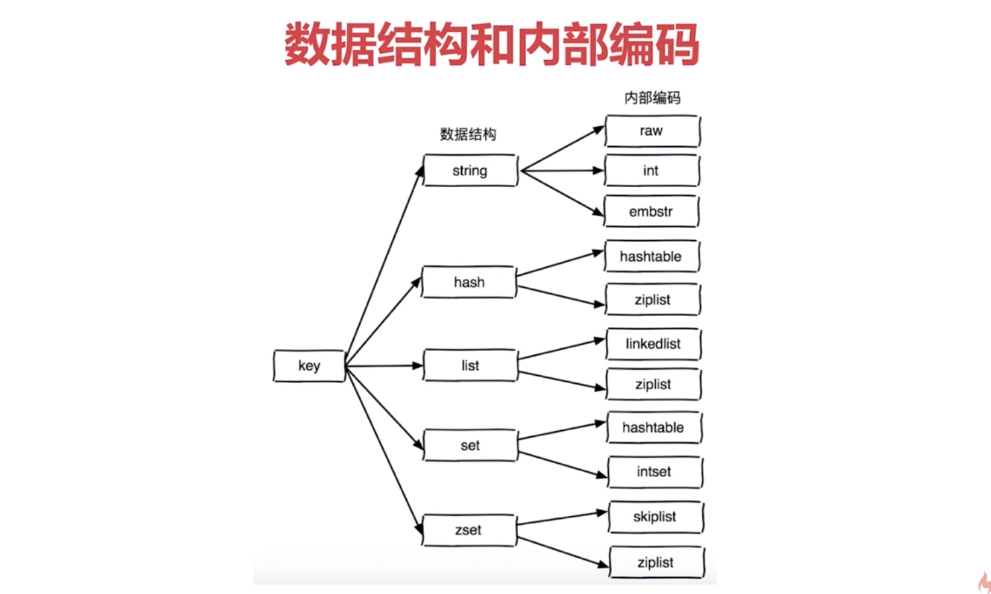

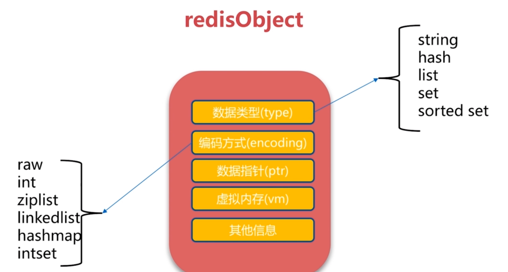


### 2.3 单线程

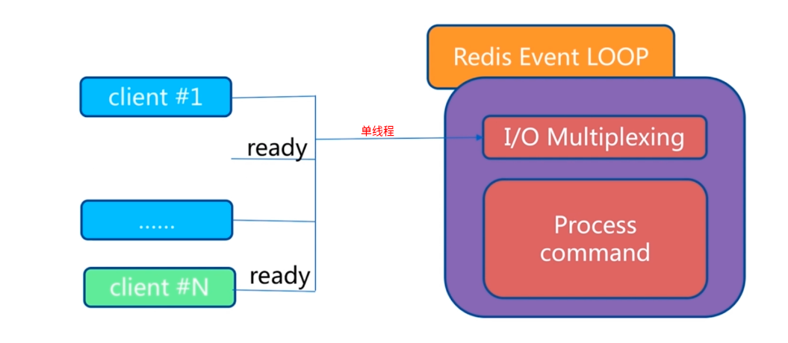

> * 一次只运行一条命令
> * 拒绝使用长(慢)命令,如keys,flushall,flushdb,show lua script,mutil/exec,operate big value(collection).
> * 某些情况不是单线程,如fsync file descriptor,close file descriptor.

### 2.4 类型接口

#### string

| 命令                                           | 含义                                                         | 复杂度 |
| :--------------------------------------------- | ------------------------------------------------------------ | :----- |
| set [key] [value]                              | 设置key-value                                                | O(1)   |
| get/del [key]                                  | 获取key对应的value/删除key-value                             | O(1)   |
| mget [k1] [k2].../mset [k1] [v1] [k2] [v2] ... | 批量操作KV                                                   | O(n)   |
| setnx [key] [value]                            | key不存在时设置KV                                            | O(1)   |
| set [key] [value] xx                           | key存在时,才更新KV                                           | O(1)   |
| incr/decr [key]                                | 计数(+1/-1),若key不存在,自增或自减后get key=1/-1             | O(1)   |
| incrby/decrby [key] [step]                     | 计数(+step/-step),如果key不存在,自增或自减后get key=step/-step | O(1)   |
| getset [key] [new value]                       | set [key] [new value] 并返回旧value                          | O(1)   |
| append [key] [value]                           | set [key] [old value + value]     拼接                       | O(1)   |
| strlen [key]                                   | 返回key对应的value的长度,注意中文(一个字可能3个字节)         | O(1)   |
| incrbyfloat [key] [step]                       | 计数(+step),如果key不存在,自增或自减后get key=step           | O(1)   |
| getrange [key] [start] [end]                   | 获取字符串指定下标所有的值,类似取子串                        | O(1)   |
| setrange [key] [index] [value]                 | 设置指定下标所对应的值                                       | O(1)   |

​		设置多个KV串时,使用set/get操作时,客户端多次会发送请求,消耗的时间为n次网络延时+n次命令执行时间, mget/mset相对来说会好很多,消耗的时间为1次网络延时+n次命令执行时间.

#### hash

| 命令                                                         | 含义                                 | 复杂度 |
| :----------------------------------------------------------- | ------------------------------------ | ------ |
| hget [key] [field]/hgetall [key]                             | 获取hash key对应的field的value       | O(1)   |
| hset [key] [field]                                           | 设置hash key对应的field的value       | O(1)   |
| hdel [key] [field]                                           | 删除hash key对应的field和value       | O(1)   |
| hexists [key] [field]                                        | 判断hash key是否存在field字段        | O(1)   |
| hlen [key]                                                   | 获取hash key field的数量             | O(1)   |
| hmget [key] [f1] [f2]... /hmset [key] [f1] [v1] [f2] [v2]... | 批量操作hash                         | O(n)   |
| hincrby [key] [f1] [count]                                   | 设置f1对应的字段递增count            | O(1)   |
| hgetall [key]                                                | 返回hash key对应的所有的field和value | O(n)   |
| hvals [key]                                                  | 返回hash key对应的所有field的value   | O(n)   |
| hkeys [key]                                                  | 返回hash key 对应的所有field         | O(n)   |
| hsetnx [key] [f] [v]                                         | 如果f已存在,则失败                   | O(1)   |
| hincrbyfloat                                                 | hincrby浮点数版本                    | O(1)   |

#### list

> * 有序
> * 可重复

| 命令                                         | 含义                                                         | 复杂度    |
| :------------------------------------------- | ------------------------------------------------------------ | --------- |
| rpush [key] [v1] [v2]...[vn]                 | 从列表右边插入值                                             | O(1)~O(n) |
| lpush [key] [v1] [v2]...[vn]                 | 从列表左边插入值                                             | O(1)~(On) |
| linsert [key] [before\|after] value newvalue | 在list指定的值前\|后插入newvalue                             | O(n)      |
| lpop [key]                                   | 从列表左侧弹出一个item                                       | O(1)      |
| rpop [key]                                   | 从列表右侧弹出一个item                                       | O(1)      |
| lrem [key] [count] [value]                   | 根据count值从列表中删除所有value相等的项：（1）count>0：从左到右，删除最多count个value相等的项；（2）count<0，从右到左删除最多Math.abs(count)个value相等的项；（3）count=0,删除所有value相等的项 | O(n)      |
| ltrim [key] [start] [end]                    | 按照索引范围修剪列表，即保留列表[start, end]，其他删除       | O(n)      |
| lrange key [start] [end]                     | 获取列表指定索引范围[start, end]的所有item.如lrange key 0 2，lrange key 1 -1 | O(n)      |
| lindex [key] [index]                         | 获取列表指定索引的item                                       | O(n)      |
| llen [key]                                   | 获取列表长度                                                 | O(1)      |
| lset [key] [index] [newvalue]                | 设置列表指定索引对应的值为newvalue                           | O(n)      |
| blpop [key] [timeout]                        | lpop阻塞版本，timeout是阻塞超时时间，timeout=0一直等待，直到有值插入 | O(1)      |
| brpop [key] [timeout]                        | rpop阻塞版本，timeout是阻塞超时时间，timeout=0一直等待，直到有值插入 | O(1)      |

注意列表可以反向操作：

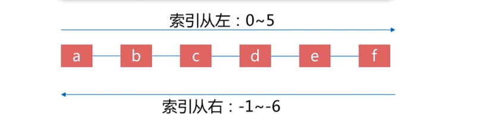

**TIPS**

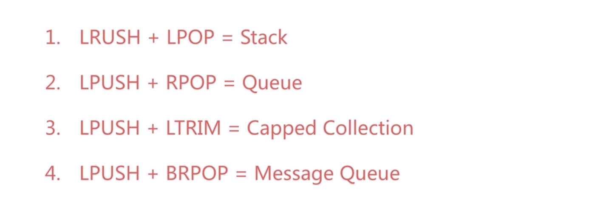

#### set

> * 不能插入重复元素
> * 无序
> * 集合间操作

| 命令                                 | 含义                                               | 复杂度 |
| :----------------------------------- | -------------------------------------------------- | ------ |
| sadd [key] [element]                 | 向集合中添加element(如果element已存在，则添加失败) | O(1)   |
| srem [key] [element]                 | 将集合key中的element移除                           | O(1)   |
| scard [key]                          | 计算集合key的大小                                  | O(1)   |
| sismember [key] [it]                 | 判断it是否在集合key中                              | O(1)   |
| srandmember [key] [count]            | 随机取出集合key中的count个元素，不会删除集合数据   | O( )   |
| smembers [key]                       | 取出集合中所有元素，结果无序                       | O(n)   |
| spop [key]                           | 从集合中随机弹出一个元素，会删除集合数据           | O()    |
| sscan                                |                                                    |        |
| sdiff [key1] [key2]                  | 差集                                               |        |
| sinter [key1] [key2]                 | 交集                                               |        |
| sunion [key1] [key2]                 | 并集                                               |        |
| sdiff\|sinter\|suion + store destkey | 将差集、交集、并集结果保存于destkey中              |        |

**TIPS**


#### zset

> * 有序
> * 不能重复
> * element + score

| 命令                                                     | 含义                                      | 复杂度      |
| :------------------------------------------------------- | ----------------------------------------- | ----------- |
| zadd [key] [score] [element] [score2] [element2]...      | 添加score和element                        | O(log(n))   |
| zrem [key] [element] [element2]...                       | 删除元素                                  | O(1)        |
| zscore [key] [element]                                   | 获取元素的分数                            | O(1)        |
| zincrby [key] [increScore] [element]                     | 增加或减少元素的分数                      | O(1)        |
| zcard [key]                                              | 返回元素的总个数                          | O(1)        |
| zrank [key] [element]                                    | 获取element的排名，从低到高               |             |
| zrange [key] [start] [end] 【withscores】                | 获取指定范围的element并打印分数值（升序） | O(log(n)+m) |
| zrangebyscore [key] [minScore] [maxScore] 【withscores】 | 返回指定分数范围内的升序元素[升序]        | O(log(n)+m) |
| zcount [key] [minScore] [maxScore]                       | 返回有序集合内在指定分数范围内的个数      | O(log(n)+m) |
| zremrangebyrank [key] [start] [end]                      | 删除指定排名内的升序元素                  | O(log(n)+m) |
| zremrangebysocre [key] [minScore] [maxScore]             | 删除指定分数内的升序元素                  | O(log(n)+m) |
| zrevrank                                                 | 与zrank相反                               |             |
| zrevrange                                                | 与zrange相反                              |             |
| zrevrangebyscore                                         | 与zrangebyscore相反                       |             |
| zinterstore                                              | 求交集并保存                              |             |
| zunionstore                                              | 求并集并保存                              |             |

### 2.5 实战

#### 2.5.1 记录网站用户个人主页的访问量

以userid:pageview为key做计数器

```bash
incr userid:pageview    (单线程无竞争)
hincrby userid:1:info pageview 1
```

#### 2.5.2 缓存信息

伪代码:

```java
// string
public VideoInfo get(long id) {
    String redisKey = redisPrefix + id;
    //先从redis查询
    VideoInfo videoInfo = redis.get(redisKey);
    
    if (videoInfo == null) {
        //redis中没有再从原数据源中获取
        videoInfo = mysql.get(id);
        if (videoInfo != null) {
            //获取到之后先序列化后存入redis中
            redis.set(redisKey, serialize(videoInfo));
        }
    }
    
    return videoInfo;
}

// hash
public VideoInfo get(long id) {
    String redisKey = redisPrefix + id;
    Map<String, String> hashMap = redis.hgetAll(redisKey);
    VideoInfo videoInfo = transferMapToVideoInfo(hashMap);
    
    if (videoInfo == null)
    {
        videoInfo = mysql.get(id);
        if (videoInfo != null)
        {
            redis.hmset(redisKey, transferVideoToMap(videoInfo));
        }
    }
}
```

#### 2.5.3 分布式id生成器

与2.5.1类似,利用redis单线程无竞争,能保证incr id是原子操作.  


## 3. Redis客户端

### python

redig-py

### Golang

redigo

### C++


## 4. Redis其他功能

### 慢查询

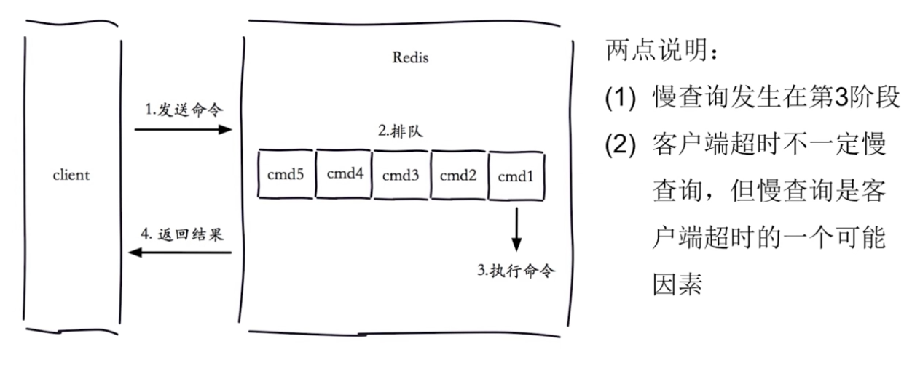

> * 慢查询实现上是一个先进先出队列；
>
> * 固定长度，最先进队列的就会被踢出；
>
> * 保存在内存中，重启会丢失。

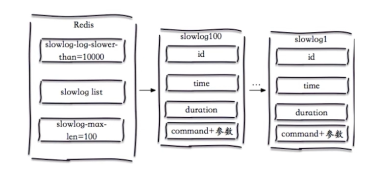

**相关配置**

| 配置项                  | 含义                                                         |
| ----------------------- | ------------------------------------------------------------ |
| slowlog-log-slower-than | 慢查询阈值（单位微妙），时间大于此值的命令会被记录到慢查询队列中；等于0，则记录所有命令；小于0，不记录任何命令 |
| slowlog-max-len         | 慢查询队列最大长度                                           |

**查看配置默认值**

> * config get slowlog-max-len = 128
> * config get slowlog-log-slower-than = 10000

**修改配置**

> * 修改配置文件重启
> * 动态配置（建议操作）
>   *  config set slowlog-max-len 1000
>   * config set slowlog-log-slower-than 1000

**相关命令**

| 命令            | 描述                |
| --------------- | ------------------- |
| slowlog get [n] | 获取慢查询队列中n条 |
| slowlog len     | 获取慢查询队列长度  |
| slowlog reset   | 清空慢查询队列      |

**建议**

> * slowlog-log-slower-than 不要设置过大，默认10ms，通常1ms；
> * slowlog-max-len不要设置过小，通常设置1000左右；
> * 定期持久化慢查询

### Pipeline

### 发布订阅

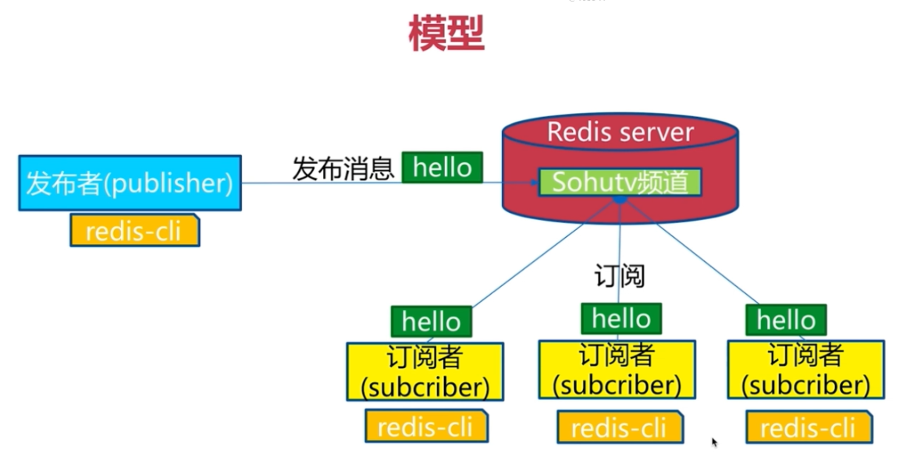

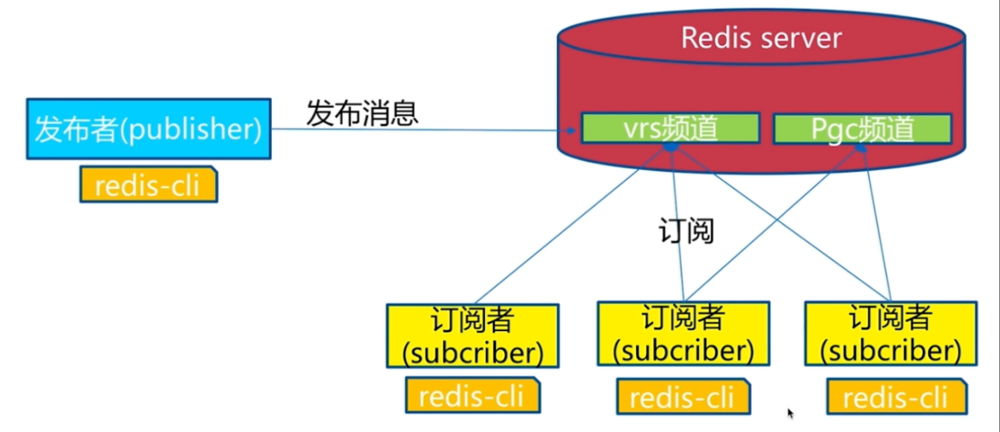

**注意：**

> * 对于一个频道，新加入的订阅者收不到之前的消息。

**相关命令**

| 命令                        | 描述                 |
| --------------------------- | -------------------- |
| publish [channel] [message] | 发布，返回订阅者个数 |
| unsubscribe [channel] ...   | 取消订阅，一个或多个 |
| subscribe [channel] ...     | 订阅一个或多个       |

### 消息队列

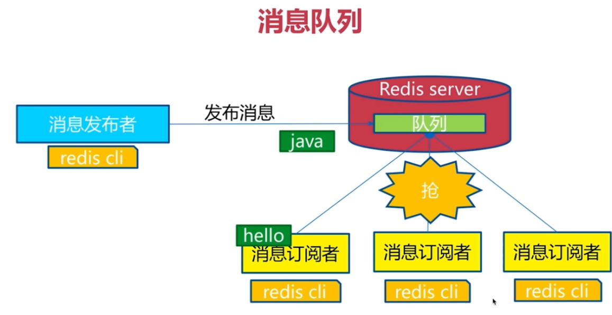

### Bitmap

**相关命令**

| 命令                        | 描述                 |
| --------------------------- | -------------------- |
| publish [channel] [message] | 发布，返回订阅者个数 |
| unsubscribe [channel] ...   | 取消订阅，一个或多个 |
| subscribe [channel] ...     | 订阅一个或多个       |

### HyperLogLog

基于HypeLogLog算法,以极小的空间完成独立数量统计.本质上还是字符串.

```bash
type hyperloglog_key = string
```

**相关命令**

| 命令                                     | 描述                      |
| ---------------------------------------- | ------------------------- |
| pfadd key element [element]...           | 向hyperloglog中添加元素   |
| pfcount key [key] ...                    | 计算hyperloglog的独立总数 |
| pfmerge destkey sourcekey [sourcekey]... | 合并多个hyperloglog       |

 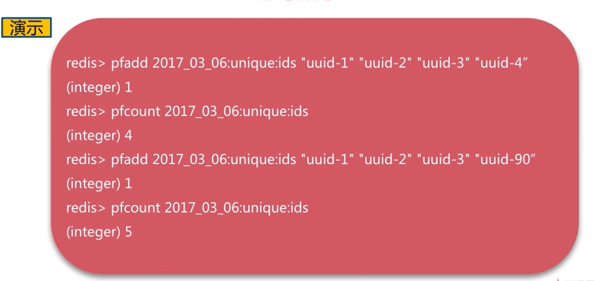

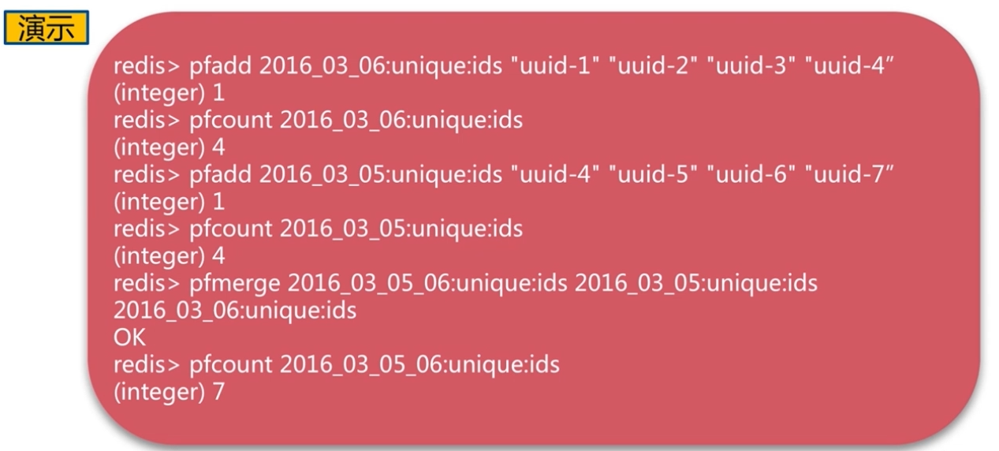

**内存消耗**

  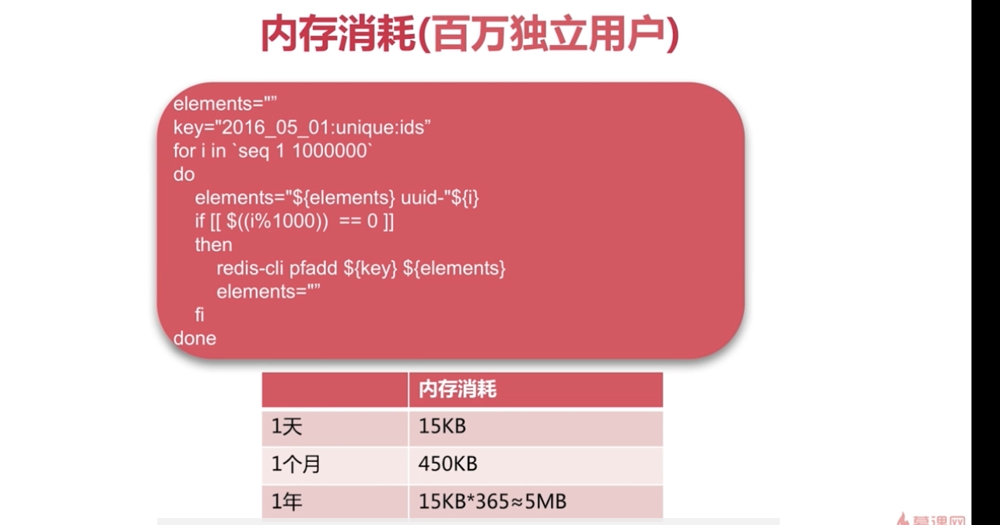

**使用注意:**

> * 以一定的错误率(0.81%)
> * 是否需要单条数据,hyperloglog取不出

### GEO

地理信息定位,存储经纬度,计算两地距离,范围计算等. 

```
type geokey = zset
```

**相关命令**

| 命令                                       | 描述                                                       |
| ------------------------------------------ | ---------------------------------------------------------- |
| geoadd key [longtitude latitude member]... | 增加地理位置信息                                           |
| geopos key [member...]                     | 获取地理位置信息                                           |
| geodist key member1 member2 [unit]         | 获取两个地理位置的距离,unit:m(米)/km(千米)/mi(英里)/ft(尺) |
| zrem key member                            | 删除member                                                 |

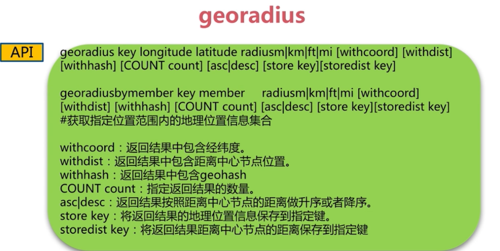

## 5. Redis持久化的取舍和选择

### 持久化的作用

redis所有数据保存在内存中，对数据的更新将异步地保存在磁盘中。

#### 持久化方式

> * 快照
> * 写日志

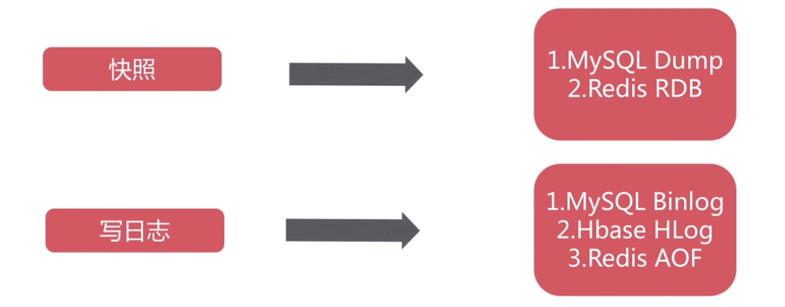

### RDB

#### RDB是什么

将数据库的快照（snapshot）以二进制的方式保存到磁盘中。

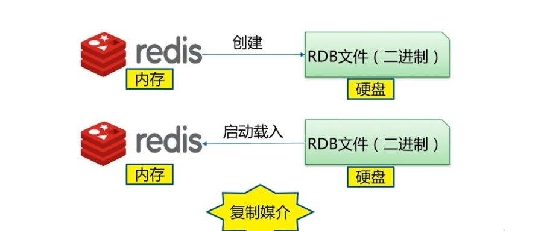

#### 主要三种触发方式

##### 两个命令

| 命令   | 含义     |
| ------ | -------- |
| save   | 同步方式 |
| bgsave | 异步方式 |

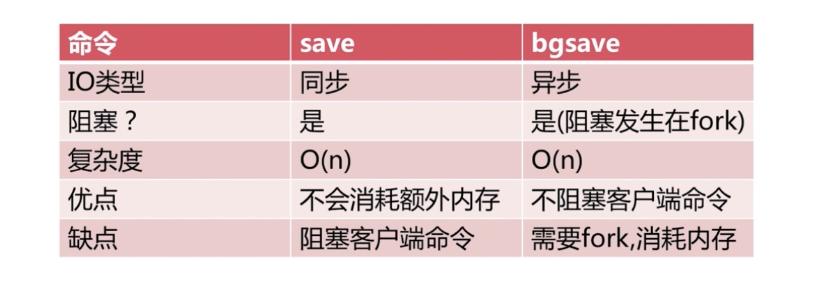

**save**


**bgsave**

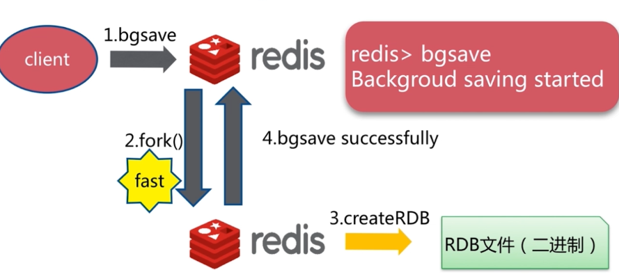


##### 自动生成

通过在配置文件中添加save配置实现。更新RDB频率无法控制。

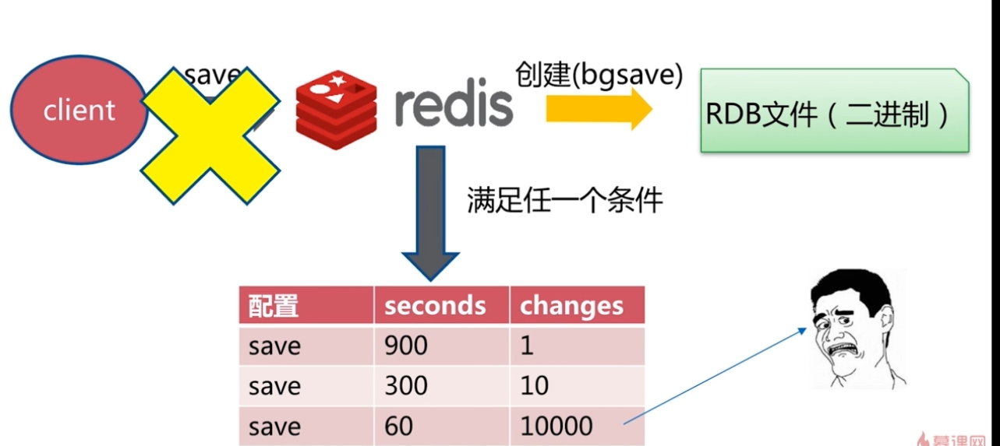

```bash
 save 900 1  
 save 300 10 #每300s有10条更新时生成RDB文件
 save 60 10000
 
 dbfilename dump.rdb #RDB文件名 可以加port dump-${port}.rdb
 dir ./		#redis数据及日志等保存目录
 stop-writes-on-bgsave-error yes #bgsave生成RDB文件时出错时停止写入
 rdbcompression yes	#是否采用压缩的方式写入RDB文件
 rdbchecksum yes
```

#### 不容忽略的触发方式

> * 全量复制 （比如主备同步）
> * debug reload (不清内存重启)
> * shutdown （shutdown save）

#### 试验


#### RDB现存问题

**耗时、耗性能 **

> * 全量dump O(n)，耗时
> * fork()：消耗内存，copy-on-write策略
> * Disk I/O：IO性能

**不可控、容易丢失数据**

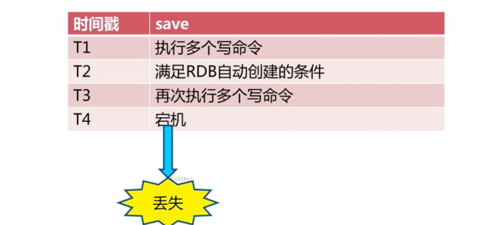

### AOF（Append Only File）

#### 什么是AOF

以协议文本的方式，将所有对数据库进行过写入的命令（及其参数）记录到 AOF 文件，以此达到记录数据库状态的目的。

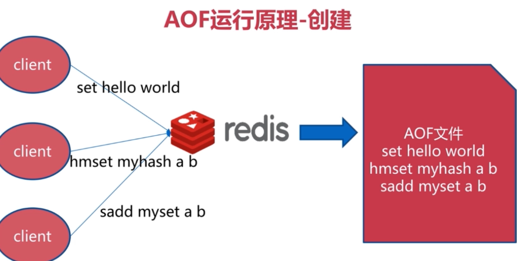


#### AOF三种策略

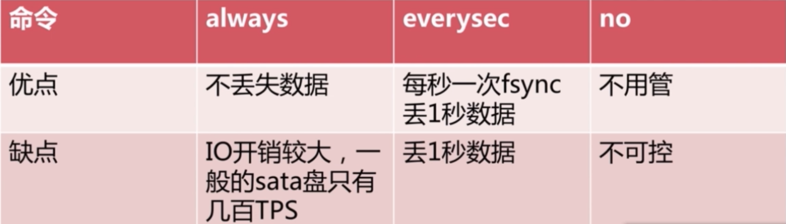

##### always

 

##### everysec

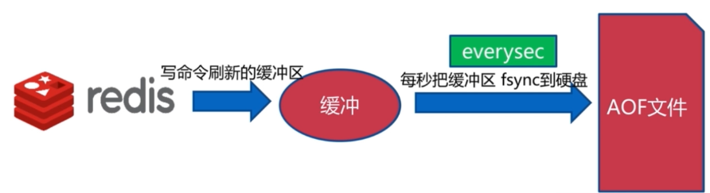

##### no


### AOF相关配置

```bash
appendonly yes
appendfilename "appendonly-${port}.aof"
appendfsync everysec
dir /bigdiskpath

# 在重写的时候是否要继续对正常AOF文件写入，yes：不写入，但是可能会导致数据丢失，需要权衡
no-appendfync-on-rewrite yes
```

#### AOF重写

AOF 持久化是通过保存被执行的写命令来记录数据库状态的，所以AOF文件的大小随着时间的流逝一定会越来越大,影响包括但不限于：

> * 对于Redis服务器，计算机的存储压力；
> * AOF还原出数据库状态的时间增加；

为了解决AOF文件体积膨胀的问题，Redis提供了AOF重写功能：Redis服务器可以创建一个新的AOF文件来替代现有的AOF文件，新旧两个文件所保存的数据库状态是相同的，但是新的AOF文件不会包含任何浪费空间的冗余命令，通常体积会较旧AOF文件小很多。

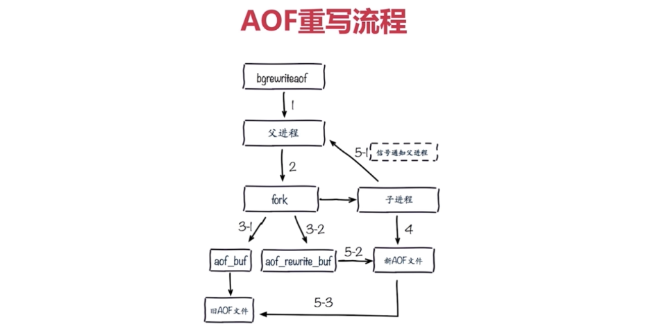

**注意**

AOF重写并不是依据原AOF文件重写，而是通过内存数据进行重写的。

| 原生AOF                                               | AOF重写            |
| ----------------------------------------------------- | ------------------ |
| 过期数据删除                                          |                    |
| set hello world<br/>set hello java<br/>set hello hehe | set hello hehe     |
| incr counter<br/>incr counter                         | set counter 2      |
| rpush mylist a<br/>rpush mylist b<br/>rpush mylist c  | rpush mylist a b c |

**两种实现方式**

**bgrewriteaof**

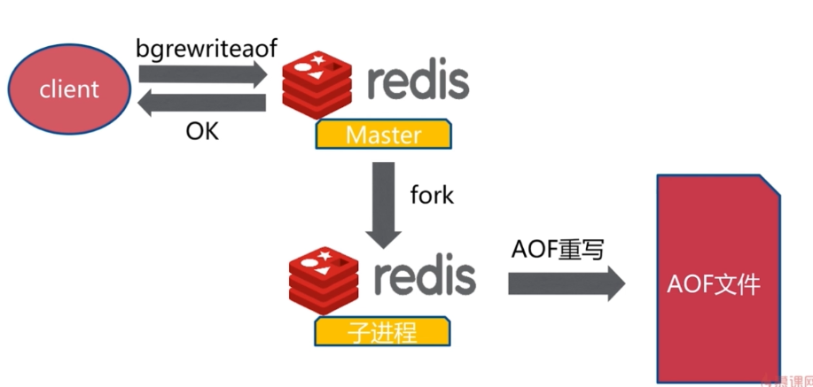

**通过配置实现**

```bash
# AOF文件重写需要的尺寸，AOF文件多大开始重写
auto-aof-rewrite-min-size
# AOF文件增长率，当AOF文件增长达到此配置再开始重写
auto-aof-rewrite-percentage

# AOF当前尺寸（字节）
aof_current_size	
# AOF上次启动和重写的尺寸（字节）
aof_base_size
```

触发时机：

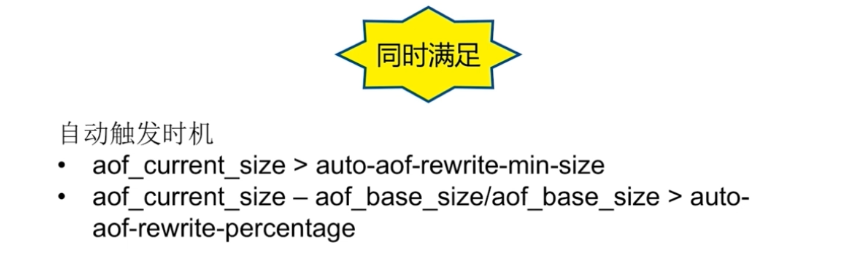

### RDB和AOF的选择

### 常见问题

#### fork操作

> * 同步操作
> * 与内存量息息相关：内存越大，耗时越长（与机器类型有关）
> * info：lastest_fork_usec  上一次fork使用的时间us

**改善fork**

> * 优先使用物理机或者高效支持fork操作的虚拟化技术
> * 控制redis实例最大可用内存：maxmemory
> * 合理配置linux内存分配策略：vm.overcommit_memory=1
> * 降低fork频率：例如放宽AOF重写自动触发时机，减少不必要的全量复制

#### 子进程开销和优化

> * cpu：
>   * 开销：RDB和AOF文件生成，属于CPU密集型？？？
>   * 优化：不做CPU绑定，不和CPU密集型应用部署在一起
> * 内存
>   * 开销：fork内存开销，COW（copy-on-write）
>   * echo never > /sys/kernel/mm/transparent_hugepage/enabled
> * 硬盘：
>   * 开销：AOF和RDB文件写入，可以结合iostat，iotop分析
>   * 优化：
>     * 不要和高硬盘负载服务部署在一起：存储服务、消息队列等
>     * no-appendfsync-on-rewrite = yes
>     * 根据写入量决定使用磁盘类型（例如ssd）
>     * 单机多实例持久化文件目录，可以考虑分盘

#### AOF追加阻塞


**问题定位**

> * redis日志
> * info persistence  
> * top

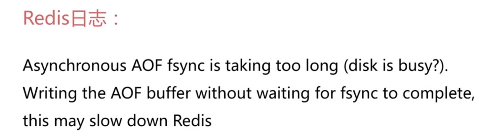

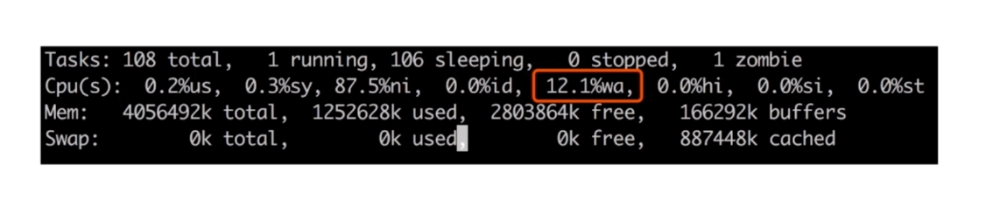

## 6. Redis复制的原理与优化

> * 一个master可以有多个slave
> * 一个slave只能有一个master
> * 数据流是单向的，master->slave

### 主从复制

两种方法，通过配置或命令实现，复制是异步的。

> * 从节点上执行slaveof + ip port（主节点），slaveof no one 可以取消复制，不会清除原来的数据，但是如果重新slaveof一个新的主节点，则会先清掉原来从节点的数据，然后再复制。
> * 添加配置实现：
>   * slaveof ip port
>   * slave-read-only yes

一些相关且实用的命令。

```bash
# 查看主从复制相关信息，包扩主从节点、偏移量等
info replication
# 查看server相关信息，比如run_id等
info server
```

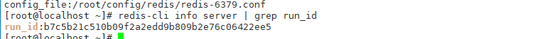

当master的run_id发生变化时，从节点发现此变化就会全量复制。

### 全量复制和部分复制

#### 全量复制

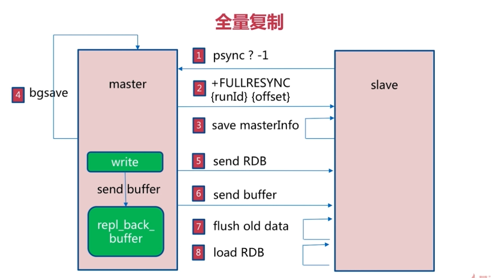

**全量复制开销**

> * bgsave消耗
> * rdb文件网络传输消耗
> * 从节点数据清空时间
> * 从节点rdb文件加载时间
> * 如果AOF开启，则加载rdb完成后会进行AOF重写

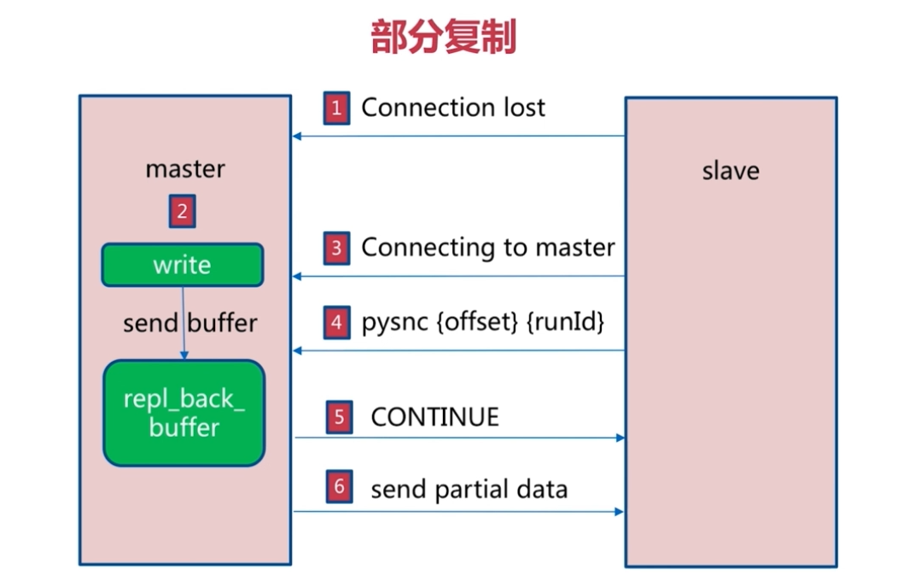

### 故障处理

#### master宕机

> * 没有自动故障转移的情况：在没有自动处理客户端在slave上执行slaveof no one让从节点变为主节点，然后让其他从节点变成该节点的从节点（slaveof new master）。
> * 自动故障转移：高可用—sentinel

### 常见问题

#### 读写分离

读流量分摊到各个从节点。

**可能遇到的问题**

> * 数据同步延迟，可能会导致读写不一致的问题；
> * 读到过期的数据；
> * 从节点故障时，该从节点上对应业务客户端的迁移；

#### 配置不一致

> * 例如maxmemory不一致：丢失数据
> * 例如数据结构优化参数（例如hash-max-ziplist-entries）:内存不一致

#### 规避全量复制

> * 第一次全量复制
>   * 不可避免，第一次的情况
>   * 小主节点（数据分片）、低峰期复制
> * 节点运行ID不匹配
>   * 主节点重启（run_id变化）的情况
>   * 故障转移（主从切换），例如哨兵或集群高可用
> * 复制积压缓冲区不足
>   * 网络中断，部分复制无法满足的情况
>   * 增加复制缓冲区配置rel_backlog_size（可以依据当前的tps计算大概每分钟写入的内存大小，然后乘以网络故障的时间）或网络“增强”； 

#### 规避复制风暴

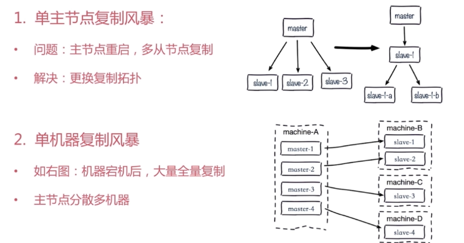

## 7. Redis Sentinel

### 7.1 什么是Sentinel

### 7.2 主从复制高可用

### 7.3 实现原理

### 7.4 选举


