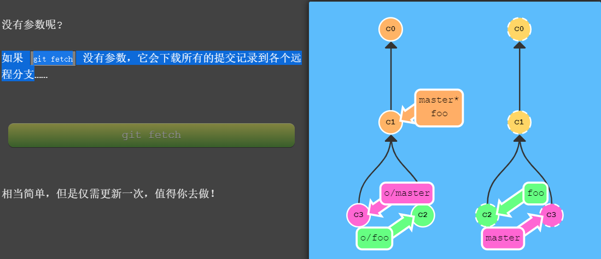

# 版本管理

## GIT

推荐一款学习git的游戏[Learn Git Branching](https://learngitbranching.js.org/?demo=&locale=zh_CN)。以下很多内容也是来自于这个游戏，帮助我对git有了更深层次的认识。

推荐IBM Developer中的一篇文章[很好的理解Git：三种状态和三个工作区](https://www.ibm.com/developerworks/cn/opensource/os-cn-git-and-github-3/index.html)。

### 本地配置

Git是分布式的代码管理工具，远程的代码管理是基于SSH/HTTP/GIT的，如果要使用远程的Git则需要SSH的配置。记录下windows ssh的配置，其他的先不管。
#### windows

配置Git全局的username和email，可配可不配。
```bash
$ git config --global user.name "julymemory"
$ git config --global user.email "enumhack@163.com"
```

生成ssh key
```bash
$ ssh-keygen -t rsa -C “enumhack@163.com"
```
生成的时候注意选择sshkey保存的位置，设置连接时的password（建议不设置密码，方便本地使用）。

### 实用操作

#### 基本流程

```bash
1. 查看远程库信息，使用git remote -v；
2. 本地新建的分支如果不推送到远程，对其他人就是不可见的；
3. 从本地推送分支，使用git push origin branch-name，如果推送失败，先用git pull抓取远程的新提交；
4. 在本地创建和远程分支对应的分支，使用git checkout -b branch-name origin/branch-name，本地和远程分支的名称最好一致；
5. 建立本地分支和远程分支的关联，使用git branch --set-upstream branch-name origin/branch-name；
6. 从远程抓取分支，使用git pull/git pull --rebase，如果有冲突，要先处理冲突。
```


#### git fetch

`git fetch` 的参数和 `git push` 极其相似。他们的概念是相同的，只是方向相反罢了（因为现在你是下载，而非上传）。

```bash
git fetch <remote> <place>
```

如果你像如下命令这样为 git fetch 设置 <place> 的话：

```bash
git fetch origin foo
```

Git 会到远程仓库的 `foo` 分支上，然后获取所有本地不存在的提交，放到本地的 `o/foo` 上。

如果我们指定 <source>:<destination> 会发生什么呢？

```bash
git fetch origin <source>:<destination>
```

如果你觉得直接更新本地分支很爽，那你就用冒号分隔的 refspec 吧。不过，你不能在当前检出的分支上干这个事，但是其它分支是可以的。这里有一点是需要注意的 —— `source` 现在指的是远程仓库中的位置，而 `<destination>` 才是要放置提交的本地仓库的位置，如果destination不存在则会创建。它与 git push 刚好相反，这是可以讲的通的，因为我们在往相反的方向传送数据。

```bash
# Git 将 foo~1 解析成一个 origin 仓库的位置，然后将那些提交记录下载到了本地的 bar 分支（一个本地分支）上。注意由于我们指定了目标分支，foo 和 o/foo 都不会被更新。
git fetch origin foo~1:bar
```


如果 `git fetch` 没有参数，它会下载所有的提交记录到各个远程分支。



如果 fetch 空 <source> 到本地，会在本地创建一个新分支。


`git fetch` 完成了仅有的但是很重要的两步:

> * 从远程仓库下载本地仓库中缺失的提交记录
> * 更新远程分支指针(如 `o/master`)

`git fetch` 实际上将本地仓库中的远程分支更新成了远程仓库相应分支最新的状态。

如果你还记得上一节课程中我们说过的，远程分支反映了远程仓库在你**最后一次与它通信时**的状态，`git fetch` 就是你与远程仓库通信的方式了！希望我说的够明白了，你已经了解 `git fetch` 与远程分支之间的关系了吧。

`git fetch` 通常通过互联网（使用 `http://` 或 `git://` 协议) 与远程仓库通信。

**git fetch 不会做的事**

`git fetch` 并不会改变你本地仓库的状态。它不会更新你的 `master` 分支，也不会修改你磁盘上的文件。

理解这一点很重要，因为许多开发人员误以为执行了 `git fetch` 以后，他们本地仓库就与远程仓库同步了。它可能已经将进行这一操作所需的所有数据都下载了下来，但是**并没有**修改你本地的文件。我们在后面的课程中将会讲解能完成该操作的命令 :git pull。

所以, 你可以将 `git fetch` 的理解为单纯的下载操作。


#### git push

```bash
git push <remote> <place>
```

**git push origin master**

把这个命令翻译过来就是：切到本地仓库中的“master”分支，获取所有的提交，再到远程仓库“origin”中找到“master”分支，将远程仓库中没有的提交记录都添加上去，搞定之后告诉我。我们通过“place”参数来告诉 Git 提交记录来自于 master, 要推送到远程仓库中的 master。它实际就是要同步的两个仓库的位置。

需要注意的是，因为我们通过指定参数告诉了 Git 所有它需要的信息, 所以它就忽略了我们所检出的分支的属性！

如果来源和去向分支的名称不同呢？比如你想把本地的 `foo` 分支推送到远程仓库中的 `bar` 分支。此时需要同时为源和目的地指定的话，只需要用冒号 `:` 将二者连起来就可以了：

```bash
git push origin <source>:<destination>
git push origin master:newBranch
```

这个source参数实际的值是个 refspec，“refspec” 是一个自造的词，意思是 Git 能识别的位置（比如分支 `foo` 或者 `HEAD~1`）。如果你要推送到的目的分支不存在会怎么样呢？没问题！Git 会在远程仓库中根据你提供的名称帮你创建这个分支！

如果 push 空 <source> 到远程仓库会如何呢？它会删除远程仓库中的分支！


**注意**

`git push` 不带任何参数时的行为与 Git 的一个名为 `push.default` 的配置有关。它的默认值取决于你正使用的 Git 的版本，但是在教程中我们使用的是 `upstream`。 这没什么太大的影响，但是在你的项目中进行推送之前，最好检查一下这个配置。

**其他操作**

```bash
# 删除远程分支develop_ct
git push origin --delete develop_ct 
```


#### git pull

既然我们已经知道了如何用 `git fetch` 获取远程的数据, 现在我们学习如何将这些变化更新到我们的工作当中。

其实有很多方法的 —— 当远程分支中有新的提交时，你可以像合并本地分支那样来合并远程分支。也就是说就是你可以执行以下命令等等:

> * git cherry-pick origin/master
> * git rebase origin/master
> * git merge origin/master

实际上，由于先抓取更新再合并到本地分支这个流程很常用，因此 Git 提供了一个专门的命令来完成这两个操作。它就是我们要讲的 `git pull`。

```bash
git pull = git fetch + git merge
git pull --rebase = git fetch + git rebase 
```

以下命令在 Git 中是等效的：

`git pull origin foo` 相当于：

```bash
git fetch origin foo; git merge o/foo
```

还有...

`git pull origin bar~1:bugFix` 相当于：

```bash
git fetch origin bar~1:bugFix; git merge bugFix
```


#### git reset & git revert

git reset 通过把分支记录回退几个提交记录来实现撤销改动。你可以将这想象成“改写历史”。git reset 向上移动分支，原来指向的提交记录就跟从来没有提交过一样。

虽然在你的本地分支中使用 git reset 很方便，但是这种“改写历史”的方法对大家一起使用的远程分支是无效的哦！为了撤销更改并分享给别人，我们需要使用 `git revert`。来看演示：


在我们要撤销的提交记录后面居然多了一个新提交！这是因为新提交记录 C2' 引入了**更改** —这些更改刚好是用来撤销 C2 这个提交的。也就是说 C2' 的状态与 C1 是相同的。revert 之后就可以把你的更改推送到远程仓库与别人分享啦。

**注意：**

两个命令均可操作commitid或者基于HEAD的相对引用，含义是一样的。

> * git reset HEAD^1 回退HEAD的提交，然后HEAD指向HEAD^1
> * git revert HEAD 撤销HEAD指向的提交

#### git log

参数说明：

```bash
–author 指定作者
–stat 显示每次更新的文件修改统计信息，会列出具体文件列表
–shortstat 统计每个commit 的文件修改行数，包括增加，删除，但不列出文件列表：
–numstat 统计每个commit 的文件修改行数，包括增加，删除，并列出文件列表：
-p 选项展开显示每次提交的内容差异，用 -2 则仅显示最近的两次更新
例如：git log -p -2
–name-only 仅在提交信息后显示已修改的文件清单
–name-status 显示新增、修改、删除的文件清单
–abbrev-commit 仅显示 SHA-1 的前几个字符，而非所有的 40 个字符
–relative-date 使用较短的相对时间显示（比如，“2 weeks ago”）
–graph 显示 ASCII 图形表示的分支合并历史
–pretty 使用其他格式显示历史提交信息。可用的选项包括 oneline，short，full，fuller 和 format（后跟指定格式）
例如： git log --pretty=oneline ; git log --pretty=short ; git log --pretty=full ; git log --pretty=fuller
–pretty=tformat: 可以定制要显示的记录格式，这样的输出便于后期编程提取分析
例如：git log --pretty=format:""%h - %an, %ar : %s""
下面列出了常用的格式占位符写法及其代表的意义。
选项 说明
%H 提交对象（commit）的完整哈希字串
%h 提交对象的简短哈希字串
%T 树对象（tree）的完整哈希字串
%t 树对象的简短哈希字串
%P 父对象（parent）的完整哈希字串
%p 父对象的简短哈希字串
%an 作者（author）的名字
%ae 作者的电子邮件地址
%ad 作者修订日期（可以用 -date= 选项定制格式）
%ar 作者修订日期，按多久以前的方式显示
%cn 提交者(committer)的名字
%ce 提交者的电子邮件地址
%cd 提交日期
%cr 提交日期，按多久以前的方式显示
%s 提交说明
–since 限制显示输出的范围，
例如： git log --since=2.weeks 显示最近两周的提交
选项 说明
-(n) 仅显示最近的 n 条提交
–since, --after 仅显示指定时间之后的提交。
–until, --before 仅显示指定时间之前的提交。
–author 仅显示指定作者相关的提交。
–committer 仅显示指定提交者相关的提交。
```

```bash
# 查看指定文件或目录的修改记录
git log + 文件名/文件目录
# 查看含有 "aa" 关键字的commit
git log --grep=aa  
# 查看关于chenteng提交的修改
git log --author=chenteng 
# 每次修改的文件列表, 显示状态
git log --name-status
# 每次修改的文件列表
git log --name-only 
# 每次修改的文件列表, 及文件修改的统计
git log --stat 

git log --help
```

根据git log统计代码量：

```bash
#!/bin/sh

git log --format='%aN' | sort -u | while read name; 
	do echo -en "$name\t"; 
	git log --since ==2020-03-11 --until==2020-03-17 --author="$name" --pretty=tformat: --numstat | awk '{ add += $1; subs += $2; loc += $1 + $2 } END { printf "added lines: %s, removed lines: %s, total lines: %s\n", add, subs, loc }' -; 
done
```

```bash
# 查看git上个人代码量, windows下需要转义 printf \"added lines: %s...\"
git log --author="username" --since ==2020-03-11 --until==2020-03-17 --pretty=tformat: --numstat | awk '{ add += $1; subs += $2; loc += $1 - $2 } END { printf "added lines: %s, removed lines: %s, total lines: %s\n", add, subs, loc }' -

# 查看仓库提交者排名前 5
git log --pretty='%aN' | sort | uniq -c | sort -k1 -n -r | head -n 5
# 贡献者统计
git log --pretty='%aN' | sort -u | wc -l
# 提交数统计
git log --oneline | wc -l
# 统计代码总行数
find . -name "*.m" -or -name "*.h" -or -name "*.xib" -or -name "*.c" |xargs grep -v "^$"|wc -l
find . "(" -name "*.java" ")" -print | xargs wc -l
```

#### git show 

```bash
git show + git提交版本号 + 文件名
# 显示某个 commitid 改变的具体内容
git show commitid 
```

#### git merge & git mergetool

```bash
git merge 合并的一些方式：
fast-forward Git 合并两个分支时，如果顺着一个分支走下去可以到达另一个分支的话，那么 Git 在合并两者时，只会简单地把指针右移，叫做“快进”（fast-forward）不过这种情况如果删除分支，则会丢失merge分支信息。
–no-ff 关闭fast-forward模式，在提交的时候，会创建一个merge的commit信息，然后合并的和master分支 
--allow-unrelated-histories 允许合并无关的历史提交 git合并操作可以指定使用的合并策略，默认会选择最适合的合并策略。例如：两个分支的合并默认使用recursive合并策略、两个以上分支的合并默认使用octpus合并策略。

我们也可以通过传递参数来指定使用的合并策略，命令行模式为： 
git merge -s 合并策略 -X 合并策略参数 <commit>...
resolve策略：只能用于两个分支的合并，这个合并策略被认为是最安全、最快的合并策略recursive策略：只能用于两个分支的合并，两个分支的合并默认使用该策略。
该策略可以使用选项： 
ours：在遇到冲突的时候，选择当前分支的版本，而忽略远程合并过来的版本。 
theirs：和ours选项相反 subtree[=path]：使用子树合并策略octpus策略：用于合并两个以上分支的策略，该策略拒绝执行需要手动解决的复杂合并。
ours：可以用于任意多个分支的合并策略，合并的结果总是使用当前分支的内容而丢弃远程合并过来的版本内容。
```

#### git branch

git branch -a、git branch -d、 git branch -D

我使用相对引用最多的就是移动分支。可以直接使用 `-f` 选项让分支指向另一个提交。例如:

```
git branch -f master HEAD~3  
git branch -f master commitid
```

上面的命令会将 master 分支强制指向 HEAD 的第 3 级父提交。


#### git rm

#### git cherry-pick & git cherry -v

- git cherry-pick <提交号>... 可以跟多个commitid

​		cherry-pick 可以将提交树上任何地方的提交记录取过来追加到 HEAD 上（只要不是 HEAD 上游的提交就没问题）。如果你想将一些提交复制到当前所在的位置（`HEAD`）下面的话， Cherry-pick 是最直接的方式了。我个人非常喜欢 `cherry-pick`，因为它特别简单。


当你知道你所需要的提交记录（**并且**还知道这些提交记录的哈希值）时, 用 cherry-pick 再好不过了 —— 没有比这更简单的方式了。但是如果你不清楚你想要的提交记录的哈希值呢? 幸好 Git 帮你想到了这一点, 我们可以利用交互式的 rebase —如果你想从一系列的提交记录中找到想要的记录, 这就是最好的方法了。

交互式 rebase 指的是使用带参数 `--interactive` 的 rebase 命令, 简写为 `-i`，如果你在命令后增加了这个选项, Git 会打开一个 UI 界面并列出将要被复制到目标分支的备选提交记录，它还会显示每个提交记录的哈希值和提交说明，提交说明有助于你理解这个提交进行了哪些更改。在实际使用时，所谓的 UI 窗口一般会在文本编辑器 —— 如 Vim —— 中打开一个文件。 

#### git checkout 

git checkout 可以在仓库提交记录树移动HEAD的指向，可以根据commit id、分支名和tag等指定位置。

​		通过哈希值指定提交记录很不方便，所以 Git 引入了相对引用。这个就很厉害了!使用相对引用的话，你就可以从一个易于记忆的地方（比如 `bugFix` 分支或 `HEAD`）开始计算。相对引用非常给力，这里我介绍两个简单的用法：

> * 使用 `^` 向上移动 1 个提交记录
> * 使用 `~` 向上移动多个提交记录，如 `~3`

"^"后也可以加数字表示第几个父提交。并不是用来指定向上返回几代，而是指定合并提交记录的某个父提交。还记得前面提到过的一个合并提交有两个父提交吧，所以遇到这样的节点时该选择哪条路径就不是很清晰了。Git 默认选择合并提交的“第一个”父提交，在操作符 `^` 后跟一个数字可以改变这一默认行为。


#### git diff

#### git remote add 


#### git remote rm
#### git stash

git stash apply、git stash drop、git stash clear、git stash pop、 git stash apply stash@{0}

#### git rebase 

**Rebase** 实际上就是取出一系列的提交记录，“复制”它们，然后在另外一个地方逐个的放下去。Rebase 的优势就是可以创造更线性的提交历史，这听上去有些难以理解。如果只允许使用 Rebase 的话，代码库的提交历史将会变得异常清晰。

```bash
# branch1 -> branch2,不会修改branch2的指向
git rebase branch1 branch2
# 当前分支 -> branch1，不会修改branch1的指向
git rebase branch1
```

这种情况也是很常见的：你之前在 `newImage` 分支上进行了一次提交，然后又基于它创建了 `caption` 分支，然后又提交了一次。此时你想对的某个以前的提交记录进行一些小小的调整。比如设计师想修改一下 `newImage` 中图片的分辨率，尽管那个提交记录并不是最新的了。

**解决方案：**

(1)

> * 先用 `git rebase -i` 将提交重新排序，然后把我们想要修改的提交记录挪到最前
> * 然后用 `commit --amend` 来进行一些小修改
> * 接着再用 `git rebase -i` 来将他们调回原来的顺序
> * 最后我们把 master 移到修改的最前端（用你自己喜欢的方法），就大功告成啦！

(2) git cherry-pick

当然完成这个任务的方法不止上面提到的一种（我知道你在看 cherry-pick 啦），之后我们会多点关注这些技巧啦，但现在暂时只专注上面这种方法。 最后有必要说明一下目标状态中的那几个`'` —— 我们把这个提交移动了两次，每移动一次会产生一个 `'`；而 C2 上多出来的那个是我们在使用了 amend 参数提交时产生的，所以最终结果就是这样了。

也就是说，我在对比结果的时候只会对比提交树的结构，对于 `'` 的数量上的不同，并不纳入对比范围内。只要你的 `master`分支结构与目标结构相同，我就算你通过。

#### git tag

​		分支很容易被人为移动，并且当有新的提交时，它也会移动。分支很容易被改变，大部分分支还只是临时的，并且还一直在变。有没有什么可以*永远*指向某个提交记录的标识呢，比如软件发布新的大版本，或者是修正一些重要的 Bug 或是增加了某些新特性，有没有比分支更好的可以永远指向这些提交的方法呢？

​		Git 的 tag 就是干这个用的啊，它们可以（在某种程度上 —— 因为标签可以被删除后重新在另外一个位置创建同名的标签）永久地将某个特定的提交命名为里程碑，然后就可以像分支一样引用了。更难得的是，它们并不会随着新的提交而移动。你也不能检出到某个标签上面进行修改提交，它就像是提交树上的一个锚点，标识了某个特定的位置。


```bash
# 查看所有tag
git tag
# 查看符合模式tag
git tag -l ‘v0.1.*’
# 查看tag信息
git show v0.1.2
# 切换到tag版本
git checkout [tagname]
# 提交tag
git push origin [tagname]
# 删除本地tag
git tag -d [tagname]
# 删除远程tag 就像git push origin :branch_1 可以删除远程仓库的分支branch_1一样， 冒号前为空表示删除远程仓库的tag。
git push origin :refs/tags/v1.01
```

#### git describe

由于标签在代码库中起着“锚点”的作用，Git 还为此专门设计了一个命令用来**描述**离你最近的锚点（也就是标签），它就是 `git describe`。

Git Describe 能帮你在提交历史中移动了多次以后找到方向；当你用 `git bisect`（一个查找产生 Bug 的提交记录的指令）找到某个提交记录时，可能会用到这个命令。

`git describe` 的语法是：

```bash
git describe <ref>
```

ref 可以是任何能被 Git 识别成提交记录的引用，如果你没有指定的话，Git 会以你目前所检出的位置（HEAD）。

它输出的结果是这样的：

```
<tag>_<numCommits>_g<hash>
```

`tag` 表示的是离 `ref` 最近的标签， `numCommits` 是表示这个 `ref` 与 `tag` 相差有多少个提交记录， `hash` 表示的是你所给定的 `ref` 所表示的提交记录哈希值的前几位。当 `ref` 提交记录上有某个标签时，则只输出标签名称。


#### config文件里面的信息多看看

#### 更新远程分支

`master` 和 `o/master` 的关联关系就是由分支的“remote tracking”属性决定的。`master` 被设定为跟踪 `o/master` —— 这意味着为 `master` 分支指定了推送的目的地以及拉取后合并的目标。

你可能想知道 `master` 分支上这个属性是怎么被设定的，你并没有用任何命令指定过这个属性呀！好吧, 当你克隆仓库的时候, Git 就自动帮你把这个属性设置好了。

当你克隆时, Git 会为远程仓库中的每个分支在本地仓库中创建一个远程分支（比如 `o/master`）。然后再创建一个跟踪远程仓库中活动分支的本地分支，默认情况下这个本地分支会被命名为 `master`。

克隆完成后，你会得到一个本地分支（如果没有这个本地分支的话，你的目录就是“空白”的），但是可以查看远程仓库中所有的分支（如果你好奇心很强的话）。这样做对于本地仓库和远程仓库来说，都是最佳选择。

这也解释了为什么会在克隆的时候会看到下面的输出：

```
local branch "master" set to track remote branch "o/master"
```

我们可以让任意分支跟踪 `o/master`, 然后该分支会像 `master` 分支一样得到隐含的 push 目的地以及 merge 的目标。 这意味着你可以在分支 `totallyNotMaster` 上执行 `git push`，将工作推送到远程仓库的 `master` 分支上。

有两种方法设置这个属性，第一种就是通过远程分支检出一个新的分支，执行:

```bash
git checkout -b totallyNotMaster o/master
```

就可以创建一个名为 `totallyNotMaster` 的分支，它跟踪远程分支 `o/master`。

另一种设置远程追踪分支的方法就是使用：`git branch -u` 命令，执行：

```bash
git branch -u o/master foo
```

这样 `foo` 就会跟踪 `o/master` 了。如果当前就在 foo 分支上, 还可以省略 foo：

```bash
git branch -u o/master
```

### 解决方案

#### 远程服务器拒绝!(Remote Rejected)

如果你是在一个大的合作团队中工作, 很可能是master被锁定了, 需要一些Pull Request流程来合并修改。如果你直接提交(commit)到本地master, 然后试图推送(push)修改, 你将会收到这样类似的信息:

```
! [远程服务器拒绝] master -> master (TF402455: 不允许推送(push)这个分支; 你必须使用pull request来更新这个分支.)
```

为什么会被拒绝?远程服务器拒绝直接推送(push)提交到master, 因为策略配置要求 pull requests 来提交更新。你应该按照流程,新建一个分支， 推送(push)这个分支并申请pull request，但是你忘记并直接提交给了master。现在你卡住并且无法推送你的更新。

此时，需要新建一个分支feature, 推送到远程服务器。然后reset你的master分支和远程服务器保持一致，否则下次你pull并且他人的提交和你冲突的时候就会有问题。

#### fatal: refusing to merge unrelated histories

```bash
$ git pull --allow-unrelated-histories
```

#### 使gitignore生效

```bash
# 修改.gitignore文件后
$ git rm -r --cached .  #清除缓存
$ git add . #重新trace file
$ git commit -m "update .gitignore" #提交和注释
```

#### 如何清空所有的commit记录

``` bash
# 使用 git checkout --orphan new_branch ,基于当前分支创建一个独立的分支new_branch；
$ git checkout --orphan  new_branch
# 添加所有文件变化至暂存空间
$ git add -A
# 提交并添加提交记录
$ git commit -am "commit message"
# 删除当前分支
$ git branch -D master
# 重新命名当前独立分支为 master
$ git branch -m master
# 推送到远端分支
$ git push -f origin master
```

```
对于--orphan < new_branch > 的解释就是:
// Create a new orphan branch, named <new_branch>, started from
// <start_point> and switch to it. The first commit made on this new
// branch will have no parents and it will be the root of a new
// history totally disconnected from all the other branches and
// commits.
// 中文翻译：
// 创建一个独立的new_branch分支，HEAD指向当前分支，并自动切换到该分支；
// 分支没有父级结点，它是一个新的根记录，不与其他任何分支和提交记录有连接。

// The index and the working tree are adjusted as if you had
// previously run "git checkout <start_point>". This allows you to
// start a new history that records a set of paths similar to
// <start_point> by easily running "git commit -a" to make the root
// commit.
// 中文翻译：
// 它会基于你之前执行"git checkout <start_point>"的 start_point 分支，调整新的索引和分支树
// 你可以通过"git commit -a"提交一个新commit记录作为根提交记录，这样的话你就有个一个新的历史记录，
// 类似于 start_point 分支的一系列提交记录痕迹；

// This can be useful when you want to publish the tree from a commit
// without exposing its full history. You might want to do this to
// publish an open source branch of a project whose current tree is
// "clean", but whose full history contains proprietary or otherwise
// encumbered bits of code.
// 中文翻译：
// 如果你想把你的分支树变成只有一个commit记录，不想暴露他所有提交历史，那么它就很有用。
// 如果你想通过这样做发布一个开源分支工程，当前所有包含专利记录分支树就会被清空，否则就是一堆冗余的代码；

// If you want to start a disconnected history that records a set of
// paths that is totally different from the one of <start_point>, then
// you should clear the index and the working tree right after
// creating the orphan branch by running "git rm -rf ." from the top
// level of the working tree. Afterwards you will be ready to prepare
// your new files, repopulating the working tree, by copying them from
// elsewhere, extracting a tarball, etc.
// 中文翻译：
// 如果你想开始一个全新的提交记录，完全与start_point分支不同，在你创建这个独立分支后，
// 通过 'git rm -rf',从根工作空间删除所有工作空间和索引里面的文件。
// 随后，你可以通过从别处复制准备你的新文件来从新填充你的工作空间。
```

## commit message

**2.1.2. Commit Message**

之前翻看了不少现存的项目代码，看到不少的 Commit Message 写得比较简单，例如一连串的 "update", "fix"，从这些 Commit Message 中完全看不出做了什么改动，想想如果之后想要定位之前的某个改动，该从哪里下手。

目前 Commit Message 规范比较常见的有 [Angular 团队的规范](https://github.com/angular/angular.js/blob/master/DEVELOPERS.md#-git-commit-guidelines)，并由此衍生出了[Conventional Commits Specification](https://www.conventionalcommits.org/en/v1.0.0/)，可以参照此 Specification 约定 Commit Message 格式规范。

```
<type>(<scope>): <subject><BLANK LINE><body><BLANK LINE><footer>
```

大体分三行：

- **【标题行】** 必填, 描述主要修改类型和内容。
- **【主题内容】** 描述为什么修改, 做了什么样的修改, 以及这么做的思路等等。
- **【页脚注释】** 放 Breaking Changes 或 Closed Issues

其中 type 是 Commit 的类型，可以有以下取值：

- feat：新特性
- fix：修改 bug
- refactor：代码重构
- docs：文档更新
- style：代码格式修改
- test：测试用例修改
- chore：其他修改, 比如构建流程, 依赖管理

其中 scope 表示的是 Commit 影响的范围，比如 ui，utils，build 等，是一个可选内容。

其中 subject 是 Commit 的概述，body 是 Commit 的具体内容。

例如：

```
fix: correct minor typos in codesee the issue for details on typos fixed.Refs #133
```

Commit Message 可以在 git 中配置模板，这样可以在 vim 中展示出模板，另外可有工具帮助我们生成和约束 Commit Message，例如 commitizen/cz-cli，这里不再具体说明。