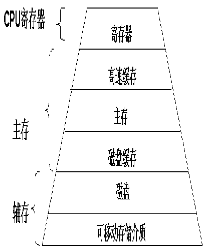
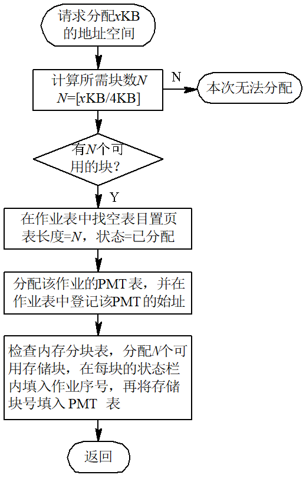
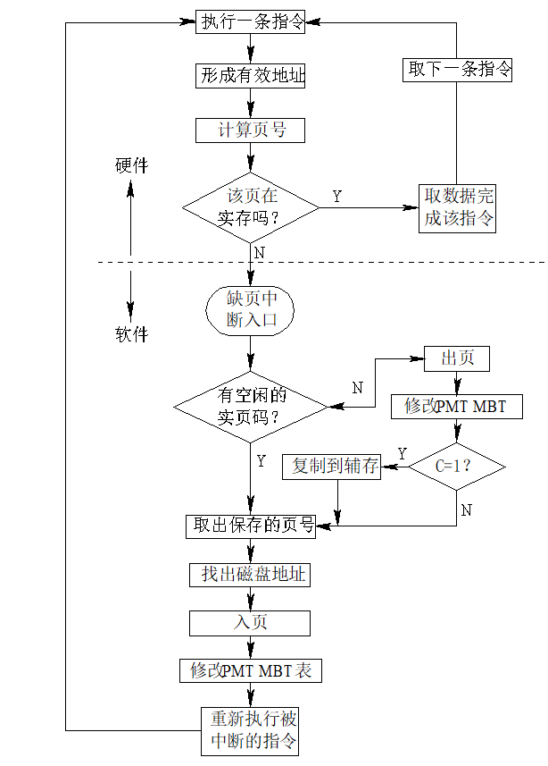

# 操作系统

## 进程管理

## CPU调度算法

## 内存管理

对于通用计算机而言，存储层次至少应具有三级 ：最高层为CPU寄存器，中间为主存，最底层是辅存。在较高档的计算机中，还可以根据具体的功能分工，细划为寄存器、高速缓存、主存储器、磁盘缓存、固定磁盘、可移动存储介质等6层。



### 虚拟内存

### 地址空间

### swap（交换技术）

交换技术被广泛地运用于早期的小型分时系统的存贮管理中。所谓交换，就是系统根据需要把主存中暂时不运行的某个(或某些)作业部分或全部移到外存，而把外存中的某个(或某些)作业移到相应的主存区，并使其投入运行。所以，交换技术也叫对换或滚进滚出（roll-in,roll-out）。也有的系统叫挂起调度或中级调度。被换出到外存的程序只是临时被剥夺了对内存的使用权，过一段时间，还必须换入内存运行。因此，交换是一种用时间换空间的技术。 

**交换的时机通常在以下情况发生**：
	①作业的进程用完时间片或等待输入输出；
	②作业要求扩充存储而得不到满足时。
同覆盖技术一样，交换技术也是利用外存来逻辑地扩充主存。它的主要特点是打破了一个程序一旦进入主存便一直运行到结束的限制。

### 分页存储管理

#### 基本概念

```
1. 等分主存：把主存划分为相同大小的存储块，称为页架或块，从0顺序编号。
2. 划分作业：把进程的逻辑地址空间按相同的等分因子划分为若干部分，称为页面或页，从0顺序编号。
3. 逻辑地址的表示：用数对（p,d）表示，p表示页号，d表示页内地址
4. 主存分配原则：以页架为单位，把主存分给作业进程，一个进程所分配的页架不一定是连续的，一个页面对应一个页架。
5. 页表和页表地址寄存器：
    页表：确定页面和页架对应关系的表，也称为页面变换表（PMT）。
         包含的信息有：页号、页架号、状态                                   
    作业调度程序调入作业时，系统为其创建页表，撤销作业时清除页表。
    页表地址寄存器：用于指出当前运行进程的页表起始地址和页表长度。
 6. 页面尺寸的大小：
     一般为2n
```

#### 动态地址变换

##### 动态地址变换

##### 高速页面变换寄存器

**动态地址变换的不足：**

因为页表是存放在内存中的，CPU要存取一个数据，需访问主存两次。第一次：访内存中的页表，找到该页的的物理块号，将此块号与页内地址拼结形成物理地址；第二次：真正访问该物理地址，存取其中的内容。这样就把程序的执行速度降低一倍。为了提高存取速度，在地址变换机构中增设一组寄存器，用来存放页表，其速度比内存表的查找要快一到两个数量级。
**做法：**

为了实现从作业地址空间到物理地址空间的变换，可采用硬件的高速寄存器来实现。因为任一时刻在处理机中只有一个作业在执行，所以只需一组高速寄存器就可满足要求。假定页面大小为 4 KB， 那么对于 100 KB的作业来说， 就需要 25 个高速寄存器。由于高速寄存器的成本高， 所以它适用于地址空间小的作业。如果系统所接受的作业都在 64 KB以下， 那么只需要 16 个寄存器就够了。在多道程序环境下，当处理机把控制转移到另一新作业时，应保存原作业的寄存器内容并重置相应的新作业的寄存器内容(即存储块号)。
**问题：**

作业过大时寄存器个数过多，成本高。

##### 联想存储器

动态地址变换速度慢，高速页面变换寄存器成本高。为控制成本且提高速度，可引入一定数量的寄存器存放页表（部分），并且使在寄存器查找到的概率达到90%左右。把存放在高速缓冲寄存器中的页表叫快表，这个高速缓冲寄存器又叫联想存贮器。存放的是当前正在运行的作业PMT中最常用的部分页号和相应的块号。

查找时双管其下，快表和PMT表的查找同时进行。

#### 算法

```
1. 作业表（JT）：整个系统一张，每个作业对应一个条目。
             包括：作业号，页表长度，起始地址，状态。
2. 存储分块表（MBT）：整个系统一张，每个表目对应一个存储块。
3. 页面变换表（PMT）：每个作业一张，有多少页面对应多少条目，包括页号、块号。
```

<figure>


</figure>

#### 优缺点

```
1. 采用动态地址变换会增加计算机成本并降低处理机的速度。
2. 各种表格要占用一定容量的主存空间，而且还要花费一部分处理机时间用来建立和管理这些表格。
3. 虽然说碎片消除了，但每个作业的最后一页一般都有不能充分利用的空白区。 
4. 存储扩充问题仍未得到解决。 
```

### 请求分页存储管理

```
一、核心：
      解决内存资源不足，实现存储扩充。
二、请求分页原理：
1. 思想：
    一作业执行之前不需将全部地址空间一次装入，动态申请，动态装入。
 2. 问题：
     在请求分页存储管理中，必须解决如下几个问题：
     ( 1 ) 如果一个作业不把它的整个地址空间同时全部装入主存，那么该作业能否开始运行并运行一段时间?
     	a.作业在运行期间的各个阶段，多数作业只使用全部地址空间的一部分。例如，用户编制的错误处理程序仅当程序出错时才会用到。
     又如多数作业在运行中划分为几个阶段：输入、计算、输出。在某一阶段中，各个程序可以不同时进入主存。
     	b.程序的局部性。顺序执行的指令和线性结构的数据(如数组)，它们通常被限定在某一连续区域。一旦某一位置被访问后，那么它附近的
     位置很快也会被访问
     ( 2 ) 在作业运行了一段时间后，必然要访问到没有装入的页面，也就是说，要访问的虚页不在实存。那么，这个问题系统是怎样发现的呢?
     	在PMT中增加一个状态位 规定该位为 0 表示该页已装入主存；该位为1表示该页不在主存。当地址变换机构检测到虚页的状态位为1时，	表示该页不在主存，规定由硬件产生缺页中断，转入中断处理程序，虽然这不是用户程序的错误，但它是属于程序中断。
     ( 3 ) 如果系统已经发现某虚页不在实存，就应将其装入实存。现在的问题是从何处装入，装入到何处，如果实存空间已满怎么办?
     	当发现虚页不在实存时， 引起缺页中断，利用中断处理程序完成该页的装入。中断处理程序将所需页面装入实存后，修改PMT的状态位，
     后重新执行该指令。
     	访问到不在内存中的虚页时，从磁盘装入（此时需建立一张辅助页表，指出对应关系）；主存有空闲时直接装入；主存满时必须淘汰某些
     旧页（若修改过，必须先写入主存；若未修改，辅存副本已存在，直接淘汰）。 

```

#### 缺页中断及其处理



####  系统抖动

入页：将某页从辅存调入主存；

出页：将某页从主存移至辅存；

系统抖动：某页刚从主存移出，根据请求马上又调入该页，处理后又将其移出，这种反复入页出页的现象称为系统抖动。

抖动的弊端：浪费大量的CPU时间。

抖动的原因：页面置换算法选择不当。

#### 页面置换算法

##### 先进先出算法( First In First Out ) 

思想：先淘汰那些驻留在主存时间最长的页面，即先进入主存的页面先被淘汰。
理由：最早调入主存的页面，其不再被访问的可能性最大。
特点：简单，容易实现；不足是进入早者，既使常用也必须淘汰。
实现：设分配给一个作业的实页数为m，则只需建立一个由m个元素组成的队列表和一个替换指针即可。 

##### 最近最久未用置换算法LRU(Least Recently Used)

思想：先淘汰那些最近长时间未使用的页面。
理由：新近访问的页面，再被访问的概率高，久未访问的页面，再被访问的概率低。
实现：记录每一页面最后一次访问后的时间间隔t，淘汰t最大者。
特点：适合各类程序；
            实现困难    软件实现：系统开销大（占用CPU时间）。
                                硬件实现：成本高。

#### LRU近似算法 

思想：设置“引用位”，系统周期性地将该位清“0”，在时间T内，访问过的页面该位置“1”，若需置换，则选取引用位为“0”者淘汰。
特点：算法简单，易于实现。
问题：T的大小确定困难。太大时几乎全“1”，太小为“0”者过多。

##### 最近最久不常用置换算法LFU(Least Frequently Used)

 思想：先淘汰那些最近一段时间内使用次数少的页面。
 理由：一段时间内较少访问的页面，再被访问的概率低，一段时间内访问频繁的页面，再被访问的概率高。
 实现：记录每一页面一段时间的使用次数，淘汰时选择频率最小者。
 特点：适合各类程序；
             实现困难    软件实现：系统开销大（占用CPU时间）。
                                 硬件实现：成本高。

 ##### 最佳置换算法（OPTimal）
 思想：淘汰那些永远不用（至少长时间不用）的页面。
 理由：不会产生颠簸。
 特点：降低缺页率。
 不足：理论上成立，需采用预调思想，实现困难。

#### 性能分析

请求页式存储管理消除了对主存大小的限制，能使更多的作业按多道方式运行，从而提高系统效率，但缺页中断对页面的调入调出，会使CPU付出相当多的代价。为了尽可能地减少缺页中断的次数，应从程序设计的质量，页面的大小，主存的容量以及页面置换算法等几方面来考虑。
**影响缺页中断的因素：**

```
1. 程序设计的质量 
局部性原理(principle of locality)：
指程序在执行过程中的一个较短时期，所执行的指令地址和指令的操作数地址，分别局限于一定区域。表现为：
	时间局部性：一条指令的一次执行和下次执行，一个数据的一次访问和下次访问都集中在一个较短时期内；
	空间局部性：当前指令和邻近的几条指令，当前访问的数据和邻近的数据都集中在一个较小区域内。
局部化程度越高越好，可集中于几个页面处理，减少缺页中断。

2. 页面大小的选择
规律：一般缺页中断率与页面尺寸成反比。但页面尺寸却不能一味地求大，它一般在0.5KB~4KB之间。
特点：因为页面大时，页表较小，占空间少，查表速度快，缺页中断次数少，但页面调度时间长，页内碎片较大。页面小时，恰恰相反。

3. 主存容量大小
引入虚拟存储，作业调入一部分即可运行，提高多道效率，实际上是低效的。即分配给作业的内存太少，引起颠簸。
4. 页面调度算法选择
页面调度算法选择不尽合理。页面调度算法不合理导致抖动。是指一段时间里，页面在内存与外存之间频繁地调度或换入换出，以至于系统用于调度页面所需要的时间比进程实际运行所占用的时间还要多。
```

主存大小和调度算法均引起抖动，抖动是由于缺页中断率很高而引起的一种坏现象，它将严重影响系统的效率，甚至可能使系统全面崩溃。

#### 优缺点

**优点：**

```
它提供了大容量的多个虚拟存储器，作业地址空间不再受实存容量的限制；
更有效地利用了主存，一个作业的地址空间不必全部同时都装入主存，只装入其必要部分，其它部分根据请求装入，或者根本就不装入(如错误处理程序等)；
更加有利于多道程序的运行， 从而提高了系统效率；
方便了用户，特别是大作业用户。 
```

**缺点：**

```
为处理缺页中断，增加了处理机时间的开销， 即请求分页系统是用时间的代价换取了空间的扩大；
可能因作业地址空间过大或多道程序道数过多以及其它原因而造成系统抖动；
为防止系统抖动所采取的各种措施会增加系统的复杂性。
```

### 分段存储管理

### 分段与分页的异同

**相同点：**

```
均采用离散方式分配内存，主存利用率高；
都要通过地址变换机构实现地址变换；
```

**不同点：** 

```
页是信息的物理单位，分页的目的是提高主存利用率；段是信息的逻辑单位，它含有一组完整的信息，分段的目的是更好地满足用户的需求。
页的大小固定，由系统确定；段的长度不固定，段的长度受制于程序大小；
页式管理其地址空间是一维的，L→ ( p,d )；段式管理地址是二维的，直接用（ s,w ）。
```

### 段页式存储管理

### 不同语言的内容管理方式

#### C++

#### Golang


