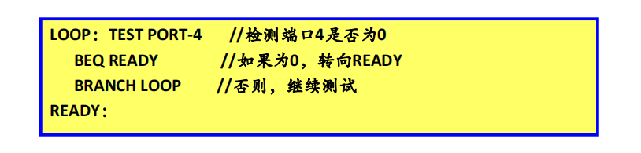

# 操作系统


## 中断与异常

## 进程线程模型

### 进程

​		进程是具有独立功能的程序关于某个数据集合上的一次运行活动，是系统进行资源分配和调度的独立单元，又称任务。

* 程序一次执行过程
* 是正在运行的程序的抽象
* 将一个 CPU 变换成多个虚拟的 CPU
* 系统资源以进程为单位分配，如内存、文件等，每个进程具有独立的地址空间
* 操作系统将 CPU 调度给需要的进程

#### 进程控制块（PCB）

PCB：Process Control Block

* 又称进程描述符、进程属性
* 操作系统用于管理控制进程的一个专门数据结构
* 记录进程的各种属性，描述进程的动态变化过程

PCB 是系统感知进程存在的唯一标志，进程与 PCB 是一一对应的。

进程表：所有进程的 PCB 集合。


### 线程


## CPU调度

## 同步机制

## 内存管理

​		对于通用计算机而言，存储层次至少应具有三级 ：最高层为CPU寄存器，中间为主存，最底层是辅存。在较高档的计算机中，还可以根据具体的功能分工，细划为寄存器、高速缓存、主存储器、磁盘缓存、固定磁盘、可移动存储介质等6层。


### 地址重定位

​	为了保证 CPU 执行指令时可正确访问内存单元，需要将用户程序中的逻辑地址转换为运行时可由机器直接寻址的物理地址，这一过程称为**地址重定位**。

#### 逻辑地址

* 用户程序经过编译、汇编后形成目标代码，目标代码通常采用相对地址的形式，其首地址为0，其余地址都相对于首地址而编址。
* 不能使用逻辑地址在内存中读取信息。

#### 物理地址

* 内存中存储单元的地址，可直接寻址

#### 静态重定位

​		当用户程序加载到内存时，一次性实现逻辑地址到物理地址的转换。一般可由软件完成。

#### 动态重定位

​		在进程执行过程中进行地址变换，即逐条指令执行时完成地址转换。需要硬件部件支持，该硬件部件通常称为 MMU（Memory Management Unit）。

### 物理内存管理


#### 分页存储管理

##### 基本概念

* 划分作业：把进程的逻辑地址空间按相同的等分因子划分为若干部分，称为页面（page）或页，从0顺序编号。
* 等分主存：把主存也按相同大小划分为若干存储块，称为页框（page frame），从0顺序编号，也称物理页面、页帧或内存块。
* 逻辑地址的表示：用数对（p,d）表示，p表示页号，d表示页内地址。
* 主存分配原则：以页框为单位，把主存分给作业进程，按进程所需的页数来进行分配，一个页面对应一个页框，逻辑上相邻的页，物理上不一定相邻。
* 页面尺寸的大小：典型的有 4K 或 4M。
* 页表：记录页号和页框号的对应关系，确定页面和页框对应关系的表，也称为页面变换表（PMT），包含的信息有：页号、页框号、状态。
* 地址转换（硬件支持）：CPU取到逻辑地址，自动划分为页号和页内地址，用页号查页表，得到页框号，再与页内偏移地址拼接成为物理地址。
* 作业调度程序调入作业时，系统为其创建页表，撤销作业时清除页表。
* 页表基址寄存器：用于指出当前运行进程的页表起始地址和页表长度。
* 容易产生内碎片：内部碎片就是已经被分配出去（能明确指出属于哪个进程）却不能被利用的内存空间。

##### 动态地址变换

###### 高速页面变换寄存器

**动态地址变换的不足：**

​		因为页表是存放在内存中的，CPU要存取一个数据，需访问主存两次。第一次：访内存中的页表，找到该页的的物理块号，将此块号与页内地址拼结形成物理地址；第二次：真正访问该物理地址，存取其中的内容。这样就把程序的执行速度降低一倍。为了提高存取速度，在地址变换机构中增设一组寄存器，用来存放页表，其速度比内存表的查找要快一到两个数量级。
**做法：**

​		为了实现从作业地址空间到物理地址空间的变换，可采用硬件的高速寄存器来实现。因为任一时刻在处理机中只有一个作业在执行，所以只需一组高速寄存器就可满足要求。假定页面大小为 4 KB， 那么对于 100 KB的作业来说， 就需要 25 个高速寄存器。由于高速寄存器的成本高， 所以它适用于地址空间小的作业。如果系统所接受的作业都在 64 KB以下， 那么只需要 16 个寄存器就够了。在多道程序环境下，当处理机把控制转移到另一新作业时，应保存原作业的寄存器内容并重置相应的新作业的寄存器内容(即存储块号)。
**问题：**

作业过大时寄存器个数过多，成本高。

###### 联想存储器

​		动态地址变换速度慢，高速页面变换寄存器成本高。为控制成本且提高速度，可引入一定数量的寄存器存放页表（部分），并且使在寄存器查找到的概率达到90%左右。把存放在高速缓冲寄存器中的页表叫快表，这个高速缓冲寄存器又叫联想存贮器。存放的是当前正在运行的作业PMT中最常用的部分页号和相应的块号。

查找时双管其下，快表和 PMT 表的查找同时进行。

##### 算法

```
1. 作业表（JT）：整个系统一张，每个作业对应一个条目。
             包括：作业号，页表长度，起始地址，状态。
2. 存储分块表（MBT）：整个系统一张，每个表目对应一个存储块。
3. 页面变换表（PMT）：每个作业一张，有多少页面对应多少条目，包括页号、块号。
```

<figure>


</figure>
##### 优缺点

```
1. 采用动态地址变换会增加计算机成本并降低处理机的速度。
2. 各种表格要占用一定容量的主存空间，而且还要花费一部分处理机时间用来建立和管理这些表格。
3. 虽然说碎片消除了，但每个作业的最后一页一般都有不能充分利用的空白区。 
4. 存储扩充问题仍未得到解决。 
```

#### 分段存储管理

##### 基本概念

* 用户进程地址空间：按程序自身的逻辑关系划分为若干个程序段，每个程序段都有一个段名。
* 内存空间被动态划分为若干长度不相同的区域，称为物理段，每个物理段由起始地址和长度确定。
* 内存分配（规则）：以段为单位进行分配，每段在内存中占据连续空间，但各段之间可以不相邻。
* 逻辑地址的表示：用数对（p,d）表示，p表示段号，d表示段内地址。
* 段表：每项记录了段号、段首地址和段长度之间的关系，每个进程一个段表存放在内存。
* 地址转换（硬件）：CPU 取到逻辑地址（包含段号和段内地址），用段号查段表，得到该段在内存的起始地址，与段内偏移地址计算出物理地址。
* 段表基址寄存器：用于指出当前运行进程的段表起始地址。

#### 分段与分页的异同

**相同点：**

```
均采用离散方式分配内存，主存利用率高；
都要通过地址变换部件实现地址变换；
```

**不同点：** 

```
页是信息的物理单位，分页的目的是提高主存利用率；段是信息的逻辑单位，它含有一组完整的信息，分段的目的是更好地满足用户的需求。
页的大小固定，由系统确定；段的长度不固定，段的长度受制于程序大小；
页式管理其地址空间是一维的，L→ ( p,d )；段式管理地址是二维的，直接用（ s,w ）。
```

#### 段页式存储管理

##### 基本概念

* 用户进程划分：先按段划分，每一段再按页面划分
* 逻辑地址：包含段号、页号、页内地址
* 内存划分：同页式存储管理方案
* 内存分配：以页为单位进行分配
* 段表：记录每一段的页表起始地址和页表长度
* 页表：记录了逻辑页号和页框号的对应关系，每一段有一张页表，一个进程有多个页表
* 空闲区管理和内存分配、回收：同页式管理
* 地址转换（硬件支持）：CPU 取到逻辑地址（包含段号和段内地址），用段号查段表，得到页表的起始地址和长度，再将段内地址划分为页号和页内地址，再根据页号查页表，得到页框号，再与页内地址拼接成为物理地址。

#### 内存不足时如何管理

##### 内存紧缩技术

在内存移动程序，将所有小的空闲区（外碎片）合并为较大的空闲区。例如：可变分区中存在的外碎片问题。

##### 覆盖技术（overlaying）

覆盖技术主要用于早期的操作系统。

* 主要解决程序大小超过物理内存总和的问题
* 程序执行过程中，程序的不同部分在内存中相互替代
  * 按照其自身的逻辑结构，将那些不会同时执行的程序段共享同一块内存区域
  * 要求程序各模块之间有明确的调用结构
* 程序员声明覆盖结构，操作系统完成自动覆盖

##### swap（交换技术）

​		交换技术被广泛地运用于早期的小型分时系统的存贮管理中。所谓交换，就是系统根据需要把主存中暂时不运行的某个(或某些)作业部分或全部移到外存，而把外存中的某个(或某些)作业移到相应的主存区，并使其投入运行。所以，交换技术也叫对换或滚进滚出（roll-in,roll-out）。也有的系统叫挂起调度或中级调度。被换出到外存的程序只是临时被剥夺了对内存的使用权，过一段时间，还必须换入内存运行。因此，交换是一种用时间换空间的技术。 

**进程哪些内容要交换到磁盘**

运行时创建或修改的内容：栈和堆

**交换区**

一般系统会指定一块特殊的磁盘区域作为交换空间（swap space），包含连续的磁道，操作系统可以使用底层的磁盘读写操作对其高效访问。

**交换的时机**：

* 只要不用就换出（很少再用）
* 作业的进程用完时间片或等待输入输出
* 作业要求扩充存储而得不到满足时
* 考虑进程的各种属性；不应换出处于等待 I/O 状态的进程

**进程空间增长的困难和解决**


##### 虚拟存储技术（virtual memory）

#### 请求分页存储管理/虚拟页式存储管理

```
一、核心：
      解决内存资源不足，实现存储扩充。
二、请求分页原理：
1. 思想：
    一作业执行之前不需将全部地址空间一次装入，动态申请，动态装入。
 2. 问题：
     在请求分页存储管理中，必须解决如下几个问题：
     ( 1 ) 如果一个作业不把它的整个地址空间同时全部装入主存，那么该作业能否开始运行并运行一段时间?
         a.作业在运行期间的各个阶段，多数作业只使用全部地址空间的一部分。例如，用户编制的错误处理程序仅当程序出错时才会用到。
     又如多数作业在运行中划分为几个阶段：输入、计算、输出。在某一阶段中，各个程序可以不同时进入主存。
         b.程序的局部性。顺序执行的指令和线性结构的数据(如数组)，它们通常被限定在某一连续区域。一旦某一位置被访问后，那么它附近的位置很快也会被访问
     ( 2 ) 在作业运行了一段时间后，必然要访问到没有装入的页面，也就是说，要访问的虚页不在实存。那么，这个问题系统是怎样发现的呢?
         在PMT中增加一个状态位 规定该位为 0 表示该页已装入主存；该位为1表示该页不在主存。当地址变换机构检测到虚页的状态位为1时，    表示该页不在主存，规定由硬件产生缺页中断，转入中断处理程序，虽然这不是用户程序的错误，但它是属于程序中断。
     ( 3 ) 如果系统已经发现某虚页不在实存，就应将其装入实存。现在的问题是从何处装入，装入到何处，如果实存空间已满怎么办?
         当发现虚页不在实存时， 引起缺页中断，利用中断处理程序完成该页的装入。中断处理程序将所需页面装入实存后，修改PMT的状态位，后重新执行该指令。访问到不在内存中的虚页时，从磁盘装入（此时需建立一张辅助页表，指出对应关系）；主存有空闲时直接装入；主存满时必须淘汰某些旧页（若修改过，必须先写入主存；若未修改，辅存副本已存在，直接淘汰）。 
```

##### 缺页中断及其处理


##### 抖动（颠簸）

入页：将某页从辅存调入主存；

出页：将某页从主存移至辅存；

抖动（颠簸）：虚存中，页面在内存与磁盘之间频繁调度，使得调度页面所需的时间比进程实际运行的时间还多，这样导致系统效率急剧下降，这种现象称为颠簸或抖动。

抖动的弊端：浪费大量的CPU时间。

抖动的原因：页面置换算法选择不当。

##### 页面置换算法

最佳置换算法 → 先进先出 → 第二次机会 → 时钟算法 → 最近未使用 → 最近最少使用 → 最不经常使用 → 老化算法 → 工作集 → 工作集时钟

**最佳置换算法（OPTimal）**

 思想：淘汰那些永远不用（至少长时间不用）的页面（置换以后不再需要的或最远的将来才会用到的页面）。
 理由：不会产生颠簸。
 特点：降低缺页率。
 不足：理论上成立，需采用预调思想，实现困难，可以作为一种标准用来衡量其他算法的性能。

**先进先出算法( First In First Out )**

思想：先淘汰那些驻留在主存时间最长的页面，即先进入主存的页面先被淘汰。
理由：最早调入主存的页面，其不再被访问的可能性最大。
特点：简单，容易实现；不足是进入早者，既使常用也必须淘汰。
实现：设分配给一个作业的实页数为m，则只需建立一个由m个元素组成的队列表和一个替换指针即可。 

**最近最久未用置换算法LRU(Least Recently Used)**

思想：先淘汰那些最近长时间未使用的页面。
理由：新近访问的页面，再被访问的概率高，久未访问的页面，再被访问的概率低。
实现：记录每一页面最后一次访问后的时间间隔t，淘汰t最大者。
特点：适合各类程序；
            实现困难    软件实现：系统开销大（占用 CPU 时间）。
                                硬件实现：成本高。

**最近最久不常用置换算法LFU(Least Frequently Used)**

 思想：先淘汰那些最近一段时间内使用次数少的页面。
 理由：一段时间内较少访问的页面，再被访问的概率低，一段时间内访问频繁的页面，再被访问的概率高。
 实现：记录每一页面一段时间的使用次数，淘汰时选择频率最小者。
 特点：适合各类程序；
             实现困难    软件实现：系统开销大（占用CPU时间）。
                                 硬件实现：成本高。

**LRU近似算法**

思想：设置”引用位”，系统周期性地将该位清“0”，在时间T内，访问过的页面该位置“1”，若需置换，则选取引用位为“0”者淘汰。
特点：算法简单，易于实现。
问题：T的大小确定困难。太大时几乎全“1”，太小为“0”者过多。

##### 性能分析

​		请求页式存储管理消除了对主存大小的限制，能使更多的作业按多道方式运行，从而提高系统效率，但缺页中断对页面的调入调出，会使CPU付出相当多的代价。为了尽可能地减少缺页中断的次数，应从程序设计的质量，页面的大小，主存的容量以及页面置换算法等几方面来考虑。
**影响缺页中断的因素：**

```
1. 程序设计的质量 
局部性原理(principle of locality)：
指程序在执行过程中的一个较短时期，所执行的指令地址和指令的操作数地址，分别局限于一定区域。表现为：
    时间局部性：一条指令的一次执行和下次执行，一个数据的一次访问和下次访问都集中在一个较短时期内；
    空间局部性：当前指令和邻近的几条指令，当前访问的数据和邻近的数据都集中在一个较小区域内。
局部化程度越高越好，可集中于几个页面处理，减少缺页中断。

2. 页面大小的选择
规律：一般缺页中断率与页面尺寸成反比。但页面尺寸却不能一味地求大，它一般在0.5KB~4KB之间。
特点：因为页面大时，页表较小，占空间少，查表速度快，缺页中断次数少，但页面调度时间长，页内碎片较大。页面小时，恰恰相反。

3. 主存容量大小
引入虚拟存储，作业调入一部分即可运行，提高多道效率，实际上是低效的。即分配给作业的内存太少，引起颠簸。
4. 页面调度算法选择
页面调度算法选择不尽合理。页面调度算法不合理导致抖动。是指一段时间里，页面在内存与外存之间频繁地调度或换入换出，以至于系统用于调度页面所需要的时间比进程实际运行所占用的时间还要多。
```

主存大小和调度算法均引起抖动，抖动是由于缺页中断率很高而引起的一种坏现象，它将严重影响系统的效率，甚至可能使系统全面崩溃。

##### 优缺点

**优点：**

```
它提供了大容量的多个虚拟存储器，作业地址空间不再受实存容量的限制；
更有效地利用了主存，一个作业的地址空间不必全部同时都装入主存，只装入其必要部分，其它部分根据请求装入，或者根本就不装入(如错误处理程序等)；
更加有利于多道程序的运行， 从而提高了系统效率；
方便了用户，特别是大作业用户。 
```

**缺点：**

```
为处理缺页中断，增加了处理机时间的开销， 即请求分页系统是用时间的代价换取了空间的扩大；
可能因作业地址空间过大或多道程序道数过多以及其它原因而造成系统抖动；
为防止系统抖动所采取的各种措施会增加系统的复杂性。
```

### 其他技术

#### MMAP

进程通过一个系统调用（mmap）将一个文件（或部分）映射到其虚拟地址空间的一部分，访问这个文件就象访问内存中的一个大数组，而不是对文件进行读写。

* 在多数实现中，在映射共享的页面时不会实际读入页面的内容，而是在访问页面时，页面才会被每次一页的读入，磁盘文件则被当作后备存储。

* 当进程退出或显式地解除文件映射时，所有被修改页面会写回文件

#### 写时拷贝		


### 缓存


## 文件系统

## IO 管理

（1）按照用户的请求，控制设备的各种操作，完成 I/O 设备与内存之间的数据交换，最终完成用户的 I/O 请求

* 设备分配与回收
  * 记录设备的状态
  * 根据用户请求和设备类型，采用一定的分配算法，选择一条数据通路
* 执行设备驱动程序，实现真正的 I/O 操作
* 设备中断处理：处理外部设备的中断
* 缓冲区管理：管理 I/O 缓冲区

（2）建立方便统一的独立于设备的接口

```
种类繁多、结构各异 -> 设计简单、避免错误 -> 采用统一的方式处理所有设备
```

* 方便性：向用户提供使用外部设备的统一接口，使用户变成时不考虑设备复杂的物理特性
* 统一性：对不同设备采取统一的操作方式，即在用户程序中使用的是逻辑设备
  * 逻辑设备与物理设备
  * 屏蔽硬件细节（设备的物理特性、错误处理、不同 I/O 过程的差异）

（3）充分利用各种技术（通道、中断、缓冲、异步 I/O 等）提高 CPU 与设备之间的并行工作能力，充分利用资源，提高资源利用率。

* 并行性
* 均衡性（使设备充分忙碌）

（4）保护：设备传送或管理的数据应该是安全的、不被破坏的、保密的。


### 设备的分类

#### 按数据组织分类

**块设备**

* 以数据块为单位存储、传输信息
* 传输速率较高、可寻址（随机读写）

**字符设备**

* 以字符为单位存储、传输信息
* 传输速率低、不可寻址

#### 按资源分配分类

**独占设备**

* 一段时间只能只有一个进程使用，一般为低速 I/O 设备（如打印机、磁带等）。

**共享设备**

* 一段时间可有多个进程共同使用，多个进程以交叉的方式使用设备，资源利用率高（如硬盘）。

**虚设备**

* 在一类设备上模拟另一类设备，常用共享设备模拟独占设备，用高速设备模拟低速设备，被模拟的设备称为虚设备。
* 目的：将慢速的独占设备改造成多个用户可共享的设备，提高设备的利用率。如 SPOLLING 技术，利用虚设备技术 -- 用硬盘模拟输入输出设备。

### I/O 设备的组成

​	I/O 设备一般由机械和电子两部分组成。

（1）机械部分是设备本身（物理装置）

（2）电子部分又称设备控制器（或适配器）

* 地址译码（端口）
* 按照主机与设备之间约定的格式和过程接受计算机发来的数据和控制信号或向主机发送数据和状态信号
* 将计算机的数字信号转换成机械部分能识别的模拟信号，或反之
* 实现设备内部硬件缓冲、数据加工等提高性能或增强功能

#### 控制器的作用

​		操作系统将命令写入控制器的接口寄存器（或接口缓冲区）中，以实现输入／输出，并从接口寄存器读取状态信息或结果信息

* 当控制器接受一条命令后，可独立于 CPU 完成指定操作，CPU可以另外执行其他计算；命令完成时，控制器产生一个中断，CPU 响应中断，控制转给操作系统；通过读控制器寄存器中的信息，获得操作结果和设备状态
* 控制器与设备之间的接口常常是一个低级接口
* 控制器的任务：把串行的位流转换为字节块，并进行必要的错误修正：首先，控制器按位进行组装，然后存入控制器内部的缓冲区中形成以字节为单位的块；在对块验证检查和并证明无错误时，再将它复制到内存中

#### I/O 端口地址

* I/O 端口地址指的是接口电路中每个寄存器具有的、唯一的地址，是个整数
* 所有 I/O 端口地址形成 I/O 端口空间（受到保护）

I/O 指令形式与 I/O 地址是相互关联的，主要有两种形式：

* 内存映像编址（内存映像 I/O 模式）
* I/O 独立编址（I/O 专用指令）


##### I/O 独立编址

* 分配给系统中所有端口的地址空间完全独立，与内存地址空间无关
* 使用专门的 I/O 指令对端口进行操作
* 优点
  * 外设不占用内存的地址空间
  * 编程时，易于区分是对内存操作还是对 I/O 端口操作
* 缺点：I/O 端口操作的指令类型少，操作不灵活

##### 内存映像编址

* 分配给系统中所有端口的地址空间与内存的地址空间统一编码
* 把 I/O 端口看做一个存储单元，对 I/O 的读写操作等同于对内存的操作
* 优点
  * 凡是可对内存操作的指令都可对 I/O 端口操作
  * 不需要专门的 I/O 指令
  * I/O 端口可占有较大的地址空间
* 缺点：占用部分内存空间

##### 内存映射 I/O 

* 优点

  * 不需要特殊的保护机制来阻止用户进程进行 I/O 操作

    操作系统需要避免把包含控制寄存器的那部分地址空间放入任何用户的虚拟地址空间之中。

  * 可以引用内存的每一条指令也可以引用控制寄存器

    例如可以使用指令 TEST 指令测试一个内存字是否为空，那么 TEST 指令也可以用来测试一个控制寄存器是否为空。

* 缺点

  * 对一个设备控制器不能进行高速缓存

    ​		考虑以下汇编代码循环，第一次引用 PORT_4 将导致它被高速缓存，随后的引用将只从高速缓存中取值并且不会再查询设备，之后当设备最终变为就绪时，软件将没有办法发现这一点，结果循环将永远进行下去。

    ​		硬件必须对每个页面具备选择性禁用高速缓冲的能力，硬件系统必须管理选择性高速缓存，所以这一特性为硬件和操作系统两者增添了额外的复杂性。

    

### I/O 控制方式

（1）可编程 I/O （轮询/查询）

​		由 CPU 代表进程向 I/O 模块发送 I/O 命令，进入忙等待，直到操作完成才继续执行。


```
轮询方式的工作过程。 应用程序提出了一个读数据的请求， 那么操作系统，设备驱动程序会去检查一下 设备的状态，如果状态是 没有问题的，那么就给这个设备发出相应的控制命令， 然后就不断地去测试这个 设备是否完成了这次执行过程，这个 ④实际上就是一个轮询，不断地去测试是否完成，如果完成了就把数据送给应用程序。 然后，应用程序 就可以继续进行相应的处理， 这就是轮询的一个工作过程
```

（2）中断驱动 I/O

​		为了减少设备驱动程序不断的询问控制器状态寄存器的开销，I/O 操作结束后，由设备控制器主动通知设备驱动程序。


```
 中断驱动I/O的工作过程。 首先， 用户程序提出I/O请求，那么设备驱动程序会去检查设备的状态， 如果设备已经准备好，那么就向设备提出 控制命令，提出控制命令之后 就把这个状态记录在设备的状态表里头， 这个时候，CPU可以继续做别的事情。 当设备完成了工作之后会给 CPU发中断信号，那么转入了中断处理程序， 中断处理程序发现这是一个正常地完成了 控制命令的信号之后就会去把结果提交给 设备管理程序，而设备管理程序会从刚才记录的这张设备状态表里头 取得是哪一个请求的完成。 接着根据 这次请求把相应的数据送到 应用程序。 最后呢，通知应用程序可以继续执行， 这就是中断驱动I/O，它的一个处理过程
```

（3）DMA（Direct Memory Access）


#### IO 部件演化

```
1．CPU直接控制外围设备
2．增加了控制器或I/O部件，CPU使用非中断的可编程I/O，CPU开始从外部设备接口的具体细节中分离出来
3．与2相同，但采用了中断方式，CPU无需花费等待执行一次I/O操作所需的时间，效率提高
4．I/O部件通过DMA直接控制存储器，可以在没有CPU参与的情况下，从内存中移出或者往内存中移入一块数据，仅仅在传送开始和结束时需要CPU干预
5．I/O部件增强为一个单独的处理器，有专门为I/O设计的指令集；CPU指导I/O处理器执行内存中的一个I/O程序。I/O处理器在没有CPU干涉的情况下取指令并执行这些指令
6．I/O部件有自己的局部存储器(其本身就是一台计算机)，使用这种体系结构可以控制许多I/O设备，并且使需要CPU参与程度降到最小（通常用于控制与交互终端的通信，I/O处理器负责大多数控制终端的任务）
```

### I/O 软件组成

​		把I/O软件组织成多个层次，每一层都执行操作系统所需要的功能的一个相关子集，它依赖于更低一层所执行的更原始的功能，从而可以隐藏这些功能的细节；同时，它又给高一层提供服务，较低层考虑硬件的特性，并向较高层软件提供接口，较高层不依赖于硬件，并向用户提供一个友好的、清晰的、简单的、功能更强的接口。


### I/O 相关技术

#### 缓冲技术

```
操作系统中最早引入的技术
	- 解决CPU与I/O设备之间速度的不匹配问题
 	凡是数据到达和离去速度不匹配的地方均可采用缓冲技术
 	- 提高CPU与I/O设备之间的并行性
 	- 减少了I/O设备对CPU的中断请求次数，放宽CPU对中断响应时间的要求
```

```
缓冲区分类
	- 硬缓冲：由硬件寄存器实现（例如：设备中设置的缓冲区）
	- 软缓冲：在内存中开辟一个空间，用作缓冲区
缓冲区管理
	- 单缓冲
 	- 双缓冲
 	- 缓冲池（多缓冲，循环缓冲）：统一管理多个缓冲区，采用有界缓冲区的生产者/消费者模型对缓	冲池中的缓冲区进行循环使用。
```

##### UNIX SYSTEM V 缓冲技术

* 采用缓冲池技术，可平滑和加快信息在内存和磁盘之间的传输
* 缓冲区结合提前读和延迟写技术对具有重复性及阵发性 I/O 进程、提高 I/O 速度很有帮助
* 可以充分利用之前从磁盘读入、虽已传入用户区但仍在缓冲区的数据（尽可能减少磁盘I/O的次数，提高系统运行的速度）

```
1. 缓冲区：200个缓冲区（512字节或1024字节）
2. 每个缓冲区由两部分组成：
	缓冲控制块或缓冲区首部 + 缓冲区数据，系统通过缓冲区首部来管理缓冲区
3. 空闲缓冲区队列（av 链），队列头部为 bfreelist
4. 设备缓冲区队列（b 链），链接所有分配给各类设备使用的缓冲区，按照散列方式组织
    buf用b双向链，可以有64个队列，每个队列首部有头标
    设备为b_dev上的逻辑块b在散列队列的
    头标为： 
    	i=(b_dev + b) mod 64

数据结构：
|设备号|
|盘块号|
|状态|
|指向缓冲数据区的指针|
|指向缓冲队列的后继指针 b-back|
|指向缓冲队列的前驱指针 b-forw|
|指向空闲队列的后继指针 av-back|
|指向空闲队列的前驱指针 av-forw|

说明：
a. 逻辑设备号和盘块号分别标志出文件系统和数据所在的盘块号，是缓冲区的唯一标志
b. 状态标识缓冲区的当前状态：忙/闲、上锁/开锁、是否延迟写、数据有效性等
c. 两组指针（av 和 b）用于对缓冲池的分配管理

每个缓冲区可以同时在 av 链和 b 链存在：
a. 开始：在空闲 av 链（缓冲区未被使用时）
b. 开始 IO 请求：在设备 IO 请求队列和设备 b 链
c. IO 完成：在空闲 av 链和设备 b 链
```

```
1. 当进程想从指定的盘块读取数据时，系统根据盘块号从设备b链(散列队列)中查找，如找到缓冲区，则将该缓冲区状态标记为“忙”，并从空闲av队列中取下，并完成从缓冲区到内存用户区的数据传送
2. 如果在设备b链中未找到时，则从空闲av链队首摘取一个缓冲区，插入设备I/O请求队列；并从原设备b链中取下，插入由读入信息盘块号确定的新的设备b链中
3. 当数据从磁盘块读入到缓冲区后，缓冲区从设备I/O请求队列取下；当系统完成从缓冲区到内存用户区的数据传送后，要把缓冲区释放，链入空闲av链队尾
4. 当数据从磁盘块读入到缓冲区，并传送到内存用户区后，该缓冲区一直保留在原设备b链中，即它的数据一直有效。若又要使用它，则从空闲av链中取下，使用完后插入到空闲av链队尾。若一直未使用它，则该缓冲区从空闲av链队尾慢慢升到队首，最后被重新分配，旧的盘块数据才被置换

5. 系统对缓冲区的分配是采用近似LRU算法
```

### I/O 设备管理

```
设备管理有关的数据结构：
1. 描述设备、控制器等部件的表格：系统中常常为每一个部件、每一台设备分别设置一张表格，常称为设备表或部件控制块。这类表格具体描述设备的类型、标识符、状态，以及当前使用者的进程标识符等
2. 建立同类资源的队列：系统为了方便对 I/O 设备的分配管理，通常在设备表的基础上通过指针将相同物理属性的设备连成队列（称设备队列）
3. 面向进程 I/O 请求的动态数据结构：每当进程发出I/O请求时，系统建立一张表格（称 I/O 请求包），将此次 I/O 请求的参数填入表中，同时也将该 I/O 有关的系缓冲区地址等信息填入表中。I/O 请求包随着I/O的完成而被删除
4. 建立 I/O 队列：如请求包队列
```

```
独占设备的分配：
1. 在申请设备时，如果设备空闲，就将其独占，不再允许其他进程申请使用，一直等到该设备被释放，才允许被其他进程申请使用 
2. 考虑效率问题，并避免由于不合理的分配策略造成死锁 
 
静态分配： 
a. 在进程运行前, 完成设备分配；运行结束时，收回设备 
b. 缺点：设备利用率低 
动态分配： 
a. 在进程运行过程中，当用户提出设备要求时，进行分配，一旦停止使用立即收回 
b. 优点：效率好；
c. 缺点：分配策略不好时, 产生死锁
```

```
分时式共享设备的分配：
1. 所谓分时式共享就是以一次I/O为单位分时使用设备，不同进程的I/O操作请求以排队方式分时地占用设备进行I/O
2. 由于同时有多个进程同时访问，且访问频繁，就会影响整个设备使用效率，影响系统效率。因此要考虑多个访问请求到达时服务的顺序，使平均服务时间越短越好
```


```
设备驱动程序：
1. 与设备密切相关的代码放在设备驱动程序中，每个设备驱动程序处理一种设备类型 
2. 一般，设备驱动程序的任务是接收来自与设备无关的上层软件的抽象请求，并执行这个请求 
3. 每一个控制器都设有一个或多个设备寄存器，用来存放向设备发送的命令和参数。设备驱动程序负责释放这些命令，并监督它们正确执行 
4. 在设备驱动程序的进程发出一条或多条命令后，系统有两种处理方式，多数情况下，执行设备驱动程序的进程必须等待命令完成，这样，在命令开始执行后，它阻塞自已，直到中断处理时将它解除阻塞为止；而在其它情况下，命令执行不必延迟就很快完成

5. 设备驱动程序与外界的接口
	a. 与操作系统的接口
 	为实现设备无关性，设备作为特殊文件处理。用户的I/O请求、对命令的合法性检查以及参数处理在文件系统中完成。在需要各种设备执行具体操作时，通过相应数据结构转入不同的设备驱动程序
	b. 与系统引导的接口（初始化，包括分配数据结构，建立设备的请求队列）
	c. 与设备的接口
	
1. 驱动程序初始化函数（如向操作系统登记该驱动程序的接口函数，该初始化函数在系统启动时或驱动程序安装入内核时执行）
2. 驱动程序卸载函数
3. 申请设备函数
4. 释放设备函数
5. I/O操作函数
	对独占设备，包含启动I/O的指令；对共享设备，将I/O请求形成一个请求包，排到设备请求队列，如果请求队列空，则直接启动设备
6. 中断处理函数
	对I/O完成做善后处理，一般是唤醒等待刚完成I/O请求的阻塞进程，使其能进一步做后续工作；如果存在I/O请求队列，则启动下一个I/O请求
```

```
一种实现方案：I/O进程
1. I/O进程：专门处理系统中的I/O请求和I/O中断工作
2. I/O请求的进入
	a. 用户程序：调用send将I/O请求发送给I/O进程；调用block将自己阻塞，直到I/O任务完成后被唤醒
	b. 系统：利用wakeup唤醒I/O进程，完成用户所要求的I/O处理
3. I/O中断的进入
	a. 当I/O中断发生时，内核中的中断处理程序发一条消息给I/O进程，由I/O进程负责判断并处理中断
	
4. I/O进程是系统进程，一般赋予最高优先级。一旦被唤醒，它可以很快抢占处理机投入运行,I/O进程开始运行后，首先关闭中断，然后用receive去接收消息

两种情形：
没有消息，则开中断，将自己阻塞
有消息，则判断消息类型（I/O请求或I/O中断）
a. I/O请求
 准备通道程序，发出启动I/O指令，继续判断有无消息
b. I/O中断，进一步判断正常或异常结束
 正常：唤醒要求进行I/O操作的进程
 异常：转入相应的错误处理程序
```

### I/O 性能问题

* 使 CPU 利用率尽可能不被 I/O 降低
* 使 CPU 尽可能摆脱 I/O

```
1. 减少或缓解速度差距 → 缓冲技术 
2. 使CPU不等待I/O → 异步I/O
3. 让CPU摆脱I/O操作 → DMA、通道
```


