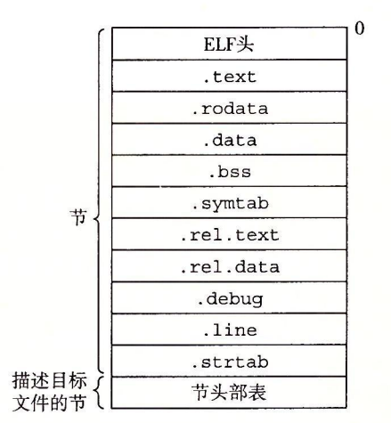

# 深入理解计算机系统

## 第1章 计算机系统漫游

### 编译系统

**四个阶段：**预处理阶段、编译阶段、汇编阶段、链接阶段（预处理器（cpp）、编译器（ccl）、汇编器（as）和链接器（ld））。

**预处理**

```shell
# .c/.cpp -> .i
$ cpp [other arguments] main.c /tmp/main.i
$ g++  -E  dm01.cpp  -o  dm01.i 
```

**编译**

```shell
# .i -> .s
$ ccl /tmp/main.i -Og [other arguments] -o /tmp/main.s
$ g++ -S dm01.i -o dm01.s
```

**汇编**

```shell
# .s -> .o（可重定位目标程序）
$ as [other arguments] -o /tmp/main.o /tmp/main.s
$ g++ -c dm01.s -o dm01.o
```

**链接**

```shell
# .o -> 可执行目标文件
$ ld -o prog [system object files and args] /tmp/main.o /tmp/sum.o
$ g++ -o dm.out dm01.o dm02.o
```


### 链接

​		**链接**（linking）是将各种代码和数据片段收集并组合成为一个单一文件的过程，这个文件可被**加载**（复制）到内存并执行。链接可以执行于**编译时**（compile time），也就是在源代码被翻译成机器代码时；也可以执行于**加载时**（load time），也就是在程序被**加载器**（loader）加载到内存并执行时；甚至执行于**运行时**（runtime），也就是由应用程序来执行。在早期的计算机系统中，链接是手动执行的。在现代系统中，链接是由叫做**链接器**（linker）的程序自动执行的。

#### 静态链接

​		Linux LD 程序这样的**静态链接器**（static linker）以一组可重定位目标文件和命令行参数作为输入，生成一个完全链接的、可以加载和运行的可执行目标文件作为输出。输入的可重定位目标文件由各种不同的代码和数据节（section）组成，每一节都是一个连续的字节序列。指令在一节中，初始化了的全局变量在另一节中，而未初始化的变量又在另外一节中。

为了构造可执行文件，链接器需要完成两个主要任务：

* 符号解析：目标文件定义和引用符号，每个符号对应于一个函数、一个全局变量或一个**静态变量**（即 C 语言中任何以 static 属性声明的变量）。符号解析的目的是将每个符号引用正好和一个符号定义关联起来。
* 代码重定向：编译器和汇编器生成从地址 0 开始的代码和数据节。链接器通过把每个符号定义与一个内存位置关联起来，从而重定位这些节，然后修改所有对这些符号的引用，使得它们指向这个内存位置。链接器使用汇编器产生的**重定位条目**（relocation entry）的详细指令，不加甄别地执行这样的重定位。

#### 目标文件

目标文件有三种形式：

- **可重定位目标文件。**包含二进制代码和数据，其形式可以在编译时与其他可重定位目标文件合并起来，创建一个可执行目标文件。
- **可执行目标文件。**包含二进制代码和数据，其形式可以被直接复制到内存并执行。
- **共享目标文件。**一种特殊类型的可重定位目标文件，可以在加载或者运行时被动态地加载进内存并链接。

​		编译器和汇编器生成可重定位目标文件（包括共享目标文件）。链接器生成可执行目标文件。从技术上来说，一个**目标模块**（object module）就是一个字节序列，而一个**目标文件**（object file）就是一个以文件形式存放在磁盘中的目标模块。

​		目标文件是按照特定的目标文件格式来组织的，各个系统的目标文件格式都不相同，Windows 使用可移植可执行（Portable Executable，PE）格式。MacOS-X 使用 Mach-O 格式。现代 x86-64 Linux 和 Unix 系统使用可执行可链接格式（Executable and Linkable Format，ELF）。

#### 可重定位目标文件

​		ELF 头（ELF header）以一个 16 字节的序列开始，这个序列描述了生成该文件的系统的字的大小和字节顺序。ELF 头剩下的部分包含帮助链接器语法分析和解释目标文件的信息。其中包括 ELF 头的大小、目标文件的类型（如可重定位、可执行或者共享的）、机器类型（如 X86-64）、节头部表（section header table）的文件偏移，以及节头部表中条目的大小和数量。不同节的位置和大小是由节头部表描述的，其中目标文件中每个节都有一个固定大小的条目（entry）。



夹在 ELF 头和节头部表之间的都是节。一个典型的 ELF 可重定位目标文件包含下面几个节： 

- **.text：**已编译程序的机器代码。
- **.rodata：**只读数据，比如 printf 语句中的格式串和开关语句的跳转表。
- **.data：**已初始化的全局和静态 C 变量。局部 C 变量在运行时被保存在栈中，既不岀现在 .data 节中，也不岀现在 .bss 节中。
- **.bss：**未初始化的全局和静态 C 变量，以及所有被初始化为 0 的全局或静态变量。在目标文件中这个节不占据实际的空间，它仅仅是一个占位符。目标文件格式区分已初始化和未初始化变量是为了空间效率：在目标文件中，未初始化变量不需要占据任何实际的磁盘空间。运行时，在内存中分配这些变量，初始值为 0。
- **.symtab：**一个符号表，它存放在程序中定义和引用的函数和全局变量的信息。一些程序员错误地认为必须通过 -g 选项来编译一个程序，才能得到符号表信息。实际上，每个可重定位目标文件在 .symtab 中都有一张符号表（除非程序员特意用 STRIP 命令去掉它）。然而，和编译器中的符号表不同，.symtab 符号表不包含局部变量的条目。
- **.rel.text：**一个 .text 节中位置的列表，当链接器把这个目标文件和其他文件组合时，需要修改这些位置。一般而言，任何调用外部函数或者引用全局变量的指令都需要修改。另一方面，调用本地函数的指令则不需要修改。注意，可执行目标文件中并不需要重定位信息，因此通常省略，除非用户显式地指示链接器包含这些信息。
- **.rel.data：**被模块引用或定义的所有全局变量的重定位信息。一般而言，任何已初始化的全局变量，如果它的初始值是一个全局变量地址或者外部定义函数的地址，都需要被修改。
- **.debug：**一个调试符号表，其条目是程序中定义的局部变量和类型定义，程序中定义和引用的全局变量，以及原始的 C 源文件。只有以 - g 选项调用编译器驱动程序时，才 会得到这张表。
- **.line：**原始 C 源程序中的行号和 .text 节中机器指令之间的映射。只有以 -g 选项调用编译器驱动程序时，才会得到这张表。
- **.strtab：**一个字符串表，其内容包括 .symtab 和 .debug 节中的符号表，以及节头部中的节名字。字符串表就是以 null 结尾的字符串的序列。

#### 符号和符号表

​		每个可重定位目标模块 m 都有一个符号表，它包含 m 定义和引用的符号的信息。在链接器的上下文中，有三种不同的符号：

- 由模块 m 定义并能被其他模块引用的**全局符号**。全局链接器符号对应于非静态的 C 函数和全局变量。
- 由其他模块定义并被模块 m 引用的**全局符号**。这些符号称为外部符号，对应于在其他模块中定义的非静态 C 函数和全局变量。
- 只被模块 m 定义和引用的**局部符号**。它们对应于带 static 属性的 C 函数和全局变量。这些符号在模块 m 中任何位置都可见，但是不能被其他模块引用。

​		**在 C 中，源文件扮演模块的角色。任何带有 static 属性声明的全局变量或者函数都是模块私有的。类似地，任何不带 static 属性声明的全局变量和函数都是公共的，可以被其他模块访问。**


## 附录

### 一个可执行文件完整的 ELF 格式内容

```shell
$ readelf -a DEF.out  > ELF.txt
```

```
ELF Header:
  Magic:   7f 45 4c 46 02 01 01 00 00 00 00 00 00 00 00 00 
  Class:                             ELF64
  Data:                              2's complement, little endian
  Version:                           1 (current)
  OS/ABI:                            UNIX - System V
  ABI Version:                       0
  Type:                              EXEC (Executable file)
  Machine:                           Advanced Micro Devices X86-64
  Version:                           0x1
  Entry point address:               0x400a10
  Start of program headers:          64 (bytes into file)
  Start of section headers:          46840 (bytes into file)
  Flags:                             0x0
  Size of this header:               64 (bytes)
  Size of program headers:           56 (bytes)
  Number of program headers:         8
  Size of section headers:           64 (bytes)
  Number of section headers:         38
  Section header string table index: 35

Section Headers:
  [Nr] Name              Type             Address           Offset
       Size              EntSize          Flags  Link  Info  Align
  [ 0]                   NULL             0000000000000000  00000000
       0000000000000000  0000000000000000           0     0     0
  [ 1] .interp           PROGBITS         0000000000400200  00000200
       000000000000001c  0000000000000000   A       0     0     1
  [ 2] .note.ABI-tag     NOTE             000000000040021c  0000021c
       0000000000000020  0000000000000000   A       0     0     4
  [ 3] .note.gnu.build-i NOTE             000000000040023c  0000023c
       0000000000000024  0000000000000000   A       0     0     4
  [ 4] .gnu.hash         GNU_HASH         0000000000400260  00000260
       0000000000000038  0000000000000000   A       5     0     8
  [ 5] .dynsym           DYNSYM           0000000000400298  00000298
       00000000000001f8  0000000000000018   A       6     1     8
  [ 6] .dynstr           STRTAB           0000000000400490  00000490
       00000000000001f5  0000000000000000   A       0     0     1
  [ 7] .gnu.version      VERSYM           0000000000400686  00000686
       000000000000002a  0000000000000002   A       5     0     2
  [ 8] .gnu.version_r    VERNEED          00000000004006b0  000006b0
       0000000000000070  0000000000000000   A       6     3     8
  [ 9] .rela.dyn         RELA             0000000000400720  00000720
       0000000000000048  0000000000000018   A       5     0     8
  [10] .rela.plt         RELA             0000000000400768  00000768
       0000000000000180  0000000000000018   A       5    12     8
  [11] .init             PROGBITS         00000000004008e8  000008e8
       0000000000000018  0000000000000000  AX       0     0     4
  [12] .plt              PROGBITS         0000000000400900  00000900
       0000000000000110  0000000000000010  AX       0     0     4
  [13] .text             PROGBITS         0000000000400a10  00000a10
       0000000000000a08  0000000000000000  AX       0     0     16
  [14] .fini             PROGBITS         0000000000401418  00001418
       000000000000000e  0000000000000000  AX       0     0     4
  [15] .rodata           PROGBITS         0000000000401430  00001430
       0000000000000288  0000000000000000   A       0     0     16
  [16] .eh_frame_hdr     PROGBITS         00000000004016b8  000016b8
       0000000000000044  0000000000000000   A       0     0     4
  [17] .eh_frame         PROGBITS         0000000000401700  00001700
       0000000000000124  0000000000000000   A       0     0     8
  [18] .ctors            PROGBITS         0000000000601828  00001828
       0000000000000018  0000000000000000  WA       0     0     8
  [19] .dtors            PROGBITS         0000000000601840  00001840
       0000000000000010  0000000000000000  WA       0     0     8
  [20] .jcr              PROGBITS         0000000000601850  00001850
       0000000000000008  0000000000000000  WA       0     0     8
  [21] .dynamic          DYNAMIC          0000000000601858  00001858
       00000000000001c0  0000000000000010  WA       6     0     8
  [22] .got              PROGBITS         0000000000601a18  00001a18
       0000000000000008  0000000000000008  WA       0     0     8
  [23] .got.plt          PROGBITS         0000000000601a20  00001a20
       0000000000000098  0000000000000008  WA       0     0     8
  [24] .data             PROGBITS         0000000000601ab8  00001ab8
       0000000000000004  0000000000000000  WA       0     0     4
  [25] .bss              NOBITS           0000000000601ac0  00001abc
       0000000000000248  0000000000000000  WA       0     0     32
  [26] .comment          PROGBITS         0000000000000000  00001abc
       000000000000005a  0000000000000001  MS       0     0     1
  [27] .debug_aranges    PROGBITS         0000000000000000  00001b16
       0000000000000040  0000000000000000           0     0     1
  [28] .debug_pubnames   PROGBITS         0000000000000000  00001b56
       000000000000003e  0000000000000000           0     0     1
  [29] .debug_info       PROGBITS         0000000000000000  00001b94
       0000000000004f42  0000000000000000           0     0     1
  [30] .debug_abbrev     PROGBITS         0000000000000000  00006ad6
       000000000000075e  0000000000000000           0     0     1
  [31] .debug_line       PROGBITS         0000000000000000  00007234
       0000000000000545  0000000000000000           0     0     1
  [32] .debug_str        PROGBITS         0000000000000000  00007779
       00000000000039b1  0000000000000001  MS       0     0     1
  [33] .debug_pubtypes   PROGBITS         0000000000000000  0000b12a
       0000000000000430  0000000000000000           0     0     1
  [34] .debug_ranges     PROGBITS         0000000000000000  0000b55a
       0000000000000030  0000000000000000           0     0     1
  [35] .shstrtab         STRTAB           0000000000000000  0000b58a
       000000000000016c  0000000000000000           0     0     1
  [36] .symtab           SYMTAB           0000000000000000  0000c078
       00000000000008b8  0000000000000018          37    57     8
  [37] .strtab           STRTAB           0000000000000000  0000c930
       00000000000004a3  0000000000000000           0     0     1
Key to Flags:
  W (write), A (alloc), X (execute), M (merge), S (strings)
  I (info), L (link order), G (group), x (unknown)
  O (extra OS processing required) o (OS specific), p (processor specific)

There are no section groups in this file.

Program Headers:
  Type           Offset             VirtAddr           PhysAddr
                 FileSiz            MemSiz              Flags  Align
  PHDR           0x0000000000000040 0x0000000000400040 0x0000000000400040
                 0x00000000000001c0 0x00000000000001c0  R E    8
  INTERP         0x0000000000000200 0x0000000000400200 0x0000000000400200
                 0x000000000000001c 0x000000000000001c  R      1
      [Requesting program interpreter: /lib64/ld-linux-x86-64.so.2]
  LOAD           0x0000000000000000 0x0000000000400000 0x0000000000400000
                 0x0000000000001824 0x0000000000001824  R E    200000
  LOAD           0x0000000000001828 0x0000000000601828 0x0000000000601828
                 0x0000000000000294 0x00000000000004e0  RW     200000
  DYNAMIC        0x0000000000001858 0x0000000000601858 0x0000000000601858
                 0x00000000000001c0 0x00000000000001c0  RW     8
  NOTE           0x000000000000021c 0x000000000040021c 0x000000000040021c
                 0x0000000000000044 0x0000000000000044  R      4
  GNU_EH_FRAME   0x00000000000016b8 0x00000000004016b8 0x00000000004016b8
                 0x0000000000000044 0x0000000000000044  R      4
  GNU_STACK      0x0000000000000000 0x0000000000000000 0x0000000000000000
                 0x0000000000000000 0x0000000000000000  RW     8

 Section to Segment mapping:
  Segment Sections...
   00     
   01     .interp 
   02     .interp .note.ABI-tag .note.gnu.build-id .gnu.hash .dynsym .dynstr .gnu.version .gnu.version_r .rela.dyn .rela.plt .init .plt .text .fini .rodata .eh_frame_hdr .eh_frame 
   03     .ctors .dtors .jcr .dynamic .got .got.plt .data .bss 
   04     .dynamic 
   05     .note.ABI-tag .note.gnu.build-id 
   06     .eh_frame_hdr 
   07     

Dynamic section at offset 0x1858 contains 23 entries:
  Tag        Type                         Name/Value
 0x0000000000000001 (NEEDED)             Shared library: [libstdc++.so.6]
 0x0000000000000001 (NEEDED)             Shared library: [libm.so.6]
 0x0000000000000001 (NEEDED)             Shared library: [libgcc_s.so.1]
 0x0000000000000001 (NEEDED)             Shared library: [libc.so.6]
 0x000000000000000c (INIT)               0x4008e8
 0x000000000000000d (FINI)               0x401418
 0x000000006ffffef5 (GNU_HASH)           0x400260
 0x0000000000000005 (STRTAB)             0x400490
 0x0000000000000006 (SYMTAB)             0x400298
 0x000000000000000a (STRSZ)              501 (bytes)
 0x000000000000000b (SYMENT)             24 (bytes)
 0x0000000000000015 (DEBUG)              0x0
 0x0000000000000003 (PLTGOT)             0x601a20
 0x0000000000000002 (PLTRELSZ)           384 (bytes)
 0x0000000000000014 (PLTREL)             RELA
 0x0000000000000017 (JMPREL)             0x400768
 0x0000000000000007 (RELA)               0x400720
 0x0000000000000008 (RELASZ)             72 (bytes)
 0x0000000000000009 (RELAENT)            24 (bytes)
 0x000000006ffffffe (VERNEED)            0x4006b0
 0x000000006fffffff (VERNEEDNUM)         3
 0x000000006ffffff0 (VERSYM)             0x400686
 0x0000000000000000 (NULL)               0x0

Relocation section '.rela.dyn' at offset 0x720 contains 3 entries:
  Offset          Info           Type           Sym. Value    Sym. Name + Addend
000000601a18  000400000006 R_X86_64_GLOB_DAT 0000000000000000 __gmon_start__ + 0
000000601ac0  001000000005 R_X86_64_COPY     0000000000601ac0 _ZSt3cin + 0
000000601be0  001300000005 R_X86_64_COPY     0000000000601be0 _ZSt4cout + 0

Relocation section '.rela.plt' at offset 0x768 contains 16 entries:
  Offset          Info           Type           Sym. Value    Sym. Name + Addend
000000601a38  000100000007 R_X86_64_JUMP_SLO 0000000000000000 _ZNSolsEd + 0
000000601a40  000200000007 R_X86_64_JUMP_SLO 0000000000000000 _ZNSirsERd + 0
000000601a48  000300000007 R_X86_64_JUMP_SLO 0000000000000000 _ZStlsIcSt11char_trait + 0
000000601a50  000600000007 R_X86_64_JUMP_SLO 0000000000000000 _ZNSt8ios_base4InitC1E + 0
000000601a58  000700000007 R_X86_64_JUMP_SLO 0000000000000000 __libc_start_main + 0
000000601a60  000800000007 R_X86_64_JUMP_SLO 0000000000000000 __cxa_atexit + 0
000000601a68  000900000007 R_X86_64_JUMP_SLO 0000000000000000 _ZNSolsEe + 0
000000601a70  001200000007 R_X86_64_JUMP_SLO 0000000000400980 _ZNSt8ios_base4InitD1E + 0
000000601a78  000a00000007 R_X86_64_JUMP_SLO 0000000000000000 _ZStlsISt11char_traits + 0
000000601a80  000b00000007 R_X86_64_JUMP_SLO 0000000000000000 fmod + 0
000000601a88  000c00000007 R_X86_64_JUMP_SLO 0000000000000000 pow + 0
000000601a90  000d00000007 R_X86_64_JUMP_SLO 0000000000000000 _ZNSirsERi + 0
000000601a98  000e00000007 R_X86_64_JUMP_SLO 0000000000000000 _ZNSolsEPFRSoS_E + 0
000000601aa0  001100000007 R_X86_64_JUMP_SLO 00000000004009e0 _ZSt4endlIcSt11char_tr + 0
000000601aa8  000f00000007 R_X86_64_JUMP_SLO 0000000000000000 floor + 0
000000601ab0  001400000007 R_X86_64_JUMP_SLO 0000000000400a00 __gxx_personality_v0 + 0

There are no unwind sections in this file.

Symbol table '.dynsym' contains 21 entries:
   Num:    Value          Size Type    Bind   Vis      Ndx Name
     0: 0000000000000000     0 NOTYPE  LOCAL  DEFAULT  UND 
     1: 0000000000000000     0 FUNC    GLOBAL DEFAULT  UND _ZNSolsEd@GLIBCXX_3.4 (2)
     2: 0000000000000000     0 FUNC    GLOBAL DEFAULT  UND _ZNSirsERd@GLIBCXX_3.4 (2)
     3: 0000000000000000     0 FUNC    GLOBAL DEFAULT  UND _ZStlsIcSt11char_traitsIc@GLIBCXX_3.4 (2)
     4: 0000000000000000     0 NOTYPE  WEAK   DEFAULT  UND __gmon_start__
     5: 0000000000000000     0 NOTYPE  WEAK   DEFAULT  UND _Jv_RegisterClasses
     6: 0000000000000000     0 FUNC    GLOBAL DEFAULT  UND _ZNSt8ios_base4InitC1Ev@GLIBCXX_3.4 (2)
     7: 0000000000000000     0 FUNC    GLOBAL DEFAULT  UND __libc_start_main@GLIBC_2.2.5 (3)
     8: 0000000000000000     0 FUNC    GLOBAL DEFAULT  UND __cxa_atexit@GLIBC_2.2.5 (3)
     9: 0000000000000000     0 FUNC    GLOBAL DEFAULT  UND _ZNSolsEe@GLIBCXX_3.4 (2)
    10: 0000000000000000     0 FUNC    GLOBAL DEFAULT  UND _ZStlsISt11char_traitsIcE@GLIBCXX_3.4 (2)
    11: 0000000000000000     0 FUNC    GLOBAL DEFAULT  UND fmod@GLIBC_2.2.5 (4)
    12: 0000000000000000     0 FUNC    GLOBAL DEFAULT  UND pow@GLIBC_2.2.5 (4)
    13: 0000000000000000     0 FUNC    GLOBAL DEFAULT  UND _ZNSirsERi@GLIBCXX_3.4 (2)
    14: 0000000000000000     0 FUNC    GLOBAL DEFAULT  UND _ZNSolsEPFRSoS_E@GLIBCXX_3.4 (2)
    15: 0000000000000000     0 FUNC    GLOBAL DEFAULT  UND floor@GLIBC_2.2.5 (4)
    16: 0000000000601ac0   280 OBJECT  GLOBAL DEFAULT   25 _ZSt3cin@GLIBCXX_3.4 (2)
    17: 00000000004009e0     0 FUNC    GLOBAL DEFAULT  UND _ZSt4endlIcSt11char_trait@GLIBCXX_3.4 (2)
    18: 0000000000400980     0 FUNC    GLOBAL DEFAULT  UND _ZNSt8ios_base4InitD1Ev@GLIBCXX_3.4 (2)
    19: 0000000000601be0   272 OBJECT  GLOBAL DEFAULT   25 _ZSt4cout@GLIBCXX_3.4 (2)
    20: 0000000000400a00     0 FUNC    GLOBAL DEFAULT  UND __gxx_personality_v0@CXXABI_1.3 (5)

Symbol table '.symtab' contains 93 entries:
   Num:    Value          Size Type    Bind   Vis      Ndx Name
     0: 0000000000000000     0 NOTYPE  LOCAL  DEFAULT  UND 
     1: 0000000000400200     0 SECTION LOCAL  DEFAULT    1 
     2: 000000000040021c     0 SECTION LOCAL  DEFAULT    2 
     3: 000000000040023c     0 SECTION LOCAL  DEFAULT    3 
     4: 0000000000400260     0 SECTION LOCAL  DEFAULT    4 
     5: 0000000000400298     0 SECTION LOCAL  DEFAULT    5 
     6: 0000000000400490     0 SECTION LOCAL  DEFAULT    6 
     7: 0000000000400686     0 SECTION LOCAL  DEFAULT    7 
     8: 00000000004006b0     0 SECTION LOCAL  DEFAULT    8 
     9: 0000000000400720     0 SECTION LOCAL  DEFAULT    9 
    10: 0000000000400768     0 SECTION LOCAL  DEFAULT   10 
    11: 00000000004008e8     0 SECTION LOCAL  DEFAULT   11 
    12: 0000000000400900     0 SECTION LOCAL  DEFAULT   12 
    13: 0000000000400a10     0 SECTION LOCAL  DEFAULT   13 
    14: 0000000000401418     0 SECTION LOCAL  DEFAULT   14 
    15: 0000000000401430     0 SECTION LOCAL  DEFAULT   15 
    16: 00000000004016b8     0 SECTION LOCAL  DEFAULT   16 
    17: 0000000000401700     0 SECTION LOCAL  DEFAULT   17 
    18: 0000000000601828     0 SECTION LOCAL  DEFAULT   18 
    19: 0000000000601840     0 SECTION LOCAL  DEFAULT   19 
    20: 0000000000601850     0 SECTION LOCAL  DEFAULT   20 
    21: 0000000000601858     0 SECTION LOCAL  DEFAULT   21 
    22: 0000000000601a18     0 SECTION LOCAL  DEFAULT   22 
    23: 0000000000601a20     0 SECTION LOCAL  DEFAULT   23 
    24: 0000000000601ab8     0 SECTION LOCAL  DEFAULT   24 
    25: 0000000000601ac0     0 SECTION LOCAL  DEFAULT   25 
    26: 0000000000000000     0 SECTION LOCAL  DEFAULT   26 
    27: 0000000000000000     0 SECTION LOCAL  DEFAULT   27 
    28: 0000000000000000     0 SECTION LOCAL  DEFAULT   28 
    29: 0000000000000000     0 SECTION LOCAL  DEFAULT   29 
    30: 0000000000000000     0 SECTION LOCAL  DEFAULT   30 
    31: 0000000000000000     0 SECTION LOCAL  DEFAULT   31 
    32: 0000000000000000     0 SECTION LOCAL  DEFAULT   32 
    33: 0000000000000000     0 SECTION LOCAL  DEFAULT   33 
    34: 0000000000000000     0 SECTION LOCAL  DEFAULT   34 
    35: 0000000000400a3c     0 FUNC    LOCAL  DEFAULT   13 call_gmon_start
    36: 0000000000000000     0 FILE    LOCAL  DEFAULT  ABS crtstuff.c
    37: 0000000000601828     0 OBJECT  LOCAL  DEFAULT   18 __CTOR_LIST__
    38: 0000000000601840     0 OBJECT  LOCAL  DEFAULT   19 __DTOR_LIST__
    39: 0000000000601850     0 OBJECT  LOCAL  DEFAULT   20 __JCR_LIST__
    40: 0000000000400a60     0 FUNC    LOCAL  DEFAULT   13 __do_global_dtors_aux
    41: 0000000000601cf0     1 OBJECT  LOCAL  DEFAULT   25 completed.6364
    42: 0000000000601cf8     8 OBJECT  LOCAL  DEFAULT   25 dtor_idx.6366
    43: 0000000000400ad0     0 FUNC    LOCAL  DEFAULT   13 frame_dummy
    44: 0000000000000000     0 FILE    LOCAL  DEFAULT  ABS crtstuff.c
    45: 0000000000601838     0 OBJECT  LOCAL  DEFAULT   18 __CTOR_END__
    46: 0000000000401820     0 OBJECT  LOCAL  DEFAULT   17 __FRAME_END__
    47: 0000000000601850     0 OBJECT  LOCAL  DEFAULT   20 __JCR_END__
    48: 00000000004013e0     0 FUNC    LOCAL  DEFAULT   13 __do_global_ctors_aux
    49: 0000000000000000     0 FILE    LOCAL  DEFAULT  ABS test01.cpp
    50: 0000000000601d00     1 OBJECT  LOCAL  DEFAULT   25 _ZStL8__ioinit
    51: 00000000004012cc    64 FUNC    LOCAL  DEFAULT   13 _Z41__static_initializati
    52: 000000000040130c    21 FUNC    LOCAL  DEFAULT   13 _GLOBAL__I__Z8hs_roundel
    53: 0000000000601a20     0 OBJECT  LOCAL  DEFAULT   23 _GLOBAL_OFFSET_TABLE_
    54: 0000000000601824     0 NOTYPE  LOCAL  DEFAULT   18 __init_array_end
    55: 0000000000601824     0 NOTYPE  LOCAL  DEFAULT   18 __init_array_start
    56: 0000000000601858     0 OBJECT  LOCAL  DEFAULT   21 _DYNAMIC
    57: 0000000000601ab8     0 NOTYPE  WEAK   DEFAULT   24 data_start
    58: 0000000000601ac0   280 OBJECT  GLOBAL DEFAULT   25 _ZSt3cin@@GLIBCXX_3.4
    59: 0000000000000000     0 FUNC    GLOBAL DEFAULT  UND _ZNSolsEd@@GLIBCXX_3.4
    60: 0000000000000000     0 FUNC    GLOBAL DEFAULT  UND _ZNSirsERd@@GLIBCXX_3.4
    61: 0000000000401340     2 FUNC    GLOBAL DEFAULT   13 __libc_csu_fini
    62: 0000000000400a10     0 FUNC    GLOBAL DEFAULT   13 _start
    63: 0000000000000000     0 FUNC    GLOBAL DEFAULT  UND _ZStlsIcSt11char_traitsIc
    64: 0000000000000000     0 NOTYPE  WEAK   DEFAULT  UND __gmon_start__
    65: 0000000000000000     0 NOTYPE  WEAK   DEFAULT  UND _Jv_RegisterClasses
    66: 0000000000401418     0 FUNC    GLOBAL DEFAULT   14 _fini
    67: 0000000000000000     0 FUNC    GLOBAL DEFAULT  UND _ZNSt8ios_base4InitC1Ev@@
    68: 0000000000000000     0 FUNC    GLOBAL DEFAULT  UND __libc_start_main@@GLIBC_
    69: 0000000000000000     0 FUNC    GLOBAL DEFAULT  UND __cxa_atexit@@GLIBC_2.2.5
    70: 0000000000000000     0 FUNC    GLOBAL DEFAULT  UND _ZNSolsEe@@GLIBCXX_3.4
    71: 0000000000400980     0 FUNC    GLOBAL DEFAULT  UND _ZNSt8ios_base4InitD1Ev@@
    72: 0000000000000000     0 FUNC    GLOBAL DEFAULT  UND _ZStlsISt11char_traitsIcE
    73: 0000000000000000     0 FUNC    GLOBAL DEFAULT  UND fmod@@GLIBC_2.2.5
    74: 0000000000401430     4 OBJECT  GLOBAL DEFAULT   15 _IO_stdin_used
    75: 0000000000601ab8     0 NOTYPE  GLOBAL DEFAULT   24 __data_start
    76: 0000000000401321    18 FUNC    WEAK   DEFAULT   13 _ZSt12setprecisioni
    77: 0000000000000000     0 FUNC    GLOBAL DEFAULT  UND pow@@GLIBC_2.2.5
    78: 0000000000601be0   272 OBJECT  GLOBAL DEFAULT   25 _ZSt4cout@@GLIBCXX_3.4
    79: 0000000000401438     0 OBJECT  GLOBAL HIDDEN    15 __dso_handle
    80: 0000000000601848     0 OBJECT  GLOBAL HIDDEN    19 __DTOR_END__
    81: 0000000000401350   137 FUNC    GLOBAL DEFAULT   13 __libc_csu_init
    82: 0000000000601abc     0 NOTYPE  GLOBAL DEFAULT  ABS __bss_start
    83: 0000000000000000     0 FUNC    GLOBAL DEFAULT  UND _ZNSirsERi@@GLIBCXX_3.4
    84: 0000000000400af4   430 FUNC    GLOBAL DEFAULT   13 _Z8hs_roundel
    85: 0000000000601d08     0 NOTYPE  GLOBAL DEFAULT  ABS _end
    86: 0000000000000000     0 FUNC    GLOBAL DEFAULT  UND _ZNSolsEPFRSoS_E@@GLIBCXX
    87: 00000000004009e0     0 FUNC    GLOBAL DEFAULT  UND _ZSt4endlIcSt11char_trait
    88: 0000000000000000     0 FUNC    GLOBAL DEFAULT  UND floor@@GLIBC_2.2.5
    89: 0000000000601abc     0 NOTYPE  GLOBAL DEFAULT  ABS _edata
    90: 0000000000400a00     0 FUNC    GLOBAL DEFAULT  UND __gxx_personality_v0@@CXX
    91: 0000000000400ca2  1578 FUNC    GLOBAL DEFAULT   13 main
    92: 00000000004008e8     0 FUNC    GLOBAL DEFAULT   11 _init

Histogram for `.gnu.hash' bucket list length (total of 3 buckets):
 Length  Number     % of total  Coverage
      0  0          (  0.0%)
      1  2          ( 66.7%)     40.0%
      2  0          (  0.0%)     40.0%
      3  1          ( 33.3%)    100.0%

Version symbols section '.gnu.version' contains 21 entries:
 Addr: 0000000000400686  Offset: 0x000686  Link: 5 (.dynsym)
  000:   0 (*local*)       2 (GLIBCXX_3.4)   2 (GLIBCXX_3.4)   2 (GLIBCXX_3.4)
  004:   0 (*local*)       0 (*local*)       2 (GLIBCXX_3.4)   3 (GLIBC_2.2.5)
  008:   3 (GLIBC_2.2.5)   2 (GLIBCXX_3.4)   2 (GLIBCXX_3.4)   4 (GLIBC_2.2.5)
  00c:   4 (GLIBC_2.2.5)   2 (GLIBCXX_3.4)   2 (GLIBCXX_3.4)   4 (GLIBC_2.2.5)
  010:   2 (GLIBCXX_3.4)   2 (GLIBCXX_3.4)   2 (GLIBCXX_3.4)   2 (GLIBCXX_3.4)
  014:   5 (CXXABI_1.3) 

Version needs section '.gnu.version_r' contains 3 entries:
 Addr: 0x00000000004006b0  Offset: 0x0006b0  Link: 6 (.dynstr)
  000000: Version: 1  File: libm.so.6  Cnt: 1
  0x0010:   Name: GLIBC_2.2.5  Flags: none  Version: 4
  0x0020: Version: 1  File: libc.so.6  Cnt: 1
  0x0030:   Name: GLIBC_2.2.5  Flags: none  Version: 3
  0x0040: Version: 1  File: libstdc++.so.6  Cnt: 2
  0x0050:   Name: CXXABI_1.3  Flags: none  Version: 5
  0x0060:   Name: GLIBCXX_3.4  Flags: none  Version: 2

Notes at offset 0x0000021c with length 0x00000020:
  Owner		Data size	Description
  GNU		0x00000010	NT_GNU_ABI_TAG (ABI version tag)

Notes at offset 0x0000023c with length 0x00000024:
  Owner		Data size	Description
  GNU		0x00000014	NT_GNU_BUILD_ID (unique build ID bitstring)
```

