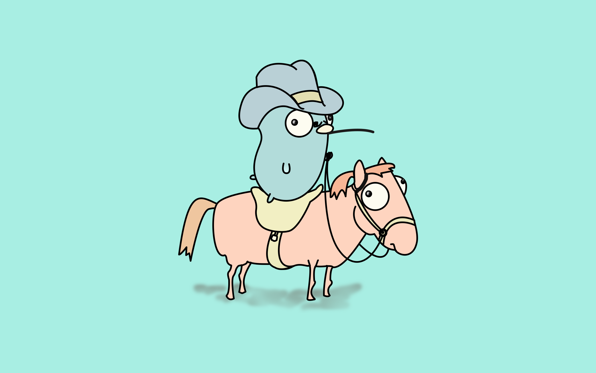
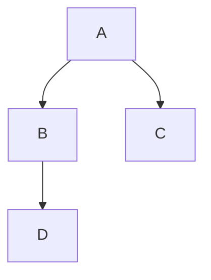
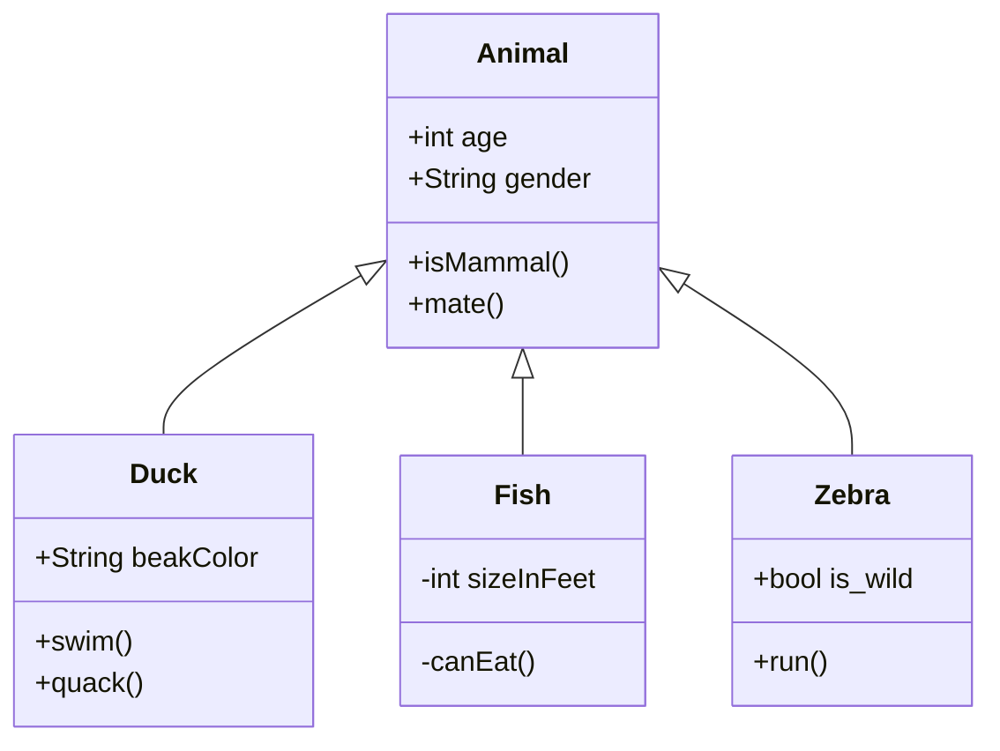
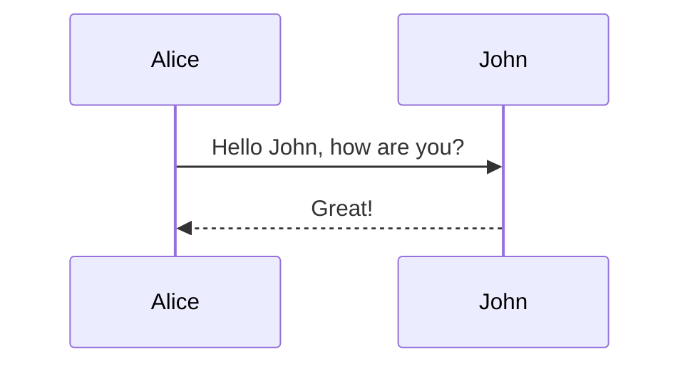
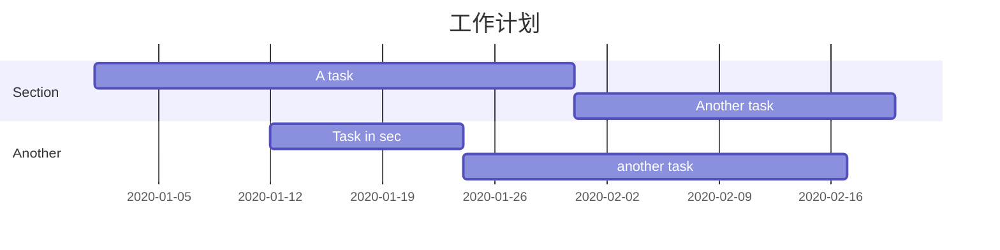
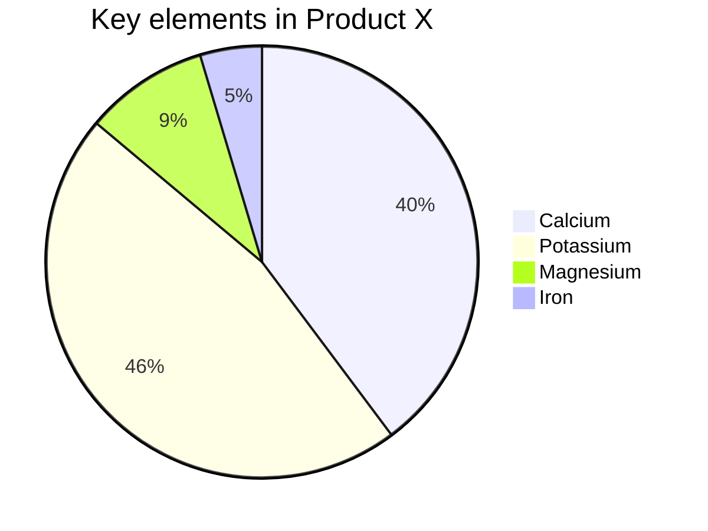

# typora skill

## 常用格式

### 图片




### 链接

[mermaid在线工具](https://mermaid-js.github.io/mermaid-live-editor/#/edit/eyJjb2RlIjoiZ3JhcGggVERcbiAgQVtDaHJpc3RtYXNdIC0tPnxHZXQgbW9uZXl8IEIoR28gc2hvcHBpbmcpXG4gIEIgLS0-IEN7TGV0IG1lIHRoaW5rfVxuICBDIC0tPnxPbmV8IERbTGFwdG9wXVxuICBDIC0tPnxUd298IEVbaVBob25lXVxuICBDIC0tPnxUaHJlZXwgRltmYTpmYS1jYXIgQ2FyXVxuXHRcdCIsIm1lcm1haWQiOnsidGhlbWUiOiJkZWZhdWx0In19)

## 数学公式

## 画图

先在 Typora 中，输入 **```mermaid** 然后敲击回车，即可初始化一张空白图。

### 流程图

`graph` 关键字就是声明一张流程图，`TD` 表示的是方向，这里的含义是 Top-Down 由上至下。



### 类图

<|--` 表示继承，`+` 表示 `public`，`-` 表示 `private



### 时序图

`->>` 代表实线箭头，`-->>` 则代表虚线。



### 状态图

`[*]` 表示开始或者结束，如果在箭头右边则表示结束


### 甘特图

甘特图一般用来表示项目的计划排期，目前在工作中经常会用到。

从上到下依次是图片标题、日期格式、项目、项目细分的任务。



### 饼图

饼图使用 `pie` 表示，标题下面分别是区域名称及其百分比。



### 导出

[mermaid在线工具](https://mermaid-js.github.io/mermaid-live-editor/#/edit/eyJjb2RlIjoiZ3JhcGggVERcbiAgQVtDaHJpc3RtYXNdIC0tPnxHZXQgbW9uZXl8IEIoR28gc2hvcHBpbmcpXG4gIEIgLS0-IEN7TGV0IG1lIHRoaW5rfVxuICBDIC0tPnxPbmV8IERbTGFwdG9wXVxuICBDIC0tPnxUd298IEVbaVBob25lXVxuICBDIC0tPnxUaHJlZXwgRltmYTpmYS1jYXIgQ2FyXVxuXHRcdCIsIm1lcm1haWQiOnsidGhlbWUiOiJkZWZhdWx0In19)
